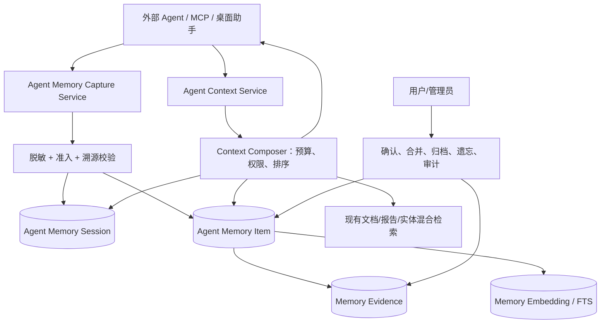

# Memorix Agent Memory 整合开发规划

> 日期：2026-08-04  
> 目标：在现有 Memorix「知识库供 Agent 检索」能力之上，建设可审计、可授权、可遗忘、跨会话连续的 **Agent 工作记忆（Agent Memory）**。  
> 参考：只读分析 `/Users/jamesyee/Desktop/workbuddy/memorix`（下称“参考项目”）的 Agent Memory 实现；不复制其代码或数据模型，吸收其设计原则并适配本项目的 .NET、多工作区与个人知识库场景。

## 1. 结论与产品定位

当前 Memorix 已经有很好的“外部知识记忆”：`search_memory`、`ask_memory`、文档/报告读取、实体图谱、混合检索，以及 Agent Profile、MCP、工具权限与调用审计。它解决了“Agent 能否读取用户知识库”。

但它尚未系统解决“**同一 Agent 在后续会话还能否可靠接续自己的任务、决策与未完成事项**”。目前 `AgentInvocationLog` 是工具调用日志，不是可检索、可证据化、可主动注入的记忆；`AgentProfile` 是权限配置，不是身份连续性的工作上下文。

建议新增产品域 **Agent Memory**，定位为：

> 在工作区权限边界内，为 Agent 提供任务会话记忆、经审核的长期记忆和源知识引用；它不替代文档 RAG，也不把原始聊天记录当作知识事实。

目标用户包括：使用 MCP 的外部 Agent、桌面端内嵌助手、研究/报告 Agent、会议纪要 Agent，以及未来的多 Agent 协作任务。

## 2. 参考项目中值得吸收的设计

参考项目是 Git 项目级、SQLite 本地优先的 Agent Memory 产品。其实现中最有价值的不是具体技术栈，而是以下控制机制。

| 参考设计 | 解决的问题 | Memorix 的适配方式 |
|---|---|---|
| Observation 与 Long-term Memory 分层 | 原始事件不能直接等同长期事实 | 增加 `AgentMemoryItem` 与 `AgentMemoryEvidence`，将会话事件、候选记忆、已确认记忆分开。 |
| Admission（准入）状态 | Hook/自动摘要容易制造噪声与幻觉 | 自动抽取先为 `candidate`；仅经来源证据、规则或人工确认后进入 `qualified/confirmed`。 |
| Evidence / Provenance（证据与溯源） | Agent 生成的“事实”必须可验证 | 每条持久记忆至少记录来源：会话消息、工具调用、DocumentChunk、Report、Meeting、Entity、用户确认或系统事件。 |
| Disclosure Layers（分层披露） | 上下文窗口有限，低可信内容不应挤占主上下文 | 以 L1 提示、L2 工作上下文、L3 证据详情组织检索结果，并设置 token 预算。 |
| Compaction checkpoint（压缩检查点） | 长会话压缩后会丢失承接信息 | 保存压缩前工作集、摘要、覆盖消息范围和投递状态；摘要可重放且可审计。 |
| Long-term Memory 需证据 | 防止将猜测、提示词或秘密固化 | 长期记忆强制 `evidence >= 1`；跨工作区迁移仅允许用户显式确认的个人记忆。 |
| Consolidation（合并） | 记忆重复膨胀 | 相似候选只给出合并建议；高价值“决策/风险/取舍”使用更高阈值并保留谱系。 |
| Retention（保留/归档） | 记忆无限增长且过期内容误导 Agent | 按价值、来源、访问与新鲜度计算归档候选；不可静默删除，保留恢复能力。 |
| Secret filter（写入/读取双重脱敏） | 会话与工具参数可能含密钥 | 在写入前和返回前统一脱敏；对原始密文不落库或用专用加密附件保存。 |
| 项目/用户可见性 | 不同 Agent、任务、项目之间会泄漏上下文 | 将可见性纳入权限模型：私有、Agent、工作区、用户可迁移；默认最小范围。 |

### 不应直接照搬的部分

1. **Git 是参考项目的主锚点，不能成为 Memorix 的唯一锚点。** Memorix 的核心是知识资产，证据还应包括文档块、报告引用、会议片段、实体关系和 Inbox 来源。
2. **不可用“本地 SQLite 单库”替代现有运行时。** 必须兼容 Local（SQLite）、Cloud（PostgreSQL）和 Hybrid，复用 `RuntimeRouter` 与现有存储/授权边界。
3. **不可自动沉淀完整原始对话。** 默认仅保留结构化事件、短期会话窗口与经准入的摘要；原始内容应由工作区策略决定。
4. **不可将记忆检索等同文档检索。** Agent Memory 使用任务、Agent、时间、新鲜度和可信度排序；用户知识 RAG 仍由现有混合检索负责。

## 3. 现状与差距

### 3.1 可直接复用的资产

| 现有资产 | 文件/模块 | 复用价值 |
|---|---|---|
| Agent 身份与配额 | `Domain/Entities/AgentProfile.cs` | 复用 Agent Profile、API Key、Transport、Scope、限流与每日额度。 |
| 工具授权 | `Infrastructure/Agent/AgentPermissionGuard.cs` | 作为记忆读写、导出、确认、清除的统一权限入口。 |
| MCP 与工具调度 | `Infrastructure/Mcp/*`、`AgentToolService` | 新工具沿现有 MCP stdio/HTTP 与审计模式接入。 |
| 调用审计 | `AgentInvocationLog` | 作为 `tool_call` 类型证据来源；不改造为记忆主表。 |
| 混合检索与向量索引 | `SearchService`、Embedding、ChunkEmbedding | 为长期记忆提供文本/向量召回能力，并允许 Memory 命中反查源文档。 |
| 工作区/主题/文档权限 | Workspace 与 Agent Permission Guard | 记忆检索必须继承工作区、主题与敏感文档约束。 |
| 实体治理与来源处理 | Entity、Document、Meeting、Report 等域模型 | 提供记忆的实体归因和可验证证据。 |

### 3.2 需要补齐的能力

| 缺口 | 影响 | 本规划中的解决项 |
|---|---|---|
| 无 Agent Session 概念 | 无法恢复任务连续性 | `AgentMemorySession`、会话状态、任务摘要。 |
| 日志不可作为一等检索记忆 | 无法追溯“上次决定了什么” | `AgentMemoryItem`、证据关系、检索服务。 |
| 无压缩检查点 | 长上下文必须依赖客户端自行摘要 | `AgentMemoryCheckpoint` 与可恢复上下文包。 |
| 无记忆准入/可信度模型 | 自动沉淀会造成噪声与错误记忆 | 状态机、证据门槛、人工确认。 |
| 无记忆治理界面 | 用户无法查看、编辑、撤回或遗忘 | Agent Memory 管理页、审计与数据控制。 |
| 无跨端会话策略 | 移动/桌面/MCP 会形成孤岛 | Workspace 级会话身份与 Hybrid 同步策略。 |

## 4. 目标架构



### 4.1 分层职责

| 层 | 新增组件 | 职责 |
|---|---|---|
| Domain | `AgentMemorySession`、`AgentMemoryItem`、`AgentMemoryEvidence`、`AgentMemoryCheckpoint`、`AgentMemoryFeedback` | 持久化领域状态与关系。 |
| Application | `IAgentMemoryService`、`IAgentContextService`、`IAgentMemoryGovernanceService`、DTO/Validator | 用例、权限前置条件、上下文包契约。 |
| Infrastructure | Capture、Sanitizer、Admission、Retriever、ContextComposer、Consolidation、Retention、Embedding Adapter | 实现存储、检索、异步维护、双数据库适配。 |
| API/MCP | `AgentMemoryController`、MCP memory tools | 为客户端提供会话、上下文、存储、确认与治理入口。 |
| Web | Agent Memory 页面与 Agent Profile 扩展 | 用户可见、可控、可审计。 |

## 5. 领域模型与数据设计

### 5.1 核心实体

| 实体 | 关键字段 | 说明 |
|---|---|---|
| `AgentMemorySession` | `Id, WorkspaceId, UserId, AgentProfileId, ExternalSessionKey, TaskTitle, Status, StartedAt, LastActiveAt, ClosedAt` | 一个可恢复的任务会话；`ExternalSessionKey` 对接 MCP 客户端线程/任务 ID。 |
| `AgentMemoryItem` | `Id, SessionId?, WorkspaceId, OwnerUserId, AgentProfileId?, Kind, Title, Content, Summary, AdmissionState, Confidence, Visibility, Importance, FreshnessAt, Status` | 记忆主体，不存储无限原文。 |
| `AgentMemoryEvidence` | `Id, MemoryItemId, EvidenceKind, ReferenceId, Locator, Relation, SnapshotHash, CapturedAt` | 证明或反驳记忆的来源，支持反查。 |
| `AgentMemoryCheckpoint` | `Id, SessionId, FromSequence, ToSequence, Summary, OpenLoopsJson, DecisionsJson, TokenEstimate, DeliveryState` | 上下文压缩的可审计检查点。 |
| `AgentMemoryFeedback` | `Id, MemoryItemId, UserId, Action, Note, CreatedAt` | confirm/reject/edit/pin/archive/restore/forget 等人工治理动作。 |
| `AgentMemoryAccessLog` | `Id, MemoryItemId?, SessionId?, AgentProfileId?, Action, TraceId, CreatedAt` | 记录读取、写入、投递、导出、删除等高风险操作。 |

### 5.2 建议枚举

```text
MemoryKind: task_state | decision | rationale | fact | preference | constraint |
            todo | blocker | handoff | lesson | tool_result | summary
AdmissionState: ephemeral | candidate | qualified | confirmed | rejected
Visibility: private | agent | workspace | user_portable
EvidenceKind: user_input | session_event | tool_invocation | document_chunk |
              report | meeting_segment | entity | system_event | manual_confirmation
MemoryStatus: active | superseded | archived | forgotten
```

### 5.3 不可变性与更新规则

1. `Evidence` 追加写入，不覆盖；记忆正文修改必须生成版本或记录 `supersedes` 关系。
2. `confirmed` 记忆不可由后台任务直接修改或合并，只能由用户/具备治理权限的 Agent 明确操作。
3. `user_portable` 仅允许用户明确确认创建，且证据不得来自私密工作区文档、工具入参或自动捕获。
4. “忘记”逻辑删除记忆内容、向量与派生摘要；审计只保留不可逆最小元数据及操作时间，遵循工作区保留策略。

## 6. 关键业务流程

### 6.1 会话启动与上下文投递

1. 客户端调用 `memory_start_session`，传入 `external_session_key`、任务描述、工作区和可选主题。
2. 服务验证 Agent Profile、工作区和主题权限，复用 `AgentPermissionGuard`。
3. `ContextComposer` 以 token 预算（默认 2,000）构建上下文包：
   - L1：任务状态、未完成事项、风险提示（约 15%）；
   - L2：已确认决策、偏好、约束、最近检查点（约 55%）；
   - L3：按需展开的证据链接、文档/报告检索入口（约 30%）。
4. 返回 `context_pack`、来源 ID、预算使用量、过期/冲突警告；Agent 不应收到未授权全文。

### 6.2 记忆捕获与准入

1. Agent 或系统调用 `memory_capture`，写入结构化候选：标题、内容、类型、作用域、证据、会话 ID。
2. 统一执行敏感信息检测；命中凭据、访问令牌、私钥或高敏文档原文时拒绝或替换为脱敏摘要。
3. 自动捕获默认 `candidate`；以下任一条件可进入 `qualified`：
   - 至少 1 个可访问、未过期的来源证据；
   - 工具调用结果与文档/报告/会议实体相互印证；
   - 用户显式确认。
4. `confirmed` 仅由用户、拥有 `agent_memory:confirm` scope 的受信 Agent 或规则化系统决策生成。

### 6.3 上下文压缩与恢复

1. 客户端报告消息/工具事件序列或令牌估算；超过阈值时创建预检 checkpoint。
2. 摘要必须提取：目标、已完成、关键决策及理由、未解决问题、文件/文档/工具证据、下一步。
3. 保存序列范围、摘要版本和源事件引用；投递成功后标记 `delivered`，失败可重试。
4. 恢复时优先使用最新已交付 checkpoint，随后补齐后续事件与相关长期记忆。

### 6.4 记忆检索与合并

1. 先按用户/工作区/主题/敏感等级过滤，再做混合召回。
2. 排序公式建议：`0.35 语义相关 + 0.25 可信度 + 0.20 新鲜度 + 0.10 重要性 + 0.10 访问/反馈`。
3. `candidate` 仅可作为 L1 提示，不可直接作为事实断言；`confirmed` 优先进入 L2。
4. 合并任务只产出建议；高价值类型（decision/rationale/constraint/blocker）阈值更高，并保留原条目与合并谱系。

## 7. API 与 MCP 契约

### 7.1 MCP 工具（最小可用集合）

| 工具 | Scope | 作用 |
|---|---|---|
| `memory_start_session` | `agent_memory:write` | 创建/恢复会话并返回初始上下文。 |
| `memory_get_context` | `agent_memory:read` | 在预算内返回任务上下文包。 |
| `memory_capture` | `agent_memory:write` | 提交结构化候选或用户显式记忆。 |
| `memory_search` | `agent_memory:read` | 搜索 Agent Memory，返回摘要与证据引用。 |
| `memory_checkpoint` | `agent_memory:write` | 生成或提交会话压缩检查点。 |
| `memory_handoff` | `agent_memory:write` | 生成接力包，供另一 Agent/会话继续。 |
| `memory_confirm` | `agent_memory:confirm` | 确认、拒绝、修订或置顶候选。 |
| `memory_forget` | `agent_memory:delete` | 用户控制的删除/遗忘，要求明确确认。 |

第一期不开放无限制 `memory_export`；导出跨越工作区与隐私边界，应在第二期引入审批、脱敏与审计。

### 7.2 REST

`/api/agent-memory/*` 提供等价管理接口：会话列表与详情、记忆检索、候选审核、保留策略预览、归档/恢复、访问审计。所有写接口采用 `Idempotency-Key`，长时间维护任务返回 `job_id`。

### 7.3 Agent Profile 扩展

在 `AgentProfile` 增加以下配置，默认保守：

```text
MemoryReadEnabled = true
MemoryWriteEnabled = false
MemoryAutoCaptureEnabled = false
MemoryMaxContextTokens = 2000
MemoryDefaultVisibility = agent
MemoryRetentionPolicy = standard
MemorySensitiveContentPolicy = redact_and_reject
```

已有的 `AllowedToolNames`、`Scopes`、Topic 限制、敏感文档开关与配额继续是底层约束；新权限不能绕过原有文档访问控制。

## 8. 安全、隐私与治理

1. **最小权限：** Memory 的读取范围不得大于 Agent 在当前工作区、主题和文档上的既有权限。
2. **双重脱敏：** 写入前处理、读取前再处理；对历史数据提供一次性扫描任务。
3. **提示注入防护：** 文档内的“请记住/忽略规则”等文本不能直接升格为记忆；自动准入只接受结构化系统事件或经验证证据。
4. **来源可见：** 每个返回给 Agent 的记忆包含 `confidence`、`admission_state` 和至少一个可展开的证据引用。
5. **冲突显式化：** 同一实体/主题的相互矛盾记忆同时返回 `conflict` 标记，禁止静默覆盖。
6. **可遗忘与可恢复：** 归档可恢复；忘记不可恢复（按配置的合法保留审计除外）。
7. **混合模式：** Local Memory 不应因移动 Inbox 同步而默认上传；Hybrid 仅同步用户显式分享且完成脱敏的记忆。

## 9. 实施路线图

### Phase 0：设计与基线（1 周）

- 明确隐私策略、记忆分类、保留周期、token 预算及默认 Scope。
- 编写 ADR：Agent Memory 与现有 RAG/Agent Tool 的职责边界。
- 建立 30 条人工标注场景：正常承接、错误记忆、敏感信息、冲突决策、权限越界、会话恢复。

**验收：** 领域模型、状态机、API 草案和威胁模型评审通过。

### Phase 1：安全 MVP（2–3 周）

- 新增 Session、Item、Evidence、Feedback 表及 SQLite/PostgreSQL 迁移。
- 实现 `IAgentMemoryService`、脱敏器、准入器、基础全文检索与权限拦截。
- 提供 `memory_start_session`、`memory_get_context`、`memory_capture`、`memory_search`。
- 新增基础 Web 页面：会话列表、记忆详情、证据和确认/拒绝。

**验收：** 外部 MCP Agent 可在两个会话间恢复任务；未确认自动记忆不会作为事实投递；越权读取为 0。

### Phase 2：可靠上下文与治理（2–3 周）

- Checkpoint 与 handoff；AgentInvocationLog / 工具结果作为证据来源。
- 记忆向量嵌入、混合排序、L1/L2/L3 上下文编排。
- 归档预览、恢复、合并建议、冲突标识、访问日志与反馈权重。

**验收：** 长会话恢复中，人工评估的关键决策与未完成项保留率 ≥ 90%；上下文包不超预算。

### Phase 3：跨端与规模化（2–4 周）

- Local/Cloud/Hybrid 同步策略、用户可迁移记忆、审批式导出。
- 后台维护：新鲜度、归档、合并、重嵌入、证据失效检测。
- 质量看板：召回、采纳、拒绝、冲突、脱敏、延迟与成本。

**验收：** Local/Cloud 迁移完整性、Hybrid 不外泄、故障重试与并发幂等均通过。

## 10. 测试与发布门禁

| 测试层 | 关键用例 |
|---|---|
| Domain 单测 | 状态机、证据最低要求、visibility、保留、冲突、可迁移约束。 |
| Infrastructure 集成测试 | SQLite/PostgreSQL 迁移、事务、向量/全文检索、幂等写入、脱敏、归档。 |
| API/MCP 契约测试 | 所有 memory tools 的 schema、错误码、token 截断、权限拒绝与审计。 |
| 安全测试 | 密钥/Token/PII 识别，提示注入样本，跨用户/跨工作区/跨主题读取。 |
| E2E | Codex/Claude 等 MCP 客户端会话恢复、handoff、用户审核与删除。 |
| 回归评测 | 记忆承接正确率、幻觉记忆率、过期命中率、平均上下文 token、P95 延迟。 |

建议将以下指标加入 CI/发布门禁：

- 权限越界测试 100% 通过；
- 敏感模式测试 100% 通过，且不把原文写入日志；
- 关键会话承接集 ≥ 90% 正确；
- `memory_get_context` P95 < 1.5 秒（不含首次嵌入）；
- 自动候选被用户拒绝率高于阈值时暂停自动投递并告警。

## 11. 取舍与待确认项

| 议题 | 建议默认值 | 原因 |
|---|---|---|
| 自动记忆 | 关闭，仅保留候选 | 先保证可信度与用户控制。 |
| 长期记忆写入 | 用户确认或证据充分的规则 | 防止 Agent 幻觉固化。 |
| 原始会话保存 | 默认摘要+结构化事件，原文可选 | 控制隐私、成本与噪声。 |
| 向量嵌入 | 复用当前 Embedding Provider，失败回退全文检索 | 保持 local-first 与多 provider。 |
| 跨工作区记忆 | 默认禁止 | 项目/团队数据与个人偏好应隔离。 |
| 多 Agent 共享 | 仅 workspace-visible 且可审计 | 避免任务间污染和责任不清。 |

需要产品负责人确认的唯一业务选择是：**是否允许“用户个人偏好”跨工作区携带**。本规划支持该能力，但默认关闭，且只能由用户明确创建/确认。

## 12. 完成定义（Definition of Done）

Agent Memory 在首个可发布版本中应满足：

1. 一个被授权的 MCP Agent 能创建会话、记录候选、读取预算内上下文、在新会话中恢复任务；
2. 每条投递的长期记忆都能展示状态、可信度和来源；
3. 用户能确认、拒绝、编辑、归档、恢复和忘记记忆；
4. 所有路径继承现有用户/工作区/主题/敏感文档授权，且写入/读取都经过脱敏；
5. SQLite 与 PostgreSQL 均有迁移和集成测试，Hybrid 不会默认同步私有 Agent Memory；
6. CI 对安全、契约、权限、会话恢复和回归评测设置强制门禁。

## 附录：参考实现映射

| 参考项目概念 | Memorix 建议落点 |
|---|---|
| Observation / admission / visibility | `AgentMemoryItem` + `AdmissionState` + `Visibility` |
| Long-term Memory + evidence | `AgentMemoryEvidence` 与 `confirmed` 记忆 |
| Compaction / checkpoint | `AgentMemoryCheckpoint` + `memory_checkpoint` |
| Project context / workset | `IAgentContextService` + `memory_get_context` |
| Consolidation / retention | 后台维护任务 + 用户可见的预览/审计 |
| Secret filter / disclosure policy | Infrastructure Sanitizer + ContextComposer L1/L2/L3 |
| Git/Code evidence | Memorix 的 DocumentChunk、Report、Meeting、Entity、ToolInvocation 与未来 Code Memory 证据 |
