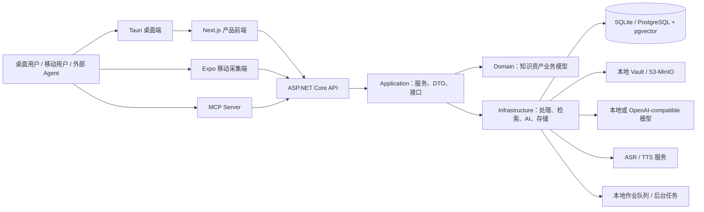

# Memorix 项目架构与功能模块成熟度评估

> 评估日期：2026-08-04  
> 评估对象：`codex/entity-resolution-governance-v1` 分支，提交 `8803199`  
> 评估方法：代码知识图谱（17,122 节点 / 47,649 关系）、仓库结构与依赖审阅、版本历史、自动化测试执行。  
> 成熟度口径：5=可稳定交付；4=核心路径完整，需持续强化；3=可用但集成/运维仍有缺口；2=原型或局部实现；1=规划阶段。

## 1. 执行摘要

Memorix 是一个**本地优先（local-first）的 AI 知识资产引擎**。它将多源采集、AI 文档加工、混合检索、带证据的问答、报告、语音、实体图谱及 Agent/MCP 接入整合到同一产品中，并以桌面端为主入口、移动端承担轻量采集。

项目的后端采用清晰的四层 .NET 架构，已经具备可运行的本地/云端/混合数据模式、认证授权、异步作业、存储与模型提供商抽象，工程骨架成熟度较高。当前主要挑战不是单个功能缺失，而是**功能覆盖面远大于自动化验证与发布治理的覆盖面**：高复杂度 UI 页面、庞大的核心处理流水线、缺失的前端测试和已移除的 CI 工作流都会放大回归风险。

**综合成熟度：3.5 / 5（具备 Beta/早期生产试点条件，尚不建议在缺少回归门禁与运维治理的前提下承诺大规模生产 SLA）。**

## 2. 系统全景

### 2.1 部署与运行形态

| 形态 | 组成 | 评价 |
|---|---|---|
| Local | SQLite、Local Vault、桌面内嵌 API | 隐私与离线优先，是最完整的产品主路径。 |
| Cloud | ASP.NET Core、PostgreSQL+pgvector、对象存储、Redis | 已有基础设施定义，适合多端与协作，但需补部署与监控门禁。 |
| Hybrid | 本地知识库 + 云端 Inbox + 移动采集 | 产品差异化明显，但跨端一致性、失败恢复和权限边界是高风险点。 |

`docker-compose.yml` 提供 PostgreSQL/pgvector、Redis、MinIO，以及按 profile 启用的 FunASR、Fish Speech、Piper；桌面端以 Tauri 2 管理 .NET API sidecar；移动端采用 Expo/React Native；`preview/` 为独立的营销站点。

## 3. 后端架构评估

### 3.1 分层与边界

| 层 | 项目 | 已承担职责 | 成熟度 |
|---|---|---|---:|
| Domain | `KnowledgeEngine.Domain` | 80+ 领域实体与枚举：文档、来源、主题、实体、会议、账单、同步等 | 4.0 |
| Application | `KnowledgeEngine.Application` | DTO、校验器、应用服务、40+ 抽象接口、DI | 4.0 |
| Infrastructure | `KnowledgeEngine.Infrastructure` | EF Core、双数据库、对象存储、索引、AI、音频、MCP、支付、后台处理 | 3.5 |
| API | `KnowledgeEngine.Api` | REST 控制器、SignalR、JWT、异常/追踪/Agent 中间件、Swagger | 3.5 |

**判断：** 依赖方向总体符合 Clean Architecture：业务模型与应用接口被基础设施实现，API 主要作为入站适配器。图谱中存在 1,331 条导入关系、7,558 条调用关系，且多数核心业务聚集在清晰的 `Domain / Application / Infrastructure / Api` 边界内。接口抽象覆盖检索、向量、文件、模型、认证、账单、运行模式等关键替换点，对本地与云端并存非常有利。

### 3.2 核心处理主链路

`DocumentPipeline.ProcessSourceAsync` 是最重要的编排点之一。静态调用链显示其连接了：来源解析、内容清洗、语言检测及中文归一化、质量评分、任务排队、文档本地化、全文索引、标签创建、实体消歧、AI 摘要、审计日志与持久化。

这体现出核心能力完整，但也意味着该链路是单点回归放大器。建议把它明确拆为可独立验证的阶段契约（输入、输出、幂等键、重试策略、可观测事件），而不仅由一个服务编排完成。

### 3.3 API 与权限

仓库包含约 78 条已识别路由、60+ 控制器，覆盖认证、文档、来源、搜索、问答、报告、导出、工作区、移动设备、音频、账单、实体治理和 Agent 接口。认证采用 JWT，本地认证处理器、API Key、工作区授权与 Agent 权限守卫均已有实现痕迹。

优点是能力面与权限概念都已经建模；风险是权限校验在多个服务和控制器中以 `RequireUserId` 等形式重复出现，需通过策略授权、统一资源授权器和权限回归测试来防止新端点遗漏。

## 4. 功能模块成熟度

| 模块 | 已实现能力（代码/配置证据） | 成熟度 | 主要风险与下一步 |
|---|---|---:|---|
| 多源采集与 Inbox | URL、文本、PDF/文件、图片、音频、移动端采集，导入任务与处理状态 | 4.0 | 采集格式广；应建立格式兼容性矩阵与失败重放测试。 |
| 文档 AI 加工 | 解析、清洗、摘要、关键点、标签、质量评分、任务队列、错误映射 | 4.0 | 核心链路耦合广；需阶段化、幂等与死信/补偿设计。 |
| 多语言能力 | 语言检测、中文归一化、本地化、中文全文索引、跨语言检索 | 3.5 | 需用真实语料评测召回、翻译偏差和成本/时延。 |
| 混合检索与 RAG | 关键词、向量、术语、实体、时间、价值信号；问答与引用记录 | 3.5 | 需要离线评测集、质量基线、检索可解释性与观测指标。 |
| 实体解析与知识图谱 | 候选生成、别名、合并/阻断、LLM 判别、关系与治理任务 | 3.5 | 近期重点功能；应补人工审核闭环、可逆合并与准确率评测。 |
| 报告与导出 | 报告、引用、模板、异步作业、Markdown/Obsidian 导出 | 3.5 | 关注长任务状态、导出可复现性与大数据量性能。 |
| 会议与语音 | 录音、分段、转写任务、说话人、纪要版本、ASR/TTS、多 provider | 3.0 | 最新提交刚引入会议纪要 P1-P3；需要真机、长音频、失败恢复及成本测试。 |
| 本地/云端/混合运行时 | SQLite/PostgreSQL、Vault/S3、运行时路由、云 Inbox、设备绑定 | 3.5 | 跨模式迁移、同步冲突、数据删除和灾难恢复需演练。 |
| 账号、工作区与 Agent | JWT、API Key、工作区、设备、MCP Server、Agent Profile/权限 | 3.5 | 安全边界正确性关键；需端到端授权矩阵和渗透测试。 |
| 账单与支付 | 计量、额度、权益、充值、微信/支付宝适配 | 2.5 | 外部支付与财务一致性未见端到端验证证据，建议作为受控试点功能。 |
| 桌面产品 | Tauri 2、sidecar、自动更新脚本、版本检查、macOS/Windows 目标 | 3.5 | 当前已具备发布工程结构；需恢复 CI、签名和更新回滚演练。 |
| 移动采集端 | Expo、离线队列、文本/URL/文件/录音采集、推送、设备配对 | 3.0 | `App.tsx` 承担较多流程；应拆分状态管理并补 iOS/Android E2E。 |
| Web 产品前端 | Next.js 16、React Query、Zustand、表单校验、完整业务页面 | 3.0 | 页面复杂度偏高且未发现前端测试文件；优先补关键路径测试。 |
| 营销站 | 独立 Next.js 前台、双语/主题 | 3.5 | 与产品核心低耦合，风险较低。 |

## 5. 工程质量与交付成熟度

### 5.1 已验证信号

| 项目 | 结果 |
|---|---|
| 后端自动化测试 | `dotnet test` 实测：130 通过、0 失败、0 跳过，耗时约 2 秒。 |
| 后端测试规模 | 30 个 C# 测试文件；主要集中在 `KnowledgeEngine.Infrastructure.Tests`。 |
| 代码规模 | 约 503 个后端 C# 源文件；前端 `web/` 约 396 个测试命名文件（含非测试命名文件需谨慎解读）。 |
| 发布工程 | Docker Compose、桌面构建/更新脚本、冒烟 API 脚本均存在。 |
| 安全依赖扫描信号 | 测试构建报告 `AngleSharp 1.4.0` 存在 1 个中危已知漏洞（NU1902）。 |

### 5.2 主要短板

1. **CI/CD 门禁缺失。** 版本历史显示 `.github/workflows` 在 2026-08-01 被删除；当前未检测到 GitHub Actions 工作流。构建、单测、lint、依赖漏洞扫描、桌面签名和发布不应依赖人工执行。
2. **前端自动化测试不足。** 未发现 `web/` 与 `mobile/` 的 `*.test.*` / `*.spec.*` 文件；产品 UI 承担大量权限、异步任务和状态转换，回归风险较高。
3. **部分 UI 组件复杂度偏高。** 静态分析中，Cloud Inbox（认知复杂度 73）、文档详情（63）、Inbox（59）均为高风险页面；应拆分数据获取、业务动作与展示组件。
4. **超宽业务域增加变更耦合。** 处理流水线、实体治理、语音、支付、跨端同步同时演进，需要以 feature flag、领域测试和发布节奏隔离风险。
5. **供应链治理需补齐。** 已发现 AngleSharp 中危漏洞；应在 CI 设定依赖审计、升级策略和例外到期机制。
6. **运维证据有限。** 有日志、健康检查、追踪 ID 等基础，但未见告警规则、指标看板、备份恢复演练和 SLO 的版本化资产。

## 6. 优先级路线图

### P0：进入公开试用/生产前必须完成

1. 恢复 CI：后端测试、web lint/build、mobile typecheck、桌面更新脚本测试、依赖漏洞扫描全部设为合并门禁。
2. 升级或替换 `AngleSharp 1.4.0`，并验证对 HTML 解析/导入链路的影响。
3. 为登录、采集→处理→检索→问答、工作区隔离、Agent 权限、移动设备绑定建立端到端回归套件。
4. 为云端模式写清备份、恢复、密钥轮换、对象存储生命周期和失败告警流程。

### P1：下一阶段提升可维护性

1. 将 `DocumentPipeline` 拆为可独立测试、可观测、可重试的阶段；对每阶段定义幂等键和补偿策略。
2. 拆分高复杂度前端页面，引入页面级 data hooks、动作层和展示组件；增加 React/移动端测试。
3. 建立检索、RAG、实体解析和 ASR 的标准评测集，持续记录质量、成本、时延与失败率。
4. 把重复的用户/工作区鉴权收敛为声明式策略与资源授权服务，并增加拒绝访问用例。

### P2：规模化与商业化前完善

1. 对支付、计量、充值执行沙箱对账、幂等和异常补偿演练。
2. 建立跨端同步冲突策略、迁移工具和数据可携带/删除验证。
3. 发布版本策略：灰度、自动更新回滚、数据库迁移兼容性检查及变更日志。

## 7. 结论

Memorix 的优势在于**产品定位明确、后端分层扎实、核心知识处理链路和多端形态已具备完整雏形**。它已经超过单一 Demo：本地/云端运行时、AI 与音频 provider 抽象、混合检索、Agent 权限、实体治理与会议能力均有对应实现。

下一阶段最有价值的投入不应继续无边界扩展功能，而应将现有能力“产品化”：以 CI、前端/E2E 测试、流水线可观测性、数据与权限治理、质量评测和发布回滚机制，将当前 3.5/5 的集成型产品提升到可持续交付的 4/5。

## 附录：评估边界

- 本报告基于静态代码、仓库元数据和一次后端测试执行，不替代真实生产流量、支付渠道、移动真机、云端基础设施和安全渗透验证。
- 项目工作区存在未纳入版本控制的 `.reasonix/` 目录；本报告未读取或修改该目录。
- 文档中的“已实现”表示仓库中存在实现/配置/接口证据，不等同于已在生产环境完成验收。
