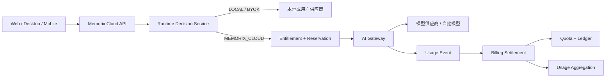
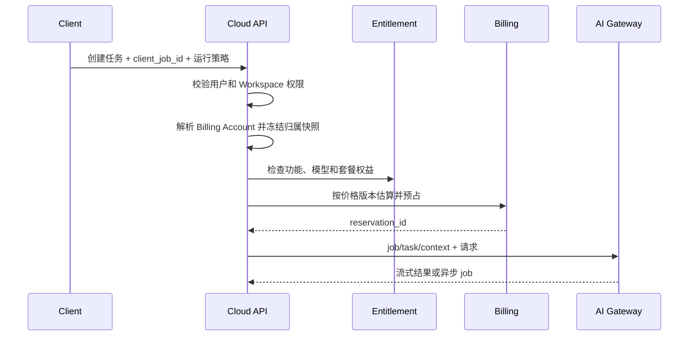

# Memorix AI 算力与 Token 计费模块开发规划

> 版本：V1.0  
> 日期：2026-07-29  
> 状态：开发规划基线  
> 适用范围：Memorix 云端 API、AI Gateway、Web、桌面端与移动端  
> 依据文档：《Memorix AI 算力与 Token 计费模块集成方案》  
> 关联文档：《Memorix 桌面端云端模式完整开发文档》《Memorix 本地—云端身份、数据同步与插件体系设计》《Memorix 用户计费中心与微信支付宝充值开发规划 V1.0》

---

## 1. 文档目标

本文把计费集成方案转换为适配当前 Memorix 代码库的可执行开发计划，统一以下内容：

1. 当前代码能力与计费目标之间的差距；
2. 计费模块与 Runtime Router、Workspace、Cloud Account、AI 调用链的边界；
3. 第一版领域模型、数据库表、接口和事件；
4. Web、桌面端、移动端的产品改造范围；
5. 分阶段任务、依赖关系、测试、灰度、回滚和验收标准。

本文不是最终商业定价表。具体套餐价格、充值规则、税务、支付渠道和发票规则需要产品、运营与财务另行确认，但工程模型必须支持价格版本化和后续扩展。

核心原则：

> 本地与 BYOK 请求不进入 Memorix 财务扣费；只有经 Memorix AI Gateway 执行的云模型、云存储、同步、席位和付费插件进入统一计费域。

---

## 2. 范围与非目标

### 2.1 本期范围

- 云模型任务的 Job、Task、Attempt 和 Usage Event；
- Workspace 到 Billing Account 的费用归属；
- 套餐权益和月度算力额度；
- 模型价格版本和算力点换算；
- 额度预估、预占、结算、释放和冲正；
- 用户费用与供应商成本分离；
- Web/桌面端用量中心；
- 预算、告警和高成本任务确认；
- Outbox、幂等、对账、审计和灰度开关；
- 为团队共享额度、插件计费、存储计费预留扩展点。

### 2.2 非目标

- 不对完全本地模型调用追溯收费；
- 不代替模型供应商向 BYOK 用户收取 Token 费用；
- 不在本地 SQLite 中维护云端财务余额真值；
- 不在第一阶段实现完整支付、发票、税务和开发者分成；
- 不在计费模块保存提示词、文档正文或模型输出；
- 不把计费建设作为开放未完成云端模式的前置替代方案。

---

## 3. 当前项目审计

### 3.1 当前技术结构

当前项目为模块化单体，主要组成如下：

| 层/端 | 当前实现 | 与计费的关系 |
|---|---|---|
| API | ASP.NET Core，目标框架 `net10.0` | 新增 Billing、Entitlement、AI Jobs API |
| Application | DTO、接口、服务契约 | 放置计费用例契约、授权上下文和领域命令 |
| Domain | EF 实体与枚举 | 新增计费领域实体，禁止保存知识正文 |
| Infrastructure | EF Core、Runtime、AI、处理流水线 | 实现计量、定价、预占、账本、Outbox |
| Web | Next.js 设置与工作区页面 | 已有 Usage 页面，可升级为用量中心 |
| Desktop | Tauri + 内置 Loopback API | 本地/BYOK 标记、云端预算和确认交互 |
| Mobile | React Native 采集客户端 | 第一版只展示云端额度和任务结果 |

### 3.2 可复用能力

| 能力 | 代码位置 | 复用方式 |
|---|---|---|
| Workspace 模式与模型配置 | `Workspace`、`WorkspaceService` | 增加计费策略引用，不在 Workspace 内保存余额 |
| Runtime 路由 | `RuntimeRouter.GetModelProviderAsync` | 演进为显式执行决策，输出运行模式和计费模式 |
| OpenAI 兼容 Usage | `OpenAiLlmService.CompleteAsync`、`LlmResult` | 扩充模型、请求 ID、缓存/推理 Token 和来源 |
| 模型统一入口 | `UnifiedModelProvider` | 本地/BYOK 保留；云模型必须切到 AI Gateway 客户端 |
| 云账号与工作区绑定 | `CloudAccountBinding`、`BindingService` | 解析 Cloud Account 和远端 Workspace，不承担费用归属 |
| Workspace 授权 | `WorkspaceAuthorizationService` | 所有计费查询先校验 Workspace 访问权 |
| 现有用量统计 | `UserUsageDaily`、`UsageService`、`/api/usage` | 降级为非财务展示聚合，不作为扣费依据 |
| 用量页面 | `web/.../settings/usage/page.tsx` | 改为新版 Billing API，保留旧统计兼容区 |
| 业务任务 | Import Job、Cloud Job Queue 接口 | 建立 `ai_job` 映射；不直接把 Import Job 当账务记录 |

### 3.3 关键缺口与风险

#### 3.3.1 云端模型入口尚未形成可靠边界

`RuntimeRouter.GetModelProviderAsync` 当前在本地和云端模式下都构造 `OpenAiLlmService` 与 `UnifiedModelProvider`。云端分支主要依赖 Workspace 中的 provider 与 endpoint 配置，尚未体现：

- Memorix Gateway 身份；
- Workspace、Billing Account 和 Job 上下文；
- 权益检查与额度预占；
- 供应商请求 ID；
- Usage Event 和结算回调；
- 禁止本地失败后无授权云端回退。

因此第一优先级不是直接增加扣费表，而是收敛云模型调用入口。

#### 3.3.2 现有 Usage 只能用于统计

`UserUsageDaily` 当前以 `UserId + UsageDate` 聚合搜索、问答、报告、Agent 和 Token：

- 没有 Workspace 和 Billing Account；
- 没有模型、供应商、任务和请求维度；
- 没有价格版本、币种、算力点与供应商成本；
- 没有幂等键；
- `RecordTokensAsync` 异常只记录日志，调用方存在发后不管；
- 聚合行可更新，不满足不可变财务账本要求；
- 不能区分本地、BYOK、Memorix Cloud。

结论：保留 `UserUsageDaily` 作为分析缓存或兼容展示，正式账务从新表追加写入。

#### 3.3.3 Job 模型未覆盖模型调用层级

当前 Import Job 偏业务处理进度，`CloudJobQueue` 仍未构成完整远程队列。计费需要独立的：

```text
AI Job → AI Task → Request Attempt → Usage Event → Charge / Provider Cost
```

业务 Import Job、报告任务、问答请求可引用 AI Job，但不能互相替代。

#### 3.3.4 Workspace 不能直接承担账户余额

当前 `Workspace.UserId` 可表达基础所有权，但团队工作区的费用承担方不一定是发起用户。必须增加：

```text
Cloud Account → Billing Account ← Workspace Billing Binding
```

任务创建时冻结归属快照，成员退出或切换 Workspace 不得改变历史费用。

### 3.4 当前成熟度判断

| 子系统 | 当前成熟度 | 结论 |
|---|---:|---|
| 基础用量展示 | 50% | 可复用 UI 和聚合思路 |
| 原始 Token 采集 | 35% | 仅部分 OpenAI 兼容结果 |
| 云模型统一入口 | 25% | 必须先建设 Gateway 边界 |
| 权益与套餐 | 10% | 需要新领域模块 |
| 预占与账本 | 0% | 全新建设 |
| 支付与发票 | 0% | 后续阶段 |
| 团队预算 | 5% | 有 Workspace 权限基础，无账务模型 |

---

## 4. 架构决策

### 4.1 部署形态

第一版采用“云端模块化单体 + 独立 AI Gateway”：



职责边界：

| 模块 | 职责 | 禁止事项 |
|---|---|---|
| Runtime Decision | 决定 local/BYOK/cloud、数据策略、模型策略 | 不扣余额 |
| Entitlement | 判断能否使用功能和模型 | 不统计 Token |
| AI Job | 管理业务任务、步骤、尝试和状态 | 不自行改余额 |
| AI Gateway | 代理云模型、采集供应商 Usage、限流与取消 | 不保存知识内容到计费表 |
| Pricing | 按价格版本计算点数、金额与成本 | 不决定从哪个余额桶扣除 |
| Wallet/Ledger | 预占、扣减、释放、冲正 | 不调用模型 |
| Aggregation | 生成日/月、功能、模型和成员报表 | 不作为财务真值 |

### 4.2 执行模式与计费模式

新增两个独立枚举，避免把 Workspace 的 `Mode` 当成计费判断：

```text
ExecutionMode
  LOCAL
  USER_BYOK
  MEMORIX_CLOUD

BillingMode
  LOCAL_FREE
  LOCAL_LICENSED
  USER_BYOK
  CLOUD_INCLUDED_QUOTA
  CLOUD_PAY_AS_YOU_GO
  ENTERPRISE_CONTRACT
  PLATFORM_FREE
```

规则：

- `Workspace.Mode=cloud` 不等于每个请求都收费；
- `ExecutionMode` 由每次任务的运行决策确定；
- 只有 `MEMORIX_CLOUD` 请求可以进入云算力预占；
- BYOK 如果未来经过 Memorix 代理，代理费必须是独立计量项；
- 本地调用可以记录本地统计，但云端账本金额必须为零且默认不上报。

### 4.3 云调用强制入口

新增 `IMemorixCloudModelClient`，云端执行不再直接复用可配置任意 endpoint 的 `OpenAiLlmService`。

建议接口：

```csharp
Task<CloudModelResult> CompleteAsync(
    AiExecutionContext context,
    CloudCompletionRequest request,
    CancellationToken ct);
```

`AiExecutionContext` 至少包含：

```text
job_id
task_id
workspace_id
billing_account_id
initiated_by_user_id
device_id
client_request_id
reservation_id
price_version_id
trace_id
```

Gateway 使用服务端托管的供应商凭据。客户端不得获得平台 API Key。

### 4.4 数据最小化

计费库和计费日志允许保存：

- 标识、模型、供应商、任务类型；
- Token/OCR/音频/存储等数值；
- 状态码、耗时、价格和费用；
- 请求哈希或供应商请求 ID。

禁止保存：

- 完整 system prompt 和 user prompt；
- 文档正文、文件内容；
- 模型完整输出；
- 用户 BYOK 明文；
- 可反推出敏感正文的调试 payload。

Gateway 业务转发日志和计费日志采用不同保留策略。

---

## 5. 目标领域模型

### 5.1 账户与权益

#### `billing_account`

| 字段 | 类型 | 说明 |
|---|---|---|
| `id` | UUID | 计费账户 |
| `account_type` | varchar | PERSONAL/TEAM/ENTERPRISE/PROMO/INTERNAL |
| `owner_cloud_user_id` | UUID? | 个人账户所有者 |
| `name` | varchar | 展示名 |
| `currency` | char(3) | 默认币种 |
| `status` | varchar | ACTIVE/SUSPENDED/CLOSED |
| `version` | bigint | 乐观并发版本 |
| `created_at/updated_at` | timestamptz | 时间 |

#### `billing_account_member`

保存成员角色，不复用 Workspace 成员表表达财务权限：

```text
OWNER / BILLING_ADMIN / VIEWER
```

#### `workspace_billing_binding`

| 字段 | 说明 |
|---|---|
| `workspace_id` | 云端 Workspace |
| `billing_account_id` | 费用承担方 |
| `effective_from/effective_to` | 有效区间 |
| `is_active` | 当前绑定 |
| `created_by` | 操作人 |

约束：同一 Workspace 同一时刻只能有一个有效 Billing Account。

#### 套餐与权益表

```text
subscription_plan
subscription
entitlement_definition
plan_entitlement
account_entitlement_override
```

客户端只读取标准权益键，不根据套餐名写分支。

第一版权益键：

```text
cloud_ai.enabled
cloud_ai.monthly_credits
cloud_ai.pay_as_you_go
cloud_ai.premium_models
cloud_ai.single_job_credit_limit
cloud_sync.enabled
cloud_storage.bytes
team.max_members
plugin.paid_access
```

### 5.2 定价

```text
price_plan
price_plan_version
price_rule
account_price_binding
```

`price_rule` 支持：

```text
meter_type
provider_id
model_id
unit
unit_size
credit_rate
sale_unit_price
provider_unit_cost
currency
effective_from/effective_to
```

要求：

- 已发布价格版本不可原地修改；
- Job 在预占时绑定 `price_plan_version_id`；
- 结算沿用该版本；
- 金额使用 `decimal`，禁止 `double`；
- 数据库存储最小货币单位或高精度 decimal，并统一舍入规则。

### 5.3 AI Job 与计量

#### `ai_job`

```text
id
client_job_id
job_type
execution_mode
billing_mode
cloud_account_id
billing_account_id
workspace_id
initiated_by_user_id
device_id
price_plan_version_id
estimated_credits
actual_credits
estimated_amount
actual_amount
currency
status
data_policy
model_policy
budget_limit
created_at
started_at
completed_at
```

唯一约束：

```text
(workspace_id, client_job_id)
```

#### `ai_task`

表达摘要、标签、实体、Embedding、Rerank、问答、报告等处理步骤。

#### `ai_request_attempt`

每次真实模型调用或重试一条，至少保存：

```text
provider_id
requested_model_id
actual_model_id
provider_request_id
attempt_no
status
started_at/completed_at
http_status
error_code
is_chargeable
```

#### `usage_event`

采用追加写入：

```text
id
job_id
task_id
attempt_id
workspace_id
billing_account_id
provider_id
model_id
usage_type
quantity
unit
usage_source
occurred_at
received_at
idempotency_key
raw_usage_json
reconciliation_status
```

第一版 `usage_type`：

```text
INPUT_TOKEN
OUTPUT_TOKEN
CACHE_READ_TOKEN
CACHE_WRITE_TOKEN
REASONING_TOKEN
EMBEDDING_TOKEN
RERANK_REQUEST
OCR_PAGE
AUDIO_SECOND
IMAGE_REQUEST
STORAGE_BYTE_HOUR
SYNC_EGRESS_BYTE
AGENT_CALL
PLUGIN_CALL
```

`raw_usage_json` 只保存供应商返回的计量字段白名单，不保存响应正文。

### 5.4 额度、预占与账本

#### `wallet`

每个 Billing Account 每币种一条钱包；算力额度本身由 Quota Bucket 管理。

#### `quota_bucket`

来源：

```text
PLAN / TOP_UP / PROMOTION / ENTERPRISE_CREDIT / MANUAL
```

关键字段：

```text
granted_credits
consumed_credits
reserved_credits
expires_at
priority
version
```

#### `balance_reservation`

状态：

```text
ACTIVE / CONSUMED / RELEASED / EXPIRED / CANCELLED
```

一个 Job 可以从多个 Bucket 预占，需使用子表记录分摊。

#### `billing_charge`

表达面向用户的收费结果；同一 Usage 可汇总成一条或多条 Charge。

#### `provider_cost`

独立保存 Memorix 对供应商的成本。失败重试即使不向用户收费，也可产生 Provider Cost。

模型供应商通常以 USD 结算，而用户可能使用 CNY、EUR 或 Credits。为保证历史毛利和供应商账单可复算，至少保存：

```text
provider_amount
provider_currency
exchange_rate_snapshot
exchange_rate_source
exchange_rate_effective_at
base_currency
base_currency_amount
cost_tags
```

规则：

- `provider_amount + provider_currency` 保存供应商原始成本；
- `exchange_rate_snapshot` 表示“1 单位供应商货币折合多少基准货币”，口径必须固定；
- `base_currency_amount` 在成本入账时计算并固化；
- 汇率来源、取值时间和舍入规则必须可审计；
- 历史 Provider Cost 不因后续汇率变化重算；
- 平台故障重试写入 `internal_retry` 成本标签，便于从用户收费和正常毛利中单独分析。

#### `account_ledger`

不可变双向记录，动作类型：

```text
GRANT / RESERVE / RELEASE / CONSUME / TOP_UP / REFUND / REVERSAL / EXPIRE / ADJUST
```

错误不能直接修改历史记录，必须通过 `REVERSAL` 或 `ADJUST` 修复。

### 5.5 聚合表

新增：

```text
usage_aggregation_daily
usage_aggregation_monthly
```

维度包含 Billing Account、Workspace、成员、Job Type、Model 和 Meter Type。

现有 `UserUsageDaily` 处理方式：

1. 保留表和旧接口一个兼容周期；
2. 新用量中心优先读取新聚合；
3. 本地非财务统计仍可继续写旧表；
4. 云端 Token 统计改由 Usage Event 聚合生成；
5. 不把旧聚合反向迁移为财务 Charge；
6. 旧 `/api/usage` 响应显式增加 `is_financial_truth=false` 和 `source=legacy_aggregate`；
7. Web 同屏展示旧统计与新版财务用量时，将旧数据标记为“历史统计，仅供参考，不作为账单依据”。

---

## 6. 核心业务流程

### 6.1 创建云端任务



顺序必须是：

1. 身份认证；
2. Workspace 授权；
3. Billing Account 解析；
4. 权益检查；
5. 价格估算和预算检查；
6. 原子预占；
7. 创建 Job/Task；
8. 调用 Gateway。

权限不足不能通过余额充足绕过，余额不足也不能通过客户端声称本地模式绕过 Gateway。

### 6.2 运行策略

客户端提交：

```json
{
  "executionPreference": "local_first",
  "allowCloudFallback": false,
  "cloudBudgetLimit": 0.50,
  "dataPolicy": "allow_selected_content",
  "modelPolicy": "balanced"
}
```

服务端规则：

- `allowCloudFallback=false` 时，本地失败必须终止或要求确认；
- 云端回退创建新的 cloud task/attempt，并在调用前预占；
- 预算以服务端估算和最终结算为准；
- 如果最大输出或批量规模导致估算超过预算，返回可操作的降级建议；
- 已开始的任务不因用户切换当前 Workspace 改变归属。

### 6.3 预占

```text
estimated_credits =
input_estimate × input_rate
+ max_output_tokens × output_rate
+ embedding_estimate
+ other_meter_estimate
```

扣减优先级：

1. 最早到期的促销额度；
2. 当前周期套餐额度；
3. 充值额度；
4. 企业信用额度。

并发要求：

- 第一版或低并发阶段，在 PostgreSQL 事务内锁定候选 Bucket；
- 校验 `available = granted - consumed - reserved`；
- 写入 Reservation、分摊明细和 Ledger；
- 使用唯一业务键保证重复请求返回同一结果；
- 禁止“先查询余额，再无条件更新”。

#### 6.3.1 分级预占策略

不同任务采用不同预占粒度：

| 任务类型 | 推荐方式 | 说明 |
|---|---|---|
| 普通问答/短对话 | 固定小额预占 | 按模型策略配置默认最大输出上限，例如 2,000 Output Token 对应的 Credits |
| 流式对话 | 小额预占 + Gateway 硬上限 | 接近上限时先补充预占，失败则停止继续生成 |
| 长文档/批处理 | Job 级完整预占或 Quota Lease | 按文档数、步骤和最大输出估算，租约 TTL 覆盖任务并支持心跳续期 |
| OCR/音视频 | 业务单位预占 | 按页数、秒数、分钟数或文件上限计算 |

结算时按实消费并释放差额。实际用量可能超过预占时，Gateway 必须在继续产生可控增量成本前申请补充预占；不能先无限调用供应商，再事后形成无担保欠费。

#### 6.3.2 Redis 与 Quota Lease 扩展

当 PostgreSQL Bucket 行锁已被压测证明是瓶颈时，可增加 Redis 高频授权层，但不得把普通额度快照直接作为独立财务真值异步回写。推荐采用“PostgreSQL 先冻结租约额度，Redis 再分配租约”的方式：

1. Billing 在 PostgreSQL 事务中从 Quota Bucket 创建 `quota_lease`，一次性冻结一段 Credits；
2. Redis 保存租约剩余额度、版本、有效期和作用域；
3. 高频小任务通过 Lua 脚本在单个租约内原子预扣；
4. 每次子预占写入可重放的 Redis Stream 或持久消息，并使用业务幂等键；
5. 后台批量把子预占、消费和释放同步为 PostgreSQL Reservation 与 Ledger；
6. 租约过期前停止签发新额度，完成对账后才释放 PostgreSQL 中未使用部分；
7. Redis 丢失、故障转移或租约版本不一致时默认停止云端授权，不能回退到未受控调用。

该设计保证最坏情况下的未同步支出不超过 PostgreSQL 已冻结的 Lease 上限。Redis 负责降低高频小请求的锁竞争，PostgreSQL 仍是账户余额、总预占和财务账本的最终真值。

新增模型：

```text
quota_lease
quota_lease_allocation
```

建议字段：

```text
lease_id
billing_account_id
quota_bucket_id
granted_credits
allocated_credits
consumed_credits
expires_at
scope
status
version
```

### 6.4 Usage 采集与结算

Gateway 在每次 Attempt 结束后：

1. 提取供应商 request ID 和 Usage；
2. 规范化为一个或多个 Usage Event；
3. 通过 Transactional Outbox 持久化；
4. 结算 Worker 按价格版本计算 Charge 和 Provider Cost；
5. 消耗实际额度；
6. 释放预占差额；
7. 更新 Job 汇总；
8. 触发聚合和告警事件。

正式收费来源优先级：

```text
PROVIDER > VERIFIED_GATEWAY_TOKENIZER > ESTIMATED
```

使用估算值结算时标记 `PENDING_RECONCILIATION`，不得伪装成供应商实测。

### 6.5 流式响应、断连与取消

AI Gateway 必须是 SSE/WebSocket 流式响应的中继和计量边界，客户端不能承担正式计量职责。

处理规则：

1. Gateway 持续记录供应商响应片段和已确认 Usage，但不把正文写入计费账本；
2. 用户主动取消时，Gateway 立即向供应商发送 Cancel/关闭上游连接；
3. 客户端网络断开时，Gateway 按配置提供短暂重连窗口；窗口结束后取消上游请求；
4. 取消后继续读取供应商的最终 Usage 或取消确认，直至能够确定实际消耗；
5. 供应商不支持可靠取消时，Gateway 接管并排空必要的剩余上游响应，以取得最终 Usage，结果不再推送给已断开的客户端；
6. 优先按供应商最终 Usage 结算；缺失时使用 Gateway 验证过的 Tokenizer 计数，并标记待对账；
7. 用户主动取消按供应商实际已消费量结算，不按客户端实际收到的字符数结算；
8. 网络断连、用户取消、Gateway 取消和供应商取消必须使用不同状态与原因码。

建议状态：

```text
CLIENT_DISCONNECTED
USER_CANCEL_REQUESTED
GATEWAY_CANCEL_SENT
SUPPLIER_CANCELLED
COMPLETED_AFTER_DISCONNECT
USAGE_PENDING_RECONCILIATION
```

流式任务必须设置最大生成量和预占上限。达到剩余额度或预算阈值时，Gateway 应停止继续读取可触发新生成的请求，并完成已有 Usage 结算。

### 6.6 失败与重试

| 场景 | 用户收费 | 供应商成本 | 处理 |
|---|---|---|---|
| 调用前校验失败 | 否 | 否 | 不创建 Attempt 或标记拒绝 |
| 供应商未受理 | 否 | 通常否 | 释放预占 |
| 超时但供应商返回 Usage | 按策略 | 是 | 记录 Usage，进入对账 |
| 平台原因自动重试成功 | 不重复收费 | 所有实际成本 | 成本标记 `internal_retry` |
| 用户主动取消且供应商已消耗 | 按实际供应商 Usage | 是 | 记录取消前实际 Usage |
| 客户端断连后成功取消 | 按取消生效前实际 Usage | 是 | 保留断连和取消状态 |
| Usage 缺失 | 暂缓或估算 | 待账单确认 | 待对账 |

工程默认规则：Gateway 崩溃、内部超时和平台路由失败等平台原因导致的重试，一律不重复向用户收费，但 Provider Cost 必须完整记录并标记 `internal_retry`。

### 6.7 本地与 BYOK

- 本地模式在本地保存统计，不调用云端 Reservation API；
- BYOK 由客户端安全凭据区提供 Key；
- BYOK 调用结果可显示 Token，但标记 `USER_BYOK` 和“由供应商收费”；
- BYOK Usage 不写入 `billing_charge`；
- 用户明确选择 Memorix Cloud 后，才创建可收费 Job；
- `allowCloudFallback` 工程默认值强制为 `false`；本地失败后必须弹出明确授权提示，用户同意后才可发送必要内容并预占；
- 余额不足时提供低成本模型、本地模型或 BYOK 选项；
- 解除云绑定、余额不足和订阅到期不得锁死本地数据库与导出。

---

## 7. API 规划

统一前缀：

```text
/api/billing
/api/entitlements
/api/ai/jobs
```

### 7.1 用户与 Workspace API

| 方法 | 路径 | 说明 |
|---|---|---|
| GET | `/api/entitlements?workspaceId=` | 当前 Workspace 有效权益 |
| GET | `/api/billing/summary?workspaceId=` | 套餐额度、预占、余额和预算 |
| GET | `/api/billing/usage` | 时间、Workspace、成员、功能、模型聚合 |
| GET | `/api/billing/jobs` | 业务任务费用列表 |
| GET | `/api/billing/jobs/{jobId}` | Task/Attempt/Usage/Charge 明细 |
| GET | `/api/billing/ledger` | 有财务权限的账户流水 |
| PUT | `/api/billing/budgets/{workspaceId}` | Workspace/成员预算 |
| POST | `/api/ai/jobs/estimate` | 高成本任务估算 |
| POST | `/api/ai/jobs` | 创建并预占云端任务 |
| POST | `/api/ai/jobs/{jobId}/cancel` | 取消任务 |

所有 Workspace 查询都必须调用 `IWorkspaceAuthorizationService`。Ledger 和团队成员预算还需 Billing Account 角色授权。

### 7.2 内部 Gateway API

| 方法 | 路径 | 说明 |
|---|---|---|
| POST | `/internal/ai/jobs/{jobId}/attempts` | 创建 Attempt |
| POST | `/internal/ai/usage-events` | 上报 Usage |
| POST | `/internal/ai/jobs/{jobId}/complete` | 完成 Job |
| POST | `/internal/ai/jobs/{jobId}/fail` | 失败 Job |

要求：

- 仅服务身份可访问；
- mTLS 或短期服务 Token；
- 请求体签名或消息总线身份；
- 强制 Idempotency-Key；
- 不接受客户端直接调用；
- 不接受 prompt/output 字段。

### 7.3 错误码

```text
entitlement_denied
premium_model_denied
billing_account_missing
quota_insufficient
budget_exceeded
reservation_conflict
price_version_unavailable
job_already_exists
usage_duplicate
usage_pending_reconciliation
billing_temporarily_unavailable
```

客户端不得把所有错误统一显示为“余额不足”。

---

## 8. 代码改造规划

### 8.1 Domain

在 `KnowledgeEngine.Domain/Entities/Billing/` 增加计费实体，在 `Enums/Billing/` 增加状态与类型。

建议按子域拆分：

```text
BillingAccount*
Subscription*
Entitlement*
Pricing*
AiJob*
Usage*
Wallet*
Ledger*
OutboxMessage
```

避免继续把所有实体直接堆放在单层 `Entities` 目录。

### 8.2 Application

新增接口：

```text
IRuntimeDecisionService
IEntitlementService
IBillingAccountResolver
IPricingService
IUsageMeteringService
IReservationService
ISettlementService
ILedgerService
IAiJobService
IBillingQueryService
IReconciliationService
```

新增上下文对象：

```text
AiExecutionPolicy
AiExecutionDecision
AiExecutionContext
UsageMeasurement
PriceQuote
ReservationResult
SettlementResult
```

### 8.3 Infrastructure

1. 扩充 `IAppDbContext` 和 `AppDbContext`；
2. 为 PostgreSQL 增加计费迁移和索引；
3. SQLite 默认不创建云端财务表，或仅创建本地统计所需表；
4. 新增 `MemorixCloudModelClient`；
5. 扩充 `LlmResult`：

```text
ProviderRequestId
Provider
RequestedModel
ActualModel
InputTokens
OutputTokens
CacheReadTokens
CacheWriteTokens
ReasoningTokens
UsageSource
```

6. 将 `RuntimeRouter` 的“选择 Provider”与“生成执行决策”拆开；
7. 云端模型禁止从 Workspace JSON 直接注入平台 API Key；
8. 使用 BackgroundService 运行结算、预占过期和对账 Worker；
9. 使用 Outbox 保证 Usage 与结算事件不丢失；
10. OpenTelemetry 增加 `job_id/task_id/attempt_id`，日志中不记录正文。

### 8.4 API

新增控制器：

```text
EntitlementsController
BillingSummaryController
BillingUsageController
BillingJobsController
BillingLedgerController
BillingBudgetsController
AiJobsController
InternalAiUsageController
```

现有 `UsageController`：

- 第一阶段保持兼容；
- 响应增加 `source=legacy_aggregate` 和 `is_financial_truth=false`；
- 新 Web 页面切换后标记废弃；
- 兼容期结束再移除，不直接改成财务接口。

### 8.5 Web

将现有 Usage 设置页升级为四个区域：

1. 本月额度：赠送、已用、预占、剩余；
2. 费用趋势：按功能、模型、Workspace；
3. 最近任务：用户可理解的 Job 明细；
4. 预算与告警：个人或团队权限范围内配置。

必须显示：

- 主视觉展示算力点（Credits），悬浮提示或详情页展示约等价货币金额及 Token 换算；
- 算力点和真实计量；
- 模型及执行方式；
- 本地/BYOK 不由 Memorix 收 Token 费；
- 额度扣减与现金费用；
- 费用归属 Workspace；
- 数据更新时间和待对账状态。

旧统计与新财务数据同屏时：

- 对 `is_financial_truth=false` 的数据统一显示“历史统计，仅供参考”；
- 旧统计不得计入余额、账单合计或应付金额；
- 待对账数据需要单独状态，不与已结算费用混合。

### 8.6 Desktop

新增 Workspace 级 AI 运行设置：

```text
execution_preference
allow_cloud_fallback
cloud_budget_limit
daily_budget
monthly_budget
confirm_cloud_upload
allow_low_cost_model_fallback
```

桌面端职责：

- 明确显示本地、BYOK、Memorix Cloud；
- 高成本任务调用 Estimate API；
- 用户确认后发送稳定 `client_job_id`；
- 本地缓存的余额、额度和预算摘要只用于 UI 展示及非权威的提前提示；
- 客户端不得使用缓存自行批准云端任务，也不得接受修改本地缓存绕过服务端校验；
- 断网时创建云任务直接返回网络异常，不进入“等待联网后自动执行”的云任务队列；
- “稍后处理”必须保存为明确的本地草稿或本地任务，联网后仍需重新向 Cloud API 申请权益与预占；
- 恢复联网后拉取 Job 和余额；
- 本地任务不排队等待云端计费。

### 8.7 Mobile

第一版只做：

- 展示 Workspace 云额度摘要；
- 提交云端采集后的处理策略；
- 查看 Job 状态与最终消耗；
- 余额不足或断网时允许“仅采集，稍后本地处理”，不得伪装为已创建云任务；
- 联网后如需转云处理，必须重新取得服务端授权与预占。

不在移动端实现充值与完整财务后台。

---

## 9. 数据库与迁移策略

### 9.1 数据库选择

- 云端财务真值仅存 PostgreSQL；
- 本地 SQLite 只保存本地统计、运行策略缓存和云端摘要缓存；
- 不通过 SQLite 文件同步账务数据；
- 客户端缓存余额必须带 `as_of` 时间、过期时间和只读标识；
- 客户端缓存仅用于视觉展示和本地提前提示，不可用于服务端授权；
- 所有云任务的创建、预占和执行授权 100% 以 Cloud API/Gateway 的实时结果为准；
- Redis Quota Lease 属于服务端授权加速层，其总额度必须已在 PostgreSQL 冻结，不能与客户端缓存混淆。

### 9.2 索引与约束

至少建立：

```text
ai_job UNIQUE(workspace_id, client_job_id)
ai_request_attempt UNIQUE(provider_id, provider_request_id, attempt_no)
usage_event UNIQUE(idempotency_key)
billing_charge UNIQUE(job_id, price_plan_version_id, charge_type)
account_ledger UNIQUE(business_type, business_id, ledger_action, sequence)
workspace_billing_binding UNIQUE active binding
```

高频查询索引：

```text
(billing_account_id, created_at)
(workspace_id, created_at)
(job_id, occurred_at)
(status, updated_at)
(reconciliation_status, occurred_at)
(expires_at, status)
```

### 9.3 上线迁移

1. 先建空表和只读 API；
2. 创建默认内部价格版本；
3. 为现有云用户建立个人 Billing Account；
4. 为 Workspace 建立明确 Billing Binding；
5. 发放测试额度 Bucket；
6. Shadow 模式采集 Usage，不产生 Charge；
7. 校验对账通过后启用额度；
8. 不从 `UserUsageDaily` 生成历史账单。

---

## 10. 安全与权限

### 10.1 权限矩阵

| 操作 | Workspace Member | Workspace Owner | Billing Viewer | Billing Admin |
|---|---:|---:|---:|---:|
| 查看自己的任务 | ✓ | ✓ |  | ✓ |
| 查看 Workspace 聚合 | 受策略限制 | ✓ | ✓ | ✓ |
| 查看成员明细 |  | ✓ | 受策略限制 | ✓ |
| 查看 Ledger |  |  | ✓ | ✓ |
| 修改预算 |  | 受授权限制 |  | ✓ |
| 绑定计费账户 |  |  |  | ✓ |
| 冲正/人工调整 |  |  |  | 平台财务角色 |

### 10.2 安全要求

- 用户不可提交 `actual_amount`、`actual_credits` 或价格版本；
- Gateway 不能信任客户端 Token 数；
- Billing Account 从服务端 Workspace Binding 解析；
- 价格和额度运算只在服务端；
- Ledger 管理操作写审计日志；
- API Key、Refresh Token 不进入计费表；
- 金额、额度、配额更新纳入并发测试；
- 管理端人工调整必须双人复核或至少记录审批引用。

---

## 11. 可观测性与对账

### 11.1 指标

```text
ai_job_total{type,status,execution_mode}
ai_attempt_total{provider,model,status}
ai_stream_disconnect_total{reason,cancel_result}
usage_event_total{type,source}
usage_event_duplicate_total
billing_reservation_total{status}
billing_quota_lease_total{status}
billing_quota_lease_sync_lag_seconds
billing_settlement_latency_seconds
billing_charge_total{currency}
provider_cost_total{provider,currency}
provider_cost_base_total{provider,base_currency,cost_tag}
billing_reconciliation_mismatch_total{category}
quota_available_credits
outbox_backlog_total
```

禁止把 user ID、文档名或 prompt 放入指标标签。

### 11.2 对账任务

| 频率 | 任务 |
|---|---|
| 5 分钟 | 修复长时间 RUNNING 的 Job/Attempt |
| 15 分钟 | 处理 Outbox、Usage 待结算和告警 |
| 1 小时 | 释放过期 Reservation |
| 每日 | Job—Attempt—Usage—Charge—Ledger 对账 |
| 每日 | 聚合值与原始事件抽样核对 |
| 每月 | Provider Cost 与供应商账单对账 |

### 11.3 告警

- Usage Event 连续积压；
- 已调用供应商但无 Attempt/Usage；
- Charge 与 Ledger 不一致；
- 余额为负且非企业信用账户；
- 重复 Usage 激增；
- 供应商成本显著高于销售金额；
- Shadow 估算与实测偏差超过阈值。

---

## 12. 测试计划

### 12.1 单元测试

- 权益合并和覆盖优先级；
- 价格版本选择；
- 不同 Token 类型的算力点计算；
- 金额舍入；
- Bucket 扣减顺序；
- 预占、释放、消费和冲正；
- 本地/BYOK 永不生成云 Token Charge；
- Workspace 到 Billing Account 解析；
- 失败重试的 Charge 与 Provider Cost 分离。

### 12.2 集成测试

- PostgreSQL 并发预占，额度不得超扣；
- Redis Quota Lease 并发子预占、租约过期、故障转移和消息重放；
- Redis 全量丢失后不得突破 PostgreSQL 已冻结的 Lease 上限；
- 相同 Idempotency-Key 重放；
- Gateway Usage 重复投递；
- Outbox Worker 崩溃恢复；
- Usage 缺失后补录与对账；
- Workspace 成员退出后的历史费用归属；
- 价格发布后旧 Job 沿用旧版本；
- 订阅周期切换和额度过期；
- 权限隔离和跨 Workspace 越权；
- 取消、超时、供应商重试和流式中断。
- 用户取消、客户端断连、重连窗口和供应商不支持取消时的流式结算；
- 多币种 Provider Cost 的汇率快照、舍入和历史不可重算；
- 旧 `/api/usage` 必须返回 `is_financial_truth=false`。

### 12.3 端到端场景

1. 完全本地摘要：成功，无云端 Job 和 Charge；
2. BYOK 问答：显示 Token，Memorix 费用为零；
3. 云端摘要：预占、调用、结算、释放差额完整；
4. 本地失败且未授权回退：不得上传、不得收费；
5. 本地失败且已授权回退：确认后创建云 Job；
6. 团队成员调用：从团队账户扣减；
7. 余额不足：提供本地、低价模型或缩小任务选项；
8. 高成本批处理：估算区间、确认、实际明细；
9. 客户端断网：云端继续结算，恢复后拉取结果；
10. 断网新建云任务：创建失败，不进入离线云任务队列；
11. 流式回答中主动取消：按供应商实际 Usage 结算；
12. 流式回答中断连：Gateway 取消或接管上游并完成 Usage；
13. Usage 重放：只结算一次。

### 12.4 财务不变量测试

必须自动验证：

```text
Bucket.granted = available + reserved + consumed + expired/adjusted
每笔 Charge 都有对应 Ledger 业务引用
每个已结算 Usage 不得重复计费
Reservation 消耗 + 释放 = 原预占
历史价格版本不可被更新
冲正前后 Ledger 可完整追溯
```

---

## 13. 实施阶段与任务拆分

### Phase 0：边界收敛与技术准备（1～2 周）

目标：建立统一入口和数据契约，不收费。

- 定义 ExecutionMode、BillingMode 和 AiExecutionContext；
- 拆分 Runtime Decision 与 Provider 构造；
- 新增 Memorix Cloud Model Client；
- 明确本地、BYOK、云端配置来源；
- 扩充 `LlmResult` Usage 字段；
- 明确 SSE/WebSocket 断连、取消、重连窗口和 Gateway 兜底计量状态机；
- 增加 Job/Task/Attempt Trace；
- 建立计费 Feature Flag；
- 完成威胁建模和数据最小化评审。

退出标准：

- 所有 Memorix Cloud 测试调用都经过 Gateway；
- 本地/BYOK 路径不依赖 Billing；
- 云端回退未经授权不可发生。

### Phase 1：计量与内部成本（2～3 周）

目标：Shadow 模式采集，不影响用户请求。

- 建立 AI Job、Task、Attempt、Usage Event、Provider Cost；
- Gateway 上报幂等 Usage；
- 建立 Outbox 和结算前置流水；
- 新增包含供应商原币、汇率快照、基准币金额和重试标签的内部成本报表；
- 建立日/月聚合；
- 保留旧 Usage 页面并增加新版内部入口；
- 完成供应商 Usage 对账。

退出标准：

- Usage 覆盖率达到 99.5% 以上；
- 重复投递不产生重复事件；
- Shadow 估算与实测偏差可量化；
- 不产生用户 Charge。

### Phase 2：套餐、权益和赠送额度（2～3 周）

目标：先做额度控制，不接现金充值。

- Billing Account 和 Workspace Binding；
- Subscription、Entitlement；
- Price Version 和算力点；
- 月度 Quota Bucket；
- Estimate、Reserve、Consume、Release；
- 先以 PostgreSQL 原子预占上线；压测达到锁竞争阈值后再启用 Redis Quota Lease；
- 新用量中心、额度告警；
- 超额后的停止、降级或转本地；
- 云端任务预算确认。

退出标准：

- 并发额度不超扣；
- 本地功能不受订阅到期影响；
- 用户能看到 Job 级消耗和 Workspace 归属；
- 所有扣减可由 Usage 与 Ledger 复算。

### Phase 3：按量付费与完整账本（3～4 周）

目标：支持充值和超额按量。

- Wallet、充值额度和支付回调；
- Billing Charge、不可变 Ledger；
- 退款、冲正和人工调整；
- 现金金额、币种和舍入；
- 支付安全与风控；
- 财务导出和自动对账；
- 客服查询工具。

退出标准：

- 支付回调幂等；
- 账务不变量全部通过；
- 可完成端到端退款/冲正；
- 财务能按月完成供应商成本对账。

### Phase 4：团队、存储与插件（3～5 周）

目标：扩展统一计费平台。

- 团队共享额度池；
- 成员/部门预算；
- 席位订阅；
- 存储和同步流量计量；
- 插件授权和按次计费；
- 企业合同价格和信用额度；
- 发票项目与开发者分成基础。

退出标准：

- 团队费用承担方稳定；
- 插件不能直接修改余额；
- 存储、AI、席位和插件可在同一账单解释。

---

## 14. 建议迭代顺序


不可颠倒的依赖：

- 未统一云模型入口前，不上线真实扣费；
- 未有幂等 Usage 前，不上线结算；
- 未绑定价格版本前，不上线历史账单；
- 未完成 Workspace Billing Binding 前，不上线团队扣费；
- 未完成账务不变量测试前，不接现金支付。

---

## 15. 灰度、开关与回滚

### 15.1 Feature Flags

```text
billing.metering.enabled
billing.shadow_pricing.enabled
billing.entitlement_enforcement.enabled
billing.quota_enforcement.enabled
billing.redis_quota_lease.enabled
billing.payg.enabled
billing.team_budgets.enabled
billing.storage_metering.enabled
```

支持按环境、账户、Workspace、模型和用户白名单开启。

### 15.2 灰度顺序

1. 内部测试账户；
2. 指定 Workspace Shadow 计量；
3. 免费测试额度，不阻断；
4. 额度不足只告警；
5. 小比例启用额度阻断；
6. 专业版全量；
7. 团队版；
8. 按量付费。

### 15.3 回滚原则

- 关闭 Enforcement 不等于删除 Usage；
- 计量可继续，Charge 可暂停；
- 已写 Ledger 不删除，以冲正处理；
- Gateway 故障时默认拒绝 Memorix Cloud 或明确降级到用户授权的本地路径；
- 不允许绕过计费直接使用平台供应商 Key；
- 回滚不得影响本地知识库读取、导出和 BYOK。

---

## 16. 验收标准

### 16.1 功能

- 用户可明确区分本地、BYOK、Memorix Cloud；
- 云端任务执行前完成权益和预算检查；
- Job 级展示估算与实际用量；
- 额度正确预占、结算和释放；
- 团队任务费用归属正确；
- 本地和 BYOK 不产生 Memorix Token Charge；
- 订阅到期不锁定本地数据。

### 16.2 一致性

- 相同业务请求重放不重复创建 Job；
- 相同供应商 Usage 重放不重复结算；
- 并发请求不超扣；
- Usage、Charge、Ledger 和余额可追溯；
- 价格调整不影响历史任务；
- 失败重试成本和用户收费可分别解释。

### 16.3 安全

- 计费表不含 prompt、文档正文、模型输出和明文 Key；
- 客户端不能伪造 Billing Account、价格和实际 Usage；
- 跨 Workspace 查询被拒绝；
- 管理调整全量审计；
- 服务间 Usage API 不对公网客户端开放。

### 16.4 性能

第一版建议目标：

```text
权益检查 P95 < 50ms（缓存命中）
预占 P95 < 150ms
Usage 接收 P95 < 100ms
结算最终一致性 < 60s
用量聚合延迟 < 5min
可用性 >= 99.9%
```

模型调用不能与财务结算处于同一个长数据库事务。

性能演进规则：

- Phase 2 默认从 PostgreSQL 原子预占开始，以正确性和可审计性为第一目标；
- 只有压测显示 Bucket 热点锁影响目标延迟后，才开启 Redis Quota Lease；
- 启用前必须通过 Redis 丢失、主从切换、重复消息、租约过期和 PostgreSQL 回写积压测试；
- Redis 故障时允许降低云端吞吐或拒绝新任务，不允许突破已冻结租约额度。

---

## 17. 待确认决策

### 17.1 工程默认策略

为避免 Phase 0/Phase 1 因产品规则未定而停滞，先采用以下默认值；产品和运营如需调整，应在 Phase 2 开启真实额度控制前完成版本化变更。

| 决策 | 工程默认策略 |
|---|---|
| 额度展示 | 主视觉展示算力点（Credits），详情展示约等价货币金额和 Token/业务单位换算 |
| 扣减顺序 | 最早到期的赠送/促销额度 → 最早到期的周期套餐额度 → 充值现金余额 → 企业信用额度 |
| 平台故障重试 | Gateway 崩溃、平台超时或路由失败导致的重试不重复向用户收费；Provider Cost 完整记录并标记 `internal_retry` |
| 云端回退 | `allowCloudFallback=false`，必须由用户在本地失败后明确授权 |
| 余额不足 | 提供低成本模型、本地模型或 BYOK；不得锁死本地读取、处理和导出 |
| 云端离线创建 | 断网直接失败，不排入自动执行的云任务队列；联网后重新申请服务端预占 |
| 主动取消 | 按供应商实际已消费 Usage 结算；Gateway 负责取消与最终计量 |

### 17.2 Phase 2 前仍需确认

1. 免费版、专业版、团队版首批权益值；
2. 各类赠送和套餐额度的具体有效期；
3. Usage 缺失时允许估算结算，还是必须等待供应商对账；
4. 支持的币种、基准币、汇率来源、税费和最小扣费精度；
5. 团队 Owner 与 Billing Admin 是否允许分离；
6. 旧 `/api/usage` 的兼容周期；
7. 流式断连重连窗口时长，以及供应商不支持取消时是否继续排空上游响应；
8. 启用 Redis Quota Lease 的压测阈值、单租约上限和最大 TTL。

---

## 18. 最终落地结论

结合当前项目，最稳妥的落地方式是：

1. 先改造 `RuntimeRouter` 和云模型调用边界；
2. 复用已有 Token 返回值，但用新的 Job/Attempt/Usage Event 建立财务级计量；
3. 保留 `UserUsageDaily` 作为非财务聚合，不在其上直接做扣费；
4. 以 Workspace Billing Binding 决定费用承担方；
5. 在 PostgreSQL 中建设版本化价格、额度预占和不可变账本；
6. 先 Shadow 计量和内部成本，再启用套餐额度，最后接按量付费；
7. 始终确保本地数据、本地模型和 BYOK 不被云端计费状态锁死。

最终职责边界：

> Runtime Decision 决定在哪里执行；AI Gateway 负责云端调用和原始计量；Billing 模块负责权益、定价、预占、账本与对账；客户端负责透明展示和获得用户对云端上传及高成本任务的明确授权。

---

## 19. 实施记录

### 19.1 2026-07-29：模块化单体基线

本轮已经实现：

- 在现有业务 `AiJob` 上兼容增加 Workspace、Billing Account、执行模式、计费模式、价格版本、预估和实际费用字段；
- 新增 Billing Account、Workspace Billing Binding、Account Entitlement、价格版本和价格规则；
- 新增 Quota Bucket、Reservation、Usage Event、Charge、Provider Cost 和不可变 Ledger；
- 新增 AI Task、Request Attempt 和供应商请求幂等键；
- 支持 Local、USER_BYOK、MEMORIX_CLOUD 三种执行模式；
- 支持云任务估算、固定额度预占、实际 Usage 计量、差额释放和任务结算；
- 支持供应商原币成本、汇率快照、基准币金额和成本标签；
- 支持 Usage Event、Job、Reservation 和 Ledger 幂等约束；
- 支持过期预占自动释放并终止未完成任务；
- 支持 PostgreSQL 与 SQLite 新库建表，以及现有数据库兼容升级；
- 新增 Entitlement、Billing Summary、AI Job 和内部 Gateway Usage API；
- 旧 `/api/usage` 返回 `is_financial_truth=false`；
- Web 用量页面显示服务端云算力摘要，并把旧统计标记为非财务数据；
- 默认配置为 `ShadowPricingEnabled=true`、`EntitlementEnforcementEnabled=false`、`QuotaEnforcementEnabled=false`。

当前 API：

```text
GET  /api/entitlements?workspaceId=
GET  /api/billing/summary?workspaceId=
GET  /api/billing/jobs/{jobId}?workspaceId=
POST /api/ai/jobs/estimate
POST /api/ai/jobs
POST /api/internal/ai/attempts
POST /api/internal/ai/attempts/{attemptId}/complete
POST /api/internal/ai/usage-events
POST /api/internal/ai/jobs/{jobId}/complete
```

本轮尚未实现：

- 独立部署的 AI Gateway 与供应商流式代理；
- 将所有现有摘要、问答、Embedding、报告流水线自动接入云 Job；
- SSE/WebSocket 上游取消和断连后的最终 Usage 回收；
- Redis Quota Lease；
- Subscription 套餐管理后台和周期性额度发放；
- 充值支付、退款、发票和税务；
- 团队 Billing Admin、成员预算和企业信用额度；
- 云存储、同步、席位和插件计量；
- 面向供应商账单的自动月度对账。

上线约束：

> 在独立 AI Gateway 和现有 AI 流水线完成接入前，必须保持 Shadow Pricing。不得仅凭当前客户端创建 Job 的能力开启现金扣费。
