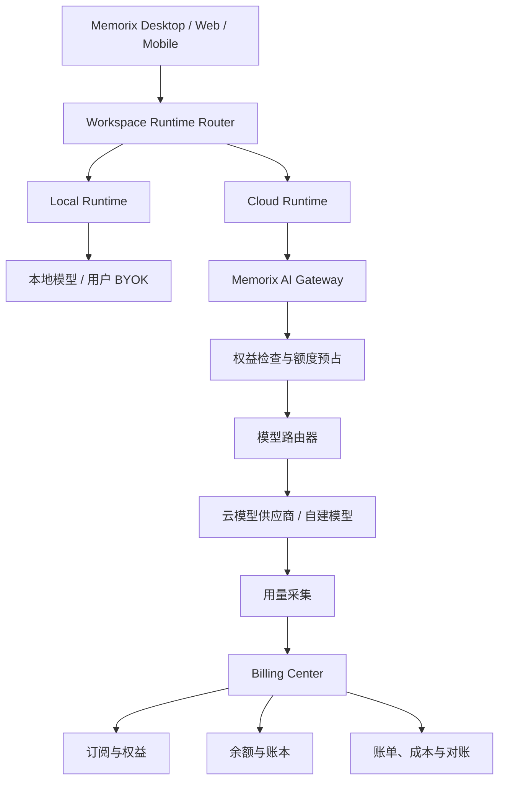
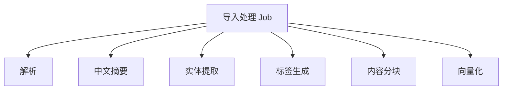

# Memorix AI 算力与 Token 计费模块集成方案

> 文档定位：Memorix 本地优先、云端可选、支持手机采集与多端共享的 AI 知识资产引擎计费架构方案。

## 1. 建设目标

Memorix 的计费模块不应直接嵌入本地知识库核心，而应作为云端控制面的独立领域模块接入。

总体原则：

> 本地核心能力不按 Token 收费；使用 Memorix 云端模型、云端存储、同步、团队空间和付费插件时，才进入统一订阅、配额与按量计费体系。

这样既能保持 Memorix“本地优先、云端可选”的产品定位，也能形成持续的云端收入。

计费体系需要同时解决：

- 用户能否使用某项功能；
- 用户拥有多少套餐额度；
- 一次知识处理任务实际消耗多少算力；
- 应从套餐、余额还是企业信用额度中扣减；
- Memorix 为模型供应商实际支付多少成本；
- 团队 Workspace 中的费用由谁承担；
- 本地模型、用户自带 Key 和 Memorix 云模型如何区分；
- 云端 AI、同步存储和付费插件如何统一结算。

---

## 2. 核心设计原则

### 2.1 本地优先不因计费而改变

Memorix 本地模式必须能够在不登录云端账户的情况下使用本地核心能力，包括：

- 文件导入与解析；
- 摘要、标签和实体提取；
- 文档分块和本地索引；
- 本地检索和 RAG；
- 报告生成；
- Markdown、Obsidian 等格式导出；
- MCP 和 Agent 对本地知识库的访问；
- 本地模型或用户自己的第三方模型 API Key。

订阅到期、云端余额不足或者云端账户解除绑定，都不能锁死用户的本地数据。

### 2.2 登录不等于上传，绑定不等于计费

必须保持以下边界：

1. 用户登录 Memorix，不代表本地资料自动上传。
2. 本地 Workspace 绑定云端账户，不代表所有 AI 处理自动切换到云端。
3. 本地模型失败后，只有用户明确允许云端回退，才可以上传必要内容并产生费用。
4. 云端计费只由明确选择的云端服务触发。

### 2.3 权益控制和用量计费分离

- **权益中心**回答“能不能使用”；
- **计量中心**回答“使用了多少”；
- **定价中心**回答“应该收多少”；
- **账务中心**回答“从哪里扣、扣款是否成功”。

不能用一个 `remaining_tokens` 字段同时承担套餐、权限、计量和财务结算。

### 2.4 计费只依赖最小必要数据

计费中心不读取用户知识内容，只接收：

- 账户与 Workspace 标识；
- 业务任务类型；
- 模型及供应商标识；
- 输入、输出、缓存、Embedding 等用量；
- 请求状态和时间；
- 价格版本及费用结果。

用户文档正文、提示词和模型输出不进入计费账本。

---

## 3. 不同运行模式的计费边界

| 运行模式 | AI 执行位置 | API Key 来源 | Token 费用承担方 | Memorix 计费方式 |
| --- | --- | --- | --- | --- |
| 完全本地 | Ollama、LM Studio、本地 Embedding | 不需要 | 用户自行承担本地硬件成本 | 不按 Token 收费 |
| BYOK | 第三方云模型 | 用户自己的 Key | 用户直接向模型供应商支付 | 不重复收 Token 费，可收软件订阅费 |
| Memorix 云模型 | Memorix AI Gateway | 平台统一管理 | Memorix 先向供应商支付 | 套餐额度 + 超额按量 |
| 混合模式 | 本地优先、云端回退 | 本地或平台 Key | 按实际执行位置分别承担 | 仅计 Memorix 云端实际消耗 |
| 云端协作 | 云端模型、同步和存储 | 平台管理 | Memorix 或企业合同账户 | 订阅 + 算力 + 存储 + 席位 |
| 付费插件 | 本地或云端插件 | 视插件而定 | 用户、Memorix 或插件商 | 授权费、订阅费或按次费 |

### 3.1 完全本地模式

```text
本地文件 → 本地解析 → 本地模型 → 本地向量库
```

处理规则：

- 不产生云端 Token 账单；
- 本地使用统计可以保存在本地；
- 不应在后续联网时追溯补扣本地模型费用；
- 可以通过软件授权销售高级本地能力，但这属于软件订阅，不属于 Token 费用。

### 3.2 第三方云模型 + 用户自己的 Key（BYOK）

```text
Memorix Desktop → 第三方模型供应商
                   ↑
             用户自己的 API Key
```

处理规则：

- Token 费用由用户直接向第三方模型供应商支付；
- Memorix 不重复收取模型 Token 费用；
- Memorix 可以对高级流水线、模型路由、批处理和插件能力收取软件订阅费；
- API Key 应存储在操作系统安全凭据区，不得以明文写入 SQLite；
- 用量可以在本地展示，但不能记作 Memorix 云端账单；
- 如果请求经过 Memorix 云代理，即使模型 Key 属于用户，也应明确是否收取代理服务费；
- BYOK 用量不能与套餐赠送算力混合扣减。

### 3.3 Memorix 云模型

```text
Memorix Desktop
    → Memorix AI Gateway
    → 模型路由器
    → 第三方模型供应商或 Memorix 自建模型
```

处理规则：

- 调用前检查套餐、余额和预算；
- 根据输入长度及最大输出长度预占额度；
- 请求结束后按实际 Usage 结算；
- 记录任务、Workspace、成员和实际模型；
- 用户查看业务任务级费用；
- 平台分别记录销售收入、供应商成本和毛利。

---

## 4. 总体系统架构



计费中心和 Memorix 的主要结合点包括：

- 云端账户；
- Billing Account；
- Workspace；
- AI Gateway；
- AI Job；
- 插件授权；
- 云端同步与存储；
- 团队成员和席位。

最关键的职责分工：

> Billing 属于 Cloud Control Plane，Runtime Router 决定某项任务是否进入 Billing。

---

## 5. 账户、身份与费用归属

### 5.1 身份关系

```text
LocalIdentity
    ↓ 用户主动登录和绑定
CloudAccount
    ↓
BillingAccount
    ↓
Workspace / Subscription / Wallet
```

- `LocalIdentity`：未登录也可以存在，只管理本地数据与配置。
- `CloudAccount`：承载登录、设备绑定、云端身份和成员关系。
- `BillingAccount`：承担订阅、余额、账单和支付责任。
- `Workspace`：实际发生知识处理、存储、同步和团队协作的空间。

### 5.2 计费账户类型

建议支持：

- 个人计费账户；
- 团队计费账户；
- 企业计费账户；
- 平台赠送账户；
- 内部测试账户。

一个用户可能同时拥有个人 Workspace，并加入多个团队 Workspace。费用不能简单从当前登录用户余额中扣除，而应由任务所属 Workspace 绑定的 Billing Account 承担。

### 5.3 费用归属规则

每个云端任务必须在创建时确定：

```text
cloud_account_id
billing_account_id
workspace_id
initiated_by_user_id
device_id
```

任务开始后不应因用户切换 Workspace 或退出团队而改变费用归属。

---

## 6. 计费模块组成

### 6.1 Subscription：订阅套餐

订阅模块定义用户拥有什么产品权益，例如：

- 云端同步资格；
- 最大设备数；
- 最大 Workspace 数；
- 云端存储空间；
- 每月赠送算力额度；
- 高级模型访问权限；
- 团队协作能力；
- 付费插件安装权限；
- MCP/Agent 云端调用权限；
- 是否允许超额按量计费。

### 6.2 Entitlement：权益中心

客户端不应直接根据“专业版”“团队版”等套餐名称判断功能，而应查询标准权益：

```json
{
  "cloud_sync": true,
  "team_members": 5,
  "cloud_storage_bytes": 107374182400,
  "monthly_compute_credits": 5000000,
  "premium_model_access": true,
  "paid_plugin_access": true,
  "pay_as_you_go": true
}
```

套餐发生变化时，服务端更新权益映射，不要求客户端修改套餐判断代码。

### 6.3 Usage Metering：用量计量

建议统一支持：

- 输入 Token；
- 输出 Token；
- 缓存读取和写入 Token；
- 推理 Token；
- Embedding Token；
- Rerank 请求；
- OCR 页数；
- 音频转写秒数；
- 图片识别或生成次数；
- 视频处理时长；
- 云端存储量；
- 同步流量；
- Agent 与 MCP 调用量；
- 插件调用量。

### 6.4 Pricing：定价中心

定价中心负责：

- 模型输入和输出价格；
- 缓存 Token 价格；
- 套餐内价格；
- 超额价格；
- 企业合同价格；
- 插件价格；
- 促销与折扣；
- 历史价格版本。

价格必须版本化。历史任务应始终绑定任务发生时的价格版本，价格调整不能重算历史账单。

### 6.5 Wallet & Ledger：余额与账本

负责：

- 套餐赠送额度；
- 充值余额；
- 活动赠送额度；
- 额度冻结；
- 实际扣费；
- 差额释放；
- 退款和冲正；
- 有效期；
- 团队预算分配。

---

## 7. 计费必须绑定 AI Job

Memorix 的一次用户操作通常会产生多次模型调用。

例如导入一篇外文文章：



如果只向用户展示底层模型请求，用户很难理解费用来自哪里。因此需要建立四级结构：

```text
Job
 ├── Task：摘要
 │    ├── Attempt 1：超时
 │    └── Attempt 2：成功
 ├── Task：实体提取
 └── Task：向量化
```

| 层级 | 含义 |
| --- | --- |
| Job | 用户能够理解的业务任务 |
| Task | 流水线中的处理步骤 |
| Attempt | 一次真实模型调用或重试 |
| Usage Event | 原始计量事件 |
| Charge | 用户最终收费 |
| Provider Cost | Memorix 实际承担的上游成本 |

失败重试可能增加平台成本，但不一定全部向用户收费，因此用户收费和平台成本必须分开记录。

---

## 8. Runtime Router 与计费流程

```text
用户发起 AI 任务
    ↓
识别 Workspace 和运行策略
    ↓
选择本地模型 / 用户 BYOK / Memorix Cloud
    ↓
如果使用 Memorix Cloud
    ├─ 检查功能权益
    ├─ 检查模型权限
    ├─ 估算用量和费用
    ├─ 检查任务预算
    ├─ 预占算力或余额
    └─ 创建云端 Job
    ↓
执行任务
    ↓
采集实际用量
    ↓
实际结算并释放差额
```

运行决策可以采用以下结构：

```json
{
  "workspace_id": "ws_001",
  "task_type": "document_summary",
  "execution_preference": "local_first",
  "allow_cloud_fallback": true,
  "cloud_budget_limit": 0.50,
  "data_policy": "allow_selected_content",
  "model_policy": "balanced"
}
```

其中：

- `execution_preference`：本地优先、仅本地、云端优先或仅云端；
- `allow_cloud_fallback`：本地失败后是否允许使用云端；
- `cloud_budget_limit`：单次任务允许的最大云端费用；
- `data_policy`：允许发送到云端的数据范围；
- `model_policy`：经济、均衡、高质量或指定模型。

`allow_cloud_fallback` 必须由用户明确开启。不能因为本地模型不可用，就自动将资料发送到云端并产生费用。

---

## 9. 额度预占与实际结算

### 9.1 预估

任务开始前计算：

```text
预计费用 =
预计输入用量
+ 最大输出用量
+ Embedding/OCR/音频等附加用量
```

批量任务应按文档数量、平均长度和工作流步骤给出区间估算。

### 9.2 预占

```text
可用额度 = 套餐剩余额度 + 充值余额 + 信用额度 - 已冻结额度
```

额度足够时创建预占记录；额度不足时可以：

- 提示充值；
- 降低最大输出长度；
- 切换低成本模型；
- 改为本地执行；
- 缩小批处理范围；
- 拒绝任务。

### 9.3 结算

任务完成后：

1. 获取模型供应商或自建模型的实际 Usage；
2. 按任务绑定的价格版本计算费用；
3. 优先扣除即将到期的赠送额度；
4. 再扣套餐额度；
5. 再扣充值余额或企业信用额度；
6. 释放未使用的预占额度；
7. 写入不可变账本；
8. 更新 Job 费用汇总。

---

## 10. 产品计费模式

Memorix 不适合只销售 Token。用户购买的是知识管理与 AI 工作流能力，Token 只是云端算力的成本计量方式。

建议采用：

> 软件订阅 + 套餐算力额度 + 超额按量 + 存储与席位 + 插件授权

### 10.1 免费本地版

- 无需登录；
- 本地导入和存储；
- 本地解析、检索和 RAG；
- 本地模型；
- 基础导出；
- 用户 BYOK；
- 不包含 Memorix 云端算力。

### 10.2 个人专业版

- 高级本地流水线；
- 官方高级插件；
- 云端 Inbox；
- 个人多设备同步；
- 一定云端存储；
- 每月赠送算力额度；
- 超额可充值。

### 10.3 团队版

- 团队 Workspace；
- 成员与角色；
- 团队知识库；
- 按席位订阅；
- 共享算力池；
- 成员预算；
- 团队审计；
- 超额按量。

### 10.4 企业版

- 企业合同账户；
- 预付或月结；
- 私有模型接入；
- 专属模型价格；
- 部门成本中心；
- SSO 与审计；
- 数据处理策略；
- 私有化或混合部署。

---

## 11. 算力点设计

不同 AI 能力不能简单使用同一种 Token 衡量。套餐层可以使用“Memorix 算力点”，底层仍保留真实用量。

示例：

```text
普通模型输入 1 Token = 1 点
普通模型输出 1 Token = 3 点
高级模型输入 1 Token = 5 点
Embedding 1 Token = 0.1 点
OCR 1 页 = 2,000 点
语音转写 1 分钟 = 5,000 点
```

用户界面应同时展示：

- 消耗多少算力点；
- 输入、输出 Token 数；
- 使用了什么模型或能力；
- 是否从套餐中扣除；
- 是否产生现金费用；
- 费用属于哪个 Workspace。

不能只展示抽象点数，否则用户难以判断收费是否透明。

---

## 12. 数据模型

### 12.1 账户与权益

```text
cloud_account
billing_account
billing_account_member
workspace_billing_binding
subscription
subscription_plan
entitlement_definition
account_entitlement
```

### 12.2 套餐与价格

```text
price_plan
price_plan_version
price_rule
model_price_rule
plugin_price_rule
account_price_binding
```

### 12.3 任务与用量

```text
ai_job
ai_task
ai_request_attempt
usage_event
usage_aggregation
billing_charge
provider_cost
```

### 12.4 余额与账本

```text
wallet
quota_bucket
balance_reservation
account_ledger
invoice
invoice_item
```

### 12.5 AI Job 关键字段

```text
job_id
cloud_account_id
billing_account_id
workspace_id
initiated_by_user_id
device_id
job_type
runtime_mode
billing_mode
estimated_credits
actual_credits
estimated_amount
actual_amount
price_version_id
job_status
created_at
completed_at
```

`billing_mode` 建议包含：

```text
LOCAL_FREE
LOCAL_LICENSED
USER_BYOK
CLOUD_INCLUDED_QUOTA
CLOUD_PAY_AS_YOU_GO
ENTERPRISE_CONTRACT
PLATFORM_FREE
```

### 12.6 用量事件关键字段

```text
event_id
job_id
task_id
attempt_id
workspace_id
billing_account_id
provider_id
model_id
usage_type
quantity
usage_source
occurred_at
idempotency_key
raw_usage
```

`usage_source` 建议包含：

```text
PROVIDER
LOCAL_TOKENIZER
ESTIMATED
MANUAL_ADJUSTMENT
```

正式扣费优先采用模型供应商返回的 Usage；估算值只能作为异常补偿依据，并应进入待对账状态。

---

## 13. 客户端功能设计

### 13.1 AI 执行方式设置

| 能力 | 本地优先 | 仅本地 | 云端优先 | 仅云端 |
| --- | ---: | ---: | ---: | ---: |
| 摘要 | ✓ |  |  |  |
| 实体提取 | ✓ |  |  |  |
| Embedding |  | ✓ |  |  |
| RAG 问答 | ✓ |  |  |  |
| 报告生成 |  |  | ✓ |  |

附加设置：

- 是否允许本地失败后使用云端；
- 单任务最高费用；
- 每日和每月预算；
- 云端上传前是否确认；
- 允许上传的资料范围；
- 是否允许自动切换低成本模型。

### 13.2 用量中心

展示：

- 本月套餐算力；
- 剩余额度；
- 现金余额；
- 按功能统计；
- 按模型统计；
- 按 Workspace 统计；
- 最近任务明细；
- 预计月底用量；
- 额度告警；
- 团队成员用量。

### 13.3 高成本任务确认

大批量导入、整库重新生成摘要、音视频转写等任务应在执行前显示：

```text
预计处理：2,486 个文档
预计消耗：约 1,200 万算力点
预计费用：¥86～¥120
执行方式：本地 Embedding + 云端摘要
```

用户确认后再预占额度。普通低成本任务可以在用户设定的自动批准额度内直接执行。

---

## 14. 离线与同步处理

### 14.1 本地执行记录

- 保存在本地 SQLite；
- 不进入云端财务账本；
- 后续联网时可以同步非敏感统计；
- 不能联网后补扣本地模型费用；
- 不得因为未登录而阻止本地任务执行。

### 14.2 云端执行记录

云端任务的计费发生在 AI Gateway。即使客户端中途断网，云端仍可以获取最终 Usage 并结算。

客户端恢复连接后拉取：

- Job 状态；
- 实际消耗；
- 额度余额；
- 生成结果；
- 账单明细。

客户端自行上报的 Token 数量只能作为分析数据，不能作为正式扣费依据。

### 14.3 Inbox 与双向同步

- 云端 Inbox 一次性拉取不应重复计费或重复导入；
- 本地导入事务失败时不能 ACK；
- 解除绑定不影响已经导入的本地资料；
- 个人多设备和团队同步可以按存储、流量或套餐权益计费；
- 不能通过同步 SQLite 数据库文件实现多端同步；
- 双向同步继续采用操作日志、同步游标和冲突处理机制。

---

## 15. 插件计费

插件计费与 AI Token 计费共用账务中心，但采用不同计量项。

| 插件模式 | 示例 |
| --- | --- |
| 免费 | 基础 Markdown 导出 |
| 一次性购买 | 专业格式转换器 |
| 月度订阅 | 行业资料源连接器 |
| 按次调用 | OCR、翻译、专业数据库查询 |
| 收入分成 | 第三方付费插件 |
| 用户自带 Key | 用户自行承担外部 API 费用 |

插件不能直接修改账户余额。标准流程为：

```text
插件请求计费授权
    ↓
Memorix 核心检查权限和额度
    ↓
签发短期调用许可
    ↓
插件执行
    ↓
核心系统接收用量事件
    ↓
统一账务入账
```

以下能力必须由 Memorix 核心控制：

- 身份；
- 权限；
- 数据库事务；
- 同步状态；
- Token 和 API Key 管理；
- 审计；
- 账务；
- 删除与隐私策略。

---

## 16. 一致性、幂等与对账

### 16.1 幂等标识

至少需要：

```text
Job 幂等：workspace_id + client_job_id
Usage 幂等：provider_request_id + usage_type
Charge 幂等：job_id + price_version_id + charge_type
Ledger 幂等：business_type + business_id + ledger_action
```

### 16.2 账务原则

- 用量事件以追加写入为主；
- 财务账本原则上不可修改或删除；
- 错误通过冲正记录修复；
- 余额更新必须使用数据库事务和并发控制；
- 不能采用先查余额再无条件更新的方式；
- AI 请求、消息发送和财务入账不应使用一个长事务。

### 16.3 对账任务

| 对账类型 | 对账内容 |
| --- | --- |
| Job 对账 | Job、Task、Attempt 是否完整 |
| 用量对账 | 模型请求与 Usage Event 是否一致 |
| 扣费对账 | Usage 与 Billing Charge 是否一致 |
| 余额对账 | Charge、Ledger 和余额是否一致 |
| 供应商对账 | 内部成本与供应商账单是否一致 |

建议执行频率：

```text
5 分钟：修复未完成 Job
1 小时：释放过期预占
每日：Job—Usage—Charge 对账
每月：供应商账单和成本对账
```

---

## 17. 推荐技术架构

初期不建议拆成大量微服务，可以先在 Memorix 云端后端中建设模块化单体：

```text
Memorix.Cloud
├── Identity
├── Workspace
├── Entitlement
├── Subscription
├── Billing
├── AI Job
├── Plugin Licensing
└── Sync
```

AI Gateway 建议独立部署，负责：

- 高并发流式代理；
- 模型路由；
- 平台 API Key 管理；
- Token 用量采集；
- 限流和熔断；
- 额度检查；
- 供应商切换；
- 请求取消；
- 链路追踪。

模块之间可以使用以下领域事件：

```text
AiJobCreated
UsageReported
AiJobCompleted
QuotaReserved
QuotaConsumed
QuotaReleased
SubscriptionChanged
PluginPurchased
StorageUsageUpdated
```

消息可靠性可以采用本地事务加 Outbox Pattern，避免模型已调用但计费事件丢失。

---

## 18. 实施阶段

### 第一阶段：计量基础

- 建立 AI Job、Task、Attempt；
- 所有 Memorix 云模型统一经过 AI Gateway；
- 采集 Token 和供应商成本；
- 记录本地、BYOK 和云端执行方式；
- 暂不实际扣费；
- 建立内部成本报表。

### 第二阶段：套餐与权益

- 建立免费版、专业版和团队版；
- 云端功能权益判断；
- 月度算力额度；
- 用量中心；
- 额度告警；
- 超额后停止、降级或转本地。

### 第三阶段：余额与按量付费

- 充值余额；
- 额度预占；
- 实际结算；
- 高成本任务确认；
- 账本、退款和冲正；
- 自动对账。

### 第四阶段：团队和插件结算

- 团队共享额度；
- 成员预算；
- 企业预付或月结；
- 插件授权；
- 第三方开发者分成；
- 发票和财务结算。

---

## 19. 最终方案

Memorix 的商业化中心应当是订阅权益，Token 计费是云端能力的成本结算方式。

```text
本地核心功能
    → 保持本地可用，不按 Token 收费

专业功能
    → 软件订阅和插件授权

第三方云模型 + 用户自己的 Key
    → 用户承担供应商 Token 费用
    → Memorix 不重复收取 Token 费用

Memorix 云端 AI
    → 套餐赠送算力 + 超额按量

云端同步与存储
    → 套餐容量 + 超额容量

团队协作
    → 席位订阅 + 共享算力池

付费插件
    → 一次性授权、订阅或按次计费
```

最终推荐的架构边界是：

> Runtime Router 负责决定任务在本地、用户 BYOK 还是 Memorix Cloud 执行；AI Gateway 负责云端调用和原始用量采集；Billing Center 负责权益、定价、额度、账本和对账。

这套结构能够在不破坏 Memorix 本地优先、数据主权和离线可用性的前提下，实现个人订阅、云端算力、团队协作和插件生态的统一商业化。
