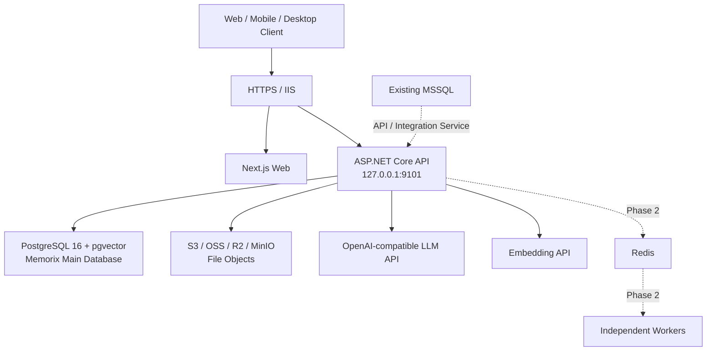

# Memorix Windows Server + IIS 云端部署与开发实施方案

> 版本：V1.0  
> 日期：2026-07-17  
> 适用环境：Windows Server、IIS、MSSQL 与 PostgreSQL 共存  
> 项目形态：ASP.NET Core API + Next.js Web + PostgreSQL/pgvector + 对象存储 + 可选 Redis/Worker  
> 文档性质：云端部署基线、开发任务书、验收标准与运维手册

---

## 1. 文档目标

本文用于指导 Memorix 从当前“本地优先、云端能力开发中”的代码状态，演进到可在 Windows Server + IIS 环境中稳定运行的云端 Beta 版本，并为后续生产化、多实例和 MSSQL 系统集成预留清晰边界。

本文解决以下问题：

1. 明确 Windows Server、IIS、PostgreSQL、MSSQL、对象存储和 AI 服务的职责；
2. 明确 Memorix 应使用 PostgreSQL 还是 MSSQL；
3. 给出 IIS 托管 ASP.NET Core API 和 Next.js Web 的实施方式；
4. 给出当前代码必须完成的云端适配任务；
5. 给出分阶段目标、交付物、验收条件和风险控制；
6. 给出安装、升级、备份、恢复、监控和回滚流程；
7. 为未来 Redis 队列、独立 Worker、多实例和跨系统数据交换提供演进路线。

---

## 2. 总体结论

### 2.1 数据库选型结论

Memorix 云端主数据库继续使用：

```text
PostgreSQL 16 + pgvector
```

不建议当前阶段把 Memorix 主库迁移到 MSSQL，原因如下：

1. 当前 EF Core 配置使用 `UseNpgsql`；
2. 向量检索依赖 pgvector；
3. 搜索、Embedding 和索引代码直接使用 `NpgsqlConnection`、`NpgsqlParameter`；
4. 部分 SQL 使用 PostgreSQL 专用类型、函数和运算符；
5. MSSQL 没有与现有 pgvector 实现完全等价的直接替代路径；
6. 强行迁移会同时影响数据库、向量检索、全文检索、任务处理和测试体系。

MSSQL 与 PostgreSQL 的推荐职责边界：

| 数据库 | 职责 |
|---|---|
| PostgreSQL | Memorix 用户、工作区、资料、文档、分块、标签、实体、报告、任务、同步状态和向量索引 |
| MSSQL | 服务器上已有业务系统，或未来需要接入的企业主数据、ERP、CRM、权限目录等 |

禁止让 Memorix 核心业务在一个事务中同时写 PostgreSQL 和 MSSQL。跨系统数据交换应使用 API、消息、定时同步或独立 Integration Service。

### 2.2 第一阶段部署结论

第一阶段采用单服务器、单 API 实例：

```text
IIS
├── memorix.example.com        → Next.js Web
└── memorix.example.com/api/*  → ASP.NET Core API

Windows Service / PostgreSQL Service
├── PostgreSQL 16 + pgvector
├── MSSQL（现有系统）
└── 可选 Redis

Object Storage
├── 推荐：S3/OSS/R2
└── 备选：服务器内独立 MinIO
```

第一阶段 API 内置后台服务继续处理文档解析、Embedding、报告和导出任务，因此 API 只能部署一个活动实例。

### 2.3 最终演进目标

```text
IIS / Reverse Proxy
        │
        ├── Web
        └── API × N
               │
               ├── PostgreSQL + pgvector
               ├── Object Storage
               ├── Redis Queue
               └── Worker × N
                     ├── Document Worker
                     ├── Embedding Worker
                     ├── Report Worker
                     └── Export Worker
```

---

## 3. 项目目标

### 3.1 总目标

在不破坏本地优先架构的前提下，将 Memorix 云端版本部署到现有 Windows Server + IIS 环境，实现安全、可升级、可备份、可监控的内部 Beta 服务。

### 3.2 Beta 发布目标

Beta 环境必须实现：

1. 用户可通过 HTTPS 注册和登录；
2. Web 端可正常访问云 API；
3. 用户可创建和管理工作区；
4. 支持文本、URL、PDF 和文件导入；
5. 支持文档解析、摘要、分块和 Embedding；
6. 支持关键词、向量和混合检索；
7. 支持 RAG 问答、报告生成与导出；
8. 支持移动端 Inbox 采集；
9. 支持桌面端绑定云端账号和拉取 Inbox；
10. 数据按用户和工作区进行授权隔离；
11. PostgreSQL、对象存储和配置有备份；
12. 服务异常时可定位、告警和回滚。

### 3.3 暂不纳入 Beta 的目标

以下内容不作为第一阶段上线条件：

1. API 多实例负载均衡；
2. Redis 分布式任务队列；
3. Worker 自动扩缩容；
4. PostgreSQL 与 MSSQL 双向实时同步；
5. 团队级复杂 RBAC；
6. 公有 SaaS 计费；
7. Kubernetes；
8. 跨区域容灾；
9. 零停机数据库升级。

---

## 4. 完成标准

项目达到云端 Beta 完成状态，必须同时满足：

| 类别 | 完成标准 |
|---|---|
| 构建 | API、Web、移动端类型检查和自动化测试全部通过 |
| 配置 | 生产环境不使用仓库内默认密码、默认 JWT Secret 或 localhost API |
| 数据库 | PostgreSQL 初始化和版本升级可重复执行，pgvector 正常启用 |
| Web | 浏览器通过同域 `/api` 访问后端 |
| API | IIS 反向代理、HTTPS、健康检查和日志正常 |
| 文件 | 上传、下载、删除和预签名 URL 正常 |
| AI | LLM 和 Embedding 服务可配置、可检测、可超时和重试 |
| 安全 | JWT、CORS、上传限制、日志脱敏和目录权限完成 |
| 运维 | 每日备份、恢复演练、发布回滚和告警完成 |
| 业务 | 注册到报告导出的端到端流程通过 |

---

## 5. 目标服务器架构

### 5.1 逻辑架构



### 5.2 IIS 站点结构

推荐使用单域名同源部署：

```text
https://memorix.example.com/
https://memorix.example.com/api/
https://memorix.example.com/swagger/
https://memorix.example.com/health
```

同源方案的优势：

1. Web 无需硬编码 API 域名；
2. CORS 配置更简单；
3. HTTPS 和证书只维护一套；
4. 移动端和桌面端仍可直接访问公开 API 域名；
5. 避免浏览器混合内容和跨域凭据问题。

### 5.3 端口规划

| 服务 | 监听地址 | 外部开放 |
|---|---|---|
| IIS HTTP | 0.0.0.0:80 | 是，只用于跳转 HTTPS |
| IIS HTTPS | 0.0.0.0:443 | 是 |
| ASP.NET Core API | 127.0.0.1:9101 | 否 |
| Next.js Node | 127.0.0.1:3000 | 否 |
| PostgreSQL | 127.0.0.1:5432 或内网 IP | 否 |
| MSSQL | 现有端口 | 按现有系统策略 |
| Redis | 127.0.0.1:6379 | 否 |
| MinIO API | 127.0.0.1:9000 或内网 IP | 否 |
| MinIO Console | 127.0.0.1:9001 | 否 |

数据库、Redis、MinIO 管理端口不得直接暴露公网。

---

## 6. PostgreSQL 与 MSSQL 共存方案

### 6.1 资源隔离

如果 PostgreSQL 和 MSSQL 安装在同一台服务器，应设置明确的资源上限：

| 资源 | 建议 |
|---|---|
| 内存 | MSSQL 设置 `max server memory`，为 PostgreSQL、IIS、Node 和系统预留内存 |
| CPU | 高负载时使用进程优先级、虚拟机或容器进行隔离 |
| 磁盘 | PostgreSQL 数据、WAL、MSSQL 数据、日志和对象文件尽量使用不同卷 |
| 备份 | 两种数据库独立备份、独立保留周期 |
| 端口 | 仅绑定 localhost 或内网地址 |
| 账号 | Memorix 不使用 MSSQL sa，也不使用 PostgreSQL superuser |

建议服务器最低资源：

```text
内部 Beta：
8 核 CPU
32 GB RAM
500 GB SSD

正式生产建议：
16 核 CPU
64 GB RAM
独立数据盘与备份盘
```

如果现有 MSSQL 负载较高，应把 PostgreSQL 或 Worker 移到独立服务器。

### 6.2 PostgreSQL 账号

建议创建三个角色：

```text
memorix_owner      数据库对象所有者，仅迁移程序使用
memorix_app        API 日常读写账号
memorix_backup     备份账号
```

应用程序不得使用 `postgres` 超级用户。

### 6.3 pgvector

PostgreSQL 必须安装与 PostgreSQL 版本匹配的 pgvector 扩展，并执行：

```sql
CREATE EXTENSION IF NOT EXISTS vector;
```

部署验收必须验证：

```sql
SELECT extversion FROM pg_extension WHERE extname = 'vector';
```

### 6.4 MSSQL 集成策略

如果未来需要读取 MSSQL 中的客户、组织或项目数据，按优先级选择：

1. 调用现有系统 API；
2. 新建独立 Integration Service；
3. 使用只读 MSSQL 账号定时抽取；
4. 使用消息队列或 Outbox；
5. 最后才考虑数据库级同步。

推荐集成数据流：

```text
MSSQL System
  → Integration API / Scheduled Sync
  → DTO Validation
  → Memorix Application Service
  → PostgreSQL
```

禁止：

1. 在 Memorix Controller 中直接写 MSSQL SQL；
2. 跨 PostgreSQL/MSSQL 开启分布式事务；
3. 通过数据库 Linked Server 直接修改 Memorix 核心表；
4. 共享数据库账号；
5. 把向量数据存入 MSSQL 后再与 PostgreSQL 双写。

---

## 7. IIS 托管方案

### 7.1 必装组件

Windows Server 安装：

1. IIS Web Server；
2. URL Rewrite Module；
3. Application Request Routing；
4. ASP.NET Core Hosting Bundle，与项目目标运行时匹配；
5. Node.js LTS；
6. PostgreSQL 16 与 pgvector；
7. Git 或标准发布工具；
8. 可选 NSSM/WinSW，用于把 Next.js 注册为 Windows Service。

当前 API 目标框架为 `net10.0`。正式上线前必须确认服务器已安装对应 .NET Hosting Bundle。若 .NET 10 尚不符合组织的生产支持策略，应在上线前统一评估降级至受支持 LTS，而不是服务器临时混装多个未知运行时。

### 7.2 API 托管

推荐由 IIS 通过 ASP.NET Core Module 托管 API。

发布命令：

```powershell
dotnet publish .\src\KnowledgeEngine.Api\KnowledgeEngine.Api.csproj `
  -c Release `
  -o C:\Deploy\Memorix\Api
```

IIS 应用池建议：

```text
Name: MemorixApiPool
.NET CLR: No Managed Code
Pipeline: Integrated
Start Mode: AlwaysRunning
Idle Timeout: 0
Identity: 独立低权限服务账号
```

API 目录建议：

```text
C:\Apps\Memorix\Api\current
C:\Apps\Memorix\Api\releases\20260717-001
C:\Apps\Memorix\Api\logs
C:\Apps\Memorix\Api\config
```

### 7.3 Web 托管

Next.js 使用 `output: "standalone"`，推荐运行 standalone Node Server，再由 IIS ARR 反向代理。

构建：

```powershell
cd C:\Build\Memorix\web
npm ci
npm run build
```

运行：

```powershell
$env:NODE_ENV = "production"
$env:HOSTNAME = "127.0.0.1"
$env:PORT = "3000"
node .next\standalone\server.js
```

应把 Node Server 注册为 Windows Service，禁止依赖交互式终端长期运行。

### 7.4 IIS 路由

IIS 路由优先级：

```text
/api/*      → http://127.0.0.1:9101/api/*
/swagger/*  → http://127.0.0.1:9101/swagger/*
/health     → http://127.0.0.1:9101/health
其他路径     → http://127.0.0.1:3000/*
```

IIS 必须转发：

```text
X-Forwarded-For
X-Forwarded-Proto
X-Forwarded-Host
```

ASP.NET Core 应启用 Forwarded Headers，并仅信任 IIS 本机代理。

### 7.5 HTTPS

要求：

1. 80 强制跳转 443；
2. 禁止 TLS 1.0/1.1；
3. 使用有效证书；
4. 设置 HSTS；
5. 上传接口配置合理超时；
6. IIS 与 Kestrel 均限制请求体大小；
7. 不在公网开放 Swagger，或使用管理员授权保护。

---

## 8. 应用配置规范

### 8.1 配置来源优先级

生产配置建议：

```text
appsettings.json                 非敏感默认值
appsettings.Production.json      生产结构配置，不含秘密
环境变量                         密码、Secret、API Key
Windows Credential/Secret Store 最高敏感凭据，可选
```

### 8.2 必需环境变量

```text
ASPNETCORE_ENVIRONMENT=Production
ASPNETCORE_URLS=http://127.0.0.1:9101
DatabaseProvider=postgres

ConnectionStrings__DefaultConnection=Host=127.0.0.1;Port=5432;Database=memorix;Username=memorix_app;Password=...

Jwt__Secret=至少64字节随机值
Jwt__Issuer=Memorix
Jwt__Audience=MemorixClients
Jwt__ExpiresMinutes=60

Cors__AllowedOrigins__0=https://memorix.example.com

Minio__Endpoint=...
Minio__AccessKey=...
Minio__SecretKey=...
Minio__Bucket=memorix
Minio__UseSsl=true

Llm__Endpoint=https://...
Llm__ApiKey=...
Llm__Model=...
Llm__MaxTokens=8192

Embedding__Endpoint=https://...
Embedding__ApiKey=...
Embedding__Model=...
```

### 8.3 Web 配置

优先采用同域路径：

```text
NEXT_PUBLIC_API_BASE_URL=/api
```

Web API Client 必须支持：

```ts
process.env.NEXT_PUBLIC_API_BASE_URL
```

桌面动态端口逻辑可以保留，但普通浏览器环境不得再默认访问 `127.0.0.1:9101`。

### 8.4 移动端配置

移动端生产构建配置：

```text
https://memorix.example.com/api
```

移动端不得使用 localhost 默认地址发布。

---

## 9. 当前代码改造清单

### 9.1 P0：上线阻塞项

#### DEV-CLOUD-001 Web API 地址环境化

改造范围：

```text
web/src/lib/api.ts
web/src/app/(main)/settings/api-docs/page.tsx
```

要求：

1. 浏览器默认使用 `/api`；
2. 支持 `NEXT_PUBLIC_API_BASE_URL`；
3. 桌面端仍支持动态 localhost 端口；
4. API 文档示例使用当前 Origin；
5. 增加构建测试。

#### DEV-CLOUD-002 生产配置与启动校验

要求：

1. 新增 `appsettings.Production.json`；
2. 启动时拒绝默认 JWT Secret；
3. 启动时拒绝空数据库连接；
4. 生产环境不创建测试用户；
5. 生产环境 Swagger 默认关闭或受保护；
6. 校验 LLM、Embedding 和对象存储配置。

#### DEV-CLOUD-003 数据库迁移体系

要求：

1. 建立 EF Core Migration 或版本化 SQL Migration；
2. 不再依赖 `EnsureCreated()` 作为生产升级主路径；
3. Migration 由单独部署步骤执行；
4. 每个版本记录 schema version；
5. 支持空库安装、旧库升级和失败回滚；
6. pgvector 扩展与索引纳入 migration。

#### DEV-CLOUD-004 API 发布包与 IIS 配置

交付：

```text
deploy/windows/iis/api/web.config
deploy/windows/iis/install-api.ps1
deploy/windows/iis/appsettings.Production.example.json
```

要求：

1. 安装脚本幂等；
2. 目录和应用池权限最小化；
3. stdout 日志只用于启动故障；
4. 正常日志写入滚动文件或集中日志系统。

#### DEV-CLOUD-005 Web Windows Service 与 IIS 代理

交付：

```text
deploy/windows/iis/web/web.config
deploy/windows/services/memorix-web.xml
deploy/windows/iis/install-web.ps1
```

要求：

1. Node Server 自动启动；
2. 异常自动重启；
3. IIS `/api` 与 Web 路由正确；
4. Web 发布目录支持版本切换。

#### DEV-CLOUD-006 对象存储生产验证

要求：

1. 验证 S3/MinIO 上传、下载、删除；
2. 验证大文件和中断重试；
3. 验证预签名地址从公网客户端可访问；
4. Bucket 默认私有；
5. 设置 CORS 和生命周期策略；
6. 不把对象存储管理端口暴露公网。

#### DEV-CLOUD-007 安全基线

要求：

1. 登录和注册限流；
2. API Key 和 JWT 日志脱敏；
3. 上传扩展名、MIME、大小限制；
4. 防止路径穿越；
5. CORS 精确域名；
6. 错误响应不泄露生产堆栈；
7. 安全响应头；
8. 账号锁定或渐进式延迟；
9. 管理接口授权复核。

### 9.2 P1：Beta 稳定性项

#### DEV-CLOUD-008 健康检查

拆分：

```text
/health/live   进程存活
/health/ready  PostgreSQL、pgvector、对象存储状态
/health/full   管理员使用，增加 LLM、Embedding、队列检查
```

#### DEV-CLOUD-009 可观测性

要求：

1. TraceId 贯穿 IIS、API 和后台任务；
2. 结构化日志；
3. 记录请求耗时和状态码；
4. 记录队列积压和任务失败；
5. 接入 OpenTelemetry 或等价方案；
6. 配置错误率、磁盘、内存、数据库连接告警。

#### DEV-CLOUD-010 备份恢复

要求：

1. PostgreSQL 每日全量备份；
2. WAL 或更高频增量策略按业务要求配置；
3. 对象存储版本化或快照；
4. 配置文件和 IIS 配置备份；
5. 每月至少一次恢复演练；
6. 明确 RPO 与 RTO。

建议 Beta 指标：

```text
RPO ≤ 24 小时
RTO ≤ 4 小时
```

#### DEV-CLOUD-011 发布与回滚

要求：

1. 发布目录版本化；
2. 发布前自动备份数据库；
3. 发布前运行 migration dry-run；
4. 发布后执行 smoke test；
5. 失败时恢复上一版本；
6. schema 不兼容时执行数据库回滚方案。

#### DEV-CLOUD-012 端到端测试

覆盖：

```text
注册
登录
创建工作区
创建专题
文本导入
URL 导入
PDF 上传
文档处理
Embedding
关键词搜索
向量搜索
RAG 问答
报告生成
报告导出
移动采集
桌面云 Inbox 拉取
权限越权测试
```

### 9.3 P2：正式生产项

#### DEV-CLOUD-013 Redis CloudJobQueue

要求：

1. 实现 enqueue、claim、heartbeat、complete、fail；
2. 任务租约超时可恢复；
3. 幂等键；
4. 指数退避；
5. 最大重试次数；
6. 死信队列；
7. 按任务类型路由；
8. 管理端查看和重放失败任务。

#### DEV-CLOUD-014 独立 Worker

拆分 API 中的 hosted service：

```text
Memorix.Worker.Document
Memorix.Worker.Embedding
Memorix.Worker.Report
Memorix.Worker.Export
```

Worker 注册为 Windows Service，API 不再承担耗时任务。

#### DEV-CLOUD-015 多实例与并发

要求：

1. API 无状态化；
2. 文件不写本机临时持久目录；
3. 分布式锁或任务租约；
4. 数据库连接池容量评估；
5. IIS Web Farm 或外部负载均衡；
6. 滚动发布；
7. 多实例重复消费测试。

#### DEV-CLOUD-016 MSSQL Integration Adapter

仅在业务确实需要时开发：

```text
KnowledgeEngine.Integrations.SqlServer
```

要求：

1. 独立接口和 DTO；
2. 独立连接字符串；
3. 默认只读；
4. 超时、重试和熔断；
5. 同步游标；
6. 审计日志；
7. 不影响 Memorix 主事务。

---

## 10. 数据库迁移设计

### 10.1 迁移原则

1. schema 变更必须有版本号；
2. 应用启动不自动执行高风险 DDL；
3. Migration 使用 owner 账号；
4. API 使用权限更低的 app 账号；
5. 大表索引创建应评估锁表；
6. 数据回填与 schema 修改分开；
7. 每次迁移必须有验证 SQL；
8. 不保证所有 migration 可自动向下回滚，但必须有恢复方案。

### 10.2 发布顺序

```text
停止新任务进入
→ 等待正在执行的任务完成
→ 数据库备份
→ 执行 migration
→ 发布 API
→ 发布 Web
→ 启动服务
→ readiness 检查
→ smoke test
→ 恢复流量
```

### 10.3 pgvector 索引

上线前根据数据量选择：

```text
小规模：精确检索或暂不创建 ANN 索引
中规模：HNSW
特定场景：IVFFlat
```

索引类型、距离度量和 Embedding 维度必须与实际模型一致。当前代码存在固定 `vector(2560)` 设计，切换 Embedding 模型前必须验证维度兼容性，并制定重建索引流程。

---

## 11. 文件与对象存储方案

### 11.1 推荐顺序

1. 已有企业对象存储；
2. 公有云 S3-compatible 服务；
3. 独立 MinIO 服务器；
4. 最后才是在应用服务器上部署 MinIO。

### 11.2 对象 Key

建议：

```text
workspaces/{workspaceId}/sources/{sourceId}/{fileId}/{safeFileName}
workspaces/{workspaceId}/exports/{exportJobId}/{fileName}
```

禁止只使用原始文件名作为 Key。

### 11.3 安全要求

1. Bucket 私有；
2. 下载使用短时预签名 URL；
3. 文件名规范化；
4. 校验 MIME 与扩展名；
5. 对可执行文件默认拒绝；
6. 可选病毒扫描；
7. 设置单用户和单工作区配额；
8. 上传失败清理残留对象；
9. 数据删除与对象删除保持可追踪。

---

## 12. AI 与 Embedding 服务

### 12.1 云端模型策略

云端环境不得默认连接服务器本机 LM Studio。

生产配置应使用：

```text
OpenAI-compatible HTTPS Endpoint
独立 API Key
明确模型名称
明确超时和 Token 上限
```

### 12.2 稳定性要求

1. 连接超时；
2. 总请求超时；
3. 429 和 5xx 重试；
4. 指数退避；
5. 最大并发；
6. Token 用量记录；
7. 请求内容日志脱敏；
8. 模型故障时任务可重试；
9. Embedding 模型版本和维度记录；
10. 模型切换触发重建索引。

---

## 13. 安全设计

### 13.1 服务账号

至少使用：

```text
svc_memorix_api
svc_memorix_web
svc_memorix_worker（第二阶段）
```

服务账号：

1. 禁止交互式登录；
2. 无本地管理员权限；
3. 只拥有应用目录必要权限；
4. 无 MSSQL 管理权限；
5. 无 PostgreSQL superuser 权限。

### 13.2 JWT

要求：

1. Secret 至少 64 字节随机值；
2. 生产环境缩短 Access Token；
3. Refresh Token 轮换；
4. 支持设备撤销；
5. 校验 issuer、audience、lifetime、signature；
6. 登录、刷新和绑定操作写审计日志。

### 13.3 IIS 与 API

1. 关闭目录浏览；
2. 限制危险 HTTP Method；
3. 设置请求体大小；
4. 限制请求超时；
5. 禁止向客户端返回服务器路径；
6. 隐藏不必要 Server Header；
7. Swagger 仅内网或管理员访问；
8. 管理页面必须服务端鉴权，不能只靠前端隐藏。

### 13.4 数据保护

1. 数据库备份加密；
2. 对象存储服务端加密；
3. HTTPS 传输；
4. API Key 不写日志；
5. 敏感配置不进入 Git；
6. 明确数据保留和删除策略；
7. 用户删除操作应覆盖数据库记录和对象文件。

---

## 14. 监控与告警

### 14.1 基础指标

| 分类 | 指标 |
|---|---|
| IIS | 请求数、5xx、响应时间、应用池重启 |
| API | 请求耗时、异常率、GC、线程池、进程内存 |
| PostgreSQL | 连接数、慢查询、锁、数据库大小、WAL |
| MSSQL | 沿用现有监控，同时观察与 PostgreSQL 的资源竞争 |
| Worker | pending、running、failed、retry、任务耗时 |
| 存储 | 容量、失败率、上传下载耗时 |
| AI | 请求数、429、5xx、Token、平均延迟、费用 |
| 系统 | CPU、内存、磁盘、磁盘队列、网络 |

### 14.2 告警阈值建议

```text
API 5xx > 5% 持续 5 分钟
健康检查连续失败 3 次
磁盘剩余 < 20%
PostgreSQL 连接使用率 > 80%
任务失败率 > 10%
最旧 pending 任务等待 > 15 分钟
备份连续 1 次失败
证书剩余 < 30 天
```

---

## 15. 备份、恢复与灾难处理

### 15.1 备份内容

1. PostgreSQL 数据库；
2. PostgreSQL 全局对象和角色定义；
3. 对象存储；
4. IIS 配置；
5. API/Web 发布包；
6. 生产配置模板；
7. 加密后的 Secret 恢复材料；
8. Migration 文件；
9. MSSQL 按现有制度独立备份。

### 15.2 保留周期建议

```text
每日备份：保留 14 天
每周备份：保留 8 周
每月备份：保留 12 个月
发布前备份：至少保留 3 个发布周期
```

### 15.3 恢复演练

恢复演练必须验证：

1. 可恢复 PostgreSQL；
2. pgvector 扩展可恢复；
3. 对象文件与数据库引用一致；
4. API 可连接恢复库；
5. 用户可登录；
6. 搜索和报告可运行；
7. 记录实际 RTO 和问题。

---

## 16. CI/CD 方案

### 16.1 CI

每次合并前执行：

```text
dotnet restore
dotnet build
dotnet test
npm ci
npm run lint
npm run build
mobile npm run typecheck
依赖漏洞扫描
Secret 扫描
```

### 16.2 CD

建议使用 GitHub Actions self-hosted runner、Azure DevOps Agent 或企业现有发布系统。

生产发布不建议直接从开发机复制。

发布产物：

```text
memorix-api-{version}.zip
memorix-web-{version}.zip
memorix-migrations-{version}.zip
checksums.txt
release-manifest.json
```

### 16.3 环境

至少分为：

```text
Development
Staging
Production
```

Staging 应尽量复刻：

```text
Windows Server
IIS
PostgreSQL + pgvector
对象存储
HTTPS
生产型 AI Endpoint
```

---

## 17. 分阶段实施计划

### 阶段 A：云端适配基线

目标周期：3～5 个开发日。

任务：

1. Web API 地址环境化；
2. 生产配置和 Secret 校验；
3. Forwarded Headers；
4. 健康检查拆分；
5. Swagger 生产控制；
6. Windows 发布脚本骨架。

完成标志：

```text
本地模拟生产环境可通过同域 /api 完成登录和核心操作。
```

### 阶段 B：Windows Server + IIS Staging

目标周期：3～5 个开发日。

任务：

1. 安装 IIS、Hosting Bundle、Node；
2. 安装 PostgreSQL + pgvector；
3. 建立数据库角色；
4. 部署 API；
5. 部署 Web Windows Service；
6. IIS HTTPS 与反向代理；
7. 对象存储接入；
8. 云端 LLM/Embedding 配置。

完成标志：

```text
Staging 域名可以完成注册、导入、处理、搜索、问答和导出。
```

### 阶段 C：迁移、备份和安全

目标周期：5～8 个开发日。

任务：

1. 正式 migration 体系；
2. 备份和恢复脚本；
3. 上传安全；
4. 限流；
5. 日志脱敏；
6. 监控告警；
7. 发布与回滚；
8. 权限越权测试。

完成标志：

```text
完成一次从备份恢复到新环境的演练，并通过安全与权限验收。
```

### 阶段 D：Beta 发布

目标周期：2～3 个开发日。

任务：

1. 全链路回归；
2. 性能基线测试；
3. 数据清理；
4. 发布演练；
5. 正式发布；
6. 24～72 小时重点观察。

完成标志：

```text
内部 Beta 用户可稳定使用，关键指标和备份任务正常。
```

### 阶段 E：生产扩展

目标周期：2～4 周。

任务：

1. Redis CloudJobQueue；
2. 独立 Worker；
3. API 多实例；
4. 任务幂等和死信；
5. MSSQL Integration Adapter；
6. 更高等级监控和容灾。

---

## 18. 里程碑

| 里程碑 | 结果 | 验收 |
|---|---|---|
| M1 云端可配置 | Web/API 无本机硬编码 | 生产配置构建和启动通过 |
| M2 IIS 可访问 | HTTPS 同域访问 Web/API | `/health/ready` 正常 |
| M3 数据链路 | PostgreSQL、pgvector、对象存储正常 | 导入到搜索全链路通过 |
| M4 AI 链路 | 云端摘要、Embedding、RAG 正常 | 文档处理和问答通过 |
| M5 运维就绪 | 监控、备份、恢复、回滚完成 | 恢复演练通过 |
| M6 Beta 上线 | 内部用户可使用 | 连续运行 7 天无 P0 故障 |
| M7 生产扩展 | 队列、Worker、多实例 | 并发与故障恢复测试通过 |

---

## 19. 验收测试清单

### 19.1 基础设施

- [ ] IIS 80 自动跳转 443；
- [ ] TLS 和证书正确；
- [ ] API、Node、PostgreSQL 不直接暴露公网；
- [ ] PostgreSQL 与 MSSQL 均正常运行；
- [ ] MSSQL 内存上限已设置；
- [ ] pgvector 已安装；
- [ ] 磁盘容量和备份路径已确认。

### 19.2 配置与安全

- [ ] 生产不使用默认 JWT Secret；
- [ ] 生产不使用默认数据库密码；
- [ ] 生产不创建测试账号；
- [ ] CORS 仅允许正式域名；
- [ ] Swagger 已关闭或受保护；
- [ ] API Key、Token 和密码不进入日志；
- [ ] 服务账号无管理员权限。

### 19.3 功能

- [ ] 注册与登录；
- [ ] Workspace 授权；
- [ ] 文本、URL、文件和 PDF 导入；
- [ ] 文档处理；
- [ ] 摘要、分块和 Embedding；
- [ ] 混合搜索；
- [ ] RAG 问答；
- [ ] 报告与导出；
- [ ] 移动 Inbox；
- [ ] 桌面账号绑定；
- [ ] 用户间越权访问被拒绝。

### 19.4 运维

- [ ] 服务随系统启动；
- [ ] Node 异常自动重启；
- [ ] IIS 应用池异常自动恢复；
- [ ] 日志可检索；
- [ ] 告警可触发；
- [ ] PostgreSQL 备份成功；
- [ ] 对象存储备份成功；
- [ ] 完成恢复演练；
- [ ] 完成版本回滚演练。

---

## 20. 性能基线

Beta 阶段建议目标：

```text
普通 API P95 < 500 ms
列表和详情 API P95 < 1 s
关键词搜索 P95 < 2 s
向量/混合搜索 P95 < 3 s（不含外部 Embedding 延迟）
文件上传支持至少 100 MB
后台任务失败后可自动恢复
50 个内部并发用户不出现持续性 5xx
```

AI 生成类接口受外部模型影响，应分别记录排队时间、模型调用时间和总耗时。

---

## 21. 风险与决策

### 风险 1：.NET 10 生产支持

当前目标框架为 net10.0。部署前确认组织支持策略和 Hosting Bundle 可用性。

决策：

```text
若 .NET 10 已正式支持 → 保持
若不满足生产策略 → 评估迁移至组织认可的 LTS
```

### 风险 2：单机资源竞争

MSSQL、PostgreSQL、IIS、Node 和 AI Worker 可能争用内存、CPU 和磁盘。

措施：

1. 限制 MSSQL max server memory；
2. 设置 PostgreSQL shared_buffers 和连接上限；
3. Worker 控制并发；
4. 分离数据盘；
5. 监控磁盘队列；
6. 达到阈值后拆分服务器。

### 风险 3：API 内置 Worker

API 重启会中断后台任务，多实例会产生并发消费风险。

措施：

```text
Beta 固定单实例
任务状态持久化
增强恢复测试
生产阶段实现 Redis Queue 和独立 Worker
```

### 风险 4：EnsureCreated 生产升级

现有启动式建表逻辑无法长期支撑生产演进。

措施：

```text
Beta 前完成 migration 基线
迁移独立执行
发布前备份
禁止多个实例并发迁移
```

### 风险 5：Embedding 维度变化

当前向量列存在固定维度，切换模型可能导致写入失败。

措施：

1. 模型配置记录维度；
2. 启动时校验；
3. 模型切换创建重建任务；
4. 重建完成前保留旧索引；
5. 禁止静默切换生产模型。

---

## 22. 推荐目录结构

```text
deploy/
└── windows/
    ├── README.md
    ├── iis/
    │   ├── api/
    │   │   └── web.config
    │   ├── web/
    │   │   └── web.config
    │   └── install-iis.ps1
    ├── postgres/
    │   ├── create-database.sql
    │   ├── create-roles.sql
    │   └── verify-pgvector.sql
    ├── services/
    │   ├── memorix-web.xml
    │   └── memorix-worker.xml
    ├── scripts/
    │   ├── deploy.ps1
    │   ├── rollback.ps1
    │   ├── backup-postgres.ps1
    │   ├── restore-postgres.ps1
    │   └── smoke-test.ps1
    └── config/
        ├── appsettings.Production.example.json
        └── environment.example.ps1
```

---

## 23. 第一批执行任务

建议按以下顺序开始：

1. `DEV-CLOUD-001`：Web API 地址环境化；
2. `DEV-CLOUD-002`：生产配置和启动校验；
3. `DEV-CLOUD-008`：健康检查拆分；
4. `DEV-CLOUD-004`：API IIS 发布包；
5. `DEV-CLOUD-005`：Next.js Windows Service 和 IIS 路由；
6. `DEV-CLOUD-003`：Migration 基线；
7. `DEV-CLOUD-006`：对象存储验证；
8. `DEV-CLOUD-007`：安全基线；
9. `DEV-CLOUD-010`：备份恢复；
10. `DEV-CLOUD-012`：端到端验收。

---

## 24. 最终验收定义

本方案实施完成的最终定义：

> Memorix 在 Windows Server + IIS 环境中，以 PostgreSQL + pgvector 作为独立主库，与现有 MSSQL 安全共存；Web、移动端和桌面端可通过 HTTPS 使用云端能力；系统具备可配置、可迁移、可监控、可备份、可恢复和可回滚能力；第一阶段以单 API 实例稳定支撑内部 Beta，后续可平滑演进到 Redis 队列、独立 Worker、多实例和 MSSQL 集成。

