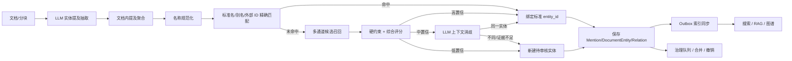

# Memorix 实体规范化、去重与消歧系统开发方案

> 版本：V1.0  
> 日期：2026-07-26  
> 状态：开发规划  
> 依据：《Memorix 实体规范化、去重与消歧系统开发文档》V1.0  
> 适用范围：Memorix 桌面端、本地运行时、云端 Web、混合模式  
> 关联模块：文档处理、实体管理、术语库、搜索、智能问答、知识图谱、后台任务

---

## 1. 文档目的

本文将目标规范映射到 Memorix 当前代码、数据结构和运行方式，形成可分阶段实施、验证和回滚的开发方案。

本方案重点解决：

1. 同一实体因中英文、缩写、括号、大小写、拼写和模型输出差异被重复创建；
2. 当前实体记录、原文提及和别名混在同一层，无法可靠追踪抽取证据；
3. 实体抽取后只按“小写名称 + 类型”精确去重，缺少候选召回、综合评分和上下文消歧；
4. 实体合并缺少影响预览、事务迁移、旧 ID 重定向、审计和撤销能力；
5. 搜索、问答和图谱仍可能按显示名称聚合，不能稳定复用统一实体身份；
6. 本地 SQLite、云端 PostgreSQL 和本地/云端仓储需要保持同一数据语义。

核心原则：

> 原文提及必须完整保留；标准实体必须使用稳定 ID；确定性规则优先于模型判断；错误合并的代价高于漏合并；任何合并都必须可审计、可重定向、可撤销。

---

## 2. 当前项目实现审计

### 2.1 已具备的基础能力

| 领域 | 当前实现 | 复用判断 |
| --- | --- | --- |
| 实体主表 | `Entity` 已包含名称、规范化名称、类型、描述、工作区、别名 JSON、外部引用、验证与使用次数 | 中 |
| 文档实体关联 | `DocumentEntity` 已包含文档、实体、提及次数、置信度、证据、首个提及和示例 | 中高 |
| 实体关系 | `EntityRelation` 已包含源实体、目标实体、关系类型、证据文档、证据文本和置信度 | 中高 |
| 实体抽取 | `AISummaryService` 能结构化返回实体名称、类型、描述、别名、示例、角色和置信度 | 中 |
| 文档流水线 | `DocumentPipeline` 在主处理链路内创建实体和文档关联 | 高 |
| 实体重处理 | `EntityWorker` 支持针对单篇文档重新生成实体 | 高 |
| 实体 API | `EntitiesController`、`EntityService` 已支持实体分页列表和详情 | 中 |
| 实体前端 | 已有实体列表、类型筛选、搜索、详情和关联文档展示 | 中 |
| 术语库 | 已支持工作区术语、别名、审核、冲突、批量导入、查询扩展和使用统计 | 高 |
| 中文检索 | 已有中文全文索引、术语查询扩展、关键词检索和混合检索基础 | 高 |
| 多路向量 | 已规划并实现原文、译文、摘要和假设问题等向量类型及 RRF 融合基础 | 高 |
| 后台任务 | `MultilingualBatchJobService` 已具备入队、暂停、恢复、重试和进度状态模型 | 高 |
| 图谱前端 | 已支持实体共现网络、Textexture 网络、右侧统计和点击节点查看相关文章 | 高 |
| 双运行时 | 已有 EF Core、SQLite 初始化、本地/云端仓储和运行时路由 | 高 |

### 2.2 当前关键代码入口

| 入口 | 当前职责 | 本次改造定位 |
| --- | --- | --- |
| `Entity.cs` | 实体主记录 | 扩展为标准实体，增加状态、显示名、重定向和版本 |
| `DocumentEntity.cs` | 文档与实体聚合关联 | 保留为聚合表，不再承担全部原文提及 |
| `EntityRelation.cs` | 实体关系与证据 | 增加工作区、状态、聚合键和合并迁移语义 |
| `DocumentPipeline.CreateEntitiesAsync` | 导入时创建/链接实体 | 改为调用统一实体解析编排器 |
| `EntityWorker.ProcessDocumentAsync` | 文档实体重生成 | 改为复用相同解析编排器，消除双套逻辑 |
| `AISummaryService` | 摘要、标签和实体抽取 | 扩展实体提及 JSON Schema 和版本审计字段 |
| `EntityService` | 实体列表和详情 | 增加别名、提及、候选、重定向和治理查询 |
| `EntitiesController` | 实体只读 API | 扩展规范化、候选、合并、撤销和审核 API |
| `TerminologyService` | 中外文术语映射和查询扩展 | 与实体别名互补，不直接替代实体身份库 |
| `SearchService` | 全文、向量和融合检索 | 接入实体别名扩展、实体过滤与实体 ID 聚合 |
| `knowledge-graph/page.tsx` | 实体共现和文本网络 | 改为优先消费后端标准实体和聚合关系 |

### 2.3 当前主要差距

| 目标能力 | 当前状态 | 影响 | 优先级 |
| --- | --- | --- | --- |
| 原始提及与标准实体分层 | `DocumentEntity` 只保留聚合信息 | 无法逐条追踪名称、位置、上下文和解析原因 | P0 |
| 独立别名表 | `Entity.Aliases` 为 JSON | 无法唯一约束、检索、审核、记录来源和有效期 | P0 |
| 可靠名称规范化 | 仅 `Trim + ToLowerInvariant` | 全半角、Unicode、括号、连接符、中英文变体仍重复 | P0 |
| 统一实体解析入口 | 流水线与 `EntityWorker` 各有一套创建逻辑 | 规则漂移、重处理结果不一致 | P0 |
| 工作区隔离 | `EntityWorker` 写死 `WorkspaceId = "default"`，主流水线又主要按 `UserId` 匹配 | 多工作区可能错误复用或重复创建实体 | P0 |
| 类型字典 | 类型由模型自由输出并使用字符串 | 同义类型、大小写和不兼容类型难以约束 | P0 |
| 候选召回与评分 | 仅标准名精确匹配 | 缩写、翻译、模糊名称和上下文无法关联 | P1 |
| LLM 二次消歧 | 不存在 | 中等置信度同名实体只能新建或误绑 | P1 |
| 合并治理 | 不存在 | 存量重复无法安全处理 | P1 |
| 旧 ID 重定向 | 不存在 | 合并后历史链接和引用会失效 | P1 |
| 合并撤销 | 不存在 | 错误合并无法低风险恢复 | P1 |
| 搜索/RAG 实体化 | 术语可扩展查询，但实体 ID 未成为统一过滤键 | 多语言查询和实体聚合不稳定 | P2 |
| 图谱后端实体图 | 当前主要在前端从语料构造共现网络 | 大数据量下重复计算，标准实体治理结果不能完整复用 | P2 |
| 质量评测 | 无实体 Golden Dataset 和误合并指标 | 规则、模型和阈值升级缺少安全门槛 | P0 |

### 2.4 必须优先修正的结构问题

#### 2.4.1 两套实体写入逻辑

`DocumentPipeline.CreateEntitiesAsync` 与 `EntityWorker.ProcessDocumentAsync` 都会独立：

1. 清理或读取文档实体；
2. 使用名称小写作为 `NormalizedName`；
3. 查询或创建实体；
4. 创建 `DocumentEntity`。

本次改造后，两者不得再直接创建实体，必须统一调用 `IEntityResolutionOrchestrator.ResolveDocumentAsync`。

#### 2.4.2 工作区身份不统一

实体已经存在 `WorkspaceId` 和工作区唯一索引，但部分查询仍按 `UserId`，重处理路径写死 `"default"`。第一阶段必须统一使用真实工作区 ID；`UserId` 仅作为所有者和授权边界，不再作为实体去重主范围。

#### 2.4.3 别名 JSON 与术语库职责重叠

两者应明确分工：

- `entity_aliases`：回答“这个名称是否指向这个稳定实体”；
- `terminology`：回答“这个专业词在某语言和领域应如何表达或翻译”；
- 经过人工确认的术语可生成实体别名建议，但不能绕过实体类型和消歧规则自动绑定；
- 实体的已验证中英文别名可提供给术语查询扩展，但不自动覆盖用户术语偏好。

---

## 3. 建设目标与范围

### 3.1 V1.0 目标

1. 建立“实体提及 → 标准实体 → 多语言显示名/别名”三层模型；
2. 新增资料使用统一解析链路，避免高频格式型重复；
3. 已知标准名和已验证别名可确定性链接；
4. 中等置信度候选使用字符串、描述、上下文、关系和来源综合评分；
5. 高风险情况进入人工审核，不自动合并；
6. 存量重复实体可预览、合并、重定向和撤销；
7. 搜索、问答和图谱逐步统一使用 `entity_id`；
8. 本地和云端使用一致的数据模型、API 契约和任务状态。

### 3.2 V1.0 不包含

- 独立图数据库；
- 图神经网络实体消歧；
- 无审核的全量存量自动合并；
- 完全自动实体拆分；
- 跨租户共享全局权威实体库；
- 用一个大模型调用替代规则、评分和审计链路。

---

## 4. 目标总体架构



### 4.1 模块划分

建议在现有分层中新增以下能力：

| 层 | 新增模块 | 责任 |
| --- | --- | --- |
| Domain | 实体别名、提及、外部 ID、候选、合并日志、禁止合并对、治理任务、Outbox 事件 | 保存事实和状态 |
| Application | 规范化、候选召回、评分、解析、合并和治理接口及 DTO | 定义用例与契约 |
| Infrastructure | 规则实现、模型适配、数据库访问、批处理和索引同步 | 执行算法和持久化 |
| API | 实体解析、候选、合并预览、合并、撤销、审核 API | 对外暴露能力 |
| Web | 实体治理工作台、别名管理、合并对比、历史和质量看板 | 人工治理 |

### 4.2 统一处理入口

新增：

```text
IEntityResolutionOrchestrator.ResolveDocumentAsync(
    workspaceId,
    userId,
    documentId,
    extractionPayload,
    options,
    cancellationToken)
```

入口负责：

1. 校验工作区和文档；
2. 保存原始提及；
3. 文档内临时聚合；
4. 名称规范化；
5. 候选召回与评分；
6. 决定绑定、新建或审核；
7. 重建该文档的 `DocumentEntity` 聚合；
8. 保存关系和审计；
9. 发出索引同步事件；
10. 返回解析统计和失败明细。

---

## 5. 数据模型设计

### 5.1 扩展 `entities`

保留现有 `Entity`，逐步把它明确为标准实体：

| 字段 | 类型 | 说明 |
| --- | --- | --- |
| `CanonicalName` | varchar(500) | 全局标准名；兼容期可回填自 `Name` |
| `PreferredNameZh` | varchar(500) nullable | 中文首选显示名 |
| `PreferredNameEn` | varchar(500) nullable | 英文首选显示名 |
| `Abbreviation` | varchar(100) nullable | 明确验证的缩写 |
| `NormalizedKey` | varchar(500) | 版本化规范化键 |
| `Status` | varchar(30) | active/pending_review/merged/rejected/split/archived |
| `MergedIntoId` | uuid nullable | 旧实体重定向目标 |
| `Confidence` | decimal nullable | 标准实体置信度 |
| `SourceCount` | int | 独立来源数 |
| `MentionCount` | int | 提及总数 |
| `RowVersion` | long | 乐观锁版本 |
| `NormalizationVersion` | varchar(30) | 规范化规则版本 |

兼容策略：

- `Name` 在一个版本周期内作为 `CanonicalName` 兼容字段；
- `DisplayName` 在一个版本周期内回退到语言首选名；
- `Aliases` JSON 只读兼容，完成迁移后停止写入；
- `ExternalRef` 迁入外部 ID 表后只读兼容；
- `IsArchived` 与 `Status` 双写一个版本，再统一到 `Status`。

索引：

```text
unique(workspace_id, normalized_key, entity_type)
index(workspace_id, status, entity_type)
index(workspace_id, merged_into_id)
index(workspace_id, preferred_name_zh)
index(workspace_id, preferred_name_en)
```

唯一索引只能约束高置信度标准键；存在同名异义时，通过带判别后缀的内部标准键或“允许同名 + 外部 ID/消歧键”策略处理，不能依赖名称唯一性错误合并。

### 5.2 新表 `entity_aliases`

关键字段：

- `Id`、`WorkspaceId`、`EntityId`；
- `Alias`、`NormalizedAlias`；
- `LanguageCode`；
- `AliasType`；
- `SourceType`、`SourceId`；
- `Confidence`、`IsVerified`；
- `ValidFrom`、`ValidTo`；
- `CreatedBy`、`CreatedAt`、`UpdatedAt`；
- `NormalizationVersion`。

别名类型：

```text
ABBREVIATION
TRANSLATION
FULL_NAME
SHORT_NAME
FORMER_NAME
SPELLING_VARIANT
TRANSLITERATION
MODEL_GENERATED
USER_DEFINED
LEGACY_JSON
```

约束：

- 同一实体下相同规范化别名唯一；
- 跨实体同名别名允许存在，但必须标记为歧义别名；
- 未验证的模型别名不得直接触发高置信度自动链接；
- 已验证缩写也必须受类型和上下文约束。

### 5.3 新表 `entity_mentions`

逐条保存原始提及，不再只保存文档级聚合：

- `Id`、`WorkspaceId`、`DocumentId`、`ChunkId`；
- `EntityId` nullable；
- `MentionText`、`NormalizedMention`、`SuggestedType`；
- `ContextText`；
- `StartOffset`、`EndOffset`；
- `ExtractionBatchId`；
- `ExtractionModel`、`ExtractionModelVersion`；
- `PromptVersion`、`SchemaVersion`；
- `ExtractionConfidence`；
- `ResolutionStatus`；
- `ResolutionMethod`；
- `ResolutionScore`；
- `ResolverVersion`；
- `ReasonCodes` JSON；
- `CreatedAt`、`UpdatedAt`。

状态：

```text
UNRESOLVED
AUTO_LINKED
LLM_LINKED
HUMAN_CONFIRMED
NEW_ENTITY
REJECTED
STALE
```

### 5.4 保留并重定义 `document_entities`

`DocumentEntity` 继续作为文档与标准实体的聚合表：

- 主键仍为 `DocumentId + EntityId`；
- `MentionCount` 从 `entity_mentions` 聚合；
- `FirstMention`、`MentionExamples` 从原始提及生成；
- `Confidence` 使用有效提及的加权平均或最大置信度；
- `Evidence` 保留兼容，新的完整证据读取 `entity_mentions`；
- 重处理时先在事务内生成新聚合，再替换旧聚合，避免短暂空数据。

### 5.5 新表 `entity_external_ids`

字段：

- `Id`、`WorkspaceId`、`EntityId`；
- `IdType`、`IdValue`；
- `Source`、`IsVerified`、`Confidence`；
- `CreatedAt`、`UpdatedAt`。

约束：

```text
unique(workspace_id, id_type, id_value)
```

外部 ID 冲突属于自动合并硬阻断。

### 5.6 新表 `entity_resolution_candidates`

保存每次候选召回和评分：

- 提及 ID、候选实体 ID、候选排名；
- 名称、别名、描述、上下文、关系和来源分数；
- 总分；
- 决策；
- 原因码；
- 规则版本、模型版本；
- 创建时间。

默认只保留 Top 20；可按工作区配置保留周期。

### 5.7 新表 `entity_merge_logs`

字段：

- `Id`、`WorkspaceId`、`BatchId`；
- `SourceEntityId`、`TargetEntityId`；
- `Reason`、`Method`、`Score`；
- `OperatorId`、`DeviceId`、`RequestId`；
- `BeforeSnapshot`、`MigrationSummary`；
- `ExpectedSourceVersion`、`ExpectedTargetVersion`；
- `Status`；
- `CreatedAt`、`CompletedAt`、`RevertedAt`。

`BeforeSnapshot` 至少包含源实体、别名、外部 ID、文档关联、提及、关系和索引映射。

### 5.8 新表 `entity_merge_blocklist`

用于记录已确认“不应合并”的实体对：

- `WorkspaceId`；
- 规范化后的 `EntityIdA`、`EntityIdB`；
- 原因、来源、操作人；
- 是否永久；
- 有效期；
- 创建时间。

实体 ID 对必须排序后保存，避免 A/B 与 B/A 重复。

### 5.9 新表 `entity_governance_tasks`

统一承载：

```text
DUPLICATE_CANDIDATE
UNRESOLVED_MENTION
TYPE_CONFLICT
EXTERNAL_ID_CONFLICT
SUSPICIOUS_MERGE
INDEX_SYNC_FAILURE
SYNC_CONFLICT
```

支持 `pending/running/paused/completed/rejected/failed`、优先级、负责人、重试、游标、进度和错误信息。

### 5.10 新表 `entity_outbox_events`

合并或实体更新事务内写入：

```text
ENTITY_CREATED
ENTITY_UPDATED
ENTITY_MERGED
ENTITY_MERGE_REVERTED
ENTITY_ALIAS_CHANGED
ENTITY_RELATION_CHANGED
ENTITY_REINDEX_REQUIRED
```

后台 Worker 异步同步全文索引、向量索引、图谱聚合和缓存。

---

## 6. 名称规范化组件

### 6.1 接口

```text
IEntityNameNormalizer.Normalize(
    rawName,
    entityType,
    languageHint,
    normalizationVersion)
```

返回：

- 原始名称；
- Unicode 规范化名称；
- 规范化键；
- 拆分出的括号别名；
- 可能的缩写；
- 版本信息；
- 触发规则和警告。

### 6.2 规则顺序

1. Unicode NFKC；
2. 全角转半角；
3. 去首尾空白和合并连续空白；
4. 统一中英文括号、连接符和常见标点；
5. 英文使用不依赖当前区域的大小写折叠；
6. 规范公司后缀，但不直接删除有判别意义的部分；
7. 识别版本号、代际、年份和模型规格；
8. 拆分“标准名（缩写/英文名）”；
9. 生成标准键和别名候选；
10. 记录规则版本。

### 6.3 硬性边界

以下情况不得仅凭名称相似自动合并：

- 模型系列与具体版本；
- 公司、品牌与产品；
- 母公司与子公司；
- 上位概念与下位概念；
- 同名人物、地点或组织；
- 旧名称与同时存在的新组织；
- 外部 ID 冲突；
- 明确版本号不同；
- 类型矩阵不兼容。

---

## 7. 类型字典与兼容矩阵

### 7.1 首期类型

```text
PERSON
ORGANIZATION
COMPANY
INSTITUTION
PRODUCT
MODEL_FAMILY
MODEL
TECHNOLOGY
FRAMEWORK
LIBRARY
DATASET
STANDARD
LOCATION
EVENT
INDUSTRY
CONCEPT
DOCUMENT
```

### 7.2 兼容现有小写类型

增加 `EntityTypeRegistry`：

- 接收现有 `person/company/product/technology/...`；
- 转换为固定大写代码；
- 未知类型进入 `CONCEPT` 或待审核，不能直接写入自由类型；
- API 返回代码和中文显示名；
- 前端统一读取后端类型字典，减少重复常量。

### 7.3 兼容矩阵

初始策略：

- 同类型可进入自动链接评分；
- `COMPANY` 与 `ORGANIZATION` 可进入人工/LLM 消歧，不直接自动合并；
- `MODEL_FAMILY` 与 `MODEL` 永久阻断自动合并；
- `FRAMEWORK` 与 `LIBRARY` 只进入中置信度判断；
- `PRODUCT` 与 `COMPANY` 阻断自动合并；
- `CONCEPT` 与其他具体类型默认阻断，除非人工改型后处理。

---

## 8. 实体提及抽取改造

### 8.1 新 JSON Schema

每条提及至少返回：

```json
{
  "mention": "大型语言模型",
  "canonical_name_suggestion": "大语言模型",
  "entity_type": "TECHNOLOGY",
  "aliases": [
    { "value": "LLM", "language": "en", "alias_type": "ABBREVIATION" }
  ],
  "description": "基于大规模语料训练的语言模型",
  "evidence": "……",
  "start_offset": 120,
  "end_offset": 126,
  "confidence": 0.93
}
```

### 8.2 抽取约束

- 模型只抽取提及和建议，不直接决定最终 `entity_id`；
- 类型必须来自固定字典；
- 每条提及必须有原文证据；
- 不确定类型时输出 `CONCEPT` 并降低置信度；
- 别名必须带语言和类型；
- 系列和具体版本分别抽取；
- 记录模型、Prompt、Schema 和批次版本；
- JSON 解析失败保留原始输出并进入可重试任务。

### 8.3 文档内聚合

分块抽取先使用 `TEMP-*` 临时实体：

- 同一文档内标准键、明确缩写和括号全称先聚合；
- 不把临时 ID 暴露给搜索和图谱；
- 文档级聚合完成后再进入全局实体解析；
- 重跑使用 `document_id + extraction_version + content_hash` 幂等。

---

## 9. 候选召回设计

### 9.1 召回通道

按成本从低到高：

1. 标准名称精确命中；
2. 已验证别名精确命中；
3. 外部 ID 精确命中；
4. 规范化键命中；
5. 缩写命中；
6. 术语库中英文映射命中；
7. 字符串模糊匹配；
8. 名称向量；
9. 描述/上下文向量；
10. 关系邻居与共现实体；
11. 来源域名、仓库或作者约束。

各通道结果合并去重后最多保留 20 个候选。

### 9.2 本地与云端实现

| 能力 | SQLite 本地 | PostgreSQL 云端 |
| --- | --- | --- |
| 精确名称/别名 | B-tree 索引 | B-tree 索引 |
| 模糊字符串 | 应用层相似度 + blocking | `pg_trgm` 或应用层相似度 |
| 全文名称 | FTS5 | PostgreSQL FTS |
| 名称/描述向量 | 复用本地向量存储 | pgvector |
| 关系邻居 | 关系表查询 | 关系表查询 |

首期不做全库两两比较，统一使用 blocking：

- 类型 + 名称前缀；
- 类型 + 缩写；
- 类型 + 规范化键；
- 拼音/首字母；
- 向量近邻；
- 外部 ID；
- 共同关系邻居；
- 相同来源域。

---

## 10. 综合评分与决策

### 10.1 默认评分

```text
score =
  0.30 * name_score +
  0.20 * alias_score +
  0.20 * description_score +
  0.15 * context_score +
  0.10 * relation_score +
  0.05 * source_score
```

所有分项、权重、阈值和原因码必须保存，不能只保存最终分数。

### 10.2 默认阈值

| 区间 | 决策 |
| --- | --- |
| `>= 0.92` | 高置信度自动链接 |
| `0.78–0.92` | LLM 二次消歧 |
| `0.60–0.78` | 人工审核 |
| `< 0.60` | 新建待审核实体 |

类型覆盖：

| 类型 | 自动链接阈值 |
| --- | ---: |
| PERSON | 0.96 |
| COMPANY | 0.95 |
| MODEL | 0.95 |
| TECHNOLOGY | 0.92 |
| CONCEPT | 0.93 |

上线初期 `enable_auto_merge=false`。自动链接与实体合并必须是两个独立开关。

### 10.3 硬约束执行顺序

1. 禁止合并表；
2. 外部 ID 冲突；
3. 类型冲突；
4. 系列/版本冲突；
5. 公司/品牌/产品边界；
6. 上下位和组织层级；
7. 明确时间、地点或关键属性冲突；
8. 通过后才计算综合分。

---

## 11. LLM 上下文消歧

### 11.1 输入

- 原始提及；
- 上下文；
- 文档标题、来源、时间和语言；
- Top-K 候选标准名、别名、类型、描述、外部 ID；
- 关键关系邻居；
- 各通道分数；
- 硬约束结果。

### 11.2 输出

```text
SAME_ENTITY
DIFFERENT_ENTITY
INSUFFICIENT_EVIDENCE
RELATED_BUT_NOT_SAME
```

同时输出：

- 候选实体 ID；
- 置信度；
- 结构化原因码；
- 一句简短解释；
- 使用的模型和 Prompt 版本。

### 11.3 安全规则

- LLM 不能覆盖硬阻断；
- `INSUFFICIENT_EVIDENCE` 不得被转换为自动绑定；
- 模型调用失败回退人工审核或新建待审核实体；
- 本地模型不可用时不应批量创建高置信度标准实体；
- 对常见高歧义缩写提高阈值。

---

## 12. 实体合并、重定向与撤销

### 12.1 合并预览

`merge-preview` 必须返回：

- 推荐主实体及选择原因；
- 将迁移的提及、别名、外部 ID、文档关联和关系数量；
- 会产生的别名冲突、外部 ID 冲突和自环；
- 受影响的搜索、问答、报告和图谱索引；
- 预计耗时；
- 是否允许自动执行；
- 当前实体版本。

### 12.2 主实体选择

按以下顺序综合决定：

1. 人工验证；
2. 权威来源和外部 ID；
3. 来源数和提及数；
4. 描述、别名和关系完整度；
5. 标准名称稳定性；
6. 创建时间。

禁止仅以“最早创建”或“名称最短”选择主实体。

### 12.3 合并事务

事务内：

1. 解析源/目标重定向链；
2. 按实体 ID 排序加锁；
3. 校验乐观锁版本；
4. 再次执行硬约束；
5. 保存合并前快照；
6. 迁移提及、别名和外部 ID；
7. 合并 `DocumentEntity` 聚合；
8. 迁移并去重关系；
9. 删除自环；
10. 源实体标记 `MERGED` 并写入 `MergedIntoId`；
11. 写合并日志；
12. 写 Outbox 事件；
13. 提交事务。

索引重建不阻塞数据库事务，由 Outbox Worker 完成。

### 12.4 旧 ID 重定向

- `GET /entities/{oldId}` 返回主实体数据并携带 `redirectedFrom`；
- 内部查询统一调用 `IEntityRedirectResolver.ResolveAsync`；
- 最大重定向深度默认 10；
- 创建合并前检查环路；
- 后台定期压缩重定向链。

### 12.5 撤销和拆分

- 仅当快照完整、后续新增数据可区分时支持一键撤销；
- 合并后新增的提及和关系必须根据发生时间、来源和操作记录分配；
- 无法自动恢复时生成 `SPLIT_REQUIRED` 治理任务；
- 撤销也写入 Outbox 和审计日志。

---

## 13. 搜索、问答和图谱接入

### 13.1 搜索

实体索引字段：

```text
entity_id
canonical_name
preferred_name_zh
preferred_name_en
verified_aliases
entity_type
description
source_count
mention_count
status
```

查询过程：

1. 使用术语库和实体别名扩展用户查询；
2. 识别可能的实体 ID；
3. 在中文 FTS、原文 FTS、多路向量中增加实体过滤或加权；
4. 使用现有 RRF 融合；
5. 结果按标准实体 ID 聚合，而非按显示名称聚合；
6. `MERGED` 实体自动解析到主实体。

### 13.2 智能问答

- 问题中的别名映射到标准实体；
- 检索时附加实体 ID 与已验证别名；
- 引用继续指向原始文档和分块，不指向 AI 生成的标准实体描述；
- 双语引用显示原文提及和当前语言的实体首选名；
- 回答后的引用一致性校验增加“引用实体是否真的出现在证据块”检查；
- 实体合并后历史问答引用仍通过旧 ID 重定向。

### 13.3 图谱

后端逐步提供标准实体图谱 API：

```text
GET /api/v1/knowledge-graph/entities
GET /api/v1/knowledge-graph/entities/{id}/neighbors
GET /api/v1/knowledge-graph/entities/{id}/documents
```

前端现有图谱保留两种模式：

- “实体关系网络”：优先读取后端标准实体和聚合关系；
- “文本网络”：继续使用 Textexture Narrative/Landscape Scan。

图谱约束：

- 节点 ID 必须是标准 `entity_id`；
- 节点标签按用户语言选择首选名称；
- 同一关系可聚合展示多份文档证据；
- 合并后边迁移、去重并移除自环；
- 点击节点继续显示相关文章和原始提及证据。

---

## 14. API 规划

### 14.1 实体与别名

```text
GET    /api/v1/entities
GET    /api/v1/entities/{id}
POST   /api/v1/entities
PATCH  /api/v1/entities/{id}
GET    /api/v1/entities/{id}/aliases
POST   /api/v1/entities/{id}/aliases
PATCH  /api/v1/entities/{id}/aliases/{aliasId}
DELETE /api/v1/entities/{id}/aliases/{aliasId}
GET    /api/v1/entities/{id}/mentions
GET    /api/v1/entities/{id}/relations
```

### 14.2 解析与候选

```text
POST /api/v1/entity-resolution/resolve
GET  /api/v1/entity-resolution/mentions/{mentionId}/candidates
POST /api/v1/entity-resolution/mentions/{mentionId}/review
POST /api/v1/entity-resolution/scan
GET  /api/v1/entity-resolution/jobs/{jobId}
POST /api/v1/entity-resolution/jobs/{jobId}/pause
POST /api/v1/entity-resolution/jobs/{jobId}/resume
POST /api/v1/entity-resolution/jobs/{jobId}/retry
```

### 14.3 合并治理

```text
POST /api/v1/entities/merge-preview
POST /api/v1/entities/merge
GET  /api/v1/entities/merge-history
POST /api/v1/entities/merges/{mergeId}/revert
POST /api/v1/entities/merge-blocklist
DELETE /api/v1/entities/merge-blocklist/{id}
GET  /api/v1/entity-governance/tasks
POST /api/v1/entity-governance/tasks/{id}/decision
```

要求：

- 合并、撤销和批量任务必须带幂等键；
- 写接口校验工作区权限；
- 合并请求带 `expectedVersion`；
- 返回结构包含 trace ID、实体 ID、决策、分数、原因码和版本；
- 本地与云端 API 契约一致。

---

## 15. 前端开发方案

### 15.1 实体列表升级

在现有实体列表增加：

- 状态、验证状态、别名数、来源数和提及数；
- 重复风险；
- 待审核数量；
- 标准实体/已合并实体筛选；
- 分页；
- 批量选择和生成合并预览；
- 旧 ID 重定向提示。

### 15.2 实体详情升级

分区显示：

1. 标准名称和多语言首选名；
2. 类型、状态、置信度和外部 ID；
3. 别名列表及来源、语言、验证状态；
4. 原始提及与上下文；
5. 关联文档；
6. 实体关系；
7. 重复候选；
8. 合并和变更历史。

### 15.3 治理工作台

新增 `/entities/governance`：

- 重复候选；
- 未解析提及；
- 类型冲突；
- 外部 ID 冲突；
- 可疑合并；
- 索引同步失败。

候选对比采用左右结构：

- 名称、类型、描述、别名和外部 ID；
- 共同/冲突文档；
- 关系邻居；
- 各分项分数；
- 硬约束和原因码；
- 合并、拒绝、加入禁止合并、添加别名和延后处理。

### 15.4 合并预览

执行前显示影响统计和冲突；高风险操作必须二次确认。完成后显示：

- 主实体；
- 被合并实体；
- 迁移数量；
- 索引同步状态；
- 可撤销条件和入口。

### 15.5 质量看板

展示：

- 实体重复率；
- 提及链接率；
- 自动链接精度抽检；
- 未解析率；
- 人工审核量；
- 合并撤销率；
- 旧 ID 重定向命中；
- 索引同步延迟；
- 按类型和规则版本的分布。

---

## 16. 本地、云端与同步适配

### 16.1 双数据库要求

所有表和字段变更同时覆盖：

1. `AppDbContext` 实体配置；
2. PostgreSQL 建表/迁移；
3. 桌面主 SQLite 启动升级；
4. 每工作区 SQLite 初始化；
5. `LocalKnowledgeRepository`；
6. `CloudKnowledgeRepository`；
7. API DTO；
8. Web 类型。

项目当前包含针对旧桌面数据库的启动时增量升级逻辑，本次应新增独立的：

```text
EnsureEntityResolutionSetupAsync()
```

该升级必须：

- 可重复执行；
- 支持已有 PascalCase 和 snake_case 历史列；
- 分批回填，避免长时间锁库；
- 建索引前检查重复；
- 记录 schema 版本；
- 提供 SQLite 升级测试。

### 16.2 本地优先

- 本地使用 UUID 创建稳定实体；
- 无网络时可完成规则匹配；
- 本地 LLM 可用于二次消歧；
- 模型不可用时，中置信度提及进入审核队列；
- 不因离线强制创建大量 ACTIVE 标准实体。

### 16.3 云端同步事件

同步对象：

- 实体创建/修改；
- 别名增删和验证；
- 人工审核；
- 合并；
- 撤销；
- 禁止合并；
- 用户首选显示名。

冲突策略：

| 冲突 | 策略 |
| --- | --- |
| 两端创建同一实体 | 生成重复候选，不覆盖 |
| 一端合并、另一端修改旧实体 | 先解析重定向，再应用或进入审核 |
| 两端合并到不同目标 | 进入合并冲突队列 |
| 两端新增别名 | 集合合并并保留来源 |
| 全局标准名不同 | 人工审核 |
| 用户首选名不同 | 作为用户偏好，不修改标准实体 |

合并和撤销事件必须具有全局可比较顺序。

---

## 17. 权限与审计

### 17.1 权限

```text
entity.read
entity.create
entity.update
entity.alias.manage
entity.review
entity.merge
entity.merge.revert
entity.type.manage
entity.rule.manage
entity.quality.read
```

建议：

- 普通用户可读取、创建、提交别名建议和处理个人审核任务；
- Workspace Owner 可审核和执行普通合并；
- 高风险批量合并、撤销和规则调整仅管理员或专门权限可执行；
- 本地单用户模式仍走同一权限语义，但可由本地 Owner 默认授权。

### 17.2 审计

记录：

- 用户、设备、工作区和请求 ID；
- 操作前后数据；
- 候选及分项分数；
- 规则、模型、Prompt 和 Schema 版本；
- 原因码；
- 执行耗时；
- 事务结果；
- 索引同步结果；
- 撤销链路。

---

## 18. 后台任务与可靠性

### 18.1 任务类型

```text
entity_extract
entity_resolve
entity_duplicate_scan
entity_merge_batch
entity_rebuild_aggregates
entity_reindex
entity_quality_evaluate
```

优先复用现有后台任务的暂停、恢复、重试和进度交互，但实体治理使用独立任务表或通用化后的任务基类，不能把实体语义硬塞入多语言任务类型。

### 18.2 幂等键

```text
抽取：document_id + chunk_id + content_hash + extraction_version
解析：mention_id + resolver_version
合并：workspace_id + idempotency_key
索引：entity_id + entity_version + event_type
```

### 18.3 并发控制

- 合并按实体 ID 排序加锁；
- `RowVersion` 乐观锁；
- 同一候选簇只允许一个活动任务；
- 处理前解析最新重定向；
- 批处理保存游标，支持断点续跑；
- 超过重试上限进入死信治理任务。

---

## 19. 存量迁移方案

### 19.1 迁移顺序

1. 备份数据库；
2. 创建新表和可空字段；
3. 回填 `CanonicalName`、`NormalizedKey`、`Status` 和版本；
4. 将 `Entity.Aliases` JSON 迁移到 `entity_aliases`，标记 `LEGACY_JSON`；
5. 将 `ExternalRef` 迁移到 `entity_external_ids`；
6. 使用现有 `DocumentEntity` 生成兼容提及，标记来源为 `LEGACY_AGGREGATE`；
7. 扫描工作区内实体候选簇；
8. 影子计算，不修改现有绑定；
9. 人工抽检和校准阈值；
10. 先处理确定性别名和格式型重复；
11. 再分批执行已审核合并；
12. 重建实体聚合、搜索和图谱索引；
13. 抽样验证后启用新写链路。

### 19.2 兼容提及限制

历史 `DocumentEntity` 没有完整偏移和逐条上下文，因此迁移出的兼容提及只能用于：

- 保留关联；
- 统计来源和提及次数；
- 辅助候选召回。

不能作为高置信度自动合并的唯一依据。需要完整证据时，应对高价值文档重新抽取。

### 19.3 存量扫描

优先级：

```text
priority = mention_count * source_count * business_weight * duplicate_risk
```

首批处理：

- 大小写差异；
- 全半角和空格差异；
- 明确括号全称/缩写；
- 已验证术语中英文映射；
- 完全一致外部 ID。

最后处理：

- 人物同名；
- 公司/品牌/产品；
- 模型系列/版本；
- 上下位概念；
- 历史名称。

---

## 20. 分阶段开发计划

### 阶段 0：基线、数据安全与评测（3～5 人日）

任务：

- 固化实体类型字典、兼容矩阵和原因码；
- 建立至少 1,000 条提及的 Golden Dataset 初版；
- 增加功能开关和配置；
- 建立迁移备份、批次和回滚规范；
- 修复工作区 ID 解析和实体写入范围；
- 明确术语库与实体别名职责。

交付：

- 配置模型；
- 评测数据格式；
- 工作区隔离测试；
- 影子运行开关；
- 数据迁移演练脚本说明。

### 阶段 1：三层模型与确定性链接 MVP（8～12 人日）

任务：

- 扩展 `Entity`；
- 新增别名、提及、外部 ID、候选和日志基础表；
- 实现 `EntityNameNormalizer`；
- 固定实体类型；
- 改造 AI 提及 Schema；
- 实现文档内临时聚合；
- 实现标准名、别名和外部 ID 精确链接；
- 统一 `DocumentPipeline` 与 `EntityWorker`；
- 重建 `DocumentEntity` 聚合；
- 增加 SQLite/PostgreSQL 升级。

验收：

- “大语言模型 / 大型语言模型 / LLM”在已验证别名条件下绑定同一实体；
- 原始提及和证据不丢失；
- 主流水线和重处理结果一致；
- 不同工作区不串数据；
- 重跑不重复创建实体、别名和提及。

### 阶段 2：多通道候选召回与评分（8～12 人日）

任务：

- blocking；
- 模糊字符串召回；
- 术语映射召回；
- 名称和描述向量召回；
- 关系邻居召回；
- 综合评分；
- 类型阈值；
- 硬阻断；
- 候选审计记录；
- 重复候选扫描任务。

验收：

- Top-K 候选召回率达到 95% 以上；
- 高置信度自动链接准确率达到 97% 以上；
- GPT/GPT-4、GPT-4/GPT-4o 等版本边界不发生自动错误链接；
- 单提及规则解析 P95 不超过 800 ms。

### 阶段 3：LLM 上下文消歧（5～8 人日）

任务：

- 候选上下文组装；
- 结构化决策和原因码；
- 公司/产品、人物同名、模型版本消歧；
- 本地 LM Studio 与云端模型适配；
- 超时、失败、成本和降级策略；
- Prompt/模型版本回归。

验收：

- 证据不足时稳定输出 `INSUFFICIENT_EVIDENCE`；
- LLM 不能绕过硬阻断；
- 中置信度样本准确率较纯规则明显提升；
- 模型不可用时任务可重试且数据不重复。

### 阶段 4：实体治理、合并和撤销（10～15 人日）

任务：

- 合并预览；
- 主实体推荐；
- 事务迁移；
- 重定向解析；
- 禁止合并表；
- 合并历史；
- 撤销与拆分任务；
- 治理工作台；
- 权限和审计；
- Outbox 索引同步。

验收：

- 合并后所有提及、别名、文档关联和关系指向主实体；
- 旧 ID 可访问并重定向；
- 无重定向环路和关系自环；
- 合并操作可预览、可审计、可撤销；
- 索引失败不回滚已完成的数据库合并，但能自动重试。

### 阶段 5：搜索、问答和图谱整合（6～10 人日）

任务：

- 实体别名查询扩展；
- 实体 ID 过滤和结果聚合；
- 接入现有中文 FTS、多路向量和 RRF；
- 双语实体显示与原文引用；
- 引用实体一致性校验；
- 后端标准实体图谱 API；
- 前端图谱消费标准实体关系。

验收：

- 中文、英文和缩写查询能召回同一实体相关文档；
- 引用仍可追溯到原始文档和分块；
- 合并前后搜索、问答和图谱结果连续；
- 点击图谱节点显示正确相关文章。

### 阶段 6：存量治理与灰度上线（6～12 人日）

任务：

- 存量别名迁移；
- 历史关联兼容提及；
- 影子扫描；
- 人工抽检；
- 分批合并；
- 索引重建；
- 质量看板；
- 阈值校准；
- 灰度放量和回滚演练。

验收：

- 单批任务可暂停、恢复、重试和查看进度；
- 错误自动合并率不超过 0.5%；
- 未解析提及率不超过 15%；
- 合并撤销率不超过 1%；
- 数据库、全文索引、向量索引和图谱统计一致。

### 20.1 总体工作量

| 范围 | 估算 |
| --- | ---: |
| MVP：阶段 0～1 | 11～17 人日 |
| 可用解析：阶段 0～3 | 24～37 人日 |
| 完整治理：阶段 0～4 | 34～52 人日 |
| 全链路与存量上线：阶段 0～6 | 46～74 人日 |

以上为工程人日，不含大规模人工标注时间。后端、前端、算法/评测可在阶段依赖满足后并行。

---

## 21. 代码改造清单

### 21.1 Domain

新增：

```text
EntityAlias.cs
EntityMention.cs
EntityExternalId.cs
EntityResolutionCandidate.cs
EntityMergeLog.cs
EntityMergeBlock.cs
EntityGovernanceTask.cs
EntityOutboxEvent.cs
```

修改：

```text
Entity.cs
DocumentEntity.cs
EntityRelation.cs
```

### 21.2 Application

新增接口：

```text
IEntityNameNormalizer
IEntityCandidateRetriever
IEntityResolutionScorer
IEntityDisambiguationService
IEntityResolutionOrchestrator
IEntityRegistryService
IEntityMergeService
IEntityRedirectResolver
IEntityGovernanceService
IEntityIndexSyncService
```

新增 DTO：

```text
EntityMentionDto
EntityAliasDto
EntityCandidateDto
EntityResolutionResult
EntityMergePreview
EntityMergeRequest
EntityMergeResult
EntityGovernanceTaskDto
EntityQualityMetrics
```

### 21.3 Infrastructure

新增建议目录：

```text
Processing/Entities/EntityNameNormalizer.cs
Processing/Entities/EntityCandidateRetriever.cs
Processing/Entities/EntityResolutionScorer.cs
Processing/Entities/EntityDisambiguationService.cs
Processing/Entities/EntityResolutionOrchestrator.cs
Processing/Entities/EntityMergeService.cs
Processing/Entities/EntityGovernanceWorker.cs
Processing/Entities/EntityOutboxWorker.cs
```

重点修改：

```text
DocumentPipeline.cs
EntityWorker.cs
AISummaryService.cs
AppDbContext.cs
SqliteInitializer.cs
LocalKnowledgeRepository.cs
CloudKnowledgeRepository.cs
SearchService.cs
```

### 21.4 API

修改：

```text
EntitiesController.cs
DocumentsController.cs
Program.cs
```

新增：

```text
EntityResolutionController.cs
EntityGovernanceController.cs
KnowledgeGraphController.cs
```

### 21.5 Web

修改：

```text
web/src/app/(main)/entities/page.tsx
web/src/app/(main)/entities/[id]/page.tsx
web/src/app/(main)/knowledge-graph/page.tsx
web/src/app/(main)/search/page.tsx
web/src/app/(main)/qa/page.tsx
web/src/lib/api.ts
web/src/lib/types.ts
```

新增：

```text
web/src/app/(main)/entities/governance/page.tsx
web/src/app/(main)/entities/merge-history/page.tsx
web/src/components/entity/entity-alias-editor.tsx
web/src/components/entity/entity-candidate-compare.tsx
web/src/components/entity/entity-merge-preview.tsx
web/src/components/entity/entity-resolution-score.tsx
web/src/components/entity/entity-quality-dashboard.tsx
```

---

## 22. 测试方案

### 22.1 单元测试

- Unicode NFKC、全半角、空格和连接符；
- 中英文括号拆分；
- 缩写识别；
- 公司后缀和版本号；
- 类型兼容矩阵；
- blocking；
- 综合评分和阈值边界；
- 硬阻断；
- 重定向链与环路；
- 关系去重和自环移除；
- 合并快照与撤销；
- 幂等键。

### 22.2 集成测试

- 新文档导入到提及、解析和聚合；
- 文档实体重处理复用统一链路；
- 多工作区隔离；
- 候选召回与 LLM 消歧；
- 合并和旧 ID 重定向；
- 搜索、RAG、报告和图谱索引同步；
- 本地 SQLite 启动升级；
- PostgreSQL 迁移；
- 本地离线解析；
- 云端同步冲突；
- 批量任务断点续跑。

### 22.3 典型样本

应链接为同一实体：

```text
大语言模型 / 大型语言模型 / LLM
检索增强生成 / Retrieval-Augmented Generation / RAG
OpenAI, Inc. / OpenAI
PyTorch / pytorch
```

不应合并：

```text
GPT / GPT-4
GPT-4 / GPT-4o
Claude / Claude 3.5 Sonnet
Apple 公司 / 苹果水果
Transformer 架构 / transformers 软件库
```

应建立关系而非合并：

```text
GPT-4 INSTANCE_OF GPT
GPT SUBCLASS_OF 大语言模型
GPT-4 DEVELOPED_BY OpenAI
```

### 22.4 Golden Dataset

至少包含：

- 1,000 个实体提及；
- 300 对应合并样本；
- 300 对不应合并样本；
- 100 个同名歧义；
- 100 个中英文和缩写；
- 100 个版本/系列边界。

每次规则、Embedding、LLM 或 Prompt 版本变化都必须运行回归。

---

## 23. 验收指标

| 指标 | 目标 |
| --- | ---: |
| 实体提及抽取准确率 | ≥ 92% |
| 别名精确命中准确率 | ≥ 99% |
| Top-K 候选召回率 | ≥ 95% |
| 自动链接准确率 | ≥ 97% |
| 错误自动合并率 | ≤ 0.5% |
| 未解析提及率 | ≤ 15% |
| 人工审核一致率 | ≥ 95% |
| 合并撤销率 | ≤ 1% |
| 精确别名查询 P95 | ≤ 100 ms |
| Top-K 候选召回 P95 | ≤ 500 ms |
| 单提及规则解析 P95 | ≤ 800 ms |
| 1 万实体候选扫描 | ≤ 10 min |
| 合并数据库事务 | ≤ 5 s |

上线初期以控制错误合并率为第一目标，不为提高自动化率降低安全阈值。

---

## 24. 发布策略

### 24.1 功能开关

```yaml
entity_resolution:
  enabled: true
  shadow_mode: true
  enable_exact_alias_link: false
  enable_scored_auto_link: false
  enable_llm_disambiguation: false
  enable_auto_merge: false
  enable_entity_search_expansion: false
  enable_graph_backend: false
```

### 24.2 上线顺序

1. 新表和兼容字段；
2. 影子提及与候选记录；
3. 名称规范化；
4. 已验证标准名和别名链接；
5. 高置信度评分链接；
6. LLM 二次消歧；
7. 人工合并治理；
8. 搜索、问答和图谱接入；
9. 存量分批合并；
10. 评估后再决定是否开放有限自动合并。

### 24.3 回滚

- 关闭新解析开关后，回退现有 `Entity/DocumentEntity` 读路径；
- 不删除新表和审计数据；
- 合并通过撤销操作恢复，不直接执行 SQL 回滚；
- 索引可按数据库事实重建；
- 每个存量批次独立备份、独立批次 ID、独立抽检；
- 单批大小从 100 个候选簇开始，稳定后逐步增加。

---

## 25. 风险与应对

| 风险 | 影响 | 应对 |
| --- | --- | --- |
| LLM 过度合并 | 污染搜索、问答和图谱 | 硬规则优先、高阈值、人工审核、可撤销 |
| 别名歧义 | 错绑实体 | 类型、上下文和来源联合判断 |
| 版本与系列混淆 | 产品/模型边界失真 | 独立类型和版本硬规则 |
| 术语库与实体别名互相覆盖 | 用户翻译偏好污染实体身份 | 明确职责、只生成建议、人工验证 |
| 工作区范围不一致 | 跨工作区串数据 | P0 统一 WorkspaceId、授权测试 |
| 存量证据不足 | 错误自动合并 | 历史聚合仅作弱证据，高价值文档重抽取 |
| SQLite 升级锁库 | 桌面端启动慢或失败 | 分批回填、幂等升级、备份和升级测试 |
| 索引异步延迟 | 短期结果不一致 | Outbox、状态展示、重试和可重建 |
| 多设备合并冲突 | 重定向链不一致 | 事件顺序、版本和冲突队列 |
| 模型升级漂移 | 阈值失效 | 版本化、影子运行和 Golden Dataset |

---

## 26. 开发完成定义

V1.0 只有在以下条件全部满足时才视为完成：

- 三层实体模型已落库；
- 主流水线和实体重处理使用同一解析编排器；
- 工作区隔离正确；
- 名称、别名和外部 ID 确定性链接可用；
- 候选召回、分项评分、硬约束和原因码可审计；
- 中置信度 LLM 消歧可降级；
- 治理人员可查看候选、拒绝、禁止合并、预览合并、执行和撤销；
- 旧实体 ID 可重定向；
- 搜索、问答和图谱按标准实体 ID 工作；
- SQLite 和 PostgreSQL 结构、仓储和 API 语义一致；
- 批量任务可暂停、恢复、重试和查看进度；
- Golden Dataset 达到验收指标；
- 存量迁移、索引重建和回滚演练通过。

---

## 27. 推荐首个开发迭代

首个迭代只做低风险、决定后续架构的 P0 工作：

1. 统一真实 `WorkspaceId`；
2. 固定实体类型和兼容映射；
3. 新增 `EntityAlias`、`EntityMention` 和实体状态字段；
4. 实现版本化名称规范化；
5. 扩展 AI 提及 Schema；
6. 新增统一 `EntityResolutionOrchestrator`；
7. 将 `DocumentPipeline` 和 `EntityWorker` 切到统一入口；
8. 只启用标准名和人工验证别名精确链接；
9. 保存候选与原因，但以影子模式运行评分；
10. 建立第一批 Golden Dataset 和 SQLite 升级测试。

这个迭代完成后，Memorix 将先获得稳定的实体身份、完整的原文证据和一致的写入链路，再安全进入智能候选、LLM 消歧和存量合并阶段。
