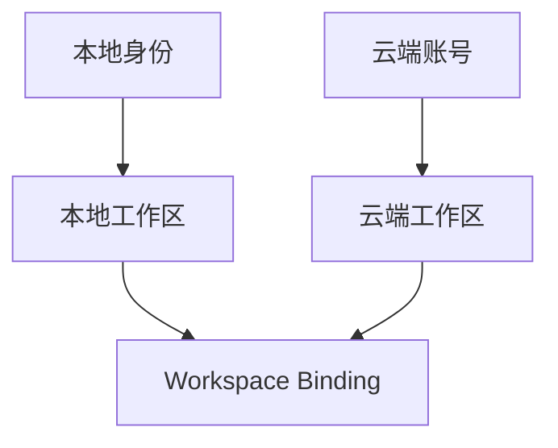
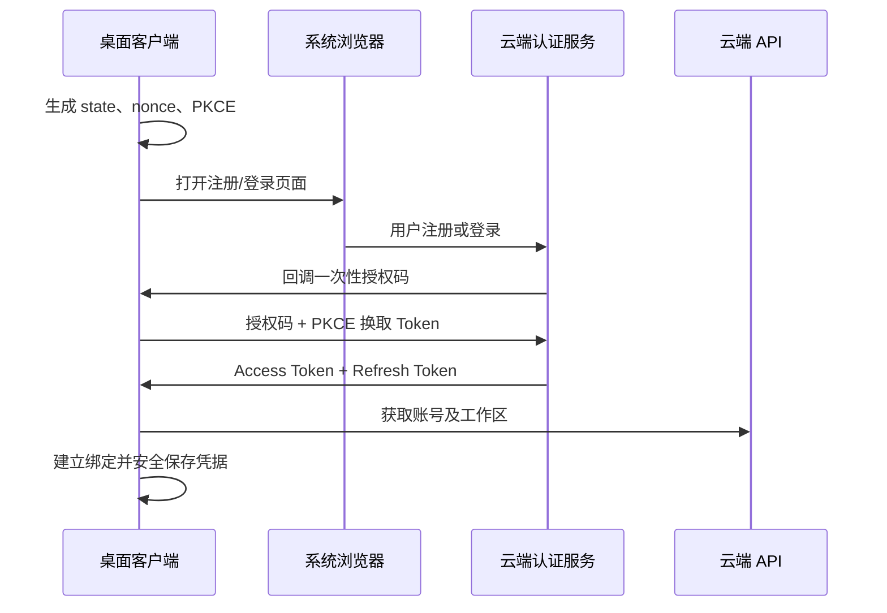
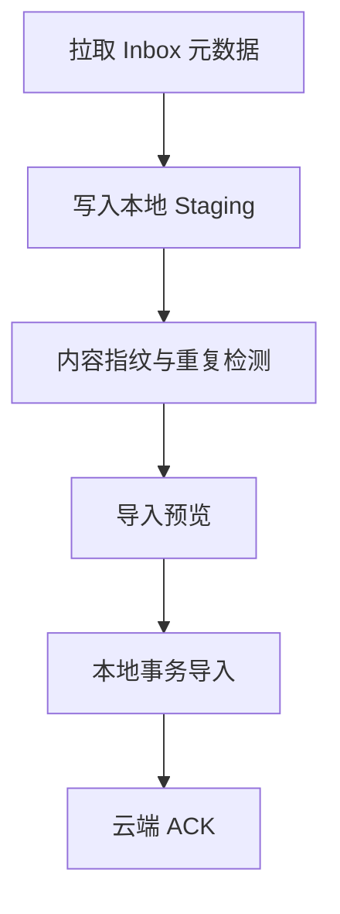
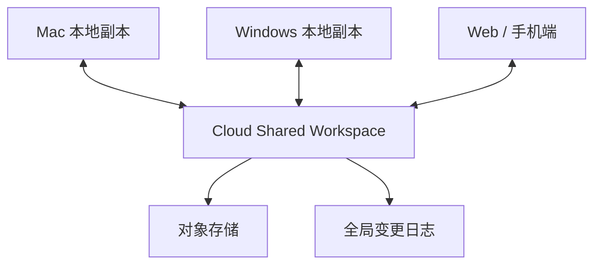
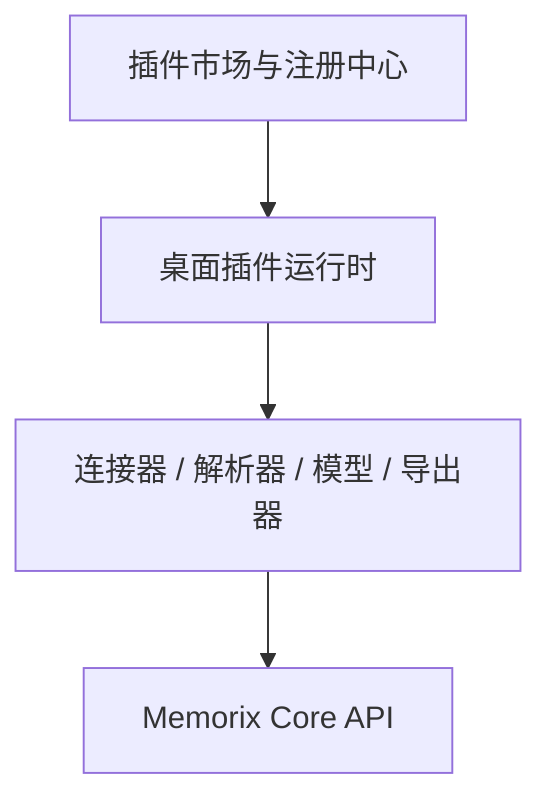

# Memorix 本地—云端身份、数据同步与插件体系设计

> 项目定位：本地优先、云端可选、支持混合模式与多端共享的 AI 知识资产引擎  
> 文档性质：在《双模式知识引擎完整开发文档》基础上的专项补充设计  
> 版本：V1.0  
> 日期：2026-07-13

---

## 1. 文档目标

本文集中解决以下问题：

1. 桌面客户端首次安装后，如何跳转云端完成注册或登录，并安全回调本地；
2. 用户最初完全离线使用，后期启用混合模式并拉取 Cloud Inbox 时，如何完成身份与工作区绑定，避免数据冲突；
3. 用户需要把本地数据同步到云端，实现 Mac、Windows、Web、手机等多端共享时，如何设计双向同步；
4. 哪些能力适合插件化，如何建设插件运行时、适配接口和插件市场；
5. 如何在本地优先、隐私保护、云端增强和生态扩展之间保持清晰边界。

核心原则：

> 本地能力不依赖云端账号；账号绑定不等于数据上传；Inbox 拉取不等于双向同步；共享工作区必须由用户主动升级；插件只能通过受控接口访问核心能力。

---

## 2. 模式定义与产品边界

系统应把“云端能力”拆成三个明确层级，不能只提供一个含义模糊的“开启同步”开关。

| 模式 | 数据方向 | 云端角色 | 适用场景 |
|---|---|---|---|
| Inbox 模式 | 云端 → 本地 | 手机采集队列 | 手机录入、本地主库 |
| 云端备份模式 | 本地 → 云端 | 备份与恢复 | 灾备、迁移设备 |
| 多端共享模式 | 本地 ↔ 云端 ↔ 多端 | 同步协调中心 | 多电脑、Web、手机、团队共享 |

对应两类工作区：

### 2.1 Local Workspace

- 本地是唯一主库；
- 无须注册云端账号；
- 可选连接 Cloud Inbox；
- 可选进行加密备份；
- 原始资料默认不上传；
- 本地模型、本地 RAG、本地 MCP 均可独立工作。

### 2.2 Shared Workspace

- 云端是共享状态和同步序列的协调中心；
- 各设备保存可离线工作的本地副本；
- 支持增量推送、增量拉取、版本历史和冲突处理；
- 可进一步支持 Web、手机编辑和团队成员权限。

Local Workspace 不能在后台被静默转为 Shared Workspace。升级必须由用户主动发起，并明确确认同步范围、原始文件策略和加密方式。

---

## 3. 身份、设备与工作区模型

### 3.1 三层身份分离

需要把以下对象相互独立：

| 对象 | 说明 | 是否依赖云端 |
|---|---|---|
| `local_profile` | 当前安装中的本地用户身份 | 否 |
| `cloud_user` | 云端注册账号 | 是 |
| `workspace_binding` | 本地工作区与云端工作区之间的关系 | 是 |

首次启动时，客户端在本地静默生成：

```text
installation_id
device_id
local_profile_id
local_workspace_id
device_key_pair
```

所有跨端业务对象必须使用 UUIDv7 或 ULID 等全局唯一标识。SQLite 可以保留自增主键提升本地性能，但必须增加唯一的 `global_id`，不得用自增 ID 参与跨设备同步。

```sql
id        INTEGER PRIMARY KEY,
global_id TEXT NOT NULL UNIQUE
```

### 3.2 关系模型



本地身份不需要迁移成云端用户。用户后期登录时，只新增账号绑定和工作区映射，不重写本地数据所有权。

### 3.3 触发登录的能力

本地模式不强制登录。以下能力需要云端身份：

- Cloud Inbox；
- 云端备份；
- 多设备同步；
- Web 或手机访问共享知识库；
- 团队工作区；
- 云端模型额度；
- 付费插件、跨设备插件配置和插件授权。

---

## 4. 桌面端云端注册与登录回调

### 4.1 推荐协议

桌面端采用 OAuth 2.1 Authorization Code + PKCE：

- 桌面端不接收用户密码；
- 安装包内不保存 OAuth Client Secret；
- 回调只返回一次性授权码；
- 客户端通过 PKCE 换取 Token；
- 使用 `state` 防止请求伪造，使用 `nonce` 防止重放和身份串用。



### 4.2 回调优先级

#### 主方案：Loopback 回调

桌面端临时监听随机端口：

```text
http://127.0.0.1:{random_port}/auth/callback
```

授权地址示例：

```text
https://account.memorix.com/oauth/authorize
  ?client_id=memorix-desktop
  &redirect_uri=http://127.0.0.1:{random_port}/auth/callback
  &response_type=code
  &code_challenge=...
  &code_challenge_method=S256
  &state=...
```

#### 备用方案：自定义 URL Scheme

```text
memorix://auth/callback?code=...&state=...
```

自定义协议存在被其他本地程序抢占的风险，因此仍必须使用 PKCE、`state` 和一次性授权码。

#### 兜底方案：设备码登录

浏览器无法回调时，客户端显示短验证码，用户在云端页面输入验证码，客户端轮询授权状态。该方式适合企业代理、严格防火墙或安全软件干扰的环境。

### 4.3 云端注册处理

桌面端不需要区分“登录”和“注册”，统一进入授权页：

```text
已有账号 → 登录
没有账号 → 注册 → 验证 → 登录
第三方账号 → OAuth 登录
```

回调 URL 不得直接携带 JWT、Refresh Token、密码或完整用户信息。

### 4.4 本地凭据保存

SQLite 只保存非敏感绑定信息：

```text
cloud_account_binding
---------------------
id
local_profile_id
cloud_user_id
cloud_api_base_url
account_display_name
account_email_masked
token_key_ref
binding_status
last_authenticated_at
created_at
updated_at
```

Refresh Token 应保存到操作系统安全存储：

| 平台 | 推荐存储 |
|---|---|
| macOS | Keychain |
| Windows | Credential Manager / DPAPI |
| Linux | Secret Service / libsecret |

Access Token 建议 15～30 分钟过期；Refresh Token 应轮换、可撤销，并与设备绑定。客户端不得保存用户密码、OAuth Client Secret或明文 Refresh Token。

---

## 5. 后期启用混合模式与 Inbox 适配

用户可能已经离线使用数月，之后才启用手机采集。这个过程不是“把本地账号改成云端账号”，而是为现有本地工作区建立一条云端绑定。

### 5.1 绑定流程

```text
用户点击“连接手机 Inbox”
→ 展示数据流向和隐私说明
→ 浏览器注册或登录
→ 选择或创建云端 Workspace
→ 显示绑定预览
→ 选择同步范围
→ 扫描云端 Inbox
→ 去重并导入本地
→ 本地完成后向云端 ACK
```

云端工作区可能出现三种情况：

1. 没有云端工作区：创建仅承担 Inbox 的新工作区；
2. 有一个工作区：显示名称、Inbox 数量后由用户确认；
3. 有多个工作区：必须让用户明确选择，不能按名称自动绑定。

默认策略：

```text
sync_mode = inbox_only
upload_original_files = false
```

### 5.2 Workspace Binding

```ts
interface WorkspaceBinding {
  id: string;
  localWorkspaceId: string;
  cloudUserId: string;
  cloudWorkspaceId: string;
  syncMode: "none" | "inbox_only" | "backup" | "metadata" | "bidirectional";
  uploadOriginalFiles: boolean;
  conflictPolicy: "manual" | "local_wins" | "cloud_wins";
  primaryDeviceId?: string;
  lastInboxCursor?: string;
  lastSyncAt?: string;
}
```

### 5.3 Inbox 首次拉取

采用“发现—暂存—去重—预览—导入—确认”的流程：



首次只拉取元数据清单，不立即下载附件或改变云端状态。

```http
GET /v1/workspaces/{workspaceId}/inbox/items?status=pending&cursor=...
```

本地暂存状态：

```text
discovered → downloading → downloaded → ready → importing → imported
                             ├─ duplicate
                             ├─ ignored
                             └─ failed
```

### 5.4 去重策略

| 判断方式 | 作用 |
|---|---|
| `cloud_inbox_item_id` | 防止同一条目重复拉取 |
| 文件 SHA-256 | 判断完全相同文件 |
| 规范化 URL 哈希 | 判断相同网页 |
| 正文内容哈希 | 判断来源不同但内容相同 |
| 标题和正文相似度 | 只提示疑似重复，不自动合并 |

处理结果：

- 全新内容：直接导入；
- 完全重复：映射到已有文档；
- 疑似重复：交给用户选择；
- 同源新内容：创建新版本。

### 5.5 ACK 与幂等

本地事务成功后再确认：

```http
POST /v1/inbox/items/{itemId}/ack
```

```json
{
  "bindingId": "binding_01",
  "deviceId": "device_01",
  "localDocumentId": "doc_01",
  "contentHash": "sha256:...",
  "result": "imported",
  "idempotencyKey": "..."
}
```

云端状态建议：

```text
pending → claimed → imported
```

导入后不要立刻物理删除，建议保留 30 天，用于重新拉取、故障恢复和审计。

### 5.6 多设备消费 Inbox

MVP 推荐“单主设备模式”：一个云端工作区指定一台主要接收设备，符合本地主库定位。

后续多设备交付时，为每台设备记录独立状态：

```text
inbox_delivery
--------------
inbox_item_id
binding_id
device_id
delivery_status
claimed_at
acknowledged_at
local_document_global_id
```

### 5.7 解除绑定

解除云端连接时：

- 保留本地已导入资料；
- 停止同步并删除本机 Token；
- 保留必要的本地同步审计记录；
- 不自动删除云端账号或云端 Inbox；
- 支持按 `binding_id + import_batch_id` 撤销错误导入，但不得删除后来已经编辑过的文档。

---

## 6. 本地数据上云与多设备共享

当用户需要在 Mac、Windows、Web、手机或团队之间共享完整数据时，应把 Local Workspace 主动升级为 Shared Workspace。

### 6.1 总体架构

采用“云端协调中心 + 本地离线副本”：



云端负责维护：

- 全局变更序列；
- 工作区成员和权限；
- 共享版本历史；
- 设备授权与撤销；
- 文件对象和同步状态。

设备离线时可以继续操作，恢复联网后上传本地变更并拉取其他设备的变更。

### 6.2 禁止同步数据库文件

不得上传、覆盖或合并整个 SQLite 文件。这会导致并发覆盖、Schema 不一致、本地路径失效、向量索引不兼容和大规模重复传输。

应同步领域对象及变更事件：

```text
workspace
topic
document
document_revision
tag
document_tag
entity
report
attachment
processing_result
```

每次修改生成一条可幂等提交的操作：

```json
{
  "operationId": "op_01",
  "workspaceId": "ws_01",
  "deviceId": "device_mac_01",
  "entityType": "document",
  "entityId": "doc_01",
  "operation": "update",
  "baseVersion": 7,
  "clientSequence": 128,
  "changedFields": { "title": "新的标题" },
  "createdAt": "2026-07-13T19:20:00Z"
}
```

### 6.3 工作区升级流程

```text
用户选择“启用多端共享”
→ 注册或登录云端账号
→ 创建或选择 Shared Workspace
→ 选择同步范围与加密策略
→ 扫描本地数据、容量和异常文件
→ 展示上传清单
→ 创建初始快照
→ 分批上传元数据与文件
→ 云端校验完整性
→ 建立增量同步游标
→ 允许其他设备加入
```

初次同步应展示：文档数量、文件容量、摘要与标签数量、异常文件以及是否上传原始资料。向量索引默认不上传。

初始快照期间产生的新操作必须写入本地 Outbox，待快照完成后继续上传，防止同步窗口内遗漏修改。

### 6.4 同步引擎组件

每台设备包含：

1. Local Change Tracker；
2. Sync Outbox；
3. Remote Change Puller；
4. Conflict Resolver；
5. File Transfer Manager；
6. Sync Health Monitor。

业务数据和 Outbox 必须在同一个本地事务中提交：

```sql
BEGIN;
UPDATE document SET title = ?, version = version + 1 WHERE global_id = ?;
INSERT INTO sync_outbox (...);
COMMIT;
```

### 6.5 推送与拉取接口

推送本地操作：

```http
POST /v1/sync/push
```

服务端根据 `workspace_id + operation_id` 实现幂等，同一操作重复提交不得重复执行。

拉取其他设备变更：

```http
GET /v1/sync/pull?workspaceId=...&after={serverCursor}&limit=500
```

每台设备独立保存 `last_server_cursor`。只有在本地事务完全成功后才能推进游标；若处理中断，旧批次可以安全重放。

同步状态：

```text
pending
uploading
applied
conflict
retryable_failed
permanent_failed
blocked
```

### 6.6 不同数据的同步策略

| 数据类型 | 策略 |
|---|---|
| 标题、描述、状态 | 字段级版本检测 |
| 标签 | 集合操作合并 |
| 正文 | 版本化或三方合并 |
| 短笔记实时协作 | 后期采用 CRDT |
| 原始文件 | 内容寻址、分块上传、断点续传 |
| 摘要与实体 | 可同步，但标记生成模型和版本 |
| Embedding | 默认不跨端同步，各端重建 |
| 本地文件路径 | 永不上传 |
| 模型 API Key | 永不随工作区同步 |
| UI 偏好 | 区分设备级和账号级 |
| 删除 | 同步墓碑，不立即物理删除 |
| 成员权限 | 以云端为准 |

### 6.7 文件同步

文件按 SHA-256 内容哈希寻址，相同文件只上传一次。大文件支持：

- 分片上传；
- 断点续传；
- 秒传；
- 完整性校验；
- 上传并发和带宽限制；
- 按需下载与离线保留。

新设备默认先同步元数据与正文，原始附件可在打开时下载；用户可把指定专题设置为“始终保留离线副本”。

### 6.8 向量索引

默认不同步向量，因为不同设备可能使用不同 Embedding 模型、维度或版本。应同步分块正文、`chunk_text_hash` 和生成配置，由目标端重建。

如果要求跨端检索完全一致，则必须锁定统一 Embedding 模型并启用云端向量索引。

---

## 7. 冲突处理

冲突的典型情况是两个离线设备基于同一个基础版本修改同一对象。

### 7.1 自动合并

- 不同字段分别修改：字段级合并；
- 标签新增：集合合并；
- 独立新建对象：直接合并；
- 完全重复操作：按幂等键忽略。

### 7.2 人工处理

以下情况进入冲突中心：

- 同一正文被多端修改；
- 同一字段出现不同值；
- 一端删除、一端继续编辑；
- 文件被不同版本替换；
- 权限变化与离线修改发生竞争。

用户可选择：

- 保留本机版本；
- 保留云端版本；
- 手工合并；
- 两个版本均保留；
- 恢复被删除对象为新版本。

### 7.3 删除墓碑

删除不能立即物理执行：

```ts
interface DeletionTombstone {
  entityId: string;
  deleted: true;
  deletedAt: string;
  deletedBy: string;
  version: number;
}
```

墓碑建议保留 30～90 天，超期后在所有活跃设备均确认同步的前提下再进行垃圾回收。

---

## 8. 多用户权限与设备管理

团队共享建议采用：

| 角色 | 权限 |
|---|---|
| Owner | 所有权限、删除工作区、转移所有权 |
| Admin | 成员、插件、内容和配置管理 |
| Editor | 新增、编辑、导入和导出 |
| Contributor | 新增内容、有限编辑 |
| Viewer | 只读和受控检索 |

服务端每次操作都必须校验：用户身份、Workspace 成员关系、角色权限、对象范围和设备状态。

设备管理能力包括：

- 查看已授权设备；
- 撤销设备 Token；
- 停止指定设备同步；
- 设置 Inbox 主设备；
- 查看最后同步时间和风险状态；
- 必要时轮换 Workspace 加密密钥。

---

## 9. 云端隐私与加密模型

### 9.1 服务端可解密

支持云端全文检索、云端 RAG、Web 阅读和团队协作，开发复杂度较低，但用户必须信任云端。

### 9.2 端到端加密

资料在本地加密后上传，服务端只保存密文。隐私更强，但服务端不能直接进行全文检索、RAG 或摘要；密钥恢复和团队密钥分发更复杂。

### 9.3 推荐：分层策略

| 策略 | 云端能力 |
|---|---|
| 端到端加密备份 | 仅备份和恢复 |
| 加密文件、可检索元数据 | 目录、标签与有限检索 |
| 云端可处理 | Web、RAG、摘要和团队协作 |

每个 Workspace 独立选择，并在界面持续显示数据存放位置、模型运行位置、上传范围和加密状态。

---

## 10. 核心同步数据表

### 10.1 Workspace Binding

```sql
CREATE TABLE workspace_binding (
    id                    TEXT PRIMARY KEY,
    local_workspace_id    TEXT NOT NULL,
    cloud_user_id         TEXT NOT NULL,
    cloud_workspace_id    TEXT NOT NULL,
    sync_mode             TEXT NOT NULL,
    binding_status        TEXT NOT NULL,
    primary_device_id     TEXT,
    last_inbox_cursor     TEXT,
    last_sync_cursor      TEXT,
    last_sync_at          TEXT,
    created_at            TEXT NOT NULL,
    updated_at            TEXT NOT NULL,
    UNIQUE(local_workspace_id, cloud_workspace_id)
);
```

### 10.2 Inbox Staging

```sql
CREATE TABLE sync_inbox_staging (
    id                       TEXT PRIMARY KEY,
    binding_id               TEXT NOT NULL,
    cloud_inbox_item_id      TEXT NOT NULL,
    cloud_revision           INTEGER,
    content_hash             TEXT,
    remote_metadata_json     TEXT,
    status                   TEXT NOT NULL,
    duplicate_document_id    TEXT,
    import_batch_id          TEXT,
    error_message            TEXT,
    discovered_at            TEXT NOT NULL,
    imported_at              TEXT,
    UNIQUE(binding_id, cloud_inbox_item_id)
);
```

### 10.3 本地 Outbox

```sql
CREATE TABLE sync_outbox (
    operation_id       TEXT PRIMARY KEY,
    binding_id         TEXT NOT NULL,
    entity_type        TEXT NOT NULL,
    entity_id          TEXT NOT NULL,
    operation_type     TEXT NOT NULL,
    base_version       INTEGER,
    patch_json         TEXT,
    payload_hash       TEXT,
    status             TEXT NOT NULL,
    retry_count        INTEGER NOT NULL DEFAULT 0,
    error_message      TEXT,
    created_at         TEXT NOT NULL,
    updated_at         TEXT NOT NULL
);
```

### 10.4 实体同步状态

```sql
CREATE TABLE entity_sync_state (
    binding_id          TEXT NOT NULL,
    entity_type         TEXT NOT NULL,
    entity_id           TEXT NOT NULL,
    local_version       INTEGER NOT NULL,
    server_version      INTEGER,
    content_hash        TEXT,
    sync_status         TEXT NOT NULL,
    last_operation_id   TEXT,
    last_synced_at      TEXT,
    PRIMARY KEY (binding_id, entity_type, entity_id)
);
```

### 10.5 云端变更日志

```sql
CREATE TABLE workspace_change_log (
    server_sequence     BIGSERIAL PRIMARY KEY,
    workspace_id        UUID NOT NULL,
    operation_id        UUID NOT NULL,
    source_device_id    UUID NOT NULL,
    entity_type         VARCHAR(50) NOT NULL,
    entity_id           UUID NOT NULL,
    operation_type      VARCHAR(20) NOT NULL,
    base_version        BIGINT,
    server_version      BIGINT NOT NULL,
    patch_json          JSONB,
    created_at          TIMESTAMPTZ NOT NULL,
    UNIQUE(workspace_id, operation_id)
);
```

---

## 11. 插件化范围

适合插件化的能力具有以下特征：第三方扩展需求明显、可以独立升级、属于可选能力，并能通过稳定接口与核心系统隔离。

### 11.1 适合插件化

| 类别 | 示例 | 建议优先级 |
|---|---|---:|
| 信息源连接器 | 网页、RSS、Notion、飞书、邮件、GitHub | P0 |
| 文档解析器 | PDF、Office、EPUB、OCR、音视频转录 | P0 |
| 模型供应商 | Ollama、LM Studio、OpenAI、DeepSeek、自定义 API | P0 |
| 导出器 | Markdown、DOCX、PDF、Obsidian、Notion | P1 |
| AI 处理器 | 摘要、翻译、实体、标签、评分、事实检查 | P1 |
| 检索与重排 | BM25、向量库、Reranker、GraphRAG | P1 |
| Agent 工具 | MCP Tool、自动报告、定时分析 | P1 |
| UI 扩展 | 时间线、知识图谱、Dashboard 组件 | P2 |
| 同步适配器 | S3、WebDAV、NAS、私有云 | P2 |

### 11.2 不适合插件化

以下能力必须留在核心程序中：

- 用户、设备和 Workspace 身份；
- 权限校验和成员关系；
- 本地数据库事务；
- 核心领域模型；
- 同步状态机、冲突处理和变更日志；
- Token、密钥和加密策略；
- 插件安装、签名和权限控制；
- 审计日志、隐私策略和安全删除。

插件不得直接任意操作 SQLite、Vault 或同步状态表。

---

## 12. 插件运行时与包规范

### 12.1 架构



插件只能通过版本化 Core API 请求能力。高风险插件优先运行在独立 Sidecar 进程或 WASM 沙箱中。

### 12.2 插件类型

```ts
type PluginType =
  | "source_connector"
  | "parser"
  | "ai_processor"
  | "model_provider"
  | "vector_store"
  | "search_provider"
  | "exporter"
  | "sync_provider"
  | "mcp_tool"
  | "ui_extension";
```

### 12.3 插件包

```text
memorix-plugin-example/
├── memorix-plugin.json
├── README.md
├── LICENSE
├── dist/index.js
├── assets/icon.png
└── schemas/config.schema.json
```

Manifest 示例：

```json
{
  "id": "com.memorix.web-clipper",
  "name": "Web Clipper",
  "version": "1.2.0",
  "publisher": "Memorix",
  "type": ["source_connector", "parser"],
  "engine": {
    "memorix": ">=0.2.0 <1.0.0",
    "pluginApi": "1"
  },
  "entry": "dist/index.js",
  "runtime": "sandbox-js",
  "permissions": [
    "network:https://*",
    "knowledge:document.create",
    "knowledge:attachment.write"
  ],
  "configSchema": "schemas/config.schema.json"
}
```

---

## 13. 插件适配接口

### 13.1 生命周期

```ts
interface MemorixPlugin {
  activate(context: PluginContext): Promise<void>;
  deactivate(): Promise<void>;
  healthCheck?(): Promise<PluginHealth>;
  migrate?(fromVersion: string, toVersion: string): Promise<void>;
}
```

### 13.2 信息源连接器

```ts
interface SourceConnector {
  test(config: unknown): Promise<TestResult>;
  collect(request: CollectRequest): Promise<SourceItem[]>;
  subscribe?(config: unknown, cursor?: string): AsyncIterable<SourceEvent>;
}
```

### 13.3 文档解析器

```ts
interface DocumentParser {
  supports(input: { mimeType: string; extension?: string }): boolean;
  parse(input: PluginFileHandle, options: ParseOptions): Promise<ParsedDocument>;
}
```

插件只能获得受控 `PluginFileHandle`，不能获得任意本地路径。

### 13.4 AI 处理器

```ts
interface KnowledgeProcessor {
  process(
    document: ReadonlyDocument,
    context: ProcessingContext
  ): Promise<ProcessingPatch>;
}
```

插件输出 Patch，核心程序验证后写库，插件不得直接修改核心表。

### 13.5 模型适配器

```ts
interface ModelProviderPlugin {
  listModels(): Promise<ModelInfo[]>;
  chat(request: ChatRequest): AsyncIterable<ChatEvent>;
  embed(request: EmbeddingRequest): Promise<EmbeddingResponse>;
  rerank?(request: RerankRequest): Promise<RerankResponse>;
}
```

---

## 14. 插件权限与安全

建议采用细粒度权限：

```text
knowledge:document.read
knowledge:document.create
knowledge:document.update
knowledge:search
attachment:read
attachment:write
model:invoke
network:api.notion.com
ui:panel
mcp:tool.register
```

安装时必须明确展示插件能做什么、不能做什么。安全要求包括：

- 包哈希校验；
- 发布者签名；
- 网络域名白名单；
- Workspace 级授权；
- API Key 由核心密钥库保管；
- CPU、内存、执行时间和并发限制；
- 数据读取、导出和网络发送进入审计日志；
- 插件卸载不得删除用户知识数据；
- Tauri 前端扩展不能获得完整 Rust Command 权限；
- 市场支持紧急撤回、禁用和安全版本更新。

---

## 15. 插件市场设计

### 15.1 组成

插件市场由以下部分组成：

1. 插件注册中心；
2. 插件包对象存储；
3. 开发者中心；
4. 自动扫描与审核系统；
5. 签名服务；
6. 安装、更新、回滚与撤回服务；
7. 授权、付费与评价系统。

### 15.2 核心数据表

```text
plugin
plugin_version
plugin_package
plugin_publisher
plugin_category
plugin_permission
plugin_review
plugin_installation
plugin_entitlement
plugin_rating
plugin_security_event
```

`plugin_version` 至少保存：插件 API 版本、客户端兼容范围、Manifest、包地址、SHA-256、发布者签名、审核状态、发布通道和发布时间。

### 15.3 发布流程

```text
开发者注册
→ 发布者认证
→ 上传插件包
→ Manifest 校验
→ 依赖和恶意代码扫描
→ 权限风险分析
→ 沙箱测试
→ 人工审核
→ 平台签名
→ 灰度发布
→ 正式上架
```

客户端安装前再次验证签名、哈希、Plugin API 版本、客户端版本范围、权限和撤回状态。

### 15.4 开放顺序

首期仅开放：信息采集、文档解析、AI 模型和导出工具。权限与沙箱稳定后再开放 AI 流水线、MCP/Agent、UI 扩展、同步存储和自动化插件。

---

## 16. 实施路线

### 阶段 A：身份与内部适配器

- 本地匿名身份与全局 ID；
- OAuth 2.1 + PKCE；
- Loopback、自定义协议和设备码回调；
- 系统凭据安全存储；
- Plugin SDK 作为内部模块接口；
- Ollama、LM Studio、解析器、导出器先以官方内置插件验证。

### 阶段 B：Inbox 单向同步

- Workspace 显式绑定；
- 云端 Inbox 元数据拉取；
- Staging、去重、幂等导入和 ACK；
- 单主设备消费；
- 解除绑定和批次撤销。

### 阶段 C：云端备份

- 初始快照；
- 本地到云端增量备份；
- 文件分块和断点续传；
- 加密备份与恢复；
- 备份完整性验证。

### 阶段 D：个人多设备同步

- Outbox 和云端变更日志；
- Push/Pull 与独立游标；
- 双向元数据同步；
- 文档版本和冲突中心；
- 删除墓碑；
- 按需下载附件；
- 多设备授权与撤销。

### 阶段 E：Web、手机与团队共享

- Web 和手机编辑；
- 字段级冲突检测；
- 必要场景引入 CRDT；
- 成员、角色与邀请；
- 团队审计和密钥分发；
- 配额与计费。

### 阶段 F：插件市场

- 本地插件管理器；
- Manifest、权限和日志；
- 官方签名市场；
- 更新、回滚和撤回；
- 第三方开发者中心；
- 自动审核、灰度发布与付费授权。

---

## 17. 关键验收标准

### 17.1 身份与绑定

- 未登录可完整使用本地核心功能；
- 登录不触发本地资料上传；
- 错误账号或工作区不会被自动绑定；
- Token 不以明文写入 SQLite；
- 设备可以被云端撤销。

### 17.2 Inbox

- 重复拉取不会重复导入；
- 本地事务失败时不会 ACK；
- 相同文件和网页可以识别；
- 解除绑定不影响本地已导入资料；
- 用户能清楚看到云端到本地的数据流向。

### 17.3 多设备同步

- 离线编辑后可安全重试；
- 同一操作重复提交不会重复执行；
- 游标推进不会造成数据遗漏；
- 冲突不会静默覆盖用户内容；
- 删除可恢复并在各端一致；
- 大文件支持中断恢复和按需下载；
- 新设备可以重建本地索引。

### 17.4 插件

- 插件无法直接访问核心数据库；
- 未授权插件无法读取文档或访问网络；
- 插件升级失败可以回滚；
- 下架插件可被安全禁用；
- 卸载插件不删除用户知识资产。

---

## 18. 最终架构结论

Memorix 应同时支持：

1. **纯本地工作区**：不登录、不上传、完整可用；
2. **本地 + Inbox**：云端负责手机采集，本地主库单向消费；
3. **云端备份**：本地数据加密上传，用于恢复；
4. **多端共享工作区**：云端协调变更，各端保留离线副本；
5. **插件生态**：外围能力可插拔，核心数据和安全边界不可插件化。

底层设计必须优先落实：

> 全局 ID、身份分离、Workspace 显式绑定、操作日志、同步游标、幂等提交、版本冲突、内容寻址、权限隔离和插件签名。

只要这些基础契约保持稳定，用户可以先完全离线使用，之后再按需启用 Inbox、备份、多端共享或团队协作，而不需要重建本地库，也不会因插件扩展破坏核心数据一致性。
