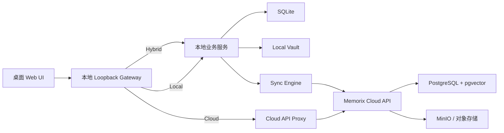
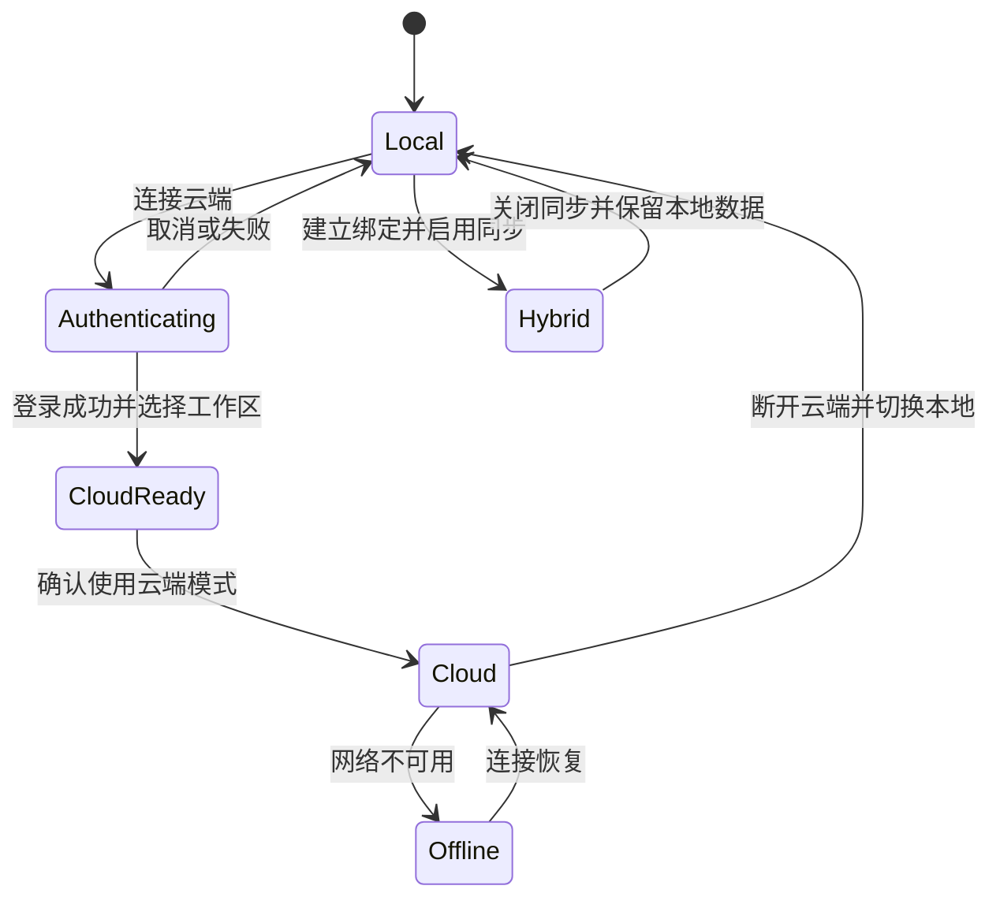
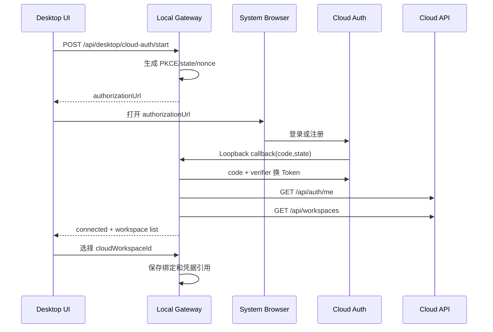
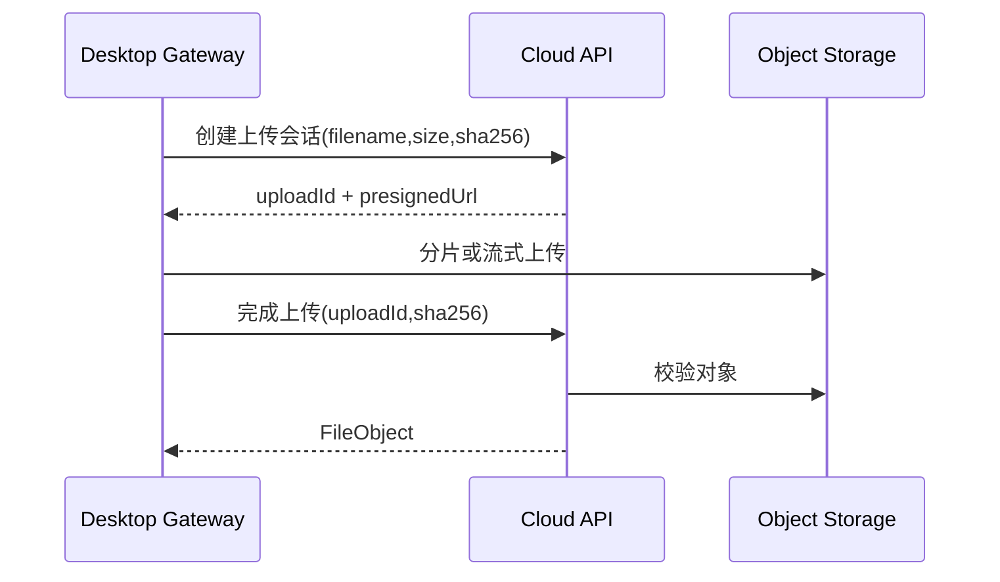

# Memorix 桌面端云端模式完整开发文档

> 版本：V1.0  
> 日期：2026-07-20  
> 状态：开发基线  
> 适用范围：macOS、Windows 桌面端，云端 Web/API，混合模式同步  
> 关联文档：《Memorix 本地—云端身份、数据同步与插件体系设计》《Memorix 云端页面与权限隔离改造开发文档》

---

## 1. 文档目的

本文用于把桌面端当前显示为“即将支持”的云端模式建设为可发布、可验证、可回滚的正式能力，统一产品定义、目标架构、接口、数据模型、安全边界、阶段任务和验收标准。

本文重点解决：

1. 桌面端如何在本地、云端、混合三种模式之间建立清晰边界；
2. 云端模式如何真正访问远程 Memorix API，而不是只在本地保存 `mode=cloud`；
3. 云端账号登录、工作区选择、Token 保存和刷新如何安全实现；
4. 云端文件、任务、向量检索、问答、报告等能力如何完整闭环；
5. 断网、Token 失效、服务异常和模式切换时如何避免数据错写和“伪云端”；
6. 如何分阶段开放 Cloud Inbox、完整云端模式和双向同步。

核心原则：

> 本地模式必须可以完全离线运行；云端模式以云端为唯一事实源；混合模式以本地为主库并显式同步；任何远程失败都不能静默回退到另一套数据库。

---

## 2. 当前实现审计

### 2.1 当前具备的能力

| 能力 | 当前状态 | 说明 |
|---|---|---|
| 云端 Web/API | 基本具备 | 支持 PostgreSQL、MinIO、pgvector、JWT、用户和工作区数据模型 |
| 工作区模式字段 | 已具备 | `Workspace.Mode` 支持 `local/cloud/hybrid` |
| 本地运行时 | 已具备 | 桌面端内置 .NET API、SQLite、Web Runtime 和本地身份 |
| 云账号绑定 | 已具备基础 | 有账号绑定、Refresh Token 安全存储、Token 刷新模型 |
| Cloud Inbox | 已具备主要链路 | 支持拉取、游标、ACK、定时任务、重试和日志 |
| Workspace Binding | 已具备基础 | 能保存本地工作区与云端工作区的绑定关系 |
| 云端文件实现 | 服务端具备 | 云端部署可使用 MinIO |
| 云端向量实现 | 服务端具备 | PostgreSQL 部署可使用 pgvector |
| 云端权限隔离 | 已建设基础 | 有平台角色、Workspace Owner 和授权服务 |

### 2.2 当前关键缺口

#### 2.2.1 桌面端请求固定进入本地 API

桌面壳启动时固定配置：

```text
DatabaseProvider=sqlite
Authentication:EnableLocalLoopback=true
AppDatabasePath=<desktop-app-data>/memorix.db
```

前端检测到桌面端动态端口后，也固定把 API 地址设置为相邻的本地端口。因此桌面端即使选择云端模式，UI 请求仍先进入本地 SQLite 后端。

#### 2.2.2 云端工作区创建没有建立远程连接

当前初始化页面创建云端工作区时只提交：

```json
{
  "name": "我的云端工作区",
  "mode": "cloud",
  "modelProvider": "..."
}
```

没有完成：

- 云端登录；
- 云端 API 地址验证；
- 云端用户绑定；
- 云端工作区创建或选择；
- `cloudWorkspaceId` 写入；
- Access Token/Refresh Token 建立；
- 远程健康检查。

#### 2.2.3 CloudKnowledgeRepository 不是真正的远程仓库

当前 `CloudKnowledgeRepository` 仍直接操作注入的 `IAppDbContext`。虽然保留 `_apiBaseUrl`、`_authToken` 和 `Configure()`，但这些配置没有参与业务请求，`Configure()` 也没有调用方。

这意味着桌面端云端模式下的资料、文档、标签、实体等数据仍可能写入本地应用数据库。

#### 2.2.4 云端任务队列是占位实现

`CloudJobQueue` 的入队、取任务、运行、完成、失败和计数接口均抛出 `NotSupportedException`。资料导入、文档处理、Embedding、报告和导出等后台任务无法依靠当前云队列闭环。

#### 2.2.5 桌面端云存储没有配置闭环

运行时在云端模式下选择 MinIO，但桌面端初始化流程没有配置 MinIO 地址、Bucket 和凭据。更合理的边界应是：桌面端不直接访问 MinIO，由云端 API 负责授权上传、对象存储和下载。

#### 2.2.6 模式可用状态不一致

当前后端 `/api/workspaces/modes` 返回：

```text
local.available = true
cloud.available = true
hybrid.available = false
```

前端却始终为云端模式显示“即将支持”。在正式闭环前，后端应返回云端不可用，或返回更细的能力状态，避免用户进入半完成模式。

### 2.3 当前支持度结论

| 产品形态 | 代码完整度估算 | 发布判断 |
|---|---:|---|
| 云端 Web | 75%～85% | 可继续按云服务部署验收 |
| 桌面端完整云端模式 | 30%～40% | 不应正式开放 |
| 桌面端 Cloud Inbox | 60%～70% | 可作为 Beta 单独开放 |
| 云端备份 | 20%～30% | 尚未形成产品闭环 |
| 多端双向同步 | 20%～30% | 尚未达到发布条件 |

以上比例是基于代码链路完整度的工程估算，不代表生产压测或安全审计结果。

---

## 3. 产品模式定义

### 3.1 本地模式 Local

- 桌面内置 API 执行业务逻辑；
- SQLite 保存结构化数据；
- Vault 保存文件；
- 本地模型或用户配置的模型执行 AI；
- 不需要云端账号；
- 可选连接 Cloud Inbox，但不会自动上传本地主库。

### 3.2 云端模式 Cloud

- 云端是唯一事实源；
- 业务 CRUD、文件、任务、向量、问答、报告均由远程 API 执行；
- 桌面端只保留连接配置、凭据引用和有限缓存；
- 网络不可用时进入只读离线页或显式缓存模式；
- 不得把新写入静默保存到本地数据库后伪装成功。

### 3.3 混合模式 Hybrid

- 本地数据库和 Vault 是主库；
- 云端承担 Inbox、备份或共享同步；
- 每类数据必须声明同步范围和方向；
- 冲突处理、同步游标、删除墓碑和失败恢复必须可观察；
- 用户明确开启前不得上传原始文件。

### 3.4 云端能力分层

界面不再用一个模糊开关表示全部云能力，而是拆为：

| 层级 | 名称 | 数据方向 | 建议开放顺序 |
|---|---|---|---|
| L0 | 云账号连接 | 无业务数据 | 第一阶段 |
| L1 | Cloud Inbox | 云 → 本地 | 第一阶段 Beta |
| L2 | 完整云端模式 | 桌面 ↔ 云 API | 第二阶段 |
| L3 | 云端备份 | 本地 → 云 | 第三阶段 |
| L4 | 多端共享 | 多端 ↔ 云 ↔ 多端 | 第四阶段 |

---

## 4. 目标架构

### 4.1 总体方案

桌面端继续把前端请求发送给内置 Loopback API，但内置 API 的角色根据模式变化：



采用本地 Gateway 而不是让 WebView 直接持有云 Token，原因包括：

- Refresh Token 可以留在操作系统凭据库；
- WebView 不需要读取长期凭据；
- 可以集中处理 Token 刷新、重试、证书、日志和错误映射；
- 前端 API 地址保持稳定；
- Local、Cloud、Hybrid 的切换可以由统一运行时状态控制。

### 4.2 请求路由原则

| 模式 | `/api/desktop/*` | 普通 `/api/*` | 同步接口 |
|---|---|---|---|
| Local | 本地处理 | 本地处理 | 可选 Cloud Inbox |
| Cloud | 本地处理 | 代理到云端 | 不启用本地主库同步 |
| Hybrid | 本地处理 | 本地处理 | Sync Engine 调用远端 |

本地控制接口包括：登录发起、回调状态、模式选择、凭据状态、日志路径、运行时健康检查和升级信息。

### 4.3 禁止的实现方式

- 不能只设置 `Workspace.Mode=cloud` 后继续操作本地 `AppDbContext`；
- 不能在远程请求失败后自动写入本地数据库；
- 不能让桌面端直接保存 MinIO 永久密钥；
- 不能把 Refresh Token 存入 SQLite、localStorage 或前端状态持久化；
- 不能依靠隐藏菜单代替服务端授权；
- 不能用工作区名称自动匹配云端工作区。

---

## 5. 运行时状态模型

### 5.1 桌面运行模式

```ts
type DesktopRuntimeMode = "local" | "cloud" | "hybrid";

type CloudConnectionState =
  | "not_configured"
  | "authenticating"
  | "connected"
  | "refreshing"
  | "offline"
  | "expired"
  | "revoked"
  | "error";
```

### 5.2 模式切换状态机



### 5.3 防止 Split Brain

每个请求必须带有本地生成的运行时世代号：

```text
runtime_generation
```

模式切换时递增世代号，并取消旧模式中的未完成请求。远程请求返回后如果世代号已变化，结果不得写入当前状态。

云端模式必须把远程 `workspaceId` 作为显式请求上下文，不依赖服务器全局“当前工作区”。

---

## 6. 身份认证与账号绑定

### 6.1 登录协议

使用 OAuth 2.1 Authorization Code + PKCE：

1. 桌面端生成 `state`、`nonce`、`code_verifier`；
2. 通过系统浏览器打开云端授权页；
3. 首选随机 Loopback 回调；
4. 使用一次性授权码和 PKCE 换取 Token；
5. 获取云端账号与可访问工作区；
6. 用户选择工作区；
7. Refresh Token 写入 Keychain、Credential Manager 或 Secret Service；
8. SQLite 只保存账号掩码和凭据引用。

### 6.2 Token 规则

| 项目 | 规则 |
|---|---|
| Access Token | 15～30 分钟有效，尽量仅保存在后端内存 |
| Refresh Token | 轮换、设备绑定、可撤销，只保存在系统凭据库 |
| PKCE verifier | 登录完成或超时后立即删除 |
| state/nonce | 单次使用，5～10 分钟过期 |
| Client Secret | 桌面端禁止保存 |

### 6.3 登录流程



### 6.4 断开账号

断开操作必须：

1. 调用云端撤销 Token；
2. 删除操作系统凭据；
3. 清理内存中的 Access Token；
4. 保留非敏感审计信息；
5. 如果当前是 Cloud 模式，要求用户先切换到 Local，或进入未连接状态页；
6. 不删除云端数据，也不自动删除本地缓存。

---

## 7. API 设计

### 7.1 桌面控制接口

#### 获取模式能力

```http
GET /api/desktop/capabilities
```

```json
{
  "local": { "available": true, "status": "ready" },
  "cloud": {
    "available": true,
    "status": "ready",
    "requiresAuthentication": true,
    "minimumCloudApiVersion": "1.0"
  },
  "hybrid": {
    "available": false,
    "status": "preview",
    "reason": "bidirectional_sync_not_ready"
  }
}
```

#### 发起云端登录

```http
POST /api/desktop/cloud-auth/start
```

请求：

```json
{
  "cloudApiBaseUrl": "https://api.memorix.example",
  "returnMode": "cloud"
}
```

响应：

```json
{
  "authorizationUrl": "https://...",
  "attemptId": "uuid",
  "expiresAt": "2026-07-20T13:00:00Z"
}
```

#### 查询登录状态

```http
GET /api/desktop/cloud-auth/attempts/{attemptId}
```

#### 获取云端连接

```http
GET /api/desktop/cloud-connection
DELETE /api/desktop/cloud-connection
```

#### 获取和选择云端工作区

```http
GET  /api/desktop/cloud-workspaces
POST /api/desktop/cloud-workspaces/select
```

```json
{
  "cloudWorkspaceId": "uuid",
  "mode": "cloud"
}
```

#### 获取路由诊断

```http
GET /api/desktop/runtime-route
```

普通用户只返回脱敏结果：

```json
{
  "mode": "cloud",
  "target": "remote",
  "cloudApiHost": "api.memorix.example",
  "workspaceId": "uuid",
  "connection": "connected",
  "lastSuccessfulRequestAt": "2026-07-20T12:40:00Z"
}
```

### 7.2 云端服务接口要求

云端至少提供：

```text
/api/auth/*
/api/workspaces/*
/api/topics/*
/api/sources/*
/api/documents/*
/api/search/*
/api/qa/*
/api/reports/*
/api/exports/*
/api/entities/*
/api/tags/*
/api/files/*
/api/jobs/*
/api/runtime/workspace-health
```

所有工作区资源接口必须：

- 从显式路由、Header 或 Token Claim 获取 Workspace 上下文；
- 验证当前用户的 Workspace 成员身份；
- 禁止依赖服务器进程级“当前 Workspace”；
- 返回统一错误结构和 `traceId`；
- 对创建类请求支持 `Idempotency-Key`。

### 7.3 代理规则

Cloud 模式下，本地 Gateway 对普通业务接口执行：

1. 校验当前云连接；
2. 获取或刷新 Access Token；
3. 注入 `Authorization`、`X-Workspace-Id`、`X-Device-Id`、`X-Trace-Id`；
4. 转发方法、Query、Body 和文件流；
5. 原样保留业务状态码；
6. 过滤 `Set-Cookie` 等不需要的 Header；
7. 将云端不可达转换为稳定的桌面错误码；
8. 禁止代理任意 Host，目标必须来自受信连接配置。

### 7.4 错误码

| 错误码 | HTTP | 含义 |
|---|---:|---|
| `CLOUD_NOT_CONFIGURED` | 409 | 尚未连接云账号 |
| `CLOUD_AUTH_REQUIRED` | 401 | 需要登录或重新授权 |
| `CLOUD_TOKEN_REVOKED` | 401 | Refresh Token 已撤销 |
| `CLOUD_WORKSPACE_REQUIRED` | 409 | 尚未选择云端工作区 |
| `CLOUD_WORKSPACE_FORBIDDEN` | 403 | 无工作区权限 |
| `CLOUD_UNREACHABLE` | 503 | 云端暂时不可达 |
| `CLOUD_VERSION_INCOMPATIBLE` | 426 | 云 API 版本不兼容 |
| `MODE_SWITCH_IN_PROGRESS` | 409 | 正在切换模式 |
| `RUNTIME_ROUTE_MISMATCH` | 500 | 实际路由与当前模式不一致 |
| `SYNC_CONFLICT` | 409 | 同步冲突需要处理 |

---

## 8. 本地数据模型

### 8.1 Desktop Runtime Profile

```sql
CREATE TABLE desktop_runtime_profiles (
    id TEXT PRIMARY KEY,
    local_profile_id TEXT NOT NULL,
    runtime_mode TEXT NOT NULL,
    runtime_generation INTEGER NOT NULL DEFAULT 1,
    cloud_connection_id TEXT NULL,
    selected_local_workspace_id TEXT NULL,
    selected_cloud_workspace_id TEXT NULL,
    created_at TEXT NOT NULL,
    updated_at TEXT NOT NULL
);
```

### 8.2 Cloud Connection

```sql
CREATE TABLE cloud_connections (
    id TEXT PRIMARY KEY,
    local_profile_id TEXT NOT NULL,
    cloud_api_base_url TEXT NOT NULL,
    cloud_user_id TEXT NOT NULL,
    account_display_name TEXT NULL,
    account_email_masked TEXT NULL,
    token_key_ref TEXT NOT NULL,
    status TEXT NOT NULL,
    api_version TEXT NULL,
    last_authenticated_at TEXT NULL,
    last_successful_request_at TEXT NULL,
    created_at TEXT NOT NULL,
    updated_at TEXT NOT NULL
);
```

数据库中禁止新增：

```text
access_token
refresh_token
password
oauth_client_secret
```

### 8.3 Workspace Binding

沿用现有绑定模型，并确保包含：

```text
local_workspace_id
cloud_workspace_id
cloud_connection_id
sync_mode
upload_original_files
conflict_policy
last_pull_cursor
last_push_cursor
binding_status
```

### 8.4 云端数据模型要求

云端业务表必须有：

```text
workspace_id
created_by
updated_by
created_at
updated_at
```

需要参与同步的对象还必须有：

```text
global_id
version
deleted_at
change_sequence
content_hash
```

---

## 9. 云端文件与上传

### 9.1 文件上传流程

桌面端不直接持有对象存储永久凭据。采用以下两种方式之一：

1. 小文件通过 Cloud API 流式上传；
2. 大文件由 Cloud API 返回短时预签名 URL，上传完成后调用确认接口。



### 9.2 必须支持

- SHA-256 去重；
- 上传大小限制；
- MIME 白名单和内容嗅探；
- 分片上传与断点续传；
- 上传取消；
- 病毒扫描或隔离状态；
- 预签名 URL 短时有效；
- 下载权限再次验证；
- 工作区级配额。

---

## 10. 云端任务处理

### 10.1 首期建议

不要求桌面端直接连接 Redis。桌面端只通过 Cloud API 创建和查询任务：

```http
POST /api/jobs
GET  /api/jobs/{id}
POST /api/jobs/{id}/retry
POST /api/jobs/{id}/cancel
GET  /api/jobs?workspaceId=...&status=...
```

云端内部可以先使用 PostgreSQL 任务表和 `FOR UPDATE SKIP LOCKED`，待并发量需要时再迁移 Redis、RabbitMQ 或其他队列。

### 10.2 任务状态

```text
pending → running → done
                  ↘ failed → retrying → running
pending/running → cancelling → cancelled
```

每个任务至少记录：

```text
workspace_id
job_type
resource_id
status
progress_current
progress_total
attempt
max_attempts
idempotency_key
error_code
error_message_safe
started_at
finished_at
heartbeat_at
```

### 10.3 替换当前占位实现

开发完成后：

- Cloud 模式不再解析到抛异常的 `CloudJobQueue`；
- 如果保留运行时接口，应实现 `RemoteJobQueue`，内部调用 Cloud API；
- 云端 Worker 按任务记录的 `WorkspaceId` 执行，不能依赖请求级当前工作区；
- 前端统一显示进度、暂停、重试和错误原因。

---

## 11. 搜索、Embedding 与模型执行

### 11.1 云端模式

- 文档切分、Embedding、FTS、RRF、重排和问答默认由云端执行；
- 向量存入云端 pgvector；
- 模型供应商配置属于云端工作区或用户；
- API Key 由云端安全保存，桌面端不获取云端密钥；
- 引用结果必须返回云端 Document/Source 的稳定 ID 和标题。

### 11.2 本地模式

- 继续使用本地 SQLite、中文 FTS5、本地 JSON 向量或本地向量实现；
- 继续支持 LM Studio、Ollama 和兼容 OpenAI 的本地服务；
- 不因用户连接云账号改变本地模型路由。

### 11.3 混合模式

必须让用户明确选择：

```text
AI 执行位置：本地 / 云端
Embedding 位置：本地 / 云端
原文是否上传：否 / 是
仅上传摘要：否 / 是
```

如果用户选择“云端 AI + 不上传原文”，只能处理用户明确允许上传的片段或摘要，不能隐式突破隐私设置。

---

## 12. 双向同步设计

完整同步在云端模式之后实施。Cloud 模式本身直接使用云 API，不需要把云数据复制成本地主库；Hybrid 才使用同步引擎。

### 12.1 同步对象

首期建议顺序：

1. Topic、Tag、Entity 元数据；
2. Source、Document 元数据；
3. Document 内容；
4. FileObject；
5. Report、Export；
6. 会话和问答历史；
7. Embedding 是否同步需单独评估，默认重建而非跨端复制。

### 12.2 增量同步

云端维护单调递增 `change_sequence`：

```http
GET /api/sync/changes?workspaceId=...&after=12345&limit=500
POST /api/sync/push
POST /api/sync/ack
```

本地按成功提交的最后一条记录推进游标。ACK 失败不能推进游标，重复拉取必须通过 `global_id + version` 幂等。

### 12.3 冲突策略

| 数据类型 | 默认策略 |
|---|---|
| 标题、摘要、正文 | 保留双方版本，提示人工合并 |
| 标签集合 | 集合合并 |
| 已读、收藏等布尔状态 | 最后修改时间优先 |
| 删除 | 使用墓碑，保留恢复窗口 |
| 文件 | 按 SHA-256 去重，不覆盖不同内容 |
| 工作区设置 | 字段级版本或人工确认 |

### 12.4 删除语义

禁止直接把删除理解为物理删除。同步对象使用：

```text
deleted_at
deleted_by
delete_version
```

服务端保留墓碑至少 30 天，确保长期离线设备重新上线后能收到删除事件。

---

## 13. 前端改造

### 13.1 模式选择页

模式卡片应由能力接口驱动，不再硬编码“即将支持”。状态包括：

```text
可用
Beta
预览
需要升级
服务不可用
即将支持
```

云端卡片点击后的步骤：

1. 说明数据存储位置和网络要求；
2. 连接或选择云账号；
3. 选择或创建云端工作区；
4. 检查服务版本和权限；
5. 显示配置摘要；
6. 确认后切换模式。

### 13.2 云端未连接页

Cloud 模式下 Token 失效时不得展示空白数据或本地数据，应显示：

- 当前账号；
- 云端 Host；
- 失效原因；
- “重新登录”；
- “切换到本地工作区”；
- 日志诊断入口。

### 13.3 离线体验

首期云端模式断网策略：

- 已打开页面可以保留只读视图；
- 新增、编辑、删除按钮禁用；
- 明确显示“云端离线”；
- 不建立隐式写队列；
- 网络恢复后自动重新验证 Token 和 Workspace 权限。

后续若增加离线写入，必须作为独立功能设计操作日志、冲突和重放机制。

### 13.4 设置页面

增加“云端连接”设置区：

```text
连接状态
账号名称和掩码邮箱
云端地址
当前云工作区
API 版本
最近连接时间
重新登录
切换工作区
断开账号
导出诊断信息
```

---

## 14. 安全要求

### 14.1 网络安全

- 生产云 API 必须使用 HTTPS；
- 默认拒绝明文 HTTP，Loopback 地址除外；
- 禁止把云 API 地址配置为本机文件、任意协议或内网敏感地址；
- 防止 SSRF：Host 必须经过格式、DNS 和地址范围校验；
- 代理只允许既定 Memorix API 路径；
- 上传下载设置大小和超时限制。

### 14.2 凭据安全

- macOS 使用 Keychain；
- Windows 使用 Credential Manager/DPAPI；
- 日志不得记录 Token、授权码、PKCE verifier、Cookie 或完整邮箱；
- 崩溃报告必须脱敏；
- Refresh Token 轮换失败时清理旧 Token 并要求重新登录。

### 14.3 授权安全

- 云端所有业务接口执行 Workspace 授权；
- 普通用户不能访问平台运行时详情；
- 管理员能力由服务端 Policy 控制；
- 后台任务显式携带 WorkspaceId 和发起用户；
- 文件下载和预签名 URL 生成必须再次授权；
- 桌面本地 `platform_admin` 身份只对 Loopback 本地 API 生效，绝不能映射为云端管理员。

### 14.4 本地 Gateway 安全

- 仅监听 `127.0.0.1`；
- 使用随机端口；
- 校验 Origin；
- 可增加本次启动随机会话密钥；
- 拒绝非 Loopback 请求；
- Tauri 权限只开放必要 URL 和命令。

---

## 15. 可观测性与诊断

### 15.1 必须记录

```text
trace_id
runtime_mode
route_target(local/remote)
cloud_host（不含路径和凭据）
workspace_id
request_path
status_code
duration_ms
retry_count
token_refresh_result
```

### 15.2 禁止记录

```text
Authorization Header
Access Token
Refresh Token
OAuth code
PKCE verifier
完整请求正文中的私人文档内容
预签名 URL 的签名参数
```

### 15.3 健康检查分层

普通用户可查看：

- 当前模式；
- 本地 Gateway；
- 云端连通性；
- 账号和工作区绑定状态；
- 模型和向量索引是否可用；
- 最近一次成功请求。

平台管理员额外查看：

- PostgreSQL、MinIO、队列、Worker、pgvector；
- 失败任务和积压；
- 云端版本、部署标识和依赖状态。

---

## 16. 兼容性与版本协商

桌面端启动云连接时调用：

```http
GET /api/meta/capabilities
```

响应至少包含：

```json
{
  "apiVersion": "1.0",
  "minimumDesktopVersion": "0.1.2",
  "features": {
    "cloudWorkspace": true,
    "cloudJobs": true,
    "presignedUpload": true,
    "bidirectionalSync": false
  }
}
```

规则：

- API 低于桌面最低要求：拒绝进入云端模式；
- 桌面版本过低：提示升级；
- 可选功能缺失：隐藏对应入口；
- 不能仅依据 HTTP 200 推断所有能力可用。

---

## 17. 代码改造建议

### 17.1 Desktop/Tauri

- 增加云端登录浏览器打开与回调支持；
- 注册 Loopback callback 或自定义 URL Scheme；
- 增加运行时模式启动参数；
- 增加操作系统凭据库适配；
- 保持内置 API 和 Web Runtime 的生命周期管理；
- 打包时加入云端能力配置和允许域名，但不加入 Secret。

### 17.2 API

- 新建 `DesktopRuntimeController`；
- 新建 `DesktopCloudAuthService`；
- 新建 `CloudApiProxyMiddleware` 或基于 YARP 的受限代理；
- 新建 `CloudTokenProvider`，负责读取、刷新和轮换 Token；
- 新建 `DesktopRuntimeStateService`；
- 把现有绑定服务接入登录闭环；
- 将 `CloudKnowledgeRepository` 明确拆分为服务端数据库实现和远程 HTTP 实现；
- 用 `RemoteJobQueue` 或 Cloud Job API 替换占位队列。

建议命名：

```text
PostgresKnowledgeRepository   // 云服务内部访问 PostgreSQL
RemoteKnowledgeApiClient     // 桌面 Gateway 访问云 API
LocalKnowledgeRepository     // 桌面访问 Workspace SQLite
RemoteJobApiClient           // 桌面访问云任务 API
```

不要继续让 `CloudKnowledgeRepository` 同时表达“云服务数据库仓库”和“桌面远程客户端”两种完全不同的职责。

### 17.3 Web

- 初始化向导改为能力驱动；
- 云端模式加入登录、工作区选择和连接检查步骤；
- 增加离线和 Token 失效页面；
- API 错误映射增加云端错误码；
- 设置中加入云端连接管理；
- 所有列表在模式切换时清空旧缓存并重新加载；
- Query Cache Key 必须包含 runtime mode 和 workspaceId。

### 17.4 云端服务

- 完成 Workspace 成员授权；
- 去除进程级当前 Workspace 依赖；
- 完成 Job API 和 Worker；
- 完成文件上传会话；
- 提供能力和版本接口；
- 完成配额、限流和审计；
- 对问答、搜索、报告、导出做云端端到端验收。

---

## 18. 分阶段实施计划

### 阶段 P0：收口当前入口（1～2 个工作日）

目标：避免用户进入伪云端模式。

- [x] `/api/workspaces/modes` 暂时设置 `cloud.available=false`；
- [x] 前端统一使用后端能力状态；
- [x] 将现有能力命名为“Cloud Inbox Beta”；
- [x] 云端卡片展示准确的功能说明；
- [x] 增加现状回归测试。

### 阶段 P1：云账号连接闭环（5～8 个工作日）

- [x] OAuth 2.1 + PKCE；
- [ ] Loopback 回调与设备码兜底；
- [x] 系统凭据库存储；
- [x] Access Token 自动刷新和轮换；
- [x] 云账号、工作区列表与选择；
- [x] 云 API 版本和能力协商；
- [x] 设置页连接管理；
- [x] 安全日志和撤销流程。

交付结果：桌面端能安全连接云账号，但完整业务入口仍保持 Beta 或受控开关。

### 阶段 P2：完整云端请求路由（8～12 个工作日）

- [x] Desktop Runtime State；
- [x] 受限 Cloud API Proxy；
- [x] Workspace Header 与权限链路；
- [x] 模式切换和请求取消；
- [x] 401 刷新与 503 离线处理；
- [ ] 云 API 版本不兼容的网关级拦截；
- [x] 防止本地数据库静默回退；
- [ ] Dashboard、专题、资料、文档、搜索、问答端到端验证；
- [ ] Query Cache 隔离。

交付结果：核心知识库功能可以在桌面端访问云端数据。

### 阶段 P3：文件和后台任务（8～12 个工作日）

- [ ] 文件上传会话和预签名 URL；
- [ ] 分片、进度、取消和校验；
- [ ] 云端 Job API；
- [ ] Worker 幂等和重试；
- [ ] 文档处理、Embedding、实体、标签；
- [ ] 报告、导出和进度展示；
- [ ] 替换 `CloudJobQueue` 占位实现。

交付结果：资料从上传到 AI 处理、检索、问答、报告全部闭环。

### 阶段 P4：稳定性与正式发布（5～8 个工作日）

- [ ] macOS、Windows 安装包验收；
- [ ] 弱网、断网、代理和证书异常测试；
- [ ] Token 撤销和账号权限变化测试；
- [ ] 多工作区切换测试；
- [ ] 性能、压测和并发测试；
- [ ] 安全审计；
- [ ] 灰度开关、遥测和回滚；
- [ ] 用户帮助与隐私说明。

交付结果：移除“即将支持”，云端模式正式开放。

### 阶段 P5：Hybrid 双向同步（后续独立里程碑）

- [ ] Change Feed；
- [ ] Push/Pull/ACK；
- [ ] 删除墓碑；
- [ ] 冲突中心；
- [ ] 云端备份与恢复；
- [ ] 多设备共享；
- [ ] 数据加密策略。

---

## 19. 测试方案

### 19.1 单元测试

- 模式状态机；
- Token 刷新和并发刷新锁；
- 代理 Header 过滤；
- Host 和 URL 校验；
- Workspace 上下文注入；
- 错误码映射；
- 凭据读写；
- 幂等键生成；
- 同步冲突策略。

### 19.2 集成测试

- 本地 Gateway + 模拟云 API；
- 登录回调与 Token 轮换；
- 云工作区创建、选择和权限拒绝；
- 文件上传和 SHA-256 校验；
- 任务提交、进度、失败、重试和取消；
- 云端问答和引用；
- Access Token 过期后的透明刷新；
- Refresh Token 撤销后的重新登录。

### 19.3 端到端测试

| 场景 | macOS | Windows |
|---|---:|---:|
| 首次安装后连接云账号 | 必测 | 必测 |
| 已有本地资料后切换云端 | 必测 | 必测 |
| 多云工作区选择 | 必测 | 必测 |
| 上传 PDF/Markdown/URL | 必测 | 必测 |
| 文档处理和 Embedding | 必测 | 必测 |
| 搜索、问答和引用 | 必测 | 必测 |
| 报告生成与导出 | 必测 | 必测 |
| 断网与恢复 | 必测 | 必测 |
| Token 撤销 | 必测 | 必测 |
| 应用升级后凭据保留 | 必测 | 必测 |

### 19.4 安全测试

- OAuth state/nonce 重放；
- 回调端口劫持；
- 非 Loopback 调用；
- SSRF 和恶意云 API 地址；
- Workspace 越权；
- 预签名 URL 越权和过期；
- 日志凭据泄漏；
- 恶意文件上传；
- Refresh Token 并发轮换；
- 普通用户访问平台接口。

---

## 20. 验收标准

### 20.1 云端模式发布门槛

- [ ] 桌面端可完成注册、登录、重新登录和断开账号；
- [ ] Refresh Token 仅存在于操作系统凭据库；
- [ ] 可以选择、创建和切换本人有权限的云端工作区；
- [ ] Cloud 模式所有业务请求实际到达远程 API；
- [ ] Cloud 模式不会把业务数据写入本地 SQLite 主库；
- [ ] 云端不可达时不产生伪成功和静默本地回退；
- [ ] 文件、任务、Embedding、搜索、问答、报告和导出形成完整链路；
- [ ] 401、403、409、426、503 均有明确用户提示；
- [ ] A 用户不能访问 B 用户或 B Workspace 的数据；
- [ ] macOS 和 Windows 安装包均通过端到端测试；
- [ ] 运行日志不包含 Token、密码或私人文档正文；
- [ ] 支持灰度关闭云端模式而不影响本地模式。

### 20.2 Cloud Inbox Beta 门槛

- [ ] 本地模式无需登录仍可完整运行；
- [ ] 用户主动连接云账号；
- [ ] 只执行云 → 本地拉取；
- [ ] 重复拉取不会产生重复资料；
- [ ] 本地成功后才向云端 ACK；
- [ ] ACK 失败不推进游标；
- [ ] 用户可以暂停、重试、查看进度和日志；
- [ ] 默认不上传本地原始文件。

---

## 21. 发布与回滚

### 21.1 功能开关

```text
desktop_cloud_auth_enabled
desktop_cloud_mode_enabled
cloud_file_upload_enabled
cloud_jobs_enabled
hybrid_sync_enabled
```

能力接口结合服务端开关、桌面版本和 API 版本决定最终可用状态。

### 21.2 灰度顺序

1. 内部开发账号；
2. 指定测试 Workspace；
3. 5% Beta 用户；
4. 25%；
5. 50%；
6. 全量。

### 21.3 回滚原则

- 关闭 Cloud 模式入口不影响 Local；
- 已登录凭据可以保留，但停止代理业务请求；
- 不自动删除云端或本地数据；
- 任务系统回滚前停止领取新任务；
- 数据库迁移必须提供向前修复方案；
- 客户端版本不兼容时进入明确的升级页。

---

## 22. 风险清单

| 风险 | 等级 | 缓解措施 |
|---|---|---|
| Cloud 模式误写本地数据库 | 高 | HTTP 代理边界、路由断言、集成测试 |
| Workspace 越权 | 高 | 服务端统一授权、显式 WorkspaceId、负向测试 |
| Refresh Token 泄漏 | 高 | 系统凭据库、日志脱敏、轮换与撤销 |
| 云队列占位导致处理失败 | 高 | P3 前不正式开放，完成 Job API |
| 断网时形成双事实源 | 高 | 首期只读离线，不支持隐式离线写入 |
| 模式切换缓存串库 | 高 | Cache Key 加 mode/workspace，切换时取消并清理 |
| 云 API 版本不兼容 | 中 | Capabilities 和最小版本协商 |
| 大文件上传失败 | 中 | 分片、续传、哈希、重试和取消 |
| OAuth 回调被拦截 | 中 | PKCE/state/nonce，设备码兜底 |
| 云成本不可控 | 中 | 配额、限流、任务并发和模型用量统计 |

---

## 23. 开发完成定义（Definition of Done）

一个阶段只有同时满足以下条件才算完成：

1. 代码、数据库迁移和配置已合并；
2. 单元、集成、端到端和安全测试通过；
3. macOS、Windows 桌面包验证通过；
4. API 文档和用户帮助同步更新；
5. 日志、指标、告警和错误码可用；
6. 功能开关和回滚路径验证完成；
7. 不降低本地离线能力；
8. 不引入本地与云端数据静默混写；
9. 产品界面显示的模式状态与服务端能力一致；
10. 云端模式满足第 20 节全部发布门槛后，才能移除“即将支持”。

---

## 24. 最终建议

近期不要直接把当前云端卡片改为“可用”。推荐顺序是：

1. 先修正能力状态，避免进入伪云端；
2. 将现有账号绑定和 Cloud Inbox 作为独立 Beta 开放；
3. 采用“本地安全 Gateway + 远程 Cloud API”的架构完成真正的桌面云端模式；
4. 完成文件和后台任务后再正式开放；
5. 把 Hybrid 双向同步作为后续独立里程碑，不与云端直连模式混在同一阶段交付。

该方案能够最大化复用现有桌面壳、云端 Web/API、身份绑定和 Cloud Inbox 代码，同时建立清晰的安全边界，避免继续扩展当前职责混杂的 `CloudKnowledgeRepository` 和占位 `CloudJobQueue`。
