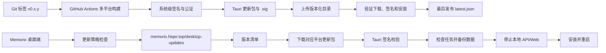
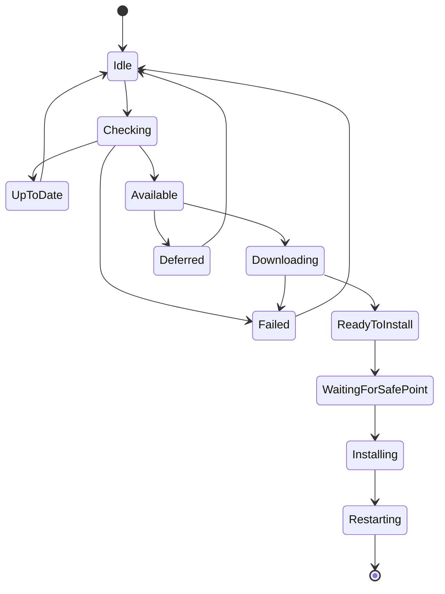
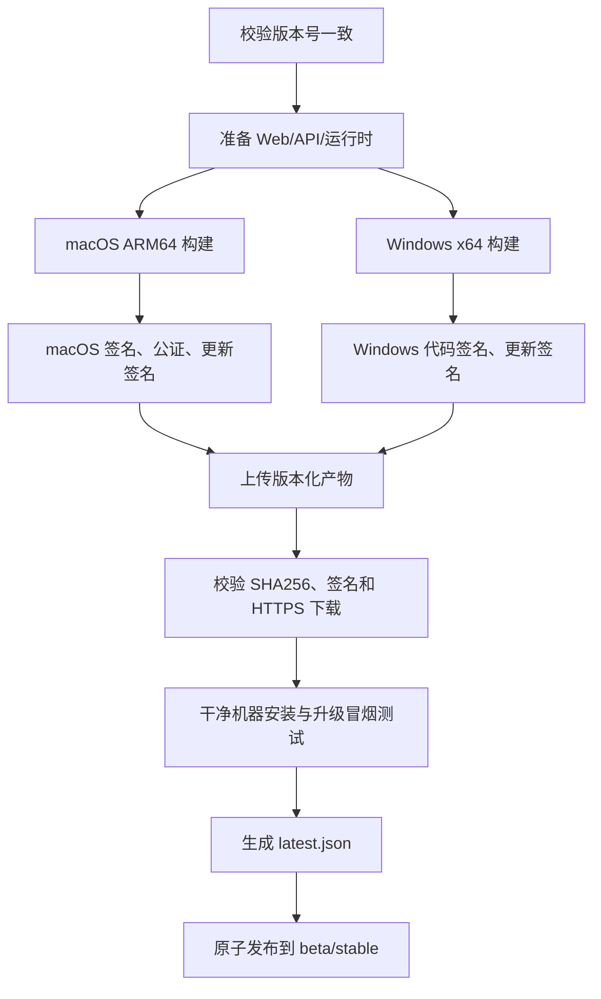

# Memorix 桌面端在线升级功能开发规划 V1.0

> 文档状态：规划稿  
> 编制日期：2026-07-27  
> 当前桌面版本：0.1.3  
> 适用范围：macOS Apple Silicon、Windows x64；Linux 暂列后续阶段

## 1. 结论

Memorix 桌面端建议使用 Tauri 2 官方 Updater 构建在线升级能力，不自行实现应用文件覆盖器。

首版采用以下方案：

1. 桌面壳、本地 Web、本地 API、Node/.NET 运行时作为一个完整应用包统一升级。
2. 更新文件发布到 `https://memorix.hiqer.top/desktop-updates/`。
3. 使用 Tauri 更新签名校验更新包，同时保留 macOS Developer ID/公证与 Windows Authenticode 操作系统级签名。
4. 默认使用 `stable` 稳定通道，设置页支持手动检查、自动检查和自动下载。
5. 安装前检查后台任务、保存应用状态、备份本地数据库、停止本地 API/Web 子进程，然后安装并重启。
6. 首期使用静态 `latest.json`；灰度、强制升级、设备分组等高级能力在第二阶段通过动态更新策略接口实现。

现有 `downloads/memorix-macos-arm64.zip` 和 `downloads/memorix-windows-x64.zip` 继续用于官网手动下载，但不能直接作为 Tauri 在线升级包。在线升级必须使用构建过程生成的专用更新产物及对应 `.sig` 签名。

## 2. 当前项目评估

### 2.1 已具备能力

- 桌面端使用 Tauri 2。
- macOS ARM64、Windows x64、Linux x64 已配置 GitHub Actions 构建矩阵。
- 桌面端会启动本地 ASP.NET API 和 Next.js Web 两个子进程。
- 应用退出时已有统一停止子进程的生命周期处理。
- 云端已提供 HTTPS 域名 `memorix.hiqer.top`。
- IIS/Nginx 已能同时承载预览站、云端 Web、API 和下载文件。
- 后端已有版本说明 `ReleaseNote`、管理页面和发布接口，可复用其编辑内容。

### 2.2 当前缺口

| 范围 | 当前状态 | 需要补齐 |
|---|---|---|
| Tauri Updater | 未接入 | Rust/前端依赖、插件注册、权限配置 |
| 更新产物 | 仅普通 DMG/EXE/MSI | 开启 `createUpdaterArtifacts`，生成 `.sig` |
| 更新清单 | 无 | 按通道生成并发布 `latest.json` |
| 发布流水线 | 仅上传 Actions Artifact | 签名、Release、上传站点、原子发布清单 |
| 应用签名 | README 标记为待办 | macOS 签名/公证、Windows 代码签名 |
| 升级界面 | 无 | 设置页、升级弹窗、进度和错误处理 |
| 本地数据保护 | 无升级流程 | 升级前备份、迁移状态、失败恢复 |
| 发布治理 | 只有 ReleaseNote | 桌面版本、平台产物、强制策略、灰度策略 |
| 版本管理 | 多处重复为 0.1.3 | 单一版本源与自动一致性检查 |

### 2.3 关键约束

Memorix 的安装包包含本地 API、Web 和运行时，体积较大。V1 不做模块化或差分升级，以完整应用包为最小升级单元。这样可以保证：

- 桌面壳与内置服务版本一致；
- 数据库迁移与业务代码同步发布；
- 出现问题时容易定位到单一发布版本；
- 不引入自定义文件替换器和跨平台权限风险。

## 3. 目标与非目标

### 3.1 V1 目标

- 支持 macOS ARM64 和 Windows x64 在线检查、下载、安装及重启。
- 更新包必须通过签名验证。
- 支持稳定通道和测试通道。
- 支持启动后自动检查与设置页手动检查。
- 显示版本说明、文件大小和下载进度。
- 不打断资料导入、向量化等不可安全中止的后台任务。
- 应用数据在升级后完整保留。
- 更新失败后仍可继续启动旧版本，并提供明确错误信息。
- 发布过程可重复、可审计、可验证。

### 3.2 V1 非目标

- 不实现二进制差分升级。
- 不单独升级内置 Web、API、Node 或 .NET 运行时。
- 不允许客户端从任意 URL 安装更新。
- 不直接支持版本降级。
- Linux 在线升级不作为 V1 上线门槛。
- 不在客户端保存更新签名私钥或代码签名证书。

## 4. 总体架构



### 4.1 发布目录

建议服务器目录：

```text
C:\Memorix\desktop-updates\
├── stable\
│   └── latest.json
├── beta\
│   └── latest.json
└── releases\
    └── 0.2.0\
        ├── Memorix_0.2.0_aarch64.app.tar.gz
        ├── Memorix_0.2.0_aarch64.app.tar.gz.sig
        ├── Memorix_0.2.0_x64-setup.exe
        ├── Memorix_0.2.0_x64-setup.exe.sig
        └── checksums.sha256
```

线上地址：

```text
https://memorix.hiqer.top/desktop-updates/stable/latest.json
https://memorix.hiqer.top/desktop-updates/beta/latest.json
https://memorix.hiqer.top/desktop-updates/releases/0.2.0/...
```

版本目录中的文件使用长期缓存；`latest.json` 禁止长期缓存，避免客户端持续获取旧版本。

## 5. 更新清单设计

### 5.1 V1 静态清单

```json
{
  "version": "0.2.0",
  "notes": "新增在线升级、优化本地运行稳定性。",
  "pub_date": "2026-08-10T10:00:00+08:00",
  "platforms": {
    "darwin-aarch64": {
      "signature": "<.sig 文件的完整文本内容>",
      "url": "https://memorix.hiqer.top/desktop-updates/releases/0.2.0/Memorix_0.2.0_aarch64.app.tar.gz"
    },
    "windows-x86_64": {
      "signature": "<.sig 文件的完整文本内容>",
      "url": "https://memorix.hiqer.top/desktop-updates/releases/0.2.0/Memorix_0.2.0_x64-setup.exe"
    }
  }
}
```

注意：

- `version` 必须符合 SemVer。
- `signature` 是 `.sig` 文件内容，不是 `.sig` 的 URL。
- Windows URL 必须指向 Tauri 当前配置实际生成并支持的更新产物。
- 清单只能在所有平台产物完成上传和验证后发布。

### 5.2 V2 动态策略接口

建议增加：

```http
GET /api/desktop-updates/check
  ?target=windows
  &arch=x86_64
  &current_version=0.2.0
  &channel=stable
  &installation_id=<匿名安装标识>
```

无可用升级或设备未进入灰度范围时返回 `204 No Content`；有更新时返回 Tauri 支持的动态响应。

动态接口负责：

- stable/beta/alpha 通道；
- 最低可支持版本；
- 强制升级；
- 灰度比例；
- 暂停某个问题版本；
- 平台、架构和版本兼容判断；
- 匿名升级统计。

## 6. 客户端功能设计

### 6.1 用户入口

在“设置 → 关于 Memorix”增加：

- 当前版本；
- 更新通道：稳定版 / 测试版；
- 自动检查更新开关，默认开启；
- 自动下载更新开关，默认关闭；
- “检查更新”按钮；
- 上次检查时间；
- 更新状态和错误提示。

发现新版本时显示弹窗：

- 新版本号；
- 发布时间；
- 版本说明；
- 下载大小；
- “下载并安装”；
- “稍后提醒”；
- “跳过此版本”，仅非强制升级允许。

### 6.2 检查时机

- 应用启动成功 20 秒后进行首次检查，避免与本地 API/Web 启动争抢资源。
- 应用持续运行时每 6 小时检查一次。
- 用户点击“检查更新”时立即检查。
- 网络离线、超时或服务端故障不影响应用正常使用。
- 同一时刻只允许一个检查或下载任务。

### 6.3 状态机



### 6.4 安装安全点

点击安装后依次执行：

1. 阻止新的资料导入、向量化、同步和报告生成任务开始。
2. 查询当前后台任务状态。
3. 若有可安全暂停任务，先暂停并记录恢复信息。
4. 若有不可中断任务，提示用户等待或取消升级。
5. 保存界面状态、当前工作区和未提交设置。
6. 创建本地数据库升级前备份。
7. 关闭本地 Web 和 API 子进程。
8. 调用 Tauri Updater 安装。
9. 重启应用。
10. 新版本启动后执行数据库迁移和健康检查。
11. 标记升级成功，并恢复可重试任务。

Windows 在进入安装阶段后会自动退出当前应用，因此停止子进程和持久化状态必须在调用安装前完成。

## 7. 数据与迁移安全

### 7.1 数据目录原则

- 用户数据库、附件、向量索引、配置和日志必须位于系统应用数据目录。
- 不能把用户数据写入应用安装目录或 Tauri Resources 目录。
- 在线升级只替换程序文件，不能删除用户数据目录。

### 7.2 升级前备份

备份目录建议：

```text
<MemorixData>/backups/pre-update/0.1.3-to-0.2.0/<timestamp>/
```

至少备份：

- SQLite/PostgreSQL 本地元数据；
- 应用设置；
- 工作区注册表；
- 数据库 schema 版本；
- 当前后台任务恢复信息。

大体积原始资料和向量文件默认不重复复制，但应验证其目录未位于应用安装路径。

### 7.3 数据库迁移规则

- 每个版本启动时只执行向前迁移。
- 迁移必须幂等，失败后再次启动可安全重试。
- 破坏性字段删除至少延迟一个稳定版本。
- 新版本首次健康检查失败时，不自动用旧二进制打开已完成不可逆迁移的数据库。
- 回滚通过发布更高补丁版本完成，例如 `0.2.1` 回退 `0.2.0` 的业务变更，而不是发布 `0.1.3` 作为“更新”。

## 8. 安全与签名

在线升级涉及三层验证：

### 8.1 Tauri 更新签名

- 生成专用更新签名密钥对。
- 公钥写入桌面应用配置。
- 私钥和密码只存放在 GitHub Actions Secrets 或专用密钥系统。
- 构建时通过 `TAURI_SIGNING_PRIVATE_KEY` 和 `TAURI_SIGNING_PRIVATE_KEY_PASSWORD` 注入。
- 禁止将私钥、密码或未脱敏日志写入仓库和发布包。
- 私钥必须离线备份；丢失私钥将导致已安装客户端无法验证后续升级。

### 8.2 macOS 签名与公证

- 使用 Apple Developer ID Application 证书签名。
- 完成 Apple Notarization 和 stapling。
- 验证 Gatekeeper 检查结果。
- 更新包内的 `.app` 与官网 DMG 均使用同一正式身份签名。

### 8.3 Windows 代码签名

- 使用受信任 Authenticode 证书签署 EXE/MSI。
- 使用时间戳服务，保证证书到期后历史包仍可验证。
- V1 Windows 推荐 `passive` 安装模式。

Tauri 更新签名不能替代操作系统代码签名，两者都需要。

### 8.4 密钥轮换

密钥轮换必须提前完成：

1. 用旧更新私钥签署一个过渡版本。
2. 过渡版本内置新公钥或兼容的轮换逻辑。
3. 确认大部分活跃客户端已升级到过渡版本。
4. 后续版本改用新私钥。

不能先丢弃旧私钥再直接替换公钥。

## 9. 代码改造范围

### 9.1 桌面 Rust 层

涉及：

- `desktop/src-tauri/Cargo.toml`
- `desktop/src-tauri/src/lib.rs`
- `desktop/src-tauri/tauri.conf.json`
- `desktop/src-tauri/capabilities/default.json`

改造项：

- 加入 `tauri-plugin-updater`。
- 加入应用重启能力。
- 注册 Updater 插件。
- 开启 `bundle.createUpdaterArtifacts`。
- 配置公钥和 HTTPS endpoint。
- 增加最小权限，不开放任意网络或命令执行能力。
- 新增安全安装命令，集中处理任务检查、备份、子进程停止和安装。
- 复用现有 `stop_sidecars`，避免升级时残留 API/Web 进程。

建议升级安装的关键流程放在 Rust 主进程，不完全交由页面 JavaScript 串联，降低页面刷新或 Web 进程退出导致流程中断的风险。

### 9.2 Web 界面

建议新增：

```text
web/src/components/desktop-update/
├── update-provider.tsx
├── update-dialog.tsx
├── update-progress.tsx
└── update-error.tsx
```

并在设置页增加桌面更新区块。

页面必须先判断是否运行于 Tauri：

- 桌面端显示更新功能；
- 云端 Web 不显示本地安装按钮；
- 浏览器环境不能直接调用 Tauri 插件。

### 9.3 后端

V1 可继续使用静态清单，不强制修改数据库。

V2 建议新增独立实体，不把安装产物字段全部塞进现有 `ReleaseNote`：

#### DesktopRelease

| 字段 | 说明 |
|---|---|
| Id | 发布 ID |
| Version | SemVer |
| Channel | stable/beta/alpha |
| Status | draft/validating/published/paused |
| ReleaseNoteId | 关联版本说明 |
| MinimumSupportedVersion | 最低支持版本 |
| IsMandatory | 是否强制 |
| RolloutPercentage | 灰度比例 |
| PublishedAt | 发布时间 |

#### DesktopArtifact

| 字段 | 说明 |
|---|---|
| Id | 产物 ID |
| DesktopReleaseId | 所属发布 |
| Target | darwin/windows/linux |
| Architecture | aarch64/x86_64 |
| DownloadUrl | 版本化下载地址 |
| Signature | Tauri `.sig` 内容 |
| Sha256 | 辅助校验 |
| SizeBytes | 下载大小 |
| Status | uploaded/verified/disabled |

现有 `ReleaseNote` 继续管理用户可读内容；`DesktopRelease` 管理机器可执行的升级策略。

### 9.4 部署配置

IIS 静态放行规则由：

```text
^(preview|downloads)(/.*)?$
```

扩展为：

```text
^(preview|downloads|desktop-updates)(/.*)?$
```

同时增加：

- `.json`、`.sig`、`.gz` 等静态文件 MIME 类型；
- `latest.json`：`Cache-Control: no-store`；
- 版本化产物：`Cache-Control: public, max-age=31536000, immutable`；
- 大文件 Range 请求支持；
- 保持 HTTPS；
- 确认请求大小限制不影响下载响应。

Nginx 增加 `location ^~ /desktop-updates/`，确保不会被转发到 Next.js。

## 10. CI/CD 发布流程

### 10.1 触发规则

- 普通分支提交：只做构建与测试，不发布。
- `v*` 标签：构建候选版本。
- 手工批准后：发布到 beta 或 stable。
- 同一个版本号发布后禁止覆盖其产物。

### 10.2 推荐流水线



### 10.3 版本单一来源

以 `desktop/src-tauri/tauri.conf.json` 的 `version` 为发布版本源，流水线同步或校验：

- `desktop/package.json`
- `desktop/package-lock.json`
- `desktop/src-tauri/Cargo.toml`
- `desktop/src-tauri/Cargo.lock`

任一版本不一致即终止发布。

### 10.4 原子发布

发布顺序必须是：

1. 上传带版本号的全部产物。
2. 上传签名和 checksum。
3. 从服务器实际下载并验证。
4. 验证 macOS/Windows 干净环境安装。
5. 生成临时清单。
6. 原子替换通道的 `latest.json`。

禁止先更新 `latest.json` 再上传产物。

## 11. 灰度、强制升级与回滚

### 11.1 通道

- `stable`：默认，正式用户。
- `beta`：内测用户主动选择。
- `alpha`：仅开发/内部验证，不在普通 UI 展示。

### 11.2 灰度

V2 使用本地生成且不含个人信息的 `installation_id`：

```text
bucket = hash(installation_id + version) % 100
eligible = bucket < rollout_percentage
```

同一设备对同一版本始终落在同一分组，避免每次检查结果变化。

推荐发布节奏：

- 5%：24 小时；
- 25%：24 小时；
- 50%：24 小时；
- 100%：稳定后全量。

### 11.3 暂停

服务端可将版本标记为 `paused`。已下载但未安装时，客户端在安装前再次确认版本状态；暂停后不再安装。

### 11.4 强制升级

仅以下情况使用：

- 严重数据安全问题；
- 后端协议已不再兼容；
- 旧版本存在不可接受的数据损坏风险。

强制升级仍应允许用户完成安全备份，并在无法下载时展示离线解决方式，不能让客户端陷入无法使用且无法修复的循环。

### 11.5 回滚

- 未下载：暂停问题版本并恢复上一稳定清单。
- 已下载未安装：安装前策略复检并取消。
- 已安装：发布更高版本的修复包。
- 数据库迁移：通过前向修复迁移恢复，避免让旧应用直接读取新 schema。

## 12. 监控与诊断

记录但不包含用户资料内容：

- 当前版本、目标版本；
- 操作系统和架构；
- 检查结果；
- 下载开始/完成/失败；
- 签名验证结果；
- 安装触发；
- 新版本首次启动健康检查；
- 错误码、trace id 和耗时。

建议错误码：

| 错误码 | 含义 |
|---|---|
| UPDATE_NETWORK_UNAVAILABLE | 网络不可用 |
| UPDATE_MANIFEST_INVALID | 清单无效 |
| UPDATE_SIGNATURE_INVALID | 签名验证失败 |
| UPDATE_DOWNLOAD_FAILED | 下载失败 |
| UPDATE_TASKS_BUSY | 后台任务阻止安装 |
| UPDATE_BACKUP_FAILED | 升级前备份失败 |
| UPDATE_SIDECAR_STOP_FAILED | 子进程停止失败 |
| UPDATE_INSTALL_FAILED | 安装失败 |
| UPDATE_POSTCHECK_FAILED | 新版本启动检查失败 |

客户端日志中不得记录密钥、令牌或完整用户路径中的敏感信息。

## 13. 测试方案

### 13.1 单元测试

- SemVer 比较；
- 更新通道选择；
- 跳过版本逻辑；
- 灰度分桶稳定性；
- 清单字段校验；
- 状态机非法跳转；
- 后台任务安全点判断；
- 备份失败阻止安装。

### 13.2 集成测试

- 无更新返回；
- stable/beta 不同版本；
- 下载进度；
- 网络中断和重试；
- 错误签名拒绝安装；
- URL 404；
- 清单已发布但产物缺失；
- 后台任务运行时延迟安装；
- 停止本地 API/Web 后成功安装；
- 新版本启动并恢复工作区。

### 13.3 平台测试矩阵

| 平台 | 场景 |
|---|---|
| macOS ARM64 | 0.1.3 → 0.2.0、签名、公证、无管理员权限 |
| Windows 10 x64 | EXE/MSI 升级、UAC、中文路径 |
| Windows 11 x64 | SmartScreen、标准用户、服务占用 |
| 两平台 | 离线、代理、慢网、断点失败、磁盘不足 |

### 13.4 数据验证

- 升级前后文档、资料、专题、向量索引数量一致；
- 工作区仍可打开；
- 本地登录和云端模式设置保持；
- 数据库迁移只执行一次；
- 失败升级不会删除数据库；
- 首次启动健康检查可定位 API/Web/数据库问题。

## 14. 分阶段实施

### 阶段 P0：发布基础

- 购买/配置 macOS 与 Windows 代码签名能力。
- 生成并离线备份 Tauri 更新签名密钥。
- 确认用户数据目录与安装目录完全分离。
- 建立版本单一来源检查。
- 在服务器增加 `desktop-updates` 静态目录和缓存策略。

验收：两平台产物能在干净机器安装，系统不再提示未知或未签名发布者。

### 阶段 P1：稳定通道 MVP

- 接入 Tauri Updater。
- GitHub Actions 生成更新产物及 `.sig`。
- 生成静态 `stable/latest.json`。
- 设置页手动检查、下载进度、安装并重启。
- 安装前停止本地子进程。
- 保留官网手动下载作为兜底。

验收：0.1.x 测试版本可在线升级到 0.2.0，升级后本地数据完整。

### 阶段 P2：自动化与数据保护

- 启动后自动检查。
- 自动下载可选。
- 后台任务安全点。
- 升级前数据库备份。
- 启动后健康检查和诊断日志。
- beta 通道。

验收：任务执行、网络中断、下载失败、重启失败等异常均有明确恢复路径。

### 阶段 P3：发布治理

- `DesktopRelease`、`DesktopArtifact`。
- 动态检查接口。
- 灰度、暂停、强制升级和最低版本。
- 管理后台发布审批。
- 匿名成功率与失败率统计。

验收：运营人员可控制发布范围，问题版本可在不重新部署客户端的情况下暂停。

### 阶段 P4：后续优化

- Linux 在线升级。
- CDN/对象存储。
- 大包下载恢复能力。
- 包体瘦身。
- 评估差分更新，但只有在完整包稳定运行后再实施。

## 15. 上线门槛

满足以下条件才允许向 stable 发布：

- macOS 和 Windows 更新产物均完成系统级签名。
- Tauri 更新签名验证通过。
- `latest.json` 与线上产物匹配。
- 从上一稳定版本升级成功。
- 升级前后用户数据校验通过。
- 后台任务安全点测试通过。
- 干净机器升级与首次启动通过。
- 回滚/暂停演练通过。
- 官网手动安装包仍可正常下载。
- 发布密钥存在安全备份，并明确负责人。

## 16. 建议的首个在线升级版本

建议不要让当前 0.1.3 直接承担完整在线升级上线，因为 0.1.3 尚未内置 Updater 公钥和客户端逻辑。

推荐路径：

1. 发布 `0.1.4` 过渡版：通过官网手动下载安装，内置 Updater、公钥、稳定通道和升级 UI。
2. 发布 `0.1.5` 验证版：只向内测设备发布，验证 0.1.4 → 0.1.5 在线升级。
3. 验证成功后发布 `0.2.0`：首次正式启用 stable 在线升级。

因此，0.1.3 用户首次仍需手动升级到 0.1.4；从 0.1.4 开始即可持续在线升级。

## 17. 官方技术依据

- Tauri 2 Updater：<https://v2.tauri.app/plugin/updater/>
- Tauri 应用分发：<https://v2.tauri.app/distribute/>
- Tauri Windows 代码签名：<https://v2.tauri.app/distribute/sign/windows/>

