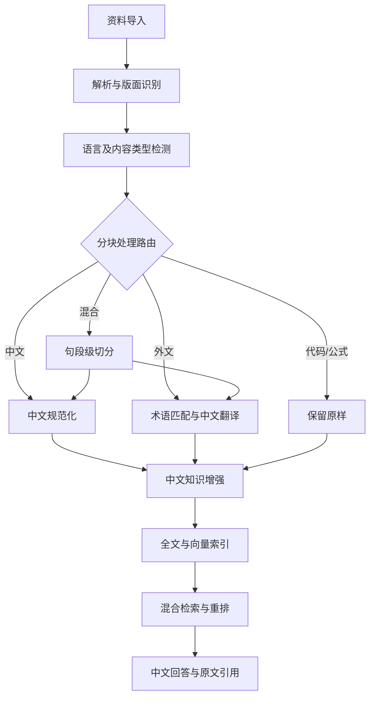
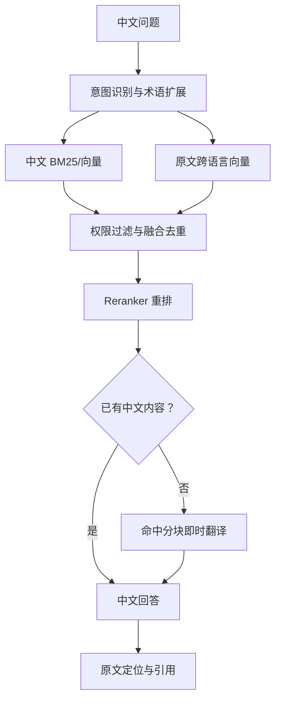

# 多语言资料库自适应处理与中文索引开发文档

> 版本：V1.0  
> 日期：2026-07-13  
> 适用范围：本地模式、云端模式及混合部署的知识资料库/RAG 系统

## 1. 文档目的

本文档定义资料库面对中文、外文及中外文混合资料时的数据模型、处理流水线、中文知识层、索引体系、检索问答、版本管理与工程实施方案。

系统面向日常使用中文的用户，设计目标是：

1. 原始资料永久保留，任何翻译、摘要和知识提炼均可追溯到原文。
2. 中文资料不做无意义翻译，直接进入中文规范化和知识增强流程。
3. 外文资料自动建立中文理解层，同时保留原文检索能力。
4. 混合资料按分块甚至句段级语言自适应路由。
5. 中文用户使用统一入口检索，不需要关心资料原始语言。
6. 支持按需翻译、全文翻译和人工审校，平衡效果、成本与处理时延。
7. 支持多租户权限隔离、任务重试、版本升级和增量重建。

## 2. 核心设计原则

### 2.1 原文是事实底座

原始文件、原始文本和原始分块均不可被译文或 AI 生成内容覆盖。中文译文、摘要、关键词、实体和假设问题属于派生内容。

### 2.2 统一中文知识层

中文原文经过规范化后直接进入中文知识层；外文原文经过翻译后进入中文知识层。上层搜索和 RAG 统一读取中文有效内容。

### 2.3 文档级识别、分块级路由

文档级语言用于任务编排和界面展示；分块级语言决定实际处理路径。只有混合度较高或 OCR 版面异常时才启用句段级切分。

### 2.4 双路证据与检索

外文资料同时建立原文跨语言向量和中文译文索引。中文检索体验由中文知识层提供，事实校验和引用由原始证据层提供。

### 2.5 翻译深度自适应

根据资料价值、使用频率和成本选择元数据翻译、命中式翻译或全文翻译，不强制所有外文资料入库时立即全文中文化。

## 3. 总体架构



系统逻辑上分为三层：

| 层级 | 主要内容 | 职责 |
| --- | --- | --- |
| 原始证据层 | 原始文件、原始文本、原文分块、页码和坐标 | 权威事实、审计和引用 |
| 中文知识层 | 中文原文规范化结果、外文中文译文、摘要、术语和实体 | 中文阅读、检索与问答 |
| 检索索引层 | BM25、向量、实体、关键词和假设问题索引 | 多路召回、融合、重排 |

## 4. 资料分类与自适应工作流

### 4.1 语言检测层级

#### 文档级语言

通过标题、开头、中部抽样和结尾文本确定主要语言：

- `zh-CN`：简体中文为主；
- `zh-TW`：繁体中文为主；
- `en`、`ja`、`ko`、`de`、`fr` 等：相应外文为主；
- `mixed`：两种或多种语言均占明显比例；
- `unknown`：无法可靠判断。

文档级结果用于确定默认翻译策略，但不直接决定每个分块是否翻译。

#### 分块级语言

每个标题、正文、表格、图注、代码块和参考文献分别检测语言。分块级结果是工作流路由的主要依据。

#### 句段级语言

仅在以下情况下启用：

- 单个块中中外文比例都较高；
- 中外文交替出现；
- OCR 将多个区域错误拼接；
- 表格不同列使用不同语言。

### 4.2 默认语言比例规则

| 外文字符比例 | 默认判断 | 处理策略 |
| ---: | --- | --- |
| 小于 5% | 中文资料 | 中文直通，保留外文术语 |
| 5%～30% | 中文为主的混合资料 | 按分块处理 |
| 30%～70% | 混合资料 | 分块处理，必要时句段切分 |
| 大于 70% | 外文资料 | 外文流程为主 |

比例只是默认参考，管理员可按资料领域和文档类型调整。

### 4.3 路径 A：中文资料

```text
原文解析 → 中文规范化 → 术语标准化 → 知识增强
→ 中文全文索引 → 中文向量索引
```

中文规范化可以执行：

- 全角/半角及标点统一；
- OCR 常见错误修复；
- 繁简映射；
- 页眉、页脚和无意义换行清理；
- 专业术语和别名关联。

规范化结果不得覆盖原文，必须分别保存 `content_original` 与 `content_normalized`。

### 4.4 路径 B：外文资料

```text
原文解析 → 外文清洗 → 领域识别 → 术语匹配 → 中文翻译
→ 翻译质检 → 中文知识增强 → 中外文双路索引
```

系统生成中文译文、摘要、关键词、实体对应关系和假设问题，同时保留外文原文向量，以避免翻译遗漏造成召回缺失。

### 4.5 路径 C：中外文混合资料

混合资料按块处理：

- 中文块进入中文规范化；
- 外文块进入中文翻译；
- 混合块先做结构或句段切分；
- 中英文术语同时保留，首次出现推荐格式为“中文标准名（英文原名，缩写）”。

### 4.6 路径 D：特殊内容

下列内容通常不做直接翻译：

- 程序代码、SQL、JSON、XML；
- URL、文件路径、接口字段；
- 数学公式、产品型号和标准编号；
- 公司法定名称、人名；
- 参考文献中的出版信息。

可以为代码或接口额外生成中文说明，但原始内容必须保持不变。

### 4.7 翻译深度

| 等级 | 中文化范围 | 适用情况 |
| --- | --- | --- |
| L1 元数据中文化 | 标题、摘要、关键词、实体 | 海量资料初次入库 |
| L2 命中式中文化 | L1 加检索命中的分块 | 低频资料或成本敏感场景 |
| L3 全文中文化 | 全部有效正文分块 | 核心制度、合同、高频资料 |

推荐普通外文资料先完成 L1，并建立原文跨语言向量；用户检索命中后执行 L2；高频、收藏或被引用的资料再升级为 L3。

## 5. 数据库设计

以下示例以 PostgreSQL 为基础，主键可使用雪花 ID、UUIDv7 或平台统一 ID。

### 5.1 文档主表 `documents`

```sql
CREATE TABLE documents (
    id                    BIGINT PRIMARY KEY,
    tenant_id             BIGINT NOT NULL,
    workspace_id          BIGINT,
    title_original        VARCHAR(1000),
    title_zh              VARCHAR(1000),
    primary_language      VARCHAR(20) NOT NULL,
    language_distribution JSONB,
    is_multilingual       BOOLEAN NOT NULL DEFAULT FALSE,
    localization_required BOOLEAN NOT NULL DEFAULT FALSE,
    localization_strategy VARCHAR(30) NOT NULL DEFAULT 'none',
    localization_level    VARCHAR(30),
    source_type           VARCHAR(50),
    source_url            TEXT,
    original_file_uri     TEXT,
    mime_type             VARCHAR(100),
    author                VARCHAR(500),
    published_at          TIMESTAMPTZ,
    content_hash          VARCHAR(64) NOT NULL,
    security_level        VARCHAR(30),
    parse_status          VARCHAR(30) NOT NULL DEFAULT 'pending',
    index_status          VARCHAR(30) NOT NULL DEFAULT 'pending',
    created_at            TIMESTAMPTZ NOT NULL,
    updated_at            TIMESTAMPTZ NOT NULL
);

CREATE INDEX idx_documents_tenant ON documents(tenant_id, workspace_id);
CREATE UNIQUE INDEX uk_documents_hash
    ON documents(tenant_id, content_hash);
```

`localization_strategy` 取值包括：`none`、`full`、`chunk_level`、`metadata_only`、`on_demand`、`manual`。

### 5.2 文档版本表 `document_versions`

```sql
CREATE TABLE document_versions (
    id                  BIGINT PRIMARY KEY,
    document_id         BIGINT NOT NULL REFERENCES documents(id),
    version_no          INT NOT NULL,
    original_file_uri   TEXT,
    original_text_uri   TEXT,
    content_hash        VARCHAR(64) NOT NULL,
    parser_name         VARCHAR(100),
    parser_version      VARCHAR(50),
    parsed_at           TIMESTAMPTZ,
    created_at          TIMESTAMPTZ NOT NULL,
    UNIQUE(document_id, version_no)
);
```

大文件、原始文本和解析中间结果建议放对象存储，数据库保存 URI、Hash 和版本信息。

### 5.3 文档分块表 `document_chunks`

```sql
CREATE TABLE document_chunks (
    id                    BIGINT PRIMARY KEY,
    tenant_id             BIGINT NOT NULL,
    document_id           BIGINT NOT NULL REFERENCES documents(id),
    document_version_id   BIGINT NOT NULL REFERENCES document_versions(id),
    parent_chunk_id       BIGINT,
    chunk_group_id        BIGINT,
    chunk_no              INT NOT NULL,
    content_type          VARCHAR(30) NOT NULL,
    detected_language     VARCHAR(20),
    language_confidence   NUMERIC(5,4),
    localization_required BOOLEAN NOT NULL DEFAULT FALSE,
    processing_route      VARCHAR(30),
    heading_original      VARCHAR(1000),
    heading_path          JSONB,
    content_original      TEXT NOT NULL,
    content_normalized    TEXT,
    page_start            INT,
    page_end              INT,
    paragraph_start       INT,
    paragraph_end         INT,
    bounding_box          JSONB,
    token_count           INT,
    content_hash          VARCHAR(64) NOT NULL,
    created_at            TIMESTAMPTZ NOT NULL,
    updated_at            TIMESTAMPTZ NOT NULL,
    UNIQUE(document_version_id, chunk_no)
);

CREATE INDEX idx_chunks_document ON document_chunks(document_id, chunk_no);
CREATE INDEX idx_chunks_tenant_route
    ON document_chunks(tenant_id, processing_route);
```

`content_type` 可取 `heading`、`paragraph`、`table`、`code`、`formula`、`reference`、`caption`、`metadata`。`processing_route` 可取 `zh_direct`、`translate`、`mixed_split`、`keep_original`、`metadata_translate`、`manual_review`、`skip`。

### 5.4 多语言本地化表 `chunk_localizations`

```sql
CREATE TABLE chunk_localizations (
    id                  BIGINT PRIMARY KEY,
    tenant_id           BIGINT NOT NULL,
    chunk_id            BIGINT NOT NULL REFERENCES document_chunks(id),
    language_code       VARCHAR(20) NOT NULL,
    heading_localized   VARCHAR(1000),
    content_localized   TEXT NOT NULL,
    translation_type    VARCHAR(30) NOT NULL,
    translation_model   VARCHAR(100),
    prompt_version      VARCHAR(50),
    glossary_version    VARCHAR(50),
    quality_score       NUMERIC(5,4),
    review_status       VARCHAR(30),
    source_content_hash VARCHAR(64) NOT NULL,
    created_at          TIMESTAMPTZ NOT NULL,
    updated_at          TIMESTAMPTZ NOT NULL,
    UNIQUE(chunk_id, language_code)
);
```

`translation_type` 可取 `machine`、`human`、`machine_reviewed`。原文 Hash 变化后，旧译文应标记为 `stale`。

### 5.5 中文知识增强表 `chunk_enrichments`

```sql
CREATE TABLE chunk_enrichments (
    id                  BIGINT PRIMARY KEY,
    tenant_id           BIGINT NOT NULL,
    chunk_id            BIGINT NOT NULL REFERENCES document_chunks(id),
    language_code       VARCHAR(20) NOT NULL,
    summary             TEXT,
    keywords            JSONB,
    entities            JSONB,
    hypothetical_questions JSONB,
    facts               JSONB,
    model_name          VARCHAR(100),
    prompt_version      VARCHAR(50),
    source_content_hash VARCHAR(64) NOT NULL,
    created_at          TIMESTAMPTZ NOT NULL,
    updated_at          TIMESTAMPTZ NOT NULL,
    UNIQUE(chunk_id, language_code)
);
```

摘要、关键词、实体、事实和假设问题必须与翻译内容分开保存，避免无法区分原文、译文与 AI 提炼结果。

### 5.6 术语表 `terminology`

```sql
CREATE TABLE terminology (
    id              BIGINT PRIMARY KEY,
    tenant_id       BIGINT NOT NULL,
    source_language VARCHAR(20) NOT NULL,
    source_term     VARCHAR(500) NOT NULL,
    target_language VARCHAR(20) NOT NULL,
    target_term     VARCHAR(500) NOT NULL,
    aliases         JSONB,
    domain_code     VARCHAR(100),
    description     TEXT,
    priority        INT NOT NULL DEFAULT 0,
    review_status   VARCHAR(30),
    created_at      TIMESTAMPTZ NOT NULL,
    updated_at      TIMESTAMPTZ NOT NULL
);

CREATE UNIQUE INDEX uk_terminology
    ON terminology(
        tenant_id, source_language, source_term,
        target_language, COALESCE(domain_code, '')
    );
```

术语库同时服务于翻译、查询扩展、中文分词词典和结果展示。

### 5.7 向量表 `chunk_embeddings`

```sql
CREATE EXTENSION IF NOT EXISTS vector;

CREATE TABLE chunk_embeddings (
    id                  BIGINT PRIMARY KEY,
    tenant_id           BIGINT NOT NULL,
    chunk_id            BIGINT NOT NULL REFERENCES document_chunks(id),
    localization_id     BIGINT,
    language_code       VARCHAR(20) NOT NULL,
    embedding_type      VARCHAR(30) NOT NULL,
    embedding_model     VARCHAR(100) NOT NULL,
    embedding_version   VARCHAR(50),
    embedding           VECTOR(1024) NOT NULL,
    source_content_hash VARCHAR(64) NOT NULL,
    created_at          TIMESTAMPTZ NOT NULL,
    UNIQUE(chunk_id, language_code, embedding_type, embedding_model)
);
```

`embedding_type` 可取 `original_content`、`localized_content`、`summary`、`hypothetical_question`。向量维度必须按实际模型配置，不应硬编码在跨模型迁移逻辑中。

### 5.8 统一中文检索视图

```sql
CREATE VIEW searchable_chunks_zh AS
SELECT
    c.id AS chunk_id,
    c.tenant_id,
    c.document_id,
    c.content_original,
    c.detected_language,
    CASE
        WHEN c.detected_language IN ('zh', 'zh-CN', 'zh-TW')
            THEN COALESCE(c.content_normalized, c.content_original)
        ELSE l.content_localized
    END AS content_zh,
    CASE
        WHEN c.detected_language IN ('zh', 'zh-CN', 'zh-TW')
            THEN 'original'
        WHEN l.translation_type = 'human'
            THEN 'human_reviewed'
        ELSE 'translated'
    END AS content_zh_source
FROM document_chunks c
LEFT JOIN chunk_localizations l
    ON l.chunk_id = c.id
   AND l.language_code = 'zh-CN';
```

## 6. 分块设计

### 6.1 默认参数

- 常规正文：400～800 tokens；
- 重叠长度：50～100 tokens；
- 法律和合同：按章、条、款分块；
- 财务资料：按制度条款、科目或报表项目分块；
- 技术资料：按标题、接口、类或方法分块；
- 表格：表头必须与数据行关联；
- 图片：OCR、图注和页面坐标关联到所属章节。

### 6.2 中外文映射

优先保持一个原文块对应一个中文块。若语言长度差异较大，可让一个原文块对应多个中文子块，但必须共享 `chunk_group_id`，并能恢复到同一原文证据范围。

不建议将外文全文翻译后重新独立切块，否则中文检索结果难以精确映射到原文位置。

## 7. 中文翻译与知识增强

### 7.1 翻译上下文

翻译任务应携带：

- 文档标题和资料领域；
- 当前章节路径；
- 相邻分块摘要；
- 租户或领域术语表；
- 已确认的人名、公司名、产品名和技术名；
- 数字、日期、单位不得改写的约束。

### 7.2 处理顺序

```text
术语识别 → 术语标准化 → 分块翻译 → 上下文一致性检查
→ 中文摘要 → 关键词与实体 → 事实提取 → 假设问题
```

### 7.3 质量检查

至少检查：

- 数字、日期、百分比和货币是否改变；
- 否定词、条件和例外条款是否遗漏；
- 单位换算是否正确；
- 专有名词是否统一；
- 表格行列关系是否保持；
- 引用能否回到原始页面和段落；
- 翻译结果是否意外包含模型说明或无关内容。

法律、医学、财务等高风险领域的关键资料应支持人工审校和译文锁定。

## 8. 中文索引体系

### 8.1 中文全文索引

全文索引建议组合：

```text
中文标题 + 中文章节标题 + 中文正文/译文 + 中文摘要
+ 中文关键词 + 中文实体 + 中文假设问题
```

Elasticsearch/OpenSearch 可采用中文分词器，并配置领域自定义词典：

```json
{
  "content_zh": {
    "type": "text",
    "analyzer": "ik_max_word",
    "search_analyzer": "ik_smart"
  },
  "content_zh_exact": {
    "type": "text",
    "analyzer": "standard"
  }
}
```

专业词汇应作为完整词项，例如“生产者责任延伸制度”“资产负债表”“多租户隔离”“检索增强生成”。

### 8.2 中文向量索引

向量输入建议包含中文标题、章节路径、中文正文或译文及简短摘要。大量关键词或实体 JSON 不宜全部拼入同一个向量，以免稀释正文语义。

### 8.3 原文跨语言向量

外文原文应使用支持跨语言检索的 Embedding 模型建立向量，使中文问题可以直接召回外文原文。不能默认所有中文 Embedding 模型都具备可靠的跨语言能力。

### 8.4 假设问题索引

每个有效分块可生成 3～5 个中文用户问题。问题向量常比正文向量更接近口语化查询，但只能辅助召回，不能作为最终事实来源。

### 8.5 不同资料的索引策略

| 资料类型 | 中文全文 | 中文向量 | 原文向量 | 假设问题 |
| --- | ---: | ---: | ---: | ---: |
| 中文原始资料 | 是 | 是 | 与中文向量共用 | 是 |
| 外文全文翻译 | 是 | 是 | 是 | 是 |
| 外文仅元数据翻译 | 标题/摘要 | 标题/摘要 | 是 | 可选 |
| 中外混合资料 | 是 | 是 | 外文块建立 | 是 |
| 代码/公式 | 中文说明 | 可选 | 专用索引 | 否 |
| 参考文献 | 标题/作者 | 可选 | 是 | 否 |

## 9. 检索与问答流程

### 9.1 中文查询处理



### 9.2 查询扩展

中文问题可以通过术语表扩展为中文别名、缩写及外文原词。例如：

```text
动力电池回收
→ 电池回收效率、生产者责任延伸制度、EPR
→ battery recycling、recycling efficiency
```

### 9.3 多路融合

建议使用 RRF（Reciprocal Rank Fusion）融合以下结果：

1. 中文 BM25 全文检索；
2. 中文正文/译文向量检索；
3. 原文跨语言向量检索；
4. 中文假设问题向量检索；
5. 实体、关键词及术语精确匹配。

RRF 比直接相加 BM25 和向量相似度更容易稳定落地。融合后按 `chunk_id` 或 `chunk_group_id` 去重，再执行 Reranker 精排和父子分块上下文扩展。

### 9.4 按需翻译回写

命中的外文分块如尚无中文译文：

```text
检索命中 → 当前请求即时翻译 → 返回中文内容
→ 保存译文 → 生成中文向量和全文索引 → 后续复用
```

应通过任务锁和幂等键避免并发请求重复翻译同一分块。

### 9.5 回答引用

结果界面应明确区分：

- 中文原文；
- 系统译文；
- 人工审校译文；
- AI 摘要；
- 外文原文。

引用应至少包含文档标题、章节、页码或段落、原文分块 ID。中文译文帮助用户理解，外文原文才是外文资料的最终事实依据。

## 10. 表格、图片与 OCR

### 10.1 表格

表格必须结构化保存原始表头、中文表头、原始单元格、中文化单元格以及行列坐标。数字、公式、单位通常保留原样，只翻译文本型单元格。

### 10.2 图片和扫描件

```text
版面识别 → OCR 区域提取 → 区域语言检测
→ 中文区清洗 / 外文区翻译 → 保存 bounding_box
```

回答引用需要能够定位到原始页图中的对应区域。

## 11. 状态机、任务与幂等

### 11.1 独立任务状态

不要只使用一个笼统状态，应分别记录：

- `parse_status`；
- `language_detect_status`；
- `normalize_status`；
- `translation_status`；
- `enrichment_status`；
- `embedding_status`；
- `fulltext_index_status`。

统一状态值：`pending`、`processing`、`completed`、`partial`、`failed`、`skipped`、`stale`。

中文资料的 `translation_status` 应为 `skipped`，而不是 `completed`，便于审计和统计。

### 11.2 事件流水线

```text
DocumentImported
→ DocumentParsed
→ LanguageDetected
→ ChunksClassified
→ ChineseChunksNormalized / ForeignChunksLocalized
→ KnowledgeEnriched
→ EmbeddingsGenerated
→ FulltextIndexed
→ DocumentReady
```

中文规范化和外文翻译可以并行，最后汇聚到知识增强阶段。

### 11.3 幂等键

```text
tenant_id + chunk_id + source_content_hash + task_type
+ model_version + prompt_version + glossary_version
```

任务重试必须复用幂等键。对同一分块的并发翻译应使用数据库唯一约束、任务去重或分布式锁控制。

## 12. 版本与增量重建

每类派生内容必须记录：

- 原文 Hash；
- 解析器及版本；
- 翻译模型及版本；
- 翻译 Prompt 版本；
- 术语表版本；
- 摘要/增强 Prompt 版本；
- Embedding 模型及版本；
- 全文索引版本。

依赖关系如下：

```text
原文变化
→ 原文分块失效
→ 译文和增强结果失效
→ 中外文向量失效
→ 全文索引重建
```

若只更换 Embedding 模型，则仅重建向量；若只调整中文分词词典，则仅重建全文索引；若只修改摘要 Prompt，则不需要重新翻译。

## 13. 权限与多租户隔离

索引记录至少携带：

- `tenant_id`；
- `workspace_id`；
- `department_id`；
- `security_level`；
- `allowed_role_ids`；
- `allowed_user_ids`。

权限过滤必须发生在召回或检索阶段，不能在答案生成后才过滤。数据库查询、向量查询、全文查询和缓存键都必须包含租户隔离条件，避免跨租户召回和缓存污染。

## 14. 异常与人工审核

以下情况进入人工处理队列：

- 语言识别置信度低于阈值；
- OCR 乱码严重或版面结构无法恢复；
- 单块包含三种以上语言；
- 翻译前后数字、日期、单位不一致；
- 关键术语有多种可能译法；
- 表格翻译后行列关系无法确认；
- 法律、医学、财务关键条款的翻译置信度不足。

用户应能执行：指定主要语言、修改处理路由、选择标准术语、重新翻译、标记无需翻译、升级全文中文化、确认人工译文和锁定译文版本。

## 15. 技术选型建议

### 15.1 MVP

```text
PostgreSQL + pgvector + PGroonga（或 ParadeDB）
```

适合资料量和并发较小、希望简化部署的本地优先版本。

### 15.2 规模化部署

```text
PostgreSQL：文档、版本、权限、分块和任务元数据
对象存储：原始文件、解析结果、页面图片
Elasticsearch/OpenSearch：中文 BM25 和结构化检索
pgvector 或专用向量库：中外文向量
Redis + 消息队列：任务编排、锁和短期缓存
Reranker：多路召回精排
```

Embedding 模型必须经过中文查询对外文资料的跨语言召回评测，不能只依据模型宣传或中文单语评测选型。

## 16. API 建议

| 接口 | 方法 | 说明 |
| --- | --- | --- |
| `/api/documents` | POST | 上传或登记资料 |
| `/api/documents/{id}/process` | POST | 启动/重启处理流水线 |
| `/api/documents/{id}/localization-level` | PUT | 调整 L1/L2/L3 中文化等级 |
| `/api/documents/{id}/chunks` | GET | 查看分块、语言和状态 |
| `/api/chunks/{id}/route` | PUT | 人工修改分块路由 |
| `/api/chunks/{id}/translate` | POST | 翻译或重新翻译分块 |
| `/api/chunks/{id}/review` | POST | 提交人工审校结果 |
| `/api/search` | POST | 中文混合检索 |
| `/api/chat` | POST | RAG 中文问答 |
| `/api/terminology` | GET/POST | 术语维护 |

所有写接口应接受 `request_id` 或 `idempotency_key`。

## 17. 验收指标

### 17.1 功能指标

- 中文、外文和混合文档均能正确进入对应路由；
- 中文资料不会产生无意义翻译任务；
- 外文检索结果能返回中文内容和原文引用；
- 混合文档中代码、公式、字段名保持原样；
- 原文更新后相关派生内容能被标记并增量重建；
- 权限不足的资料不会进入候选召回结果。

### 17.2 质量指标

- 文档主语言识别准确率；
- 分块语言识别准确率；
- 中文查询 Recall@K、MRR、nDCG；
- 跨语言查询 Recall@K；
- Reranker 后 Top-K 相关率；
- 引用定位成功率；
- 数字、日期、单位翻译一致率；
- 术语一致率；
- 按需翻译缓存复用率。

应建立中文问题—外文证据、中文问题—中文证据、混合语言文档三类独立评测集。

## 18. 分阶段实施计划

### 阶段一：统一数据底座

- 建立文档、版本、分块和对象存储模型；
- 实现文档/分块语言检测；
- 完成原始证据定位和基础状态机。

### 阶段二：自适应中文化

- 实现中文直通、外文翻译、混合分块和特殊内容路由；
- 建立术语表、翻译版本和质量检查；
- 支持 L1/L2/L3 翻译深度。

### 阶段三：中文索引与检索

- 建立中文 BM25、中文向量和原文跨语言向量；
- 实现术语扩展、RRF 融合、去重和 Reranker；
- 支持命中式翻译和索引回写。

### 阶段四：生产化增强

- 加入多租户权限过滤、幂等和并发控制；
- 建立人工审核台、质量指标和评测集；
- 支持模型、Prompt、术语和索引的增量升级。

## 19. 最终设计结论

系统不应把外文资料简单翻译成中文后覆盖原文，而应构建：

```text
原始证据层 + 中文理解层 + 多语言语义层
```

中文资料直接形成中文理解层；外文资料通过翻译形成中文理解层；混合资料按分块自适应汇入同一层。中文全文检索负责关键词精确召回，多语言向量负责跨语言语义召回，Reranker 负责精排，原始资料始终负责事实追溯。

该架构能够在中文使用体验、外文资料真实性、处理成本、多语言扩展和工程可维护性之间取得平衡，并适合作为双模式知识引擎的多语言资料处理基础。
