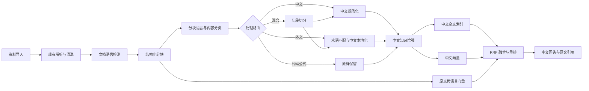

# Memorix 多语言资料库自适应处理与中文索引开发规划

> 版本：V1.0  
> 日期：2026-07-13  
> 依据：《多语言资料库自适应处理与中文索引开发文档》V1.0  
> 适用范围：Memorix 桌面端、本地运行时、云端 Web 与混合部署

## 1. 规划目标

本规划用于把目标方案落到 Memorix 当前代码与数据结构中，采用渐进扩展方式完成以下能力：

1. 原始资料、规范化内容、中文译文和 AI 增强结果分层保存，互不覆盖。
2. 对中文、外文和混合文档执行文档级与分块级语言识别。
3. 中文资料直通中文规范化，外文资料按 L1/L2/L3 策略建立中文理解层。
4. 同时保留中文检索路径和外文原文跨语言检索路径。
5. 中文问题能够召回中文、英文及混合资料，并返回中文回答和可追溯原文引用。
6. 本地 SQLite 与云端 PostgreSQL 使用一致的领域模型、状态语义和 API 契约。
7. 支持存量资料增量回填、模型升级、失败重试和局部重建。

## 2. 当前项目基线

### 2.1 已具备能力

Memorix 已具备多语言方案所需的大部分基础设施：

| 领域 | 当前实现 | 可复用程度 |
| --- | --- | --- |
| 资料导入 | URL、文本、PDF、Markdown、Word、表格、CSV 等来源处理器 | 高 |
| 主处理流水线 | 解析、清洗、文档创建、AI 摘要、评分、标签、实体、分块任务 | 高 |
| 文档模型 | 原文、Markdown、语言、摘要、评分、独立处理状态 | 高 |
| 分块模型 | 标题路径、前后块、页码、Hash、Embedding 状态 | 高 |
| 向量化 | 后台 Embedding Worker、模型元数据、重试与 stale 状态 | 高 |
| 检索 | 关键词、向量、混合检索、元数据加权 | 中 |
| 问答 | RAG 上下文、简单重排、引用生成 | 中 |
| 实体与标签 | 文档实体、实体类型、标签、图谱关系 | 高 |
| 双运行时 | SQLite 本地模式、PostgreSQL 云端模式、运行时路由 | 高 |
| 管理界面 | 文档、分块调试、检索、问答、实体、专题和处理状态 | 高 |

主要现有代码入口：

- `DocumentPipeline.ProcessSourceAsync`：当前主资料处理流水线。
- `ChunkingService.ChunkDocument`：按 Markdown 标题和滑动窗口分块。
- `EmbeddingWorker`：异步生成并保存分块向量。
- `SearchService.HybridSearchAsync`：关键词与向量混合检索。
- `QaService.AskAsync`：问答、检索、上下文和引用组装。
- `AppDbContext`：云端/桌面主数据库 EF Core 模型。
- `LocalKnowledgeRepository`、`CloudKnowledgeRepository`：本地与云端知识运行时。

### 2.2 当前数据基线

截至 2026-07-13，桌面资料库状态为：

| 指标 | 数量 |
| --- | ---: |
| 文档总数 | 3,522 |
| 英文文档 | 3,519 |
| 中文文档 | 3 |
| 分块总数 | 11,305 |
| 待向量化分块 | 11,265 |
| 已向量化分块 | 39 |
| 向量化失败分块 | 1 |

因此第一阶段不能只处理新增资料，还必须覆盖现有英文资料的中文元数据、语言回填与索引重建。

### 2.3 主要差距

| 目标能力 | 当前状态 | 差距与影响 | 优先级 |
| --- | --- | --- | --- |
| 可靠语言识别 | 仅按 CJK 字符比例返回 `zh` 或 `en` | 不支持日、韩、繁体、混合及置信度 | P0 |
| 分块级语言路由 | 文档只记录一个 Language | 混合文档无法正确处理 | P0 |
| 原文与规范化分离 | `ContentText` 同时承担清洗结果与检索内容 | 规范化、翻译可能覆盖证据语义 | P0 |
| 中文本地化表 | 不存在 | 无法保存译文版本、质量和审校状态 | P0 |
| 多路向量 | 分块只有单一主向量/单一 ChunkEmbedding 记录语义 | 无法区分原文、译文、摘要和假设问题 | P1 |
| 中文全文索引 | 当前主要是包含匹配/数据库搜索 | 中文分词、术语召回不足 | P1 |
| 跨语言召回评测 | 不存在 | 无法证明中文问题能召回外文证据 | P0 |
| RRF 融合 | 当前采用固定权重线性加权 | 不同分值尺度下稳定性不足 | P1 |
| 翻译任务与状态 | 不存在独立任务 | 无法重试、审计、按需回写 | P0 |
| 术语库 | 实体和标签可复用，但无中外文术语映射 | 翻译和查询扩展不一致 | P1 |
| 引用层级 | 已有文档/分块引用 | 尚未区分原文、译文、摘要来源 | P1 |
| 存量回填 | 无多语言回填任务 | 3,519 篇英文资料无法自动升级 | P0 |

## 3. 总体实施原则

### 3.1 不重建现有流水线

在 `DocumentPipeline` 的解析和清洗之后插入语言分类与本地化编排；保留现有摘要、标签、实体、分块、Embedding Worker 和问答入口。

### 3.2 不修改原文事实底座

- `Source.RawText`、原始文件和解析结果继续作为原始证据。
- `Document.ContentText` 在兼容期内保留现有语义。
- 新增原文、规范化文本和中文本地化字段/表。
- 中文译文、摘要、关键词和假设问题均标记来源及版本。

### 3.3 双数据库一致

所有模型变更必须同时覆盖：

1. EF Core `AppDbContext` 与 PostgreSQL/主 SQLite 数据库；
2. `SqliteInitializer` 和每工作区本地 SQLite；
3. `LocalKnowledgeRepository`；
4. `CloudKnowledgeRepository`；
5. API DTO 和前端类型。

禁止只修改 EF Migration 而遗漏本地运行时表结构。

### 3.4 先验证跨语言召回，再批量翻译

首个可用版本优先完成 L1 中文元数据与原文跨语言向量。只有评测证明无法满足中文召回时，才扩大 L3 全文翻译范围，避免不必要的模型成本。

## 4. 目标架构



## 5. 数据模型规划

### 5.1 `documents` 增量字段

在现有 `Document` 上增量增加：

| 字段 | 类型 | 说明 |
| --- | --- | --- |
| `TitleOriginal` | text nullable | 原始标题 |
| `TitleZh` | text nullable | 中文标题或原中文标题 |
| `PrimaryLanguage` | varchar(20) | BCP-47 主语言 |
| `LanguageDistribution` | JSON/text | 各语言比例和置信度 |
| `IsMultilingual` | bool | 是否为混合资料 |
| `LocalizationStrategy` | varchar(30) | none/metadata_only/on_demand/full/chunk_level/manual |
| `LocalizationLevel` | varchar(10) | L1/L2/L3 |
| `LanguageDetectStatus` | varchar(30) | 独立状态 |
| `LocalizationStatus` | varchar(30) | 独立状态 |
| `EnrichmentStatus` | varchar(30) | 中文知识增强状态 |
| `FulltextIndexStatus` | varchar(30) | 中文全文索引状态 |
| `ContentHash` | varchar(64) | 文档内容版本基准 |

兼容策略：首轮迁移保留现有 `Language`，新代码优先读取 `PrimaryLanguage`，为空时回退 `Language`。

### 5.2 `document_chunks` 增量字段

| 字段 | 类型 | 说明 |
| --- | --- | --- |
| `ContentOriginal` | text | 原始分块内容 |
| `ContentNormalized` | text nullable | 中文规范化内容 |
| `DetectedLanguage` | varchar(20) | 分块语言 |
| `LanguageConfidence` | decimal | 识别置信度 |
| `LanguageDistribution` | JSON/text | 混合比例 |
| `ContentType` | varchar(30) | heading/paragraph/table/code/formula/reference/caption |
| `ProcessingRoute` | varchar(30) | zh_direct/translate/mixed_split/keep_original/review/skip |
| `LocalizationRequired` | bool | 是否需要中文化 |
| `ChunkGroupId` | Guid nullable | 原文块与中文子块映射组 |
| `ParentChunkId` | Guid nullable | 父子分块关系 |
| `ParagraphStart/End` | int nullable | 段落定位 |
| `BoundingBox` | JSON/text nullable | OCR 引用区域 |

兼容策略：`ContentOriginal` 首次回填为当前 `Content`；当前 `Content` 暂不删除，待检索和前端全部迁移后再决定是否降级为兼容字段。

### 5.3 新表 `chunk_localizations`

保存机器译文和人工审校译文：

- `Id`、`ChunkId`、`UserId/WorkspaceId`；
- `LanguageCode`，首期固定支持 `zh-CN`；
- `HeadingLocalized`、`ContentLocalized`；
- `TranslationType`；
- `Model`、`PromptVersion`、`GlossaryVersion`；
- `QualityScore`、`ReviewStatus`；
- `SourceContentHash`；
- `CreatedAt`、`UpdatedAt`。

唯一键：`ChunkId + LanguageCode`。原文 Hash 改变后译文标记为 `stale`。

### 5.4 新表 `chunk_enrichments`

保存与译文分离的中文知识增强结果：

- 摘要；
- 中文关键词；
- 实体；
- 事实；
- 3～5 个中文假设问题；
- 模型、Prompt 与原文 Hash。

现有文档级 Summary、KeyPoints、Entity 和 Tag 保留；新增表负责分块级增强。

### 5.5 扩展 `chunk_embeddings`

在现有 `ChunkEmbedding` 增加：

- `LanguageCode`；
- `EmbeddingType`：original/localized/summary/hypothetical_question；
- `LocalizationId`；
- `SourceContentHash`；
- 唯一键调整为 `ChunkId + LanguageCode + EmbeddingType + Provider + Model`。

当前 `DocumentChunk.Embedding` 作为兼容缓存保留一个版本周期，新检索优先读取 `chunk_embeddings`。

### 5.6 新表 `terminology`

首期字段：源语言、源术语、目标语言、目标术语、别名、领域、优先级、审核状态和版本。术语库同时提供给：

- 翻译 Prompt；
- 中文查询扩展；
- 中文预分词；
- 实体别名归一化；
- 图谱节点展示。

## 6. 服务与接口设计

### 6.1 新增应用接口

```text
ILanguageDetectionService
IContentClassificationService
IChineseNormalizationService
ILocalizationService
ILocalizationQualityService
ITerminologyService
IChineseTokenizer
IRetrievalFusionService
IRerankerService
```

接口必须隐藏具体模型和数据库实现，便于本地模型、云模型以及不同全文索引后端切换。

### 6.2 处理任务类型

在现有 JobQueue 增加：

| JobType | 输入 | 输出 |
| --- | --- | --- |
| `language_detection` | DocumentId | 文档语言分布 |
| `chunk_language_detection` | DocumentId/ChunkId | 分块语言和路由 |
| `chinese_normalization` | ChunkId | 规范化中文 |
| `metadata_localization` | DocumentId | 中文标题、摘要、关键词 |
| `chunk_localization` | ChunkId | 中文译文 |
| `localization_quality` | LocalizationId | 质量分和异常项 |
| `chunk_enrichment_zh` | ChunkId | 中文增强结果 |
| `fulltext_index_zh` | ChunkId | 中文全文索引 |
| `embedding_original` | ChunkId | 原文向量 |
| `embedding_localized` | LocalizationId | 中文向量 |
| `embedding_hypothetical_question` | EnrichmentId | 问题向量 |

幂等键：`workspace + chunk + content_hash + task + model + prompt + glossary`。

### 6.3 API 增量

| API | 方法 | 用途 |
| --- | --- | --- |
| `/api/documents/{id}/language` | GET/PUT | 查看或人工修正主语言 |
| `/api/documents/{id}/localization-level` | PUT | 切换 L1/L2/L3 |
| `/api/documents/{id}/reprocess-language` | POST | 重跑语言与路由 |
| `/api/documents/{id}/chunks` | GET | 增加语言、路由、本地化状态 |
| `/api/chunks/{id}/route` | PUT | 人工修改处理路由 |
| `/api/chunks/{id}/translate` | POST | 翻译/重译 |
| `/api/chunks/{id}/localizations` | GET | 查看译文版本 |
| `/api/chunks/{id}/review` | POST | 审校与锁定 |
| `/api/terminology` | GET/POST/PUT | 术语维护 |
| `/api/search` | POST | 增加 language、evidenceMode、fusionMode |
| `/api/workspaces/reindex-multilingual` | POST | 存量回填与重建 |

所有写接口支持 `Idempotency-Key`。

## 7. 中文全文与向量索引方案

### 7.1 桌面端 SQLite

不依赖难以打包的原生中文扩展，首期采用：

1. `IChineseTokenizer` 在应用层生成空格分隔的预分词文本；
2. SQLite FTS5 保存标题、章节、中文内容、摘要、关键词和实体；
3. 精确短语和产品型号额外保留未分词字段；
4. FTS 表通过触发器或索引任务增量维护；
5. FTS 不可用时回退现有关键词搜索，但记录降级原因。

首期分词实现可采用可替换词典方案；术语表中的高优先级词条必须作为完整词项。

### 7.2 云端 PostgreSQL

推荐顺序：

1. 有运维条件时使用 PGroonga；
2. 无 PGroonga 时使用应用层预分词 + `tsvector`；
3. `pg_trgm` 只作为短文本和模糊匹配补充；
4. 向量继续使用 pgvector。

禁止让桌面端和云端采用不同的检索字段语义；只允许索引后端不同。

### 7.3 Embedding 策略

- 中文原始块：一个中文向量。
- 英文/外文块：原文跨语言向量 + 可选中文译文向量。
- L1：中文标题/摘要向量 + 原文向量。
- L2：命中块生成中文译文向量并回写。
- L3：全部有效块生成中文译文向量。
- 代码、公式、参考文献按内容类型决定是否向量化。

Embedding 模型不得硬编码；模型配置需记录语言能力、维度、最大输入和版本。

## 8. 检索与问答改造

### 8.1 召回通道

中文查询并行执行：

1. 中文 FTS/BM25；
2. 中文原文或译文向量；
3. 外文原文跨语言向量；
4. 中文假设问题向量；
5. 术语、实体和关键词精确匹配。

### 8.2 融合方式

将 `SearchService` 当前固定权重线性加权逐步替换为 RRF：

```text
RRFScore(d) = Σ 1 / (k + rank_i(d))
```

推荐 `k=60`，按 `ChunkId/ChunkGroupId` 去重。新旧融合算法通过配置开关并行运行，先记录离线指标，再切换默认值。

### 8.3 重排

把 `QaService` 当前重排逻辑抽取为 `IRerankerService`：

- 本地无模型时使用现有启发式重排；
- 有本地/云端 Reranker 时使用模型重排；
- 重排输入包含中文查询、中文候选文本、原文标题与章节；
- 不把 AI 摘要当作最终事实证据。

### 8.4 引用契约

每条引用增加：

- `documentId`、`chunkId`、`chunkGroupId`；
- 文档标题和章节；
- 页码、段落、offset/bounding box；
- `contentLanguage`；
- `displayContentSource`：original/normalized/machine_translated/human_reviewed/summary；
- 中文展示片段；
- 原文证据片段；
- 原始 URL 或文件定位。

前端明确显示“中文原文”“系统译文”“人工审校”“AI 摘要”“外文原文”。

## 9. 分阶段开发计划

### 阶段 0：基线、评测与兼容层（1 个迭代）

目标：在改模型前建立可比较基线。

任务：

- 建立中文问题—英文证据、中文问题—中文证据、混合文档三类评测集。
- 记录当前 Recall@5/10、MRR、引用命中率和问答无资料率。
- 为语言、翻译、索引和融合增加 Feature Flags。
- 增加处理耗时、模型 Token、失败原因和索引积压指标。
- 为现有 3,522 篇资料生成只读迁移报告。

退出条件：评测命令可重复运行，旧功能有稳定基线，所有新能力可关闭回退。

### 阶段 1：语言识别与数据底座（2 个迭代）

目标：可靠区分中文、外文和混合分块，保持原文不变。

任务：

- 增加 Document/DocumentChunk 字段及新表 Migration。
- 同步更新本地 SQLite 初始化脚本和双 Repository。
- 实现 `ILanguageDetectionService`，输出语言、分布和置信度。
- 实现代码、公式、URL、表格、参考文献内容分类。
- 分块后生成 `ProcessingRoute`。
- 将 3,519 篇英文和 3 篇中文文档回填到新字段。
- 增加文档详情与分块调试界面的语言、路由和状态展示。

退出条件：抽样语言识别准确率不低于 95%，混合文档分块路由准确率不低于 90%，原文 Hash 不变化。

### 阶段 2：L1 中文知识层与术语库（2 个迭代）

目标：以较低成本让外文资料获得中文标题、摘要、关键词和实体。

任务：

- 实现中文规范化服务。
- 建立术语表及管理 API。
- 建立 `chunk_localizations`、`chunk_enrichments`。
- 对英文文档执行 L1 元数据中文化。
- 翻译质量检查数字、日期、单位、否定词和专名。
- 增加失败重试、人工修正语言、术语和路由入口。
- 在文档列表和详情页提供原文/中文视图切换。

退出条件：L1 处理成功率不低于 98%，数字日期一致率不低于 99.5%，中文标题/摘要覆盖率不低于 95%。

### 阶段 3：中文全文索引与多路检索（2 个迭代）

目标：中文问题稳定召回中文与英文资料。

任务：

- SQLite 建立中文预分词 FTS5 索引。
- PostgreSQL 建立 PGroonga 或预分词 tsvector 索引。
- 扩展 `chunk_embeddings` 支持多语言和多类型向量。
- 验证并选择跨语言 Embedding 模型。
- 实现术语查询扩展和 RRF。
- 按 ChunkGroup 去重并接入可替换 Reranker。
- 增加检索诊断页面，展示各召回通道和排名。

退出条件：中文查询跨语言 Recall@10 相对基线提升至少 20%，无资料误判率显著下降，P95 检索延迟满足部署目标。

### 阶段 4：L2/L3 按需翻译与问答引用（2 个迭代）

目标：命中外文内容可即时中文展示，并可复用。

任务：

- 实现命中式分块翻译与回写。
- 增加并发任务锁和幂等约束。
- 支持文档 L1/L2/L3 升降级。
- 为高频、收藏或核心专题自动建议 L3。
- 问答同时返回中文展示内容和原文证据。
- 前端增加译文来源、审校状态和原文定位。

退出条件：按需翻译缓存复用率可观测；重复并发不产生重复译文；引用均能回到原文块。

### 阶段 5：生产化与人工审核（持续迭代）

目标：可运营、可升级、可审计。

任务：

- 建立低置信度和高风险资料人工审核队列。
- 支持人工译文锁定和版本回退。
- 按内容 Hash 执行派生内容失效与增量重建。
- 完善租户、工作区、角色和敏感级别的召回前过滤。
- 建立模型、Prompt、术语和索引版本看板。
- 定期运行多语言评测集并阻断质量回退。

## 10. 存量资料迁移方案

### 10.1 执行顺序

1. 备份数据库并生成文档/分块 Hash 清单。
2. 添加 nullable 新字段和新表，不修改旧字段。
3. 回填 `ContentOriginal = Content`。
4. 对文档和分块执行语言检测。
5. 中文块执行规范化，英文块先执行 L1。
6. 先清理当前 11,265 个待向量化积压，再建立新型向量任务。
7. 新旧检索并行对比。
8. 指标达标后切换默认中文检索。

### 10.2 批处理策略

- 每批 50～100 篇文档；
- 按 Topic、价值评分和访问频率排序；
- 每批完成后记录成功、失败、Token、耗时和 Hash；
- 失败不阻塞后续批次；
- 支持按 DocumentId、TopicId 和时间范围重跑；
- 本地设备空闲、接电并且网络允许时执行模型任务。

### 10.3 回滚

- 新字段和新表为增量结构，旧检索路径保留一个版本周期。
- Feature Flag 可切回旧 HybridSearch。
- 新索引可删除重建，不影响原始文档和原分块。
- 数据回滚只删除对应模型/版本生成的派生记录。

## 11. 前端规划

### 11.1 文档与专题

- 显示主语言、混合语言标识和中文化等级。
- 支持“中文视图 / 原文视图”。
- 筛选：语言、中文化状态、翻译等级、处理失败。
- 批量操作：生成中文摘要、升级 L3、重建索引。

### 11.2 文档详情

- 原文与译文并排或切换显示。
- 显示分块语言、路由、翻译模型、质量分和版本。
- 支持重新翻译、人工编辑、确认、锁定和恢复机器译文。

### 11.3 搜索与问答

- 搜索结果显示命中通道：中文全文、中文向量、跨语言向量、实体或术语。
- 显示原文语言和译文类型。
- 问答引用展开后同时显示中文内容和原文证据。
- 未完成 L2 时允许用户触发“翻译此段”。

### 11.4 设置与运维

- 默认中文化策略与成本上限。
- 翻译、Embedding、Reranker 模型配置。
- 术语库维护。
- 索引积压、失败任务和重建进度。

## 12. 测试与验收

### 12.1 自动化测试

- 语言检测单元测试：简中、繁中、英文、日文、韩文、混合、代码、乱码。
- 分块路由测试：标题、段落、表格、代码、公式和参考文献。
- 翻译质量规则测试：数字、日期、单位、货币、否定和专名。
- Migration 测试：SQLite 与 PostgreSQL 升级、回滚和幂等。
- Repository 契约测试：本地和云端结果一致。
- 检索融合测试：RRF 排名、去重、权限过滤。
- 问答引用测试：中文显示与原文 Chunk 映射。
- 存量回填测试：中断恢复、重复运行和版本失效。

当前项目缺少针对核心流水线、搜索和问答的系统化测试；阶段 0 必须先建立测试项目和固定样本库。

### 12.2 核心验收指标

| 指标 | 首期目标 |
| --- | ---: |
| 文档主语言识别准确率 | ≥ 95% |
| 分块语言识别准确率 | ≥ 93% |
| 混合分块路由准确率 | ≥ 90% |
| L1 处理成功率 | ≥ 98% |
| 数字/日期/单位一致率 | ≥ 99.5% |
| 中文跨语言 Recall@10 | 比当前基线提升 ≥ 20% |
| 引用原文定位成功率 | ≥ 99% |
| 重复翻译任务率 | < 0.5% |
| 无权限资料召回数 | 0 |

性能目标需在阶段 0 根据桌面设备和云端规格分别建立基线，不在未测量前写死统一数值。

## 13. 风险与控制

| 风险 | 影响 | 控制措施 |
| --- | --- | --- |
| 双数据库结构漂移 | 本地可用、云端失败或反之 | Repository 契约测试 + 双 Migration 清单 |
| 全文翻译成本失控 | 模型费用和处理时间过高 | 默认 L1，按命中升级 L2，核心资料才 L3 |
| 翻译改变事实 | 错误回答 | 数值规则校验 + 原文引用 + 高风险人工审核 |
| 跨语言模型能力不足 | 中文问题召回失败 | 模型评测后选型，保留译文向量补偿 |
| 中文分词词典不足 | 专业术语召回差 | 术语库驱动动态词典和查询扩展 |
| 存量索引积压 | 新功能无法验证 | 先治理 11,265 个待处理分块，限流批处理 |
| `DocumentPipeline` 继续膨胀 | 难维护和测试 | 拆分编排器与独立 Stage Handler |
| 派生内容版本混乱 | 旧译文污染检索 | Hash + 模型/Prompt/术语版本 + stale 状态 |

## 14. 建议的代码改造顺序

1. 新建多语言领域实体、DTO 和枚举常量。
2. 更新 `AppDbContext`、EF Migration 与 `SqliteInitializer`。
3. 更新 Local/Cloud Repository 接口与实现。
4. 增加语言检测、内容分类和中文规范化服务。
5. 把 `DocumentPipeline` 拆为可组合 Stage Handler，插入语言路由。
6. 扩展 JobQueue 和 Worker。
7. 增加术语、本地化、增强和多路向量服务。
8. 建立 SQLite/PostgreSQL 中文全文索引。
9. 重构 SearchService 为多路召回 + RRF + Reranker。
10. 更新 QaService 引用契约。
11. 更新 Web、桌面与移动端界面。
12. 执行存量回填、并行评测和灰度切换。

## 15. 首个里程碑建议

首个里程碑不包含全文翻译，范围控制为：

- 新数据模型与双数据库迁移；
- 文档级/分块级语言检测；
- 中文直通规范化；
- 英文文档 L1 中文标题与摘要；
- 原文跨语言向量；
- 中文术语扩展；
- 基础 RRF；
- 中文问答返回外文原文引用；
- 完成现有 3,522 篇资料的回填和评测。

该里程碑可以最早验证“中文用户是否能够有效使用外文资料”，同时将翻译成本、数据迁移风险和前端改造范围控制在可管理水平。

## 16. 完成定义

本规划完成的最终标准不是“所有外文均已翻译”，而是：

1. 任意资料均有可追溯原文证据。
2. 系统能够正确识别文档与分块语言并选择处理路径。
3. 中文问题能够稳定召回中文和外文资料。
4. 用户能够阅读中文展示，同时查看最终原文证据。
5. 译文、摘要、实体和向量可按内容 Hash 与版本增量重建。
6. SQLite 本地端和 PostgreSQL 云端行为一致。
7. 所有新能力可观测、可重试、可回滚并经过评测集验证。

