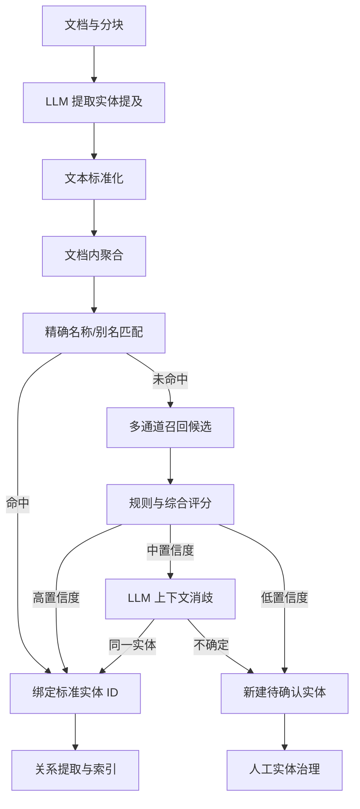

# Memorix 实体规范化、去重与消歧系统开发文档

> 文档版本：V1.0
> 编制日期：2026-07-26
> 适用项目：Memorix / AI 知识资产引擎
> 文档状态：开发规划稿
> 目标读者：产品经理、架构师、后端工程师、算法工程师、前端工程师、测试工程师

---

## 1. 文档概述

### 1.1 项目背景

Memorix 在对网页、报告、论文、资讯、笔记等内容进行 LLM 结构化处理时，会提取人物、公司、产品、技术、模型、数据集、事件等实体。由于来源语言、作者习惯、翻译方式、大小写、缩写、括号和模型输出存在差异，同一个客观实体经常被生成多个名称。

典型示例：

- 大语言模型
- 大型语言模型
- LLM
- 大语言模型（LLM）
- 大语言模型 (LLM)
- Large Language Model
- Large Language Models

如果直接以实体名称作为唯一对象，将导致：

- 搜索、统计和知识图谱节点分散；
- 同一实体的文档、标签和关系无法聚合；
- RAG 召回遗漏；
- 趋势分析和共现分析失真；
- 重复 embedding 增加存储与计算成本；
- 后续批量合并难以追溯，错误合并难以撤销。

### 1.2 建设目标

本系统需要实现：

1. 在 LLM 提取阶段减少非必要的实体重复；
2. 将“原文提及”和“标准实体”分离保存；
3. 通过规则、别名、字符串、向量、上下文和关系进行实体链接；
4. 为同一实体建立唯一、稳定的 `entity_id`；
5. 支持中文、英文、缩写、旧称和拼写变体；
6. 对存量重复实体进行批量发现、审核和合并；
7. 保证实体合并可审计、可重定向、可撤销；
8. 支持本地优先、云端处理及后续多端同步；
9. 为知识图谱、混合检索、RAG 和报告分析提供统一实体底座。

### 1.3 非目标

V1.0 不追求：

- 完全依靠 LLM 一次性解决所有实体消歧；
- 对所有领域建立完整权威知识图谱；
- 自动合并所有模糊候选；
- 仅通过 embedding 相似度决定实体是否相同；
- 删除原文中的原始实体写法；
- 将上下位概念、产品系列与具体版本强行合并。

### 1.4 核心原则

1. **名称可以有多个，实体身份只能有一个。**
2. **原文提及不可覆盖，标准实体可以修订。**
3. **先归一化实体，再生成正式关系。**
4. **错误合并的危害大于漏合并。**
5. **自动判断必须有置信度、依据和版本。**
6. **所有合并操作必须可追溯、可撤销。**
7. **规则处理确定性问题，LLM 处理语义歧义。**
8. **外部唯一标识符优先于名称相似度。**

---

## 2. 术语与概念模型

| 术语 | 英文 | 定义 | 示例 |
|---|---|---|---|
| 实体提及 | Entity Mention | 原文中实际出现的字符串 | “大型语言模型（LLM）” |
| 标准实体 | Canonical Entity | 系统中的唯一知识对象 | 大语言模型 |
| 标准名称 | Canonical Name | 标准实体的主名称 | 大语言模型 |
| 首选名称 | Preferred Name | 面向特定语言或用户显示的名称 | 中文“大语言模型” |
| 别名 | Entity Alias | 指向同一标准实体的其他名称 | LLM |
| 实体类型 | Entity Type | 实体所属类别 | TECHNOLOGY |
| 实体链接 | Entity Linking | 将实体提及绑定到标准实体的过程 | LLM → ENT-001 |
| 实体消歧 | Entity Disambiguation | 判断同名提及具体指向哪个实体 | Apple 公司/水果 |
| 实体合并 | Entity Merge | 将重复实体迁移到主实体 | ENT-102 → ENT-001 |
| 实体拆分 | Entity Split | 撤销错误聚合并拆成多个实体 | Gemini 模型/星座 |
| 候选实体 | Candidate Entity | 可能与提及相同的已有实体 | Top-K 候选 |
| 实体簇 | Entity Cluster | 被判定或疑似属于同一实体的一组记录 | LLM 名称簇 |

### 2.1 三层数据模型

系统必须区分以下三层：

1. **原文层**：保留原始 `mention_text` 和出现位置；
2. **实体层**：使用稳定的 `entity_id` 聚合知识；
3. **展示层**：按用户语言和偏好显示首选名称。

示例：

```text
原文：LLM 正在改变软件开发
提及：mention_text = "LLM"
绑定：entity_id = "ENT_TECH_000001"
中文展示：大语言模型
英文展示：Large Language Model
```

---

## 3. 实体类型体系

### 3.1 基础实体类型

```text
PERSON          人物
ORGANIZATION    组织
COMPANY         公司
INSTITUTION     机构
PRODUCT         产品
MODEL_FAMILY    模型系列
MODEL           具体模型或版本
TECHNOLOGY      技术
FRAMEWORK       框架
LIBRARY         软件库
DATASET         数据集
STANDARD        标准或协议
LOCATION        地点
EVENT           事件
INDUSTRY        行业
CONCEPT         概念
DOCUMENT        文档或论文
```

### 3.2 类型治理规则

- LLM 不得自由创建新的类型名称；
- 类型字典由平台维护，并支持版本化；
- 类型变更必须记录变更前后值；
- `MODEL_FAMILY` 与 `MODEL` 必须分离；
- `COMPANY`、`PRODUCT` 与 `BRAND` 不得默认合并；
- 类型不兼容时禁止自动合并；
- 一个实体确需多类型时，通过 `entity_type_mapping` 扩展，不建议在主表存逗号分隔值。

### 3.3 典型区分

| 名称 | 推荐类型 | 备注 |
|---|---|---|
| OpenAI | COMPANY | 公司 |
| GPT | MODEL_FAMILY | 模型系列 |
| GPT-4 | MODEL | 具体模型 |
| 大语言模型 | TECHNOLOGY | 技术类别 |
| Transformer | TECHNOLOGY | 模型架构 |
| PyTorch | FRAMEWORK | 开发框架 |

---

## 4. 总体架构与处理流程



### 4.1 推荐流水线顺序

```text
文档解析
→ 文本清洗
→ 文档分块
→ 实体提及抽取
→ 文档内实体聚合
→ 名称标准化
→ 全局候选召回
→ 实体链接与消歧
→ 新实体注册
→ 别名学习
→ 关系提取
→ embedding 与搜索索引
→ 人工治理
```

### 4.2 核心服务

| 服务 | 职责 |
|---|---|
| Entity Extraction Service | 从文本提取实体提及 |
| Normalization Service | 字符、括号、大小写、空格等标准化 |
| Candidate Retrieval Service | 从实体库召回 Top-K 候选 |
| Entity Resolution Service | 规则评分、链接与消歧 |
| Entity Registry Service | 标准实体和别名注册 |
| Entity Merge Service | 合并、迁移、重定向与撤销 |
| Entity Governance Service | 人工审核与质量治理 |
| Index Sync Service | 同步全文索引、向量索引和图谱 |

---

## 5. 事前控制：LLM 提取阶段

### 5.1 提取与归一化分离

建议将一次处理拆成两个任务：

1. **实体提取任务**：忠实记录原文中出现了什么；
2. **实体归一化任务**：判断它对应哪个已有实体。

不得因为 LLM 推荐了标准名而丢弃 `mention_text`。

### 5.2 LLM 输出 JSON Schema

```json
{
  "mention": "大型语言模型（LLM）",
  "canonical_name_suggestion": "大语言模型",
  "entity_type": "TECHNOLOGY",
  "aliases": [
    {
      "value": "大型语言模型",
      "language": "zh",
      "alias_type": "SPELLING_VARIANT"
    },
    {
      "value": "LLM",
      "language": "en",
      "alias_type": "ABBREVIATION"
    }
  ],
  "description": "基于大规模语料训练的语言模型类别",
  "evidence": "大型语言模型（LLM）正在改变软件开发方式",
  "start_offset": 0,
  "end_offset": 11,
  "confidence": 0.96
}
```

### 5.3 提示词约束

系统提示词至少包含：

```text
1. mention 必须保留原文，不得改写。
2. canonical_name_suggestion 使用最通用、稳定的名称。
3. 不要将“中文名（英文缩写）”整体作为标准名称。
4. 中文名称、英文全称、缩写分别写入 aliases。
5. 大小写、单复数、全半角和括号差异不得创建新实体。
6. 公司、品牌、产品、模型系列和具体版本必须分别识别。
7. 无法确认是否同一实体时，不得强制合并。
8. 优先复用系统提供的已有实体候选及其 entity_id。
9. 不得编造外部标识符、别名或实体关系。
10. 输出必须严格符合 JSON Schema。
```

### 5.4 候选实体注入

处理新分块前，系统先通过名称和 embedding 召回 5～20 个候选：

```json
{
  "existing_entity_candidates": [
    {
      "entity_id": "ENT_TECH_000001",
      "canonical_name": "大语言模型",
      "preferred_name_en": "Large Language Model",
      "aliases": ["大型语言模型", "LLM"],
      "entity_type": "TECHNOLOGY",
      "description": "基于大规模语料训练的语言模型类别"
    }
  ]
}
```

归一化输出：

```json
{
  "mention": "大型语言模型（LLM）",
  "resolution": "LINK_EXISTING",
  "matched_entity_id": "ENT_TECH_000001",
  "confidence": 0.97,
  "reason_codes": [
    "ALIAS_EXACT_MATCH",
    "TYPE_COMPATIBLE",
    "CONTEXT_CONSISTENT"
  ]
}
```

未匹配时：

```json
{
  "resolution": "CREATE_NEW",
  "matched_entity_id": null,
  "confidence": 0.81,
  "reason_codes": ["NO_COMPATIBLE_CANDIDATE"]
}
```

### 5.5 批次内临时实体表

同一文档内先生成临时实体：

```text
TEMP-001 → 大语言模型
TEMP-002 → OpenAI
```

后续分块出现“LLM”时优先匹配 `TEMP-001`，文档处理结束后再与全局实体库对齐。这样可以减少长文分块造成的重复。

### 5.6 抽取版本管理

每条提取记录必须保存：

- 模型名称；
- 模型版本；
- prompt 版本；
- JSON Schema 版本；
- 任务批次；
- 提取时间；
- 原始响应或可审计响应摘要；
- 解析状态与错误码。

---

## 6. 名称标准化规则

### 6.1 基础规则

`normalized_name` 仅用于匹配，不能覆盖原始名称。建议处理：

1. Unicode NFKC 标准化；
2. 全角转半角；
3. 英文转小写；
4. 去除首尾空格；
5. 连续空格合并；
6. 中英文括号统一；
7. 连字符和连接符统一；
8. 去除无意义外围标点；
9. 英文常见单复数归一；
10. 公司后缀、版本号等按类型单独处理。

### 6.2 括号拆解

以下写法：

```text
大语言模型 (LLM)
大语言模型（LLM）
大型语言模型（Large Language Model，LLM）
```

应拆为：

```text
primary_name = 大语言模型
full_name_alias = Large Language Model
abbreviation_alias = LLM
```

括号内容不能一律视为别名。诸如“OpenAI（公司）”中的“公司”属于类型说明。

### 6.3 缩写确认

缩写自动绑定至少满足一项：

- 文本中存在明确的“全称（缩写）”定义；
- 缩写可由英文全称合理生成；
- 命中已人工确认的别名；
- 上下文、类型和描述一致，综合评分达到阈值。

对 `AI`、`ML`、`AGI` 等高歧义缩写可设独立审核阈值。

### 6.4 多语言处理

实体需要分别保存：

- `canonical_name`：内部默认标准名；
- `preferred_name_zh`：中文首选名；
- `preferred_name_en`：英文首选名；
- `abbreviation`：首选缩写；
- 其他语言名称：存入别名表。

搜索时允许多语言召回，展示时根据用户语言选择首选名称。

---

## 7. 候选召回与实体消歧

### 7.1 多通道候选召回

| 通道 | 适用场景 | 建议 Top-K |
|---|---|---:|
| 标准名精确匹配 | 完全相同 | 5 |
| 别名精确匹配 | 已知别名 | 10 |
| 标准化键匹配 | 大小写、括号、空格差异 | 10 |
| 模糊字符串匹配 | 拼写差异 | 10 |
| 缩写匹配 | LLM、RAG、NLP | 20 |
| 多语言词典匹配 | 中英文对应 | 10 |
| 名称 embedding | 名称语义近似 | 20 |
| 描述/上下文 embedding | 同名消歧 | 20 |
| 图关系近邻 | 关联公司、产品、人物一致 | 10 |
| 外部 ID | DOI、ORCID、域名等 | 5 |

各通道结果去重后，最多保留 20 个候选进入评分。

### 7.2 Blocking 策略

存量实体不得进行全表两两比较。可以按以下键分桶：

- `entity_type + normalized_name`；
- `entity_type + abbreviation`；
- `entity_type + 拼音首字母`；
- `entity_type + 名称前缀`；
- `entity_type + embedding cluster`；
- `external_id_type + external_id_value`；
- 共同关系邻居；
- 相同官网域名或模型仓库 ID。

### 7.3 综合评分

推荐初始公式：

\[
Score =
0.30S_{name} +
0.20S_{alias} +
0.20S_{description} +
0.15S_{context} +
0.10S_{relation} +
0.05S_{source}
\]

各项定义：

| 分项 | 含义 |
|---|---|
| `S_name` | 标准名和提及名称的字符相似度 |
| `S_alias` | 别名、缩写、多语言名称命中程度 |
| `S_description` | 实体描述向量相似度 |
| `S_context` | 当前提及上下文与候选上下文相似度 |
| `S_relation` | 关联人物、公司、产品、地点是否一致 |
| `S_source` | 来源可靠性及外部词典权重 |

### 7.4 硬性约束

以下约束优先于综合分数：

- 外部唯一 ID 冲突：禁止合并；
- 实体类型不兼容：禁止自动合并；
- 一个是系列、一个是具体版本：禁止合并；
- 明确版本号不同：禁止合并；
- 母公司与子公司：禁止合并；
- 品牌与公司：默认禁止合并；
- 上位概念与下位概念：建立关系，不合并；
- 时间、地点或关键属性明显冲突：进入人工审核。

### 7.5 初始阈值

| 综合分数 | 默认动作 |
|---:|---|
| `≥ 0.92` | 自动绑定已有实体 |
| `0.78～0.92` | LLM 二次消歧 |
| `0.60～0.78` | 进入人工审核 |
| `< 0.60` | 新建待确认实体 |

阈值必须按实体类型独立配置。例如公司、人物应比概念类实体更保守。

### 7.6 LLM 二次消歧

LLM 输入：

- 原始提及；
- 前后文；
- 文档标题与来源；
- 候选实体列表；
- 类型、描述、别名；
- 关键关系邻居；
- 外部标识符；
- 冲突属性。

输出：

```json
{
  "decision": "SAME_ENTITY",
  "target_entity_id": "ENT_TECH_000001",
  "confidence": 0.94,
  "reason_codes": [
    "ABBREVIATION_MATCH",
    "DESCRIPTION_MATCH",
    "CONTEXT_CONSISTENT"
  ],
  "conflicts": []
}
```

`decision` 枚举：

```text
SAME_ENTITY
DIFFERENT_ENTITY
INSUFFICIENT_EVIDENCE
RELATED_BUT_NOT_SAME
```

不得只保存自由文本理由，必须保存结构化 `reason_codes`。

---

## 8. 数据库设计

以下为逻辑模型，字段类型可根据 PostgreSQL、SQLite 或 SQL Server 实际调整。

### 8.1 标准实体表 `entity`

```sql
CREATE TABLE entity (
    id                    UUID PRIMARY KEY,
    canonical_name        VARCHAR(500) NOT NULL,
    preferred_name_zh     VARCHAR(500),
    preferred_name_en     VARCHAR(500),
    abbreviation          VARCHAR(100),
    normalized_name       VARCHAR(500) NOT NULL,
    entity_type           VARCHAR(50) NOT NULL,
    description           TEXT,
    status                VARCHAR(30) NOT NULL DEFAULT 'ACTIVE',
    confidence            DECIMAL(5,4),
    merged_into_id        UUID,
    is_verified           BOOLEAN NOT NULL DEFAULT FALSE,
    source_count          INTEGER NOT NULL DEFAULT 0,
    mention_count         INTEGER NOT NULL DEFAULT 0,
    created_at            TIMESTAMP NOT NULL,
    updated_at            TIMESTAMP NOT NULL,
    version               INTEGER NOT NULL DEFAULT 1
);
```

状态：

```text
ACTIVE
PENDING_REVIEW
MERGED
REJECTED
SPLIT
ARCHIVED
```

### 8.2 实体别名表 `entity_alias`

```sql
CREATE TABLE entity_alias (
    id                    UUID PRIMARY KEY,
    entity_id             UUID NOT NULL,
    alias                 VARCHAR(500) NOT NULL,
    normalized_alias      VARCHAR(500) NOT NULL,
    language              VARCHAR(20),
    alias_type            VARCHAR(30) NOT NULL,
    source_type           VARCHAR(30),
    source_id             UUID,
    confidence            DECIMAL(5,4),
    is_verified           BOOLEAN NOT NULL DEFAULT FALSE,
    valid_from            TIMESTAMP,
    valid_to              TIMESTAMP,
    created_at            TIMESTAMP NOT NULL,
    FOREIGN KEY (entity_id) REFERENCES entity(id)
);
```

别名类型：

```text
ABBREVIATION
TRANSLATION
FULL_NAME
SHORT_NAME
FORMER_NAME
SPELLING_VARIANT
TRANSLITERATION
MODEL_GENERATED
USER_DEFINED
```

同一 `normalized_alias` 可能对应不同实体，因此不能单独设置全局唯一约束。建议索引：

```sql
CREATE INDEX idx_entity_alias_lookup
ON entity_alias(normalized_alias, language, alias_type);
```

### 8.3 实体提及表 `entity_mention`

```sql
CREATE TABLE entity_mention (
    id                     UUID PRIMARY KEY,
    document_id            UUID NOT NULL,
    chunk_id               UUID,
    entity_id              UUID,
    mention_text           VARCHAR(500) NOT NULL,
    normalized_mention     VARCHAR(500),
    entity_type            VARCHAR(50),
    context_text           TEXT,
    start_offset           INTEGER,
    end_offset             INTEGER,
    extraction_model       VARCHAR(100),
    extraction_version     VARCHAR(50),
    prompt_version         VARCHAR(50),
    extraction_confidence  DECIMAL(5,4),
    resolution_status      VARCHAR(30) NOT NULL,
    resolution_method      VARCHAR(30),
    resolution_score       DECIMAL(5,4),
    created_at             TIMESTAMP NOT NULL,
    updated_at             TIMESTAMP NOT NULL,
    FOREIGN KEY (entity_id) REFERENCES entity(id)
);
```

解析状态：

```text
UNRESOLVED
AUTO_LINKED
LLM_LINKED
HUMAN_CONFIRMED
NEW_ENTITY
REJECTED
```

### 8.4 外部标识表 `entity_external_id`

```sql
CREATE TABLE entity_external_id (
    id                    UUID PRIMARY KEY,
    entity_id             UUID NOT NULL,
    id_type               VARCHAR(50) NOT NULL,
    id_value              VARCHAR(500) NOT NULL,
    source                VARCHAR(100),
    is_verified           BOOLEAN NOT NULL DEFAULT FALSE,
    created_at            TIMESTAMP NOT NULL,
    FOREIGN KEY (entity_id) REFERENCES entity(id)
);

CREATE UNIQUE INDEX uk_entity_external_id
ON entity_external_id(id_type, id_value);
```

可支持：

- DOI；
- ORCID；
- Wikidata QID；
- GitHub Repository；
- Hugging Face Model ID；
- 官网域名；
- 股票代码；
- 统一社会信用代码。

### 8.5 候选匹配表 `entity_resolution_candidate`

```sql
CREATE TABLE entity_resolution_candidate (
    id                    UUID PRIMARY KEY,
    mention_id            UUID NOT NULL,
    candidate_entity_id   UUID NOT NULL,
    name_score            DECIMAL(5,4),
    alias_score           DECIMAL(5,4),
    description_score     DECIMAL(5,4),
    context_score         DECIMAL(5,4),
    relation_score        DECIMAL(5,4),
    source_score          DECIMAL(5,4),
    total_score           DECIMAL(5,4),
    rank_no               INTEGER,
    decision              VARCHAR(30),
    reason_codes_json     TEXT,
    created_at            TIMESTAMP NOT NULL
);
```

### 8.6 实体合并日志 `entity_merge_log`

```sql
CREATE TABLE entity_merge_log (
    id                    UUID PRIMARY KEY,
    source_entity_id      UUID NOT NULL,
    target_entity_id      UUID NOT NULL,
    merge_reason          VARCHAR(500),
    merge_method          VARCHAR(30) NOT NULL,
    similarity_score      DECIMAL(5,4),
    operator_type         VARCHAR(20) NOT NULL,
    operator_id           UUID,
    snapshot_before       TEXT NOT NULL,
    migration_summary     TEXT,
    status                VARCHAR(30) NOT NULL,
    merged_at             TIMESTAMP NOT NULL,
    reverted_at           TIMESTAMP
);
```

### 8.7 禁止合并表 `entity_merge_blocklist`

用于沉淀人工审核结论，防止同一错误候选反复出现：

```sql
CREATE TABLE entity_merge_blocklist (
    id                    UUID PRIMARY KEY,
    entity_id_a           UUID NOT NULL,
    entity_id_b           UUID NOT NULL,
    reason_code           VARCHAR(50) NOT NULL,
    description           VARCHAR(500),
    created_by            UUID,
    created_at            TIMESTAMP NOT NULL
);
```

### 8.8 实体关系表

```sql
CREATE TABLE entity_relation (
    id                    UUID PRIMARY KEY,
    source_entity_id      UUID NOT NULL,
    relation_type         VARCHAR(50) NOT NULL,
    target_entity_id      UUID NOT NULL,
    document_id           UUID,
    evidence_text         TEXT,
    confidence            DECIMAL(5,4),
    status                VARCHAR(30) NOT NULL,
    created_at            TIMESTAMP NOT NULL
);
```

关系示例：

```text
GPT-4 --INSTANCE_OF--> GPT
GPT --SUBCLASS_OF--> 大语言模型
GPT-4 --DEVELOPED_BY--> OpenAI
```

---

## 9. 实体合并与存量治理

### 9.1 存量处理流程

1. 扫描存量实体并生成标准化键；
2. 按类型和 Blocking 规则生成候选簇；
3. 计算字符串、别名、向量、上下文和关系分数；
4. 过滤类型冲突和禁止合并对；
5. 高置信度候选进入自动合并队列；
6. 中等置信度候选进入审核队列；
7. 选择主实体；
8. 事务内迁移所有引用；
9. 旧实体标记为 `MERGED` 并保留重定向；
10. 重建搜索、向量和图谱索引；
11. 记录完整合并快照；
12. 进行抽样质量检查。

### 9.2 主实体选择

主实体评分可参考：

- 已人工确认；
- 命中权威词典；
- 外部 ID 完整；
- 来源数量更多；
- 提及次数更多；
- 描述和属性更完整；
- 关系数量更多；
- 名称更稳定；
- 首次创建时间更早。

不得只按名称最短或创建时间最早选择。

### 9.3 合并迁移范围

合并必须迁移：

- `entity_mention.entity_id`；
- 实体别名；
- 外部标识符；
- 文档实体关联；
- 标签和用户收藏；
- 实体关系的源端和目标端；
- 摘要、报告和图谱引用；
- 全文搜索索引；
- embedding 索引；
- 共现统计和趋势统计；
- 用户批注与个性化元数据。

### 9.4 合并事务

建议伪代码：

```text
BEGIN TRANSACTION

锁定 source_entity 与 target_entity
校验 source 未被再次合并
校验 target 状态为 ACTIVE
校验不存在硬冲突或 blocklist
保存 source/target 完整快照
迁移 mentions、aliases、relations、external_ids
去除迁移后重复关系和重复别名
source.status = MERGED
source.merged_into_id = target.id
target.version += 1
写入 entity_merge_log
写入 outbox_event

COMMIT
```

索引更新建议通过 Outbox 异步完成，避免数据库事务同时依赖搜索服务或向量库。

### 9.5 旧 ID 重定向

任何 API 接收到已合并的实体 ID 时，应沿 `merged_into_id` 找到最终实体，并返回：

```json
{
  "requested_entity_id": "ENT-102",
  "resolved_entity_id": "ENT-001",
  "redirected": true
}
```

需要防止重定向环路，并在合并时进行校验。

### 9.6 撤销合并

撤销要求：

- 使用合并前快照恢复；
- 恢复原实体状态；
- 恢复可明确归属的提及、别名、关系和属性；
- 对合并后新增的数据进入人工分配；
- 写入撤销日志；
- 重建相关索引；
- 不直接删除原合并记录。

若合并后两个实体共同新增大量数据，应采用“实体拆分任务”，而非简单事务回滚。

---

## 10. 避免错误合并

### 10.1 上下位概念

以下实体不得合并：

```text
人工智能 ≠ 生成式人工智能
大语言模型 ≠ GPT
GPT ≠ GPT-4
Claude ≠ Claude 3.5 Sonnet
```

应建立 `SUBCLASS_OF`、`INSTANCE_OF` 或 `BELONGS_TO_FAMILY` 关系。

### 10.2 系列与版本

以下名称相似，但属于不同实体：

```text
GPT-4
GPT-4 Turbo
GPT-4o
GPT-4.1
```

版本号、发布日期、开发方和模型 ID 是重要消歧字段。

### 10.3 同名不同实体

```text
Apple：公司 / 水果
Claude：模型 / 人名
Gemini：模型 / 星座 / 平台
```

必须结合类型、上下文、来源和关系进行判断。

### 10.4 历史名称

组织改名时可保存：

```text
alias_type = FORMER_NAME
valid_from
valid_to
```

组织改名通常仍是同一实体；母公司、子公司、品牌和业务线通常不是同一实体。

---

## 11. API 设计

### 11.1 提交实体解析

```http
POST /api/v1/entity-resolution/resolve
```

请求：

```json
{
  "document_id": "DOC-001",
  "chunk_id": "CHK-001",
  "mention": "大型语言模型（LLM）",
  "entity_type": "TECHNOLOGY",
  "context": "大型语言模型（LLM）正在改变软件开发方式",
  "language": "zh"
}
```

响应：

```json
{
  "resolution_status": "AUTO_LINKED",
  "entity_id": "ENT_TECH_000001",
  "canonical_name": "大语言模型",
  "score": 0.97,
  "method": "ALIAS_EXACT_MATCH",
  "candidates": []
}
```

### 11.2 查询候选实体

```http
GET /api/v1/entities/candidates?name=LLM&type=TECHNOLOGY&topK=10
```

### 11.3 创建新实体

```http
POST /api/v1/entities
```

### 11.4 添加别名

```http
POST /api/v1/entities/{entityId}/aliases
```

### 11.5 预览合并影响

```http
POST /api/v1/entities/merge-preview
```

返回：

- 待迁移提及数量；
- 待迁移关系数量；
- 重复别名；
- 关系冲突；
- 外部 ID 冲突；
- 索引影响；
- 是否允许自动合并。

### 11.6 执行合并

```http
POST /api/v1/entities/merge
```

请求：

```json
{
  "source_entity_ids": ["ENT-102", "ENT-315"],
  "target_entity_id": "ENT-001",
  "reason": "同一技术概念的中英文及缩写",
  "expected_target_version": 8
}
```

### 11.7 撤销合并

```http
POST /api/v1/entities/merges/{mergeLogId}/revert
```

### 11.8 API 通用要求

- 所有写接口支持幂等键；
- 合并接口使用乐观锁；
- 权限区分查看、审核、合并和撤销；
- 批量任务返回任务 ID；
- 提供进度、失败原因和重试能力；
- 响应中不得只返回字符串名称，必须返回 `entity_id`。

---

## 12. 实体治理后台

### 12.1 重复候选列表

筛选项：

- 实体类型；
- 综合分数区间；
- 来源；
- 语言；
- 审核状态；
- 发现时间；
- 是否存在硬冲突；
- 提及次数。

列表展示：

- 候选名称；
- 标准名称；
- 类型；
- 相似度；
- 来源数量；
- 上下文示例；
- 推荐主实体；
- 风险标识。

### 12.2 候选对比详情

左右对比：

- 标准名与别名；
- 类型；
- 描述；
- 外部 ID；
- 来源文档；
- 上下文证据；
- 关系邻居；
- 模型判断；
- 冲突项；
- 合并影响预览。

操作：

- 确认合并；
- 拒绝合并；
- 加入禁止合并；
- 修改标准名；
- 添加别名；
- 建立上下位或关联关系；
- 暂缓审核。

### 12.3 未解析实体

优先级建议：

\[
Priority = MentionCount \times SourceCount \times BusinessWeight
\]

高频、跨来源、影响检索的实体优先审核。

### 12.4 可疑错误合并

定期检测：

- 合并后类型冲突；
- 多个互斥外部 ID；
- 描述向量差异过大；
- 同一文档出现自冲突关系；
- 实体连接度异常增长；
- 用户频繁修改首选名称；
- 合并后检索点击率下降。

### 12.5 合并历史

展示：

- 操作者；
- 操作时间；
- 来源实体和目标实体；
- 判断依据；
- 数据迁移统计；
- 合并前快照；
- 索引同步状态；
- 是否可撤销。

---

## 13. 搜索、RAG 与知识图谱适配

### 13.1 搜索索引

索引文档建议包含：

```json
{
  "entity_id": "ENT_TECH_000001",
  "canonical_name": "大语言模型",
  "preferred_name_zh": "大语言模型",
  "preferred_name_en": "Large Language Model",
  "aliases": ["大型语言模型", "LLM"],
  "entity_type": "TECHNOLOGY",
  "description": "...",
  "source_count": 128,
  "mention_count": 942
}
```

查询 “LLM” 时，应召回标准实体和所有绑定文档，但原文片段仍显示原始名称。

### 13.2 embedding 策略

不建议为每个拼写变体生成独立实体向量。推荐：

- 标准实体生成一条描述向量；
- 别名可生成轻量名称向量或放入同一检索文本；
- 实体描述变更时异步重建向量；
- 提及上下文向量保留在文档或分块层；
- 合并后删除或失效旧实体向量，并重建主实体向量。

实体 embedding 输入可采用：

```text
[类型] TECHNOLOGY
[中文名] 大语言模型
[英文名] Large Language Model
[缩写] LLM
[别名] 大型语言模型
[描述] 基于大规模语料训练的语言模型类别
```

### 13.3 RAG 查询扩展

用户查询命中任意别名后，内部扩展为：

```text
entity_id = ENT_TECH_000001
aliases = [大语言模型, 大型语言模型, LLM, Large Language Model]
```

召回阶段以 `entity_id` 过滤或加权，生成答案时按用户语言展示首选名称。

### 13.4 图谱约束

- 图节点使用 `entity_id`；
- 节点标签使用首选名称；
- 原文证据保留 `mention_text`；
- 合并后边迁移并去重；
- 禁止生成 `entity_id` 指向自身的无意义关系；
- 同一关系可保留多份文档证据，但图边应支持聚合展示。

---

## 14. 本地与云端双模式适配

### 14.1 本地优先

- 本地生成 UUID/ULID 实体 ID；
- 本地实体、别名和合并日志完整保存；
- 离线状态下可完成规则匹配和本地模型消歧；
- 云端不可用时中低置信度实体进入待审核队列；
- 不得因离线直接强制创建大量标准实体。

### 14.2 云端同步

多设备同步时需区分：

- 实体内容同步；
- 别名集合合并；
- 用户首选显示名；
- 合并操作事件；
- 撤销事件；
- 禁止合并对；
- 人工确认状态。

### 14.3 冲突处理

| 冲突 | 推荐策略 |
|---|---|
| 两端分别创建同一实体 | 云端生成重复候选，不直接覆盖 |
| 一端合并、另一端修改旧实体 | 先解析重定向，再将修改应用到主实体或进入审核 |
| 两端目标实体不同 | 进入合并冲突队列 |
| 别名新增 | 集合合并，保留来源 |
| 首选名称不同 | 作为用户偏好处理，不修改全局标准名 |
| 一端撤销合并 | 基于事件顺序和版本进行人工或规则裁决 |

合并事件必须全局有序或具备可比较的逻辑时钟。

---

## 15. 权限、审计与安全

### 15.1 权限建议

| 权限 | 说明 |
|---|---|
| `entity.read` | 查看实体 |
| `entity.create` | 创建实体 |
| `entity.alias.manage` | 管理别名 |
| `entity.review` | 审核候选 |
| `entity.merge` | 执行合并 |
| `entity.merge.revert` | 撤销合并 |
| `entity.type.manage` | 管理类型字典 |
| `entity.rule.manage` | 管理匹配规则和阈值 |

### 15.2 审计要求

记录：

- 用户和设备；
- 请求 ID；
- 操作前后数据；
- 规则、模型和 prompt 版本；
- 候选及分数；
- 决策原因码；
- 执行时间；
- 索引同步结果；
- 撤销链路。

---

## 16. 性能与可靠性

### 16.1 性能目标

建议初始目标：

| 场景 | 指标 |
|---|---:|
| 精确别名查询 P95 | ≤ 100 ms |
| Top-K 候选召回 P95 | ≤ 500 ms |
| 单提及规则解析 P95 | ≤ 800 ms |
| LLM 消歧 | 异步或 ≤ 30 s |
| 1 万实体候选扫描 | ≤ 10 min |
| 合并事务 | ≤ 5 s，不含异步索引 |

### 16.2 幂等与重试

- 提取任务使用 `document_id + chunk_id + extraction_version` 作为幂等维度；
- 解析任务使用 `mention_id + resolver_version`；
- 合并请求必须带幂等键；
- 索引更新使用 Outbox；
- 失败任务进入重试队列；
- 超过重试上限进入死信和人工处理；
- 重跑不得重复创建实体或别名。

### 16.3 并发控制

- 合并时锁定来源实体和目标实体；
- 主实体更新使用版本号；
- 合并前重新计算目标是否已重定向；
- 批量任务按实体 ID 排序加锁，避免死锁；
- 同一实体簇只允许一个活动审核任务。

---

## 17. 测试方案

### 17.1 单元测试

- Unicode 和全半角转换；
- 中英文括号拆分；
- 空格、大小写和连接符处理；
- 缩写生成与验证；
- 类型兼容矩阵；
- 综合评分计算；
- 阈值边界；
- 重定向环路检测；
- 关系去重；
- 合并回滚。

### 17.2 典型测试集

#### 应合并

```text
大语言模型 / 大型语言模型 / LLM
检索增强生成 / Retrieval-Augmented Generation / RAG
OpenAI, Inc. / OpenAI
PyTorch / pytorch
```

#### 不应合并

```text
GPT / GPT-4
GPT-4 / GPT-4o
Claude / Claude 3.5 Sonnet
Apple 公司 / 苹果水果
Transformer 架构 / transformers 软件库
```

#### 应建立关系

```text
GPT-4 INSTANCE_OF GPT
GPT SUBCLASS_OF 大语言模型
GPT-4 DEVELOPED_BY OpenAI
```

### 17.3 集成测试

- 文档导入至实体链接完整链路；
- 候选召回与 LLM 消歧；
- 合并后的搜索索引同步；
- 合并后的知识图谱边迁移；
- 旧实体 ID 重定向；
- 合并撤销；
- 本地离线创建后与云端同步；
- 多设备冲突；
- 批量任务断点续跑。

### 17.4 回归测试

建立人工标注的 Golden Dataset，至少包含：

- 1,000 个实体提及；
- 300 对应合并样本；
- 300 对不应合并样本；
- 100 个同名歧义样本；
- 100 个中英文和缩写样本；
- 100 个版本/系列边界样本。

每次修改规则、embedding 模型、LLM 或 prompt 后运行回归。

### 17.5 验收指标

| 指标 | 建议目标 |
|---|---:|
| 实体提及抽取准确率 | ≥ 92% |
| 自动链接准确率 | ≥ 97% |
| 别名精确命中准确率 | ≥ 99% |
| 错误自动合并率 | ≤ 0.5% |
| 未解析提及率 | ≤ 15% |
| 合并撤销率 | ≤ 1% |
| 人工审核一致率 | ≥ 95% |

上线初期应优先控制错误合并率，不应为了提高自动合并率降低安全阈值。

---

## 18. 监控与质量指标

### 18.1 核心指标

| 指标 | 含义 |
|---|---|
| Entity Duplicate Rate | 标准实体重复比例 |
| Mention Link Rate | 提及成功绑定比例 |
| Auto-link Precision | 自动绑定准确率 |
| False Merge Rate | 错误合并率 |
| Unresolved Mention Rate | 未解析提及比例 |
| Alias Reuse Rate | 已有别名复用比例 |
| Human Review Rate | 人工审核比例 |
| Merge Rollback Rate | 合并撤销比例 |
| Redirect Hit Rate | 旧 ID 被访问比例 |
| Index Sync Delay | 数据库与索引延迟 |

### 18.2 告警

- 错误合并率超过阈值；
- 单实体短期大量新增别名；
- 单实体关系数异常增长；
- 合并队列持续积压；
- LLM 消歧失败率异常；
- 索引同步延迟超过阈值；
- 重定向环路；
- 外部 ID 冲突；
- 同一规则版本的结果分布突然变化。

---

## 19. 分阶段实施计划

### 阶段一：基础数据模型与确定性去重

目标：解决大小写、括号、空格、缩写等高频重复。

任务：

- 建立实体、别名、提及、外部 ID 和合并日志表；
- 实现 Unicode、括号和空格标准化；
- 实现标准名和别名精确匹配；
- 实现文档内临时实体聚合；
- 改造 LLM JSON Schema；
- 建立 `entity_id` 引用；
- 实现旧 ID 重定向；
- 实现合并事务与审计。

验收：

- 示例中的 LLM 变体可归一到同一实体；
- 原文提及不丢失；
- 合并后所有引用正确迁移；
- 合并操作可追溯。

### 阶段二：智能候选召回

任务：

- 字符串模糊匹配；
- 多语言名称与缩写召回；
- embedding 候选召回；
- 类型兼容矩阵；
- 综合评分；
- 阈值配置中心；
- 候选匹配记录；
- 批量重复候选扫描。

验收：

- Top-K 候选召回率达到目标；
- 高置信度自动链接准确率达到 97%；
- 系列与版本不发生自动错误合并。

### 阶段三：LLM 上下文消歧

任务：

- 候选上下文组装；
- 结构化 reason codes；
- 同名实体消歧；
- 中英文对应判断；
- 公司、品牌、产品边界识别；
- 模型系列与版本识别；
- 失败降级与成本控制。

验收：

- LLM 无法确认时正确输出 `INSUFFICIENT_EVIDENCE`；
- 中等置信度样本准确率明显提升；
- 不因 LLM 自信表达绕过硬性规则。

### 阶段四：实体治理后台

任务：

- 重复候选列表；
- 候选对比详情；
- 合并影响预览；
- 未解析实体队列；
- 禁止合并表；
- 合并历史；
- 撤销与拆分；
- 人工确认结果反哺别名库。

验收：

- 审核人员可独立完成确认、拒绝、合并和撤销；
- 所有操作具备审计记录；
- 误判候选不再重复推送。

### 阶段五：存量迁移与全链路优化

任务：

- 扫描现有实体；
- 建立候选簇；
- 先人工抽检，再分批自动处理；
- 重建全文和向量索引；
- 修复知识图谱关系；
- 接入 RAG 查询扩展；
- 建立质量看板；
- 灰度放量。

---

## 20. 上线与迁移策略

### 20.1 影子运行

新解析器先仅记录建议，不修改现有实体绑定：

- 对比旧系统与新系统结果；
- 统计错误合并风险；
- 调整类型矩阵和阈值；
- 建立 Golden Dataset。

### 20.2 灰度上线

建议顺序：

1. 精确标准名匹配；
2. 人工确认别名匹配；
3. 括号与格式标准化；
4. 高置信度自动链接；
5. LLM 二次消歧；
6. 存量实体自动合并。

存量自动合并应最后启用。

### 20.3 数据备份

批量合并前必须：

- 完成数据库备份；
- 导出实体、别名、提及、关系和索引映射；
- 记录批次 ID；
- 设置单批上限；
- 支持批次级暂停；
- 进行合并后抽样检查。

---

## 21. 风险与应对

| 风险 | 影响 | 应对 |
|---|---|---|
| LLM 过度合并 | 污染图谱和检索 | 硬规则优先、提高阈值、可撤销 |
| 别名歧义 | 错绑实体 | 类型和上下文联合判断 |
| embedding 语义过近 | 上下位概念误合并 | 关系识别与版本规则 |
| 存量数据规模大 | 两两比较成本高 | Blocking + ANN |
| 本地云端冲突 | 合并链不一致 | 事件日志、版本和冲突队列 |
| 索引异步延迟 | 短期结果不一致 | Outbox、状态展示和重试 |
| 人工审核量过大 | 队列积压 | 高频优先、主动学习、阈值分层 |
| 模型升级结果漂移 | 质量波动 | 版本化、影子运行、Golden Dataset |

---

## 22. 推荐技术选型

结合 Memorix 本地优先和云端双模式，可采用：

| 能力 | 本地方案 | 云端方案 |
|---|---|---|
| 关系数据库 | SQLite / PostgreSQL | PostgreSQL |
| 模糊字符串 | RapidFuzz | RapidFuzz / pg_trgm |
| 全文检索 | SQLite FTS5 | PostgreSQL FTS / OpenSearch |
| 向量检索 | sqlite-vec / 本地向量库 | pgvector / OpenSearch |
| 任务队列 | 本地任务表 | Redis + Worker / MQ |
| LLM | LM Studio / Ollama | 模型 API |
| embedding | 多语言本地模型 | 可替换 embedding 服务 |
| 图谱 | 关系表起步 | 后续按需接入图数据库 |

V1.0 不建议一开始就引入独立图数据库。优先在关系数据库中完成实体身份、别名、提及和关系治理，待图查询需求明确后再扩展。

---

## 23. 开发交付清单

### 后端

- [ ] 数据库迁移脚本
- [ ] 类型字典和兼容矩阵
- [ ] 名称标准化组件
- [ ] 候选召回服务
- [ ] 综合评分服务
- [ ] LLM 消歧适配器
- [ ] 实体注册服务
- [ ] 合并、撤销和重定向服务
- [ ] Outbox 与索引同步
- [ ] 批量扫描任务
- [ ] 审计日志

### 前端

- [ ] 重复候选列表
- [ ] 候选详情对比
- [ ] 合并影响预览
- [ ] 未解析实体列表
- [ ] 别名管理
- [ ] 合并历史
- [ ] 撤销与拆分交互
- [ ] 规则和阈值配置
- [ ] 实体质量看板

### 算法

- [ ] 字符串相似度评估
- [ ] 多语言 embedding 评估
- [ ] Blocking 和 ANN 召回
- [ ] 综合评分校准
- [ ] LLM 消歧提示词
- [ ] Golden Dataset
- [ ] 阈值与错误分析报告

### 测试

- [ ] 名称标准化单元测试
- [ ] 应合并/不应合并测试集
- [ ] 合并事务和回滚测试
- [ ] 并发和幂等测试
- [ ] 索引一致性测试
- [ ] 本地云端同步冲突测试
- [ ] 性能和批量任务测试
- [ ] 模型与 prompt 回归测试

---

## 24. 最终落地建议

Memorix 应将实体规范化建设为独立的基础能力，而不是把它当作 LLM 提示词的小修补。

推荐落地路径：

1. 先建立 `mention → entity_id → alias` 的数据分层；
2. 用确定性规则解决格式、括号、大小写和已知别名；
3. 使用多通道召回形成小规模候选集合；
4. 用类型、描述、上下文、关系和外部 ID 综合评分；
5. 只让 LLM 处理真正存在语义歧义的候选；
6. 对高风险合并保留人工审核；
7. 通过合并日志、重定向和快照实现可撤销治理；
8. 让 RAG、搜索、统计和知识图谱统一使用稳定的 `entity_id`。

完成该改造后，即使原文和不同模型继续产生“大语言模型”“大型语言模型”“LLM”等不同写法，系统仍能将其聚合为同一知识对象，同时完整保留原始文本证据和多语言展示能力。

---

## 附录 A：原因码建议

```text
CANONICAL_NAME_EXACT_MATCH
ALIAS_EXACT_MATCH
NORMALIZED_NAME_MATCH
ABBREVIATION_MATCH
TRANSLATION_MATCH
EXTERNAL_ID_MATCH
TYPE_COMPATIBLE
TYPE_CONFLICT
DESCRIPTION_MATCH
CONTEXT_CONSISTENT
CONTEXT_CONFLICT
RELATION_NEIGHBOR_MATCH
VERSION_CONFLICT
FAMILY_INSTANCE_CONFLICT
EXTERNAL_ID_CONFLICT
BLOCKLIST_MATCH
INSUFFICIENT_EVIDENCE
HUMAN_CONFIRMED
HUMAN_REJECTED
```

## 附录 B：配置项建议

```yaml
entity_resolution:
  candidate_top_k: 20
  auto_link_threshold: 0.92
  llm_review_threshold: 0.78
  human_review_threshold: 0.60
  max_redirect_depth: 10
  enable_auto_merge: false
  weights:
    name: 0.30
    alias: 0.20
    description: 0.20
    context: 0.15
    relation: 0.10
    source: 0.05
  type_thresholds:
    PERSON:
      auto_link: 0.96
    COMPANY:
      auto_link: 0.95
    MODEL:
      auto_link: 0.95
    TECHNOLOGY:
      auto_link: 0.92
    CONCEPT:
      auto_link: 0.93
```

## 附录 C：最小可行版本范围

MVP 必须包含：

- 三层实体数据模型；
- 名称标准化；
- 别名精确匹配；
- LLM 结构化输出；
- 文档内实体聚合；
- 基础候选召回；
- 类型兼容约束；
- 人工确认合并；
- 合并日志和旧 ID 重定向；
- 搜索按实体 ID 聚合。

MVP 可暂缓：

- 图神经网络；
- 自动实体拆分；
- 独立图数据库；
- 全自动存量合并；
- 主动学习模型；
- 多租户共享权威实体库。
