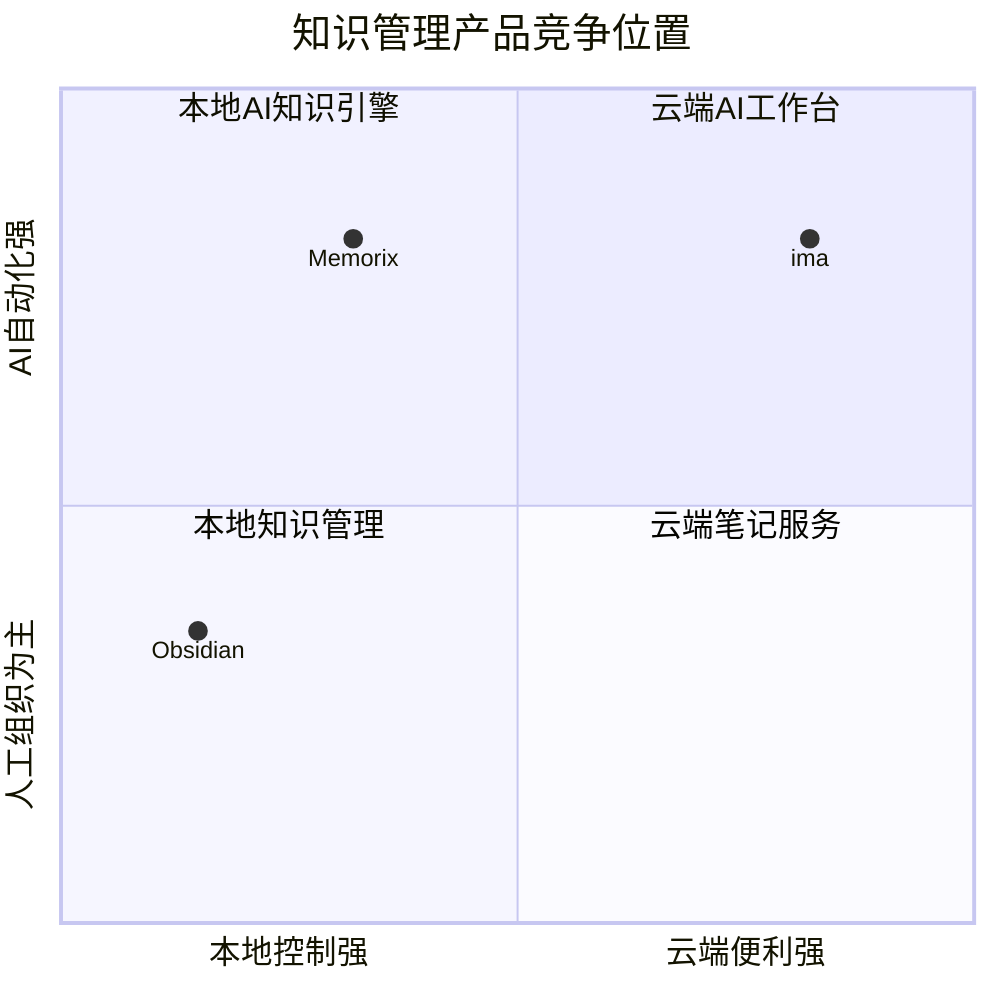

# Memorix 与 ima、Obsidian 竞品对比分析

> 项目：Memorix——个人的 AI 记忆体  
> 文档类型：产品定位与竞品分析  
> 版本：V1.0  
> 日期：2026-07-13

---

## 1. 分析结论

Memorix 与 ima、Obsidian 并不是完全相同的产品：

- **ima**：偏向“云端 AI 知识库”，强项是低门槛、开箱即用、搜读写一体和内容分享；
- **Obsidian**：偏向“本地 Markdown 知识管理平台”，强项是数据所有权、双链笔记、可塑性和庞大的插件生态；
- **Memorix**：应定位为“本地优先的 AI 知识资产引擎”，重点不是笔记编辑，而是把多源资料自动加工成可检索、可问答、可报告、可供 Agent 调用的长期知识资产。

一句话概括：

> ima 更像云端 AI 知识库，Obsidian 更像本地知识操作系统，Memorix 应成为连接信息采集、AI 加工、语义检索与 Agent 的个人 AI 记忆体。

---

## 2. 三款产品的核心定位

### 2.1 Memorix

Memorix 当前规划是一个“本地优先 + 云端可选 + 手机采集 + 多端共享”的双模式 AI 知识资产引擎。

核心链路：

```text
多源信息采集
→ 文档解析与清洗
→ 语言识别与多语言处理
→ AI 摘要、标签和实体提取
→ 分块、Embedding 和混合索引
→ RAG 问答与证据追溯
→ 报告、导出和 Agent 调用
```

### 2.2 ima

腾讯官方将 ima 定位为以知识库为核心，集“搜、读、写”于一体的 AI 工作台，并接入腾讯混元、DeepSeek 等模型。其产品重点是让普通用户以较低门槛创建知识库、检索内容、向资料提问和生成内容。

参考：[腾讯 ima 官方网站](https://ima.qq.com/)

### 2.3 Obsidian

Obsidian 是以本地文件和 Markdown 为基础的个人知识管理工具。其核心价值是用户掌握自己的文件，并通过双链、属性、图谱、Canvas、模板和插件构建个性化知识系统。

官方 Web Clipper 明确强调网页内容存储到本地 Vault，保存为持久的 Markdown 文件，并支持导出；官方 Sync 则支持端到端加密、离线工作、版本历史、跨平台同步和共享 Vault。

参考：[Obsidian Web Clipper](https://obsidian.md/clipper)、[Obsidian Sync](https://obsidian.md/sync)

---

## 3. 总体能力对比

| 维度 | Memorix 当前规划 | ima | Obsidian |
|---|---|---|---|
| 核心定位 | AI 知识资产加工与检索引擎 | 云端 AI 搜读写工作台 | 本地知识管理与笔记平台 |
| 产品理念 | 本地优先、云端可选 | 云端服务优先 | File over App、本地优先 |
| 主要对象 | PDF、网页、录音、图片、报告等资料 | 云端知识库内容 | Markdown 笔记和附件 |
| 是否必须登录 | 本地模式不需要 | 云端能力通常依赖账号 | 本地使用不需要 |
| 数据主权 | 本地、云端、混合可选 | 主要由云端平台管理 | 用户直接掌握本地文件 |
| 原始数据形态 | Vault + SQLite + 对象文件 | 平台内部知识库 | Markdown + 普通附件 |
| AI 原生程度 | 高，AI 流水线是核心 | 高，AI 问答是核心 | 核心较弱，主要靠插件 |
| 文档自动处理 | 解析、清洗、摘要、实体、标签、分块 | 上传后可直接问答 | 通常需要多个插件组合 |
| RAG | 核心内置 | 核心内置 | 多依赖社区插件 |
| 本地模型 | Ollama、LM Studio | 通常由平台提供模型 | 可通过插件接入 |
| 云端模型 | 可选、多供应商 | 平台统一提供 | 通过插件或外部服务 |
| 多端同步 | 规划支持三种同步模式 | 云端天然多端 | 官方 Sync 或第三方同步 |
| 插件生态 | 规划建设、尚未成熟 | 相对封闭 | 极其成熟 |
| Agent / MCP | 核心规划能力 | 更偏用户问答 | 可借助插件实现 |
| 知识图谱 | 规划实体和语义关系 | 非主要优势 | 双链与图谱成熟 |
| 报告生成 | 核心模块 | AI 写作能力较强 | 依靠模板和插件 |
| 团队协作 | Shared Workspace 规划 | 云端分享天然方便 | Shared Vault / Publish |
| 使用门槛 | 中等 | 最低 | 中高 |
| 系统可控性 | 高 | 较低 | 最高 |
| 生态成熟度 | 初期 | 平台型生态 | 非常成熟 |

---

## 4. Memorix 与 ima 的比较

### 4.1 ima 的优势

#### 4.1.1 开箱即用

ima 面向普通用户，其主要路径非常短：

```text
上传资料
→ 创建知识库
→ 直接提问
→ AI 生成回答
→ 分享知识库
```

用户不需要理解 Embedding、分块、向量数据库、本地模型、模型供应商、同步策略或 MCP。这使 ima 在大众用户获取和新手体验方面明显占优。

#### 4.1.2 云端能力统一

由于内容与计算主要集中于云端，ima 更容易提供：

- Web、桌面和其他终端访问；
- 内容分享和加入知识库；
- 云端模型统一升级；
- 云端全文检索和 RAG；
- 无须安装、配置和维护本地模型。

#### 4.1.3 中文内容与腾讯生态

ima 更适合国内普通用户的中文搜索、知识库分享和内容消费。腾讯账号、社交关系和内容生态，是 Memorix 短期无法复制的资源优势。

### 4.2 ima 的不足与 Memorix 的机会

#### 4.2.1 数据控制

对企业资料、财务数据、技术文档和个人研究资料而言，用户可能不希望：

- 原始文件必须上传第三方平台；
- 全部内容必须由平台模型处理；
- 数据锁定在特定云端产品；
- Embedding、检索和分块规则不可选择。

Memorix 可以提供完整本地链路：

```text
本地文件
+ 本地数据库
+ 本地模型
+ 本地 Embedding
+ 本地 RAG
+ 本地 MCP
```

这是 Memorix 相对 ima 最重要的差异化。

#### 4.2.2 AI 处理过程的可控性

ima 的优势是简单，但专业用户对以下环节的控制通常有限：

- 文档清洗规则；
- 分块策略；
- 摘要结构；
- 中英文双索引；
- Embedding 模型；
- Reranker；
- 混合检索权重；
- 实体提取 Schema；
- 数据导出格式。

Memorix 应采用双层产品设计：普通用户使用经过验证的默认配置，专业用户可进入高级设置调整完整流水线。

#### 4.2.3 Agent 资产接口

ima 的主要交互更接近：

```text
用户向知识库提问
```

Memorix 应进一步走向：

```text
用户提问
Agent 调用
Hermes 定时分析
IDE 调用
MCP 工具调用
API 批量检索
自动生成研究报告
```

因此，Memorix 不应成为另一个 ima，而应让知识库成为 Agent 可以调用的长期记忆层。

---

## 5. Memorix 与 Obsidian 的比较

### 5.1 Obsidian 的优势

#### 5.1.1 数据所有权清晰

Obsidian 的核心资产是普通 Markdown 文件。即使用户停止使用 Obsidian，文件仍可以被其他软件读取。

相比之下，Memorix 当前采用：

```text
SQLite
+ Vault 附件
+ 结构化数据库
+ 向量索引
```

结构化程度更高，但也更容易让用户担心数据锁定。因此 Memorix 必须提供：

- Markdown 批量导出；
- 原始文件目录访问；
- 元数据 JSON 导出；
- 数据库备份与恢复；
- 一键迁移；
- Obsidian 兼容导出。

#### 5.1.2 双链和知识组织成熟

Obsidian 在以下能力上明显领先当前 Memorix：

- `[[双向链接]]`；
- Backlinks；
- 标签与 Properties；
- Canvas；
- Graph View；
- 模板；
- 日记和长期写作；
- 人工知识整理。

Memorix 不应在早期与 Obsidian 竞争“最好的笔记编辑器”。

#### 5.1.3 插件生态强大

截至 2026 年 7 月，Obsidian 官方社区页面展示约 5,649 个插件和 626 个主题，覆盖集成、文件、编辑、AI、自动化、可视化和链接等类别。

参考：[Obsidian Community](https://community.obsidian.md/)

其生态覆盖：

- AI 问答；
- OCR；
- Dataview；
- Excalidraw；
- 日历；
- Git 和 WebDAV 同步；
- 本地模型；
- 知识图谱；
- Agent 与自动化。

Memorix 短期不可能靠插件数量与 Obsidian 竞争。

#### 5.1.4 多端同步成熟

Obsidian Sync 已支持：

- Mac、Windows、Linux、iOS 和 Android；
- 离线工作后同步；
- AES-256 端到端加密；
- 版本历史；
- 删除文件恢复；
- 选择性同步；
- 共享 Vault；
- 插件、主题和配置同步。

这可以作为 Memorix 多端同步的重要参照，但 Memorix 还要额外处理数据库对象、处理任务、AI 结果、Embedding 模型和对象存储，复杂度高于纯文件同步。

### 5.2 Obsidian 的不足与 Memorix 的机会

#### 5.2.1 AI 知识库配置成本较高

要把 Obsidian 组合成完整 AI 资料库，用户通常需要安装和配置：

```text
Web Clipper
+ PDF 解析插件
+ OCR
+ AI 问答插件
+ Embedding
+ 向量库
+ Dataview
+ 模板
+ 同步方案
```

多插件组合可能带来：

- 配置复杂；
- 数据格式不一致；
- 插件停止维护；
- 移动端兼容性问题；
- AI 接口重复配置；
- 多个插件重复建立索引；
- 隐私边界不清晰。

Memorix 应把这些能力整合为统一流水线：

```text
资料导入
→ 解析清洗
→ 语言识别
→ 中文辅助索引
→ 摘要与结构化提取
→ 标签、实体与分块
→ 混合检索
→ RAG 与报告
```

#### 5.2.2 笔记中心与资料处理中心的差异

Obsidian 的基础单位主要是文件和笔记，强项是人工编辑与连接。

Memorix 的基础单位应包括：

```text
Source
Document
DocumentChunk
Entity
Topic
Report
ProcessingJob
SyncState
AgentMemory
```

因此，Memorix 更适合：

- 大批量 PDF 和网页资料；
- 数千篇研究文章；
- 外文资料中文化索引；
- 音视频转录；
- 自动摘要与结构化提取；
- 产业情报分析；
- 多文档综合报告；
- Agent 长期记忆。

例如，对数千篇 AI 资讯的处理，Obsidian 更适合查看、链接和人工整理最终结果；Memorix 更适合承担抓取、清洗、AI 加工、索引、问答和报告生成。

---

## 6. 典型用户选择

| 用户或场景 | 更适合的产品 |
|---|---|
| 上传几份资料后立即问答 | ima |
| 普通用户建立可分享的 AI 知识库 | ima |
| 希望统一使用平台提供的模型 | ima |
| 重度笔记、双链和日记用户 | Obsidian |
| 希望完全掌握本地 Markdown 文件 | Obsidian |
| 希望自行组合大量插件 | Obsidian |
| 有大量 PDF、网页、录音需要自动加工 | Memorix |
| 外文资料需要中文检索和中文问答 | Memorix |
| 使用 Ollama、LM Studio 等本地模型 | Memorix |
| 需要本地 RAG 和隐私隔离 | Memorix |
| 让 Hermes、Cursor、Claude 等 Agent 调用知识库 | Memorix |
| 在本地、云端、混合模式之间切换 | Memorix |
| 企业内部研究资料和知识资产 | Memorix 潜在优势 |

---

## 7. 竞争位置

可以用“本地控制—云端便利”和“人工知识管理—AI 自动化”两个维度理解三者：



需要强调的是：Memorix 目前处在“设计上的理想位置”，并不意味着已经具备相应的市场竞争力。

其当前范围同时包括：

- 本地知识库；
- 云端知识库；
- 手机端；
- 多端同步；
- AI 处理流水线；
- RAG；
- 报告；
- MCP 与 Agent；
- 插件市场；
- 团队协作。

如果并行推进全部能力，容易导致每项都缺乏深度和稳定性。

---

## 8. Memorix 不应该复制的方向

### 8.1 不复制 ima 的云端中心模式

如果 Memorix 最终所有高级功能都要求上传云端，“本地优先”就会退化成营销概念。

本地模式必须独立完成：

- 导入；
- 解析；
- 摘要；
- 标签和实体提取；
- 分块和索引；
- 检索；
- RAG；
- 报告；
- MCP。

### 8.2 不复制 Obsidian 的全能笔记编辑器

早期没有必要投入大量资源实现：

- 极其复杂的 Markdown 编辑器；
- Canvas 和白板；
- 日历与任务管理；
- 主题系统；
- 大量 UI 扩展点。

这些能力不是 Memorix 的核心壁垒。

### 8.3 不过早复制 Obsidian 插件市场

Memorix 的插件体系应循序渐进：

```text
第一阶段：内部适配器
第二阶段：官方插件
第三阶段：受审核合作伙伴插件
第四阶段：开放第三方市场
```

早期最重要的是形成稳定的 Parser、Model Provider、Source Connector、Exporter 和 MCP Tool 接口，而不是追求插件数量。

---

## 9. Memorix 应强化的差异化能力

### 9.1 多语言知识资产

建议把以下结构做成默认能力：

```text
外文原文
+ 中文摘要
+ 中文标签
+ 中文实体
+ 原文 Embedding
+ 中文辅助 Embedding
+ 跨语言检索
```

ima 可以进行中文问答，Obsidian 也能通过插件组合类似能力，但 Memorix 可以把它做成完整、可控、可审计的标准工作流。

### 9.2 可观测的 AI 处理流水线

用户应看到每份资料所处状态：

```text
已导入
→ 已清洗
→ 已识别语言
→ 已生成摘要
→ 已提取实体
→ 已分块
→ 已向量化
→ 已建立中文辅助索引
```

系统还应支持：

- 失败重试；
- 批量重处理；
- 模型切换；
- Prompt 版本管理；
- 处理成本和耗时统计；
- 生成结果追溯。

### 9.3 知识证据追溯

RAG 回答和报告应尽量保留：

- 来源文件；
- 原文段落；
- 页码或章节；
- 来源 URL；
- 抓取时间；
- 原文语言；
- 摘要模型；
- Embedding 模型；
- 文档版本；
- 相关性或置信信息。

这一能力对研究、法务、财务和企业知识库尤其重要。

### 9.4 Agent-ready Memory

Memorix 应明确成为“人可以阅读、Agent 也可以调用”的长期记忆层。

建议提供：

```text
search_memory
ask_memory
get_document
get_evidence
list_topics
generate_report
save_memory
```

这比单纯提供 AI 聊天窗口更容易形成技术和产品差异。

### 9.5 Obsidian 互操作

Obsidian 不应只被视为竞争者，也可以成为 Memorix 的下游编辑与展示工具：

```text
Memorix：采集、解析、AI加工、索引、RAG、报告
Obsidian：笔记编辑、双链、图谱、日记、人工整理
```

建议实现：

- 一键导出 Obsidian Vault；
- 自动生成 YAML Frontmatter；
- 实体映射为 `[[Wiki Links]]`；
- 标签映射为 Obsidian Tags；
- 报告导出为 Markdown；
- 保留原文链接和本地附件；
- 可选监控 Obsidian Vault 变化并重新索引。

---

## 10. 竞争能力评分

以下评分中，Memorix 按“当前规划目标”评分，不代表已经完成的产品成熟度。

| 能力 | Memorix 规划 | ima | Obsidian |
|---|---:|---:|---:|
| 开箱即用 | 3 | 5 | 3 |
| 本地隐私 | 5 | 2 | 5 |
| AI 原生 | 5 | 5 | 2 |
| 批量资料处理 | 5 | 3 | 2 |
| 中文用户体验 | 4 | 5 | 3 |
| 多语言检索 | 5 | 3 | 2 |
| 笔记编辑 | 2 | 3 | 5 |
| 双链与图谱 | 3 | 2 | 5 |
| 插件生态 | 2 | 1 | 5 |
| 模型自由度 | 5 | 2 | 4 |
| 多端成熟度 | 2 | 5 | 5 |
| 分享便利性 | 2 | 5 | 4 |
| Agent / MCP | 5 | 2 | 3 |
| 数据可迁移性 | 4 | 2 | 5 |
| 企业可控性 | 5 | 3 | 4 |

Memorix 在架构目标上得分较高，但在当前产品成熟度、多端体验、稳定性、用户规模和生态方面仍明显落后，需要避免把“规划能力”误认为“已经形成的优势”。

---

## 11. 产品战略建议

### 11.1 核心定位

推荐中文定位：

> **Memorix 是一个本地优先的 AI 知识资产引擎，自动将网页、文档、图片、录音和笔记加工成可检索、可问答、可报告、可被 Agent 调用的个人或团队长期记忆。**

推荐英文定位：

> **A local-first AI knowledge asset engine that turns your information into searchable, explainable, and agent-ready memory.**

### 11.2 市场表达

- 不称为“另一个 AI 知识库”，避免与 ima 正面同质化；
- 不称为“另一个笔记软件”，避免与 Obsidian 正面竞争；
- 强调 AI 加工流水线；
- 强调本地优先与模型自由；
- 强调跨语言索引；
- 强调证据追溯；
- 强调 Agent-ready。

### 11.3 产品优先级

建议按以下顺序形成最小竞争闭环：

1. 多源资料稳定导入；
2. 解析、清洗和结构化处理；
3. 多语言与中文辅助索引；
4. 混合检索、RAG 和证据追溯；
5. 报告与 Markdown / Obsidian 导出；
6. 本地 MCP / Agent 接口；
7. Cloud Inbox 和手机采集；
8. 云端备份与个人多设备同步；
9. 团队共享；
10. 开放插件市场。

---

## 12. 最终结论

Memorix 最合理的战略不是正面复制 ima 或 Obsidian，而是吸收两者的优点：

- 学习 ima 的开箱即用和低门槛 AI 交互；
- 继承 Obsidian 的本地数据主权、长期可迁移性和开放性；
- 把自己的核心壁垒放在 AI 知识加工流水线、多语言索引、证据追溯以及 Agent 长期记忆。

最终可以形成以下清晰分工：

| 产品 | 核心价值 |
|---|---|
| ima | 快速建立并分享云端 AI 知识库 |
| Obsidian | 自由构建本地个人知识系统 |
| Memorix | 把多源信息加工成可复用、可追溯、可被 Agent 调用的知识资产 |

最终战略可概括为：

> 学习 ima 的开箱即用，继承 Obsidian 的本地数据主权，但把核心壁垒放在二者都不够完整的“AI 知识加工流水线 + Agent 长期记忆”上。

---

## 13. 参考资料

- [腾讯 ima 官方网站](https://ima.qq.com/)
- [Obsidian Web Clipper](https://obsidian.md/clipper)
- [Obsidian Sync](https://obsidian.md/sync)
- [Obsidian Community Plugins and Themes](https://community.obsidian.md/)

